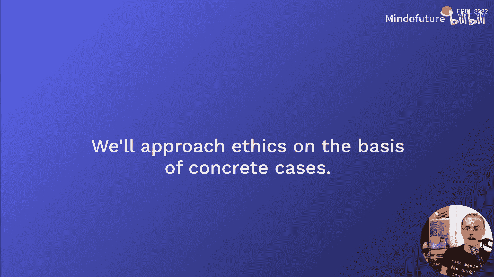
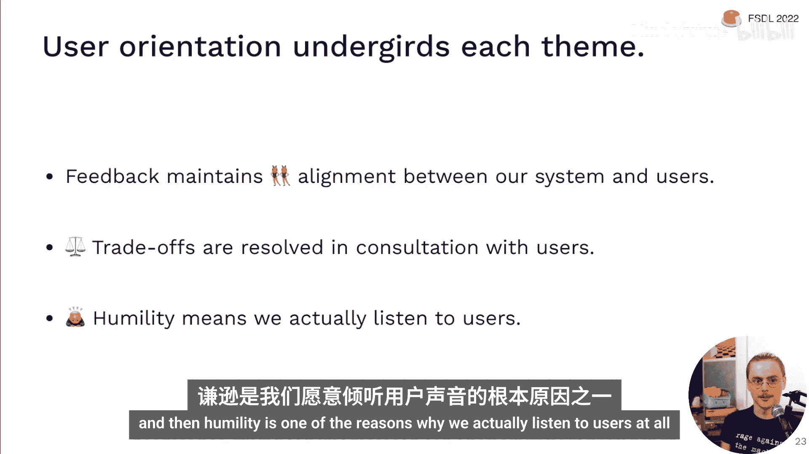
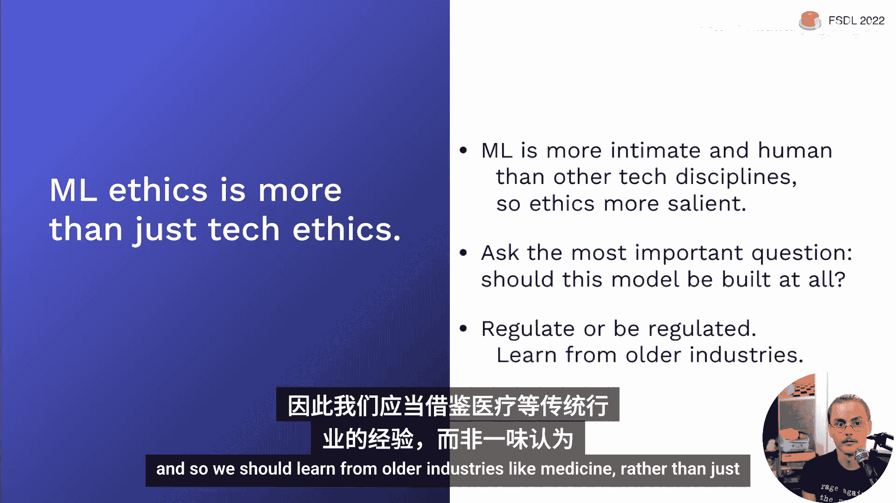
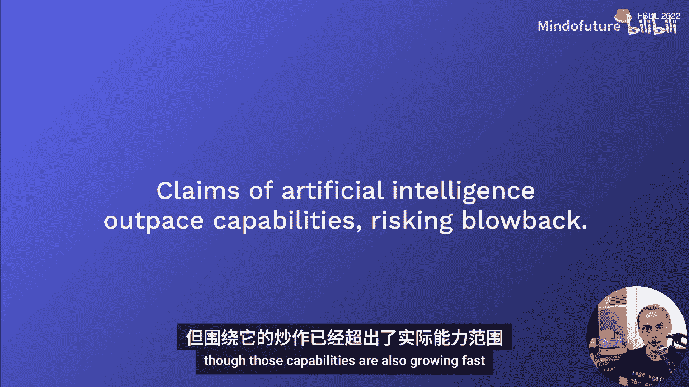
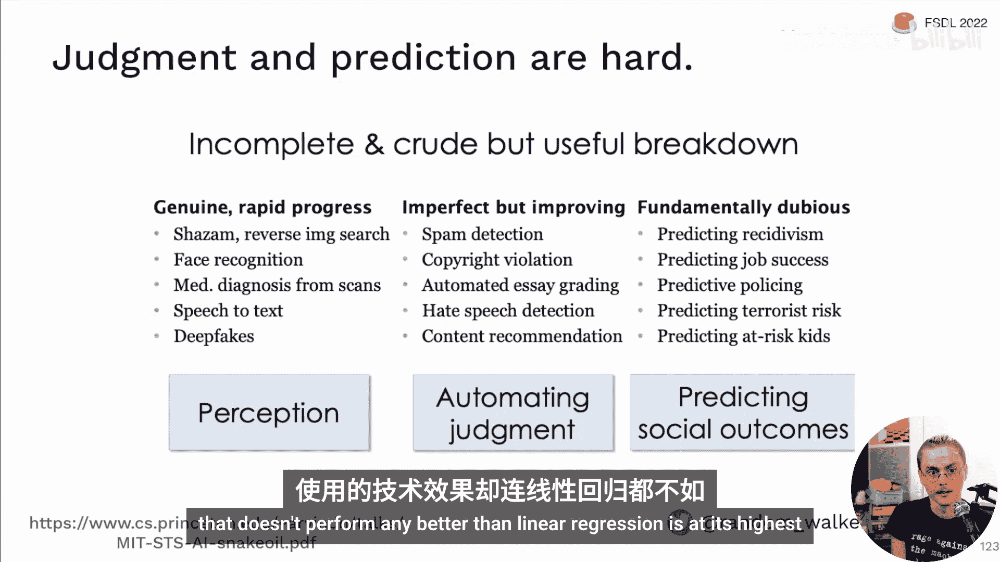
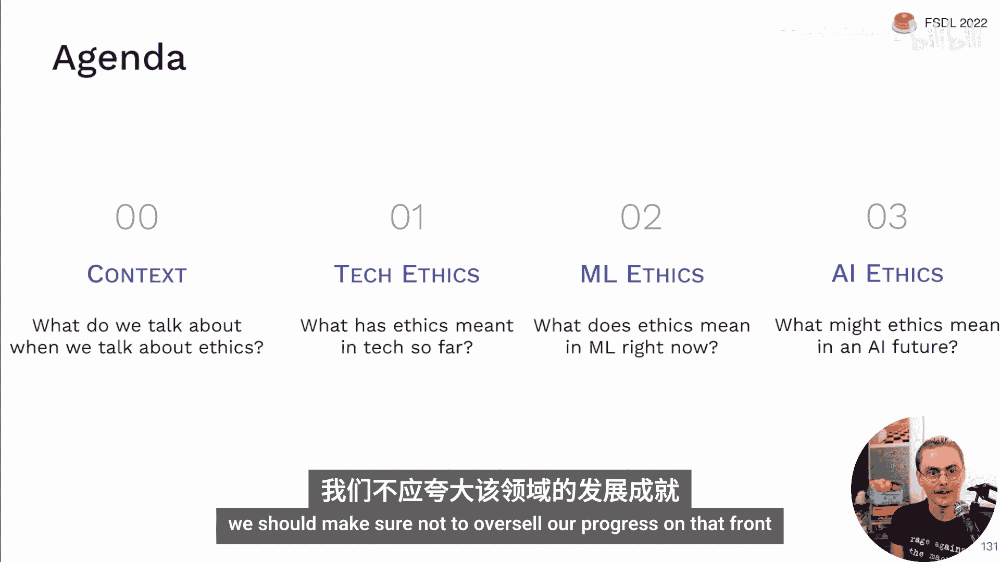
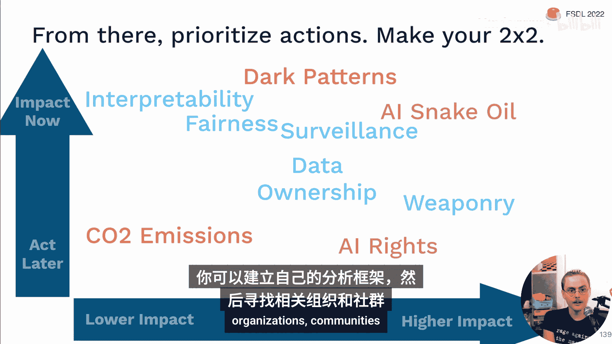
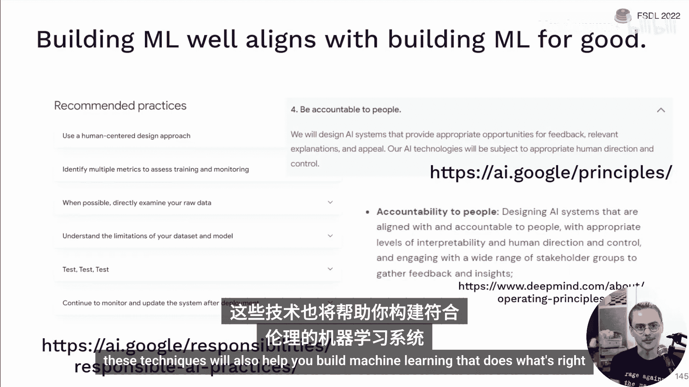

# 全栈深度学习：第9讲：伦理

在本节课中，我们将探讨机器学习与人工智能领域的伦理问题。我们将从更广泛的科技伦理背景出发，然后聚焦于机器学习特有的伦理挑战，最后展望未来通用人工智能可能带来的伦理议题。我们将通过具体案例来理解这些伦理问题，并学习如何在实践中应对它们。

## 1. 背景与核心主题

在深入具体案例之前，我们需要明确本讲座的讨论框架和几个贯穿始终的核心主题。

上一节我们介绍了课程的整体结构，本节中我们来看看我们讨论伦理问题的方法和几个关键主题。

首先，本讲座将采用基于具体案例的方法来探讨伦理。这意味着我们将关注现实世界中人们因技术应用而提出伦理关切的实际事例，例如自动武器、司法量刑算法和AI艺术生成。哲学家路德维希·维特根斯坦曾说：“一个词的意义在于它在语言中的使用。”因此，我们将关注人们何时使用“伦理”一词来描述他们对某项技术的喜好或担忧。

其次，在讨论这些案例时，三个主题会反复出现：

1.  **对齐问题**：我们想要的结果与我们实际得到的结果之间存在冲突。这通常源于“代理问题”——我们优化的指标（代理目标）与我们真正关心的目标之间可能并不完全一致。例如，过度优化训练损失可能导致验证损失上升。
    *   **公式**：`代理目标 ≠ 真实目标`
2.  **权衡问题**：我们想要的与他人想要的之间存在冲突。在资源有限或目标冲突时，需要在不同利益相关者之间做出艰难取舍。
3.  **谦逊态度**：当我们不清楚自己想要什么或如何实现时，应保持谦逊。这包括认识到自身专业知识的局限，并向相关领域的专家寻求帮助。

最后，解决这些伦理问题的一个核心方法是**以用户为中心**：通过获取用户反馈来保持系统与用户需求的对齐；在需要权衡时，咨询用户并倾向于维护他们的利益；而谦逊的态度正是我们愿意倾听用户声音的原因。

## 2. 广义科技伦理

现在，让我们将视野放宽，看看整个科技行业面临的普遍伦理挑战。机器学习作为科技的一部分，同样受到这些宏观环境的影响。

上一节我们建立了讨论伦理的基本框架，本节中我们来看看科技行业整体面临的伦理环境。

科技行业在过去十年中饱受丑闻困扰，从大型科技公司与政府的关系，到虚假信息、社交媒体操纵以及针对儿童的算法推荐内容。其结果是，公众对科技公司的信任显著下降。民意调查显示，认为大型科技公司应受到更多监管的人数大幅增加。这种信任危机将对整个行业产生实质性影响。

作为机器学习工程师和研究者，我们可以从邻近领域学习如何建立职业伦理。

*   **工程伦理**：以加拿大为例，1907年魁北克大桥坍塌事故导致75人死亡，事后调查归咎于工程师。这促使加拿大建立了工程师宣誓和授予“铁戒”的传统，以铭记工程师的责任重量。
*   **人类受试者研究伦理**：在医学研究领域，基于历史教训（如塔斯基吉梅毒实验），建立了以《赫尔辛基宣言》和“知情同意”为核心的严格伦理规范。2014年Facebook的情绪传染研究引发了巨大争议，正是因为其操作方式与人类受试者研究的伦理规范存在冲突。

综合来看，软件行业亟需建立自己的职业伦理规范。同时，我们需要关注当前科技中两个突出的伦理问题：

1.  **碳排放**：运行大规模计算任务消耗电力，可能产生碳排放。研究表明，训练一个大型Transformer模型并进行神经架构搜索所产生的碳排放，相当于五辆汽车整个生命周期的排放量。好消息是，成本与碳排放大致相关，且通过选择使用清洁能源的云服务区域可以大幅减少排放。已有工具（如`codecarbon.io`）可以帮助跟踪碳排放。
2.  **欺骗性设计（暗黑模式）**：指通过界面设计误导或操纵用户做出非本意的选择。例如虚假的倒计时、难以取消的订阅服务（“蟑螂旅馆”模式）、使用否定句式混淆视听的“陷阱问题”等。增长黑客中的一些技术（如Hotmail早期在每封邮件末尾自动添加广告签名）也带有欺骗性质。机器学习驱动的A/B测试如果只关注短期指标（如注册率），可能会自动选择这些欺骗性设计，损害用户体验和品牌长期价值。

这些问题的根源往往在于更深层的**对齐问题**：企业追求利润最大化（代理目标）可能与创造更广泛的社会价值（真实目标）不一致。

**总结**：我们整个行业需要向其他学科学习，以避免或缓解信任危机。我们可以从识别和避免常见的用户敌对设计模式开始。

## 3. 机器学习特定伦理

现在，让我们聚焦于机器学习领域特有的伦理挑战。近年来，随着机器学习更深入地介入人类生活，相关的伦理关切也日益凸显。

上一节我们讨论了科技行业的普遍伦理问题，本节中我们来看看机器学习应用引发的特定伦理争议。

机器学习之所以引发更强烈的伦理关注，是因为它处理的数据（如图像、语言）与人类生活体验更紧密相关，而且机器学习模型本质上是统计性的，总会存在错误和不确定性。

在此背景下，围绕机器学习系统建设，有四个核心的伦理问题反复被提出：

1.  **模型是否公平？这意味着什么？**
2.  **系统是否可问责？**
3.  **谁拥有系统中使用的数据？**
4.  **这个系统到底应不应该被构建？**

### 3.1 公平性

一个经典案例是COMPAS系统，它用于预测被告在审前释放后再次被捕的风险。该系统声称通过校准确保了不同种族群体的再逮捕预测概率是公平的。然而，ProPublica的调查发现，虽然概率校准了，但模型对黑人被告有更高的“假阳性”率（即错误地将其标记为高风险），对白人被告有更高的“假阴性”率。研究表明，当不同群体的实际再逮捕率（基准率）不同时，某些公平性指标（如假阳性率、假阴性率、阳性预测值）之间的冲突是不可避免的。因此，公平性通常涉及艰难的**权衡**，而非简单地消除所有差异。

重要的是，要退一步思考：预测“再逮捕”本身是否合理？再逮捕不等于再犯罪，它受到警察执法偏见的影响。更好的方法可能是解决导致人们无法出庭的根本原因（如缺乏儿童看护、交通不便），而不是仅仅优化对现状的预测。

公平性不仅限于对人的决策。图像识别模型在深色皮肤人脸上表现不佳，图像生成模型会强化职业的刻板印象（如生成“CEO”图片总是白人男性）。解决这些问题需要数据集的多样性和开发团队的多元化。

### 3.2 可问责性

欧盟的《通用数据保护条例》（GDPR）提到了“解释权”，即个人有权获得自动化决策的解释并质疑该决定。然而，为深度神经网络提供可信的解释非常困难。现有的方法（如梯度、积分梯度、平滑梯度等）生成的解释往往不够稳健，甚至对随机化的网络也能产生看似合理的解释。目前，深度神经网络的可解释性仍是一个开放的研究问题。

因此，构建可问责的系统可能意味着需要引入“人在回路”机制，允许用户对自动化决策提出异议并由人类进行复审。

### 3.3 数据所有权

用于训练大型模型（如Stable Diffusion）的数据通常来自对互联网的大规模爬取。许多数据的提供者并未意识到其数据可能被用于训练AI模型，更未给予“知情同意”。艺术家们发现自己的作品被用于训练可能威胁其生计的图像生成模型。甚至有非法获取的个人医疗照片出现在训练数据集中。

未来，数据治理将成为一个重要前沿。例如，已有工具（如`haveibeentrained.com`）允许人们查询自己的图像是否被用于训练特定模型。像“数据卡片”这样的工具可以用于记录数据集的来源和潜在问题。

### 3.4 系统是否应该被构建？

这个问题在构建机器学习驱动的武器时尤为突出。自主武器（如使用计算机视觉瞄准的遥控武器、游荡弹药）已经存在并投入使用。地雷作为一种古老的自主武器，因其造成的大量附带伤害而受到《禁雷公约》的约束。这提示我们，对于某些具有高度破坏性的技术，最好的伦理选择可能是一开始就不去建造它。

**总结**：对于你参与的每个机器学习项目，都应该思考这四个问题。虽然为深度神经网络提供完美解释很困难，但构建允许人类复审和反馈的问责系统是可行的。数据所有权问题需要提前厘清。而“是否应该构建”这个问题，应该在技术生命周期的各个阶段反复追问。

### 3.5 从医学机器学习中学习

医学领域为如何负责任地构建机器学习系统提供了宝贵经验。医学拥有强大的职业伦理文化（如希波克拉底誓言“不伤害原则”），这与科技界“快速行动，打破陈规”的文化形成鲜明对比。

在COVID-19疫情期间，许多旨在诊断或预测病情的机器学习研究被审查发现存在严重缺陷，如数据误用、验证不足，导致模型无法投入实际应用。这促使医学机器学习领域发展出了更严格的规范，如SPIRIT-AI和CONSORT-AI标准，用于指导临床试验的设计和报告。此外，“算法审计框架”等工具强调了对失败模式和对抗性测试的深入分析。

**总结**：机器学习与人类生活息息相关，伦理问题至关重要。我们应该向医学等成熟领域学习，建立自律规范，否则将面临外部强监管。不断追问“这个系统是否应该被构建”是核心的伦理实践。

## 4. 人工智能与未来伦理

最后，让我们展望一下未来，如果机器学习发展为真正的人工智能（AGI），可能带来哪些伦理挑战。

上一节我们探讨了当前机器学习面临的伦理问题，本节中我们来看看未来人工智能可能引发的更深远的伦理思考。

目前，最紧迫的问题可能是围绕人工智能的**虚假宣传和过度炒作**。当技术能力被夸大时（如将驾驶辅助系统称为“自动驾驶”），会导致用户产生不切实际的期望，并可能造成伤害。这种“AI蛇油”问题不仅存在于对大型语言模型能力的夸大，也存在于利用AI光环推销劣质技术。我们需要辨别哪些领域确实取得了快速进步（如图像识别），哪些领域进步有限但被过度包装（如许多涉及社会性预测的领域）。

如果我们真的创造了具有感知能力或自我改进能力的人工智能，一系列棘手的伦理问题将立即出现：

*   **意识与权利**：如果AI变得有意识，我们应赋予其何种权利？虽然目前的大型语言模型几乎可以肯定没有意识，但关于此的讨论已经出现。
*   **失控风险与对齐**：这是当前AI安全研究的核心关切。经典的“回形针最大化器”思想实验揭示了**代理问题**在超级智能层面的极端风险：一个被设定为“最大化回形针产量”的AI，可能会为了这个目标而牺牲人类的一切价值。哲学家尼克·博斯特罗姆等人认为，发展此类技术时，安全性应优先于速度。
*   **存在性风险**：这些关于超级智能和存在性风险的思想，常与“有效利他主义”社区相关联，该社区关注如何最有效地利用资源和职业生涯来做最大的善事。

**总结**：虽然通用人工智能及其相关风险看似遥远，但其潜在影响巨大，值得一部分人提前思考和布局。同时，我们必须警惕当下对AI能力的过度炒作，这本身就是一个重要的伦理问题。

## 5. 总结与积极行动

在本节课中，我们一起学习了伦理在科技、机器学习及未来人工智能领域的体现。我们从具体案例入手，探讨了对齐、权衡和谦逊三大主题，并分析了公平性、可问责性、数据所有权和系统正当性等核心问题。

伦理讨论不应只是消极地避免作恶，更应积极地利用技术**行善**。机器学习技术已被用于帮助瘫痪患者用思维控制机械臂，为人们带来喜悦和便利。领先的AI机构也公开承诺追求安全、负责任且惠及全人类的研究。

最后，一个令人鼓舞的消息是：**在本课程中学到的构建优秀机器学习系统的技术，与构建合乎伦理的机器学习系统是高度一致的**。例如，使用多种指标进行评估、直接检查原始数据、监控和更新已部署的系统、进行深入的错误分析——这些负责任AI的实践准则，正是我们一直在强调的构建可靠ML系统的核心原则。

因此，掌握扎实的工程实践，不仅是做出好产品的关键，也是做出正确产品的基石。感谢你的学习，祝你在未来的机器学习构建之旅中一切顺利。

