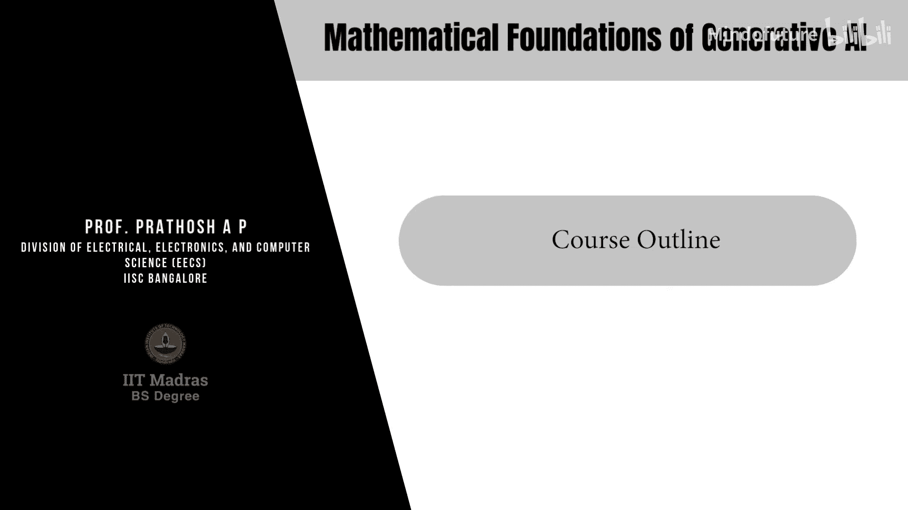
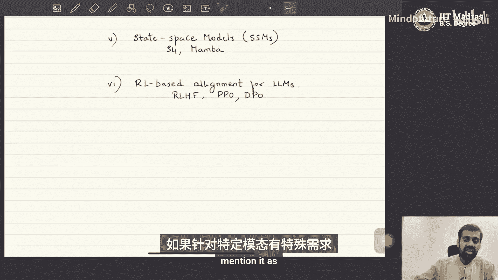
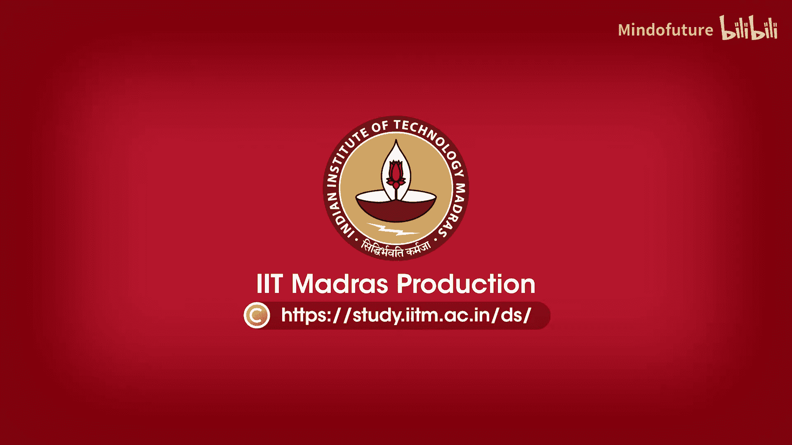

# 001：课程大纲 📚

在本课程中，我们将学习多种深度生成模型（也称为生成式AI）的数学基础。课程的核心目标是从数学角度深入理解这些模型的工作原理，以便能够阅读原始论文并理解其背后的公式化思想。我们将涵盖从经典到最前沿的多种模型。

## 课程目标与特色 🎯

本课程的独特之处在于其数学化的处理方式。我们将从数学角度探讨所有著名的生成模型，这并不意味着我们会忽略实践方面，而是旨在为理解这些模型的工作原理打下坚实的理论基础。通过这种方式，学习者可以深入理解模型的运作机制，并能够轻松阅读相关原始论文及其改进工作。

## 涵盖的模型家族 🤖

以下是本课程计划涵盖的深度生成模型家族。

*   **生成对抗网络**：我们将从**生成对抗网络**开始。尽管GANs在某些任务上已非最先进技术，但它为理解生成建模的基本原理奠定了坚实基础。
*   **变分自编码器**：接下来是**变分自编码器**。与GANs一样，VAEs是经典模型，但其工作原理和理论基础为学习许多其他先进模型（如DDPMs）铺平了道路。
*   **去噪扩散概率模型**：然后，我们将学习**去噪扩散概率模型**。这是当前许多生成任务（如图像生成）的先进模型，也是DALL-E等商业工具背后的核心技术。
*   **基于分数的模型**：与扩散模型密切相关的是**基于分数的模型**，我们也将探讨其运作方式。
*   **自回归模型**：另一个重要的类别是**自回归模型**。当前著名的大型语言模型，如构成GPT、Gemini等商业平台基础的模型，大多属于此类。
*   **状态空间模型**：我们还将学习**状态空间模型**，例如S4和Mamba。这是新兴的生成模型家族，可作为自回归语言模型的替代方案。
*   **大模型对齐技术**：课程最后，我们将探讨用于对齐大型语言模型的一些技术，特别是基于强化学习的方法，如**近端策略优化**和**直接偏好优化**。

## 教学方法与框架 📝

本课程的教学将主要采用概率论框架。我们将使用概率框架来处理这些生成模型，因为概率论为理解和形式化“生成数据”这一过程提供了最自然和强大的语言。

课程内容将通过手写板书的形式进行讲授，以确保数学公式的推导能够清晰、严谨地呈现，方便大家逐步理解。

## 数据模态与配套教程 📊

本课程的讲解将采用**数据模态无关**的方式。这意味着我们学习的技巧是通用的，只需稍作修改即可适应不同类型的数据（如图像、文本、语音）。当特定模态需要特别处理时，我们会进行说明。

此外，本课程将配有实践教程。针对每一类生成模型，都会有相应的教程指导大家使用PyTorch等框架进行实现，并设置评估环节。课程还包含测验、作业和考试等环节，具体安排将在后续公布。

---

**本节课总结**：我们一起了解了《生成式AI的数学基础》课程的整体框架。我们明确了课程将从数学角度深入探讨GANs、VAEs、扩散模型、自回归模型、状态空间模型以及对齐技术等一系列生成模型，并采用概率论框架和手写板书的方式进行教学，旨在为大家打下坚实的理论基础。