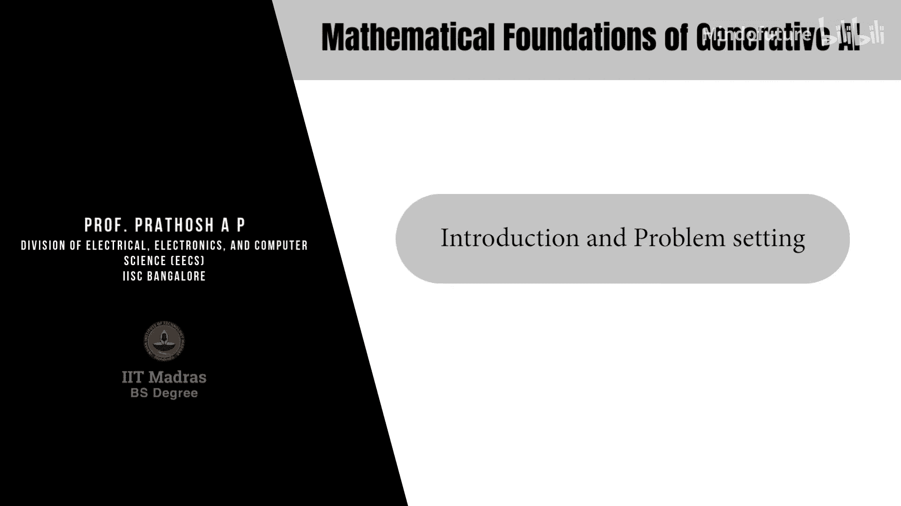

生成式AI的数学基础：P02：W1L2-介绍与问题设定

在本节课中，我们将从数学角度定义生成式建模问题。我们将探讨生成式模型是什么，其核心目标，以及解决该问题的通用框架。

生成式模型在当今随处可见。以下是几个例子：
*   **条件文本生成器**：例如ChatGPT、Google Gemini和Claude。这些模型以文本（提示词）作为输入，生成相应的文本响应。输入可以是自然语言或计算机代码。
*   **条件图像生成器**：例如Stable Diffusion。这些模型根据对图像的描述（提示词）生成对应的图像。
*   **语音生成器**：这些模型将给定的文本转换为对应的语音波形文件。

从数学角度看，我们面临的问题是什么？

任何机器学习技术的起点都是**数据**。我们将数据定义为一组**独立同分布**的样本，这些样本从一个未知的分布 **PX** 中抽取。我们拥有 **n** 个数据点，记为 **{x1, x2, ..., xn}**。

这些数据点 **xi** 是某个**随机变量**的实例，该随机变量服从分布 **PX**。我们假设所有数据点都来自同一个未知的底层分布。

通常，这些数据点 **x** 位于某个 **d** 维实数空间 **ℝd** 中，其中 **d** 称为数据的**维度**。在处理图像、文本或语音等高维数据时，**d** 的值可能非常大（例如数万或数十万维）。

需要强调的是，**独立同分布**假设是指**不同数据点之间**（例如第一张图片与第一百张图片）是统计独立的，并且来自同一分布。这**不意味着**数据点**内部各维度之间**（例如一张图片的第一个像素与第一千个像素）是独立的。这个假设是为了数学上的便利。

因此，数据点 **xi** 可以被视为一个 **d** 维向量值随机变量的实例，该变量服从分布 **PX**。这个数学形式化观点在后续课程中非常重要。

有了这个基础，我们现在来定义生成式建模问题。

给定从未知分布 **PX** 中独立同分布抽取的 **n** 个样本，生成式建模的目标是：
1.  **估计**底层的概率密度函数 **PX**。
2.  **学习如何**从该分布中**采样**。

这与判别式模型形成对比。判别式模型通常估计条件分布 **P(Y|X)**，但不一定学习从数据分布中采样。而在生成式模型中，估计分布并学会采样是核心目标。

那么，解决这个问题的通用原则是什么？观察现有的生成式模型，可以抽象出一个通用的解决框架。

以下是解决生成式建模问题的一般步骤：

1.  **假设一个参数化模型族**：首先，为待估计的分布 **PX** 假设一个参数化形式，通常记为 **Pθ**。鉴于现代深度神经网络具有强大的表达能力（万能近似定理），**Pθ** 通常由深度神经网络表示。在本课程中，当我们提到“模型”时，通常指的就是这个参数化的 **Pθ**。

2.  **定义并计算散度度量**：定义一个散度或距离度量 **D**，用于衡量模型分布 **Pθ** 与真实分布 **PX** 之间的差异。一个关键问题是，既然两者分布都未知，如何计算这个散度？我们将在后续课程中回答。

3.  **解决优化问题**：在参数 **θ** 的空间中解决一个优化问题，目标是最小化上述散度度量。即寻找最优参数 **θ***，使得 **D(PX || Pθ)** 最小化。

通过不断调整代表 **Pθ** 的神经网络参数，使得 **Pθ** 尽可能接近 **PX**。

现在，我们来看一个如何实现这个框架的具体例子，并解释采样是如何完成的。

我们的目标是估计 **PX** 并从中采样。采样通过以下方式实现：

假设存在一个随机变量 **Z**，它位于 **k** 维实数空间 **ℝk** 中，并服从一个已知的任意分布（例如，**k** 维标准高斯分布 **N(0, I)**）。

定义一个由神经网络表示的确定性函数 **Gθ**，它将 **Z** 映射到数据空间 **ℝd**。
`X̂ = Gθ(Z)`

根据概率论，一个随机变量经过确定性函数变换后，其输出也是一个随机变量。**X̂** 的分布不同于 **Z** 的分布，它依赖于函数 **Gθ**。我们将 **X̂** 的密度函数记为 **Pθ(X̂)**。

现在，这个神经网络的输出可以解释为来自分布 **Pθ(X̂)** 的样本。

接下来，遵循我们的通用框架：
1.  模型分布是 **Pθ(X̂)**（由 **Gθ** 隐式定义）。
2.  定义真实分布 **PX** 与模型分布 **Pθ** 之间的散度度量 **D(PX || Pθ)**。
3.  解决优化问题以找到最优参数 **θ***：
    `θ* = argminθ D(PX || Pθ)`

成功解决这个优化问题后，**Pθ*** 将非常接近 **PX**。此时，我们不仅通过 **Gθ*** 隐式地估计了分布 **PX**，还获得了从中采样的方法。

采样过程如下：从已知分布（如高斯分布）中抽取一个样本 **z**，然后将其通过训练好的神经网络 **Gθ***：
`x̂ = Gθ*(z)`
由于 **Pθ* ≈ PX**，因此 **x̂** 可以近似看作是从真实数据分布 **PX** 中采样的一个样本。

回顾一下，我们的目标是在给定数据样本的情况下估计未知分布并从中采样。我们从一个易于采样的已知分布开始，利用随机变量经确定性函数变换后产生新随机变量的原理，并用深度神经网络表示该函数。通过优化网络参数，使新随机变量的分布逼近真实数据分布。训练完成后，该网络不仅能估计分布，还能通过前向传播从已知分布生成样本，从而间接实现从目标分布中采样。

这是生成对抗网络、变分自编码器、扩散模型等许多算法的通用原理。

基于这个通用框架，我们需要提出并回答以下几个关键问题：

*   **如何计算散度度量？**：在不知道 **PX** 和 **Pθ** 具体形式的情况下，如何计算它们之间的散度？我们只有来自两者的样本。
*   **如何选择散度度量？**：不同的散度度量选择会导致具有不同性质和特点的生成式模型。
*   **如何选择模型（Gθ 或 Pθ）？**：即应该为 **Pθ** 选择什么样的参数化形式？不同的模型族（如GAN、VAE、扩散模型）做出了不同的选择。
*   **如何解决优化问题？**：给定模型和散度度量后，如何有效地最小化该散度？

在本课程中，我们将探讨回答这些问题不同方法，每一种选择都将引向一类特定的生成式模型。

本节课中，我们一起学习了生成式建模问题的数学定义和通用解决框架。我们首先通过实例了解了生成式模型，然后形式化地定义了问题：给定从未知分布中独立同分布采样的数据，目标是估计该分布并学会从中采样。接着，我们介绍了一个包含三个步骤的通用解决框架：假设参数化模型、定义分布间散度、优化模型参数以最小化散度。我们还通过一个使用神经网络变换随机变量的具体例子，说明了如何同时实现分布估计和采样。最后，我们提出了构建生成式模型时需要解决的几个核心问题。在后续课程中，我们将深入探讨不同的散度度量、模型选择和优化方法，从而引出各种流行的生成式模型。