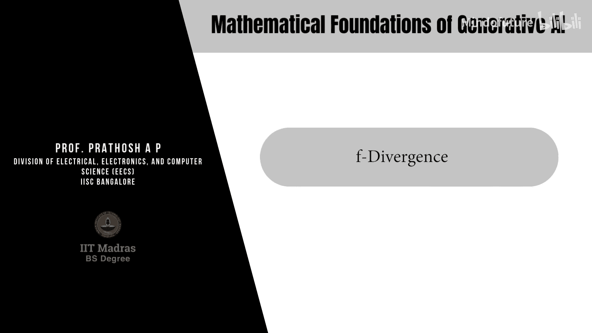
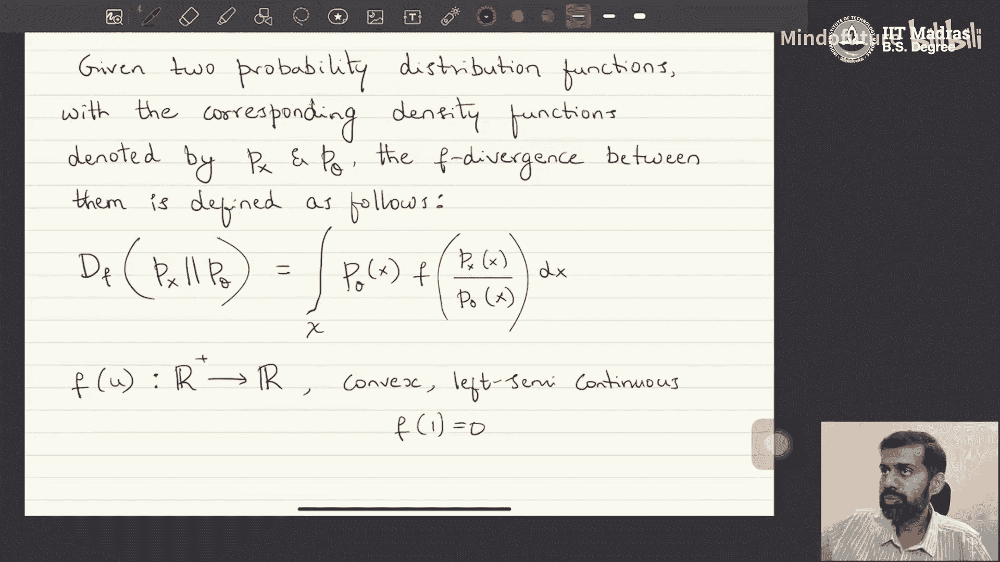
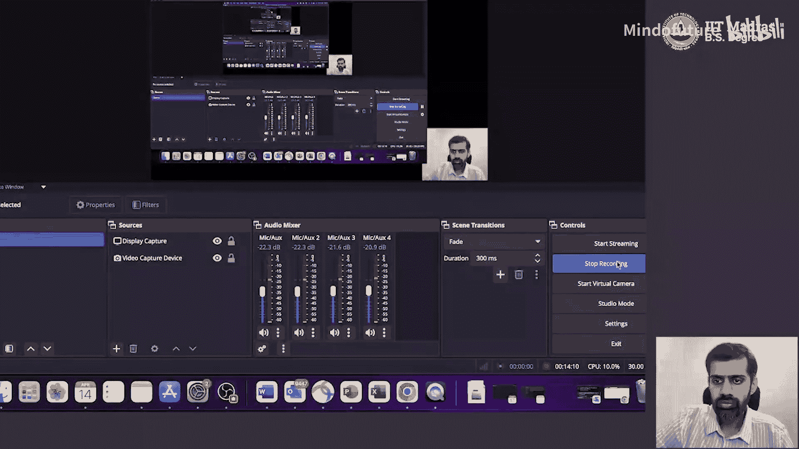
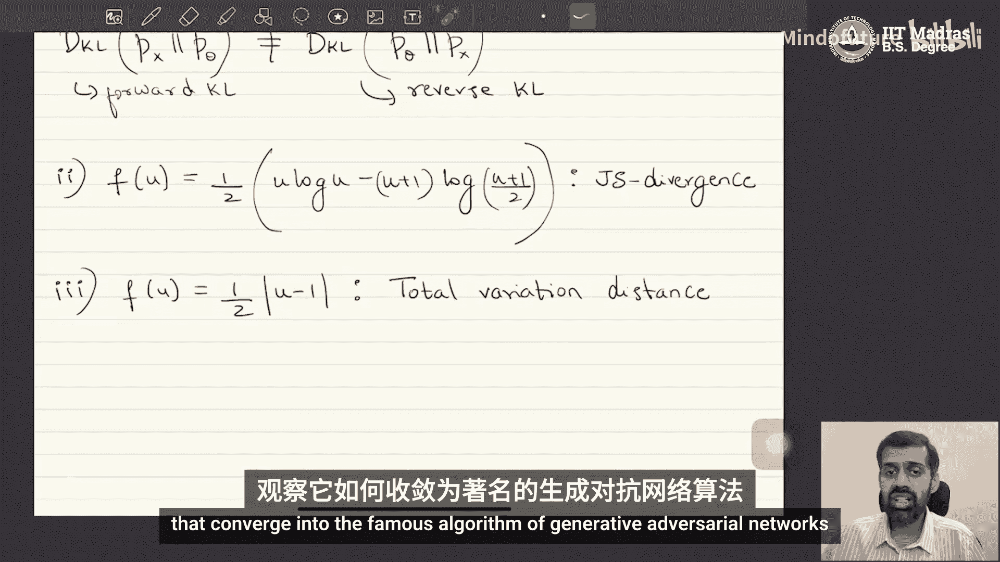

# 003：f-散度

欢迎来到深度生成模型课程的本节内容。在本节中，我们将探讨一类基于“变分散度最小化”原理的生成模型。著名的生成对抗网络也是这个生成模型家族的成员。

在深入探讨变分散度最小化的细节之前，我们先快速回顾一下上一节的概念，以保持连续性。

## 概述

在上一节中，我们学习了生成建模的形式化定义。我们被给予的数据集是一组独立同分布地从底层未知分布 `P_x` 中抽取的样本。目标是根据这个数据集估计底层分布 `P_x` 并学会从中采样。估计 `P_x` 可以是隐式的或显式的，但生成模型的一个主要要求是学会从底层分布中采样。

我们还学习了构建生成模型的通用原则，它包含三个主要步骤：
1.  假设一个参数化分布族 `P_θ`，通常用深度神经网络表示。
2.  定义并估计真实分布 `P_x` 与模型分布 `P_θ` 之间的散度度量。
3.  通过优化 `P_θ` 的参数来最小化上述散度度量，使 `P_θ` 尽可能接近 `P_x`。

我们以“前向映射”方法为例，其思想是从一个已知如何采样的任意随机变量（如标准正态分布）开始，通过一个确定性函数 `G_θ`（通常是神经网络）将其映射到数据空间。输出随机变量的分布就是 `P_θ`。目标是优化 `G_θ` 的参数，使 `P_θ` 与 `P_x` 之间的散度最小。

上一节结束时，我们提出了几个关键问题：
*   如何在不知道 `P_x` 和 `P_θ` 具体形式、仅有其样本的情况下计算散度？
*   应该选择哪种散度度量？
*   如何选择函数 `G_θ`（即模型结构）？
*   如何解决最小化散度的优化问题？

变分散度最小化方法与之前看到的前向映射方法并无本质不同。现在，让我们开始学习这种方法。

## 定义散度度量

构建生成模型的关键要素之一是定义分布间的散度度量。让我们定义一类称为 **f-散度** 的分布散度度量。

给定两个概率分布函数及其对应的密度函数 `p_x` 和 `p_θ`（假设为连续随机变量且密度函数定义良好），它们之间的 **f-散度** 定义如下：

`D_f(p_x || p_θ) = ∫ p_θ(x) * f( p_x(x) / p_θ(x) ) dx`

其中：
*   积分在随机变量 `x` 的整个空间（通常是 `R^d`）上进行。
*   `f` 是一个从正实数到实数的**凸函数**，且是**左半连续**的，并满足 `f(1) = 0`。
*   `u = p_x(x) / p_θ(x)` 是密度比，由于密度函数非负，该比值为正实数，因此 `f(u)` 定义良好。

## f-散度的性质

f-散度具有以下对我们构建生成模型至关重要的性质：
1.  **非负性**：对于任何满足条件的 `f`，`D_f(p_x || p_θ) ≥ 0`。
2.  **同一性**：`D_f(p_x || p_θ) = 0` 当且仅当 `p_x = p_θ`（即两个分布完全相同）。

我们的目标是构建生成模型，使模型分布 `P_θ` 与真实分布 `P_x` 之间的散度为零。利用f-散度的这两个性质，当散度最小化为零时，就意味着两个分布匹配，从而可以通过模型生成近似来自 `P_x` 的样本。

## f-散度的例子

通过选择不同的凸函数 `f`，我们可以得到具有不同性质的散度度量。以下是几个著名的例子：

**1. KL散度**
如果选择 `f(u) = u log u`，对应的f-散度就是著名的**KL散度**（Kullback-Leibler divergence）：
`D_f(p_x || p_θ) = ∫ p_x(x) log( p_x(x) / p_θ(x) ) dx`
KL散度是f-散度的一个特例。需要注意的是，KL散度是非对称的，即 `D_KL(p_x || p_θ) ≠ D_KL(p_θ || p_x)`，前者称为前向KL，后者称为反向KL。

**2. JS散度**
如果选择 `f(u) = -(u+1)log((u+1)/2) + u log u`，对应的f-散度称为**Jensen-Shannon散度**。
JS散度的一个版本被用于著名的生成对抗网络中。

**3. 总变差距离**
如果选择 `f(u) = 0.5 * |u - 1|`，对应的f-散度称为**总变差距离**。

所有这些 `f` 函数都满足从 `R+` 到 `R` 的凸性、左半连续性以及 `f(1)=0` 的条件。

## 总结

通过选择特定的 `f` 函数，我们可以获得具有特定性质的f-散度。不同的选择将导致不同的散度度量，进而影响生成模型的构建方式。

在本节课中，我们一起学习了：
1.  回顾了生成模型的通用构建框架。
2.  正式定义了**f-散度**这一类分布距离度量，并了解了其非负性和同一性的关键性质。
3.  探讨了f-散度的几个具体实例，包括KL散度、JS散度和总变差距离，认识到通过选择不同的凸函数 `f` 可以得到不同特性的散度。

接下来，我们将描述一个通用算法，该算法利用我们之前看到的前向映射方法，通过最小化任意f-散度来构建生成模型。之后，我们将通过固定一个特定的f-散度（JS散度）来查看其如何演变成著名的生成对抗网络算法。