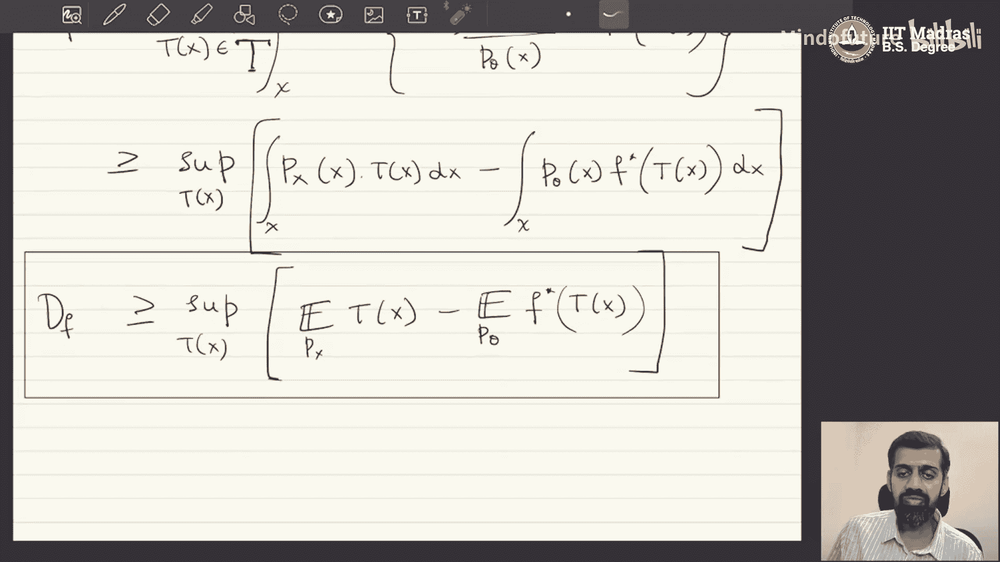

# 004：变分散度最小化

## 概述

在本节课中，我们将学习如何构建生成式模型的核心优化算法。具体来说，我们将探讨如何在不直接知道真实数据分布 `Px` 和模型分布 `Pθ` 的情况下，通过样本数据来最小化它们之间的 `f` 散度。我们将学习如何利用凸共轭函数将难以计算的积分形式的散度，转化为可以通过样本均值来近似的期望形式，从而为后续的实际优化奠定基础。

## 生成式建模的设定

上一节我们介绍了生成式建模的基本框架。本节中，我们来看看这个框架下的具体优化目标。

我们有一个数据集 `D`，包含 `n` 个独立同分布的数据点 `{x1, x2, ..., xn}`，它们来自一个未知的真实数据分布 `Px`。

我们的目标是学习一个能够从 `Px` 中采样的生成模型。我们使用一个由神经网络参数化的函数 `Gθ(z)` 来实现这一点。其中，`z` 来自一个我们已知如何采样的简单分布（例如标准正态分布）。`Gθ(z)` 的输出 `x̂` 服从模型分布 `Pθ`。

为了使 `Pθ` 成为 `Px` 的有效采样器，我们需要确保 `Pθ` 与 `Px` 尽可能相同。这可以通过最小化 `Pθ` 和 `Px` 之间的分布散度来实现，例如 `f` 散度。

我们的优化目标是：
**目标**：找到参数 `θ`，以最小化 `Px` 和 `Pθ` 之间的 `f` 散度。

然而，我们面临一个核心挑战：我们既不知道 `Px` 的精确形式，也不知道 `Pθ` 的精确形式。我们只有来自这两个分布的样本：
*   来自 `Px` 的样本：数据集 `D`。
*   来自 `Pθ` 的样本：将随机噪声 `z` 输入生成网络 `Gθ` 得到的输出。

此外，`f` 散度的定义涉及在高维数据空间上的积分，直接计算是难以处理的。

## 关键思路：用样本近似期望

为了解决上述挑战，我们需要一个关键的统计学思想：涉及密度函数的积分可以用从该分布中抽取的样本来近似。

具体来说，假设我们需要计算一个积分 `I`，它是某个函数 `h(x)` 关于分布 `Px` 的期望：
`I = ∫ h(x) Px dx = E_{x~Px}[h(x)]`

根据大数定律，如果我们有从 `Px` 中独立抽取的样本 `{x1, x2, ..., xn}`，那么这个期望可以用样本均值来近似：
`E_{x~Px}[h(x)] ≈ (1/n) Σ_{i=1}^{n} h(xi)`

这意味着，**我们只需要样本，而不需要知道分布的确切形式，就可以近似计算关于该分布的期望**。

这个思路对我们的问题至关重要。如果我们可以将 `f` 散度表示为关于 `Px` 和 `Pθ` 的期望形式，那么我们就可以利用已有的样本来近似计算它，并进行优化。

## 将 `f` 散度表达为期望形式

现在，我们的核心任务是将 `f` 散度用关于 `Px` 和 `Pθ` 的期望表示出来。这需要用到凸分析中的**凸共轭函数**工具。

### 凸函数与凸共轭

首先，我们回顾一下凸函数的定义。

一个函数 `f(u)` 是凸函数，如果对于其定义域内的任意两点 `u1`, `u2` 和任意满足 `α1 + α2 = 1` 且 `α1, α2 ≥ 0` 的系数，都有：
`α1 f(u1) + α2 f(u2) ≥ f(α1 u1 + α2 u2)`

对于任意凸函数 `f(u)`，都存在一个对应的**凸共轭函数** `f*(t)`，定义为：
`f*(t) = sup_{u} [ t * u - f(u) ]`
其中，`sup` 表示上确界（可以理解为最大值）。这个定义是逐点进行的：为了得到 `f*(t)` 在某个 `t` 处的值，我们需要求解一个关于 `u` 的优化问题。

凸共轭函数 `f*(t)` 本身也是凸函数。此外，凸共轭的共轭会得到原函数（在闭凸函数条件下），即：
`f(u) = sup_{t} [ u * t - f*(t) ]`

### 对 `f` 散度应用凸共轭

`f` 散度的定义是：
`D_f(Px || Pθ) = ∫ Pθ(x) * f( Px(x) / Pθ(x) ) dx`

令 `u = Px(x) / Pθ(x)`。利用上面提到的凸共轭性质 `f(u) = sup_{t} [ u * t - f*(t) ]`，我们可以将 `f` 散度重写为：
`D_f(Px || Pθ) = ∫ Pθ(x) * sup_{t} [ (Px(x)/Pθ(x)) * t - f*(t) ] dx`

现在，我们遇到了一个顺序问题：积分内部有一个上确界运算。由于内部优化问题的目标函数依赖于 `x`，其解 `t` 也将是 `x` 的函数。因此，我们不能简单地将 `sup` 移到积分外面。

正确的做法是，将优化变量视为一个函数 `T(x)`，它属于所有可能的函数空间 `𝒯`（从数据空间 `x` 映射到 `f*` 的定义域）。这样，我们就可以将上确界移到积分外部：
`D_f(Px || Pθ) ≥ sup_{T ∈ 𝒯} ∫ [ Px(x) * T(x) - Pθ(x) * f*( T(x) ) ] dx`

请注意，这里变成了不等式（`≥`）。这是因为我们搜索的函数空间 `𝒯` 可能并不包含那个对每个 `x` 都能给出内部优化问题精确解的理想函数 `T*(x)`。因此，我们实际上得到了 `f` 散度的一个**下界**。

### 得到期望形式

现在，观察上述不等式的右边：
`sup_{T ∈ 𝒯} { ∫ Px(x) T(x) dx - ∫ Pθ(x) f*( T(x) ) dx }`

这正是我们想要的期望形式：
`sup_{T ∈ 𝒯} { E_{x~Px}[ T(x) ] - E_{x~Pθ}[ f*( T(x) ) ] }`

**我们成功地将 `f` 散度表示为了一个关于 `Px` 和 `Pθ` 的期望的优化形式（确切地说，是散度下界的优化形式）。**

## 总结

本节课中，我们一起学习了构建生成式模型的关键一步——将分布散度最小化问题转化为可计算的优化问题。

1.  **我们首先明确了问题**：在只有样本、不知道分布具体形式的情况下，如何最小化模型分布 `Pθ` 与真实分布 `Px` 之间的 `f` 散度。
2.  **我们引入了核心工具**：利用大数定律，我们可以用样本均值来近似关于分布的期望。
3.  **我们完成了关键的推导**：通过引入凸共轭函数 `f*`，我们将难以直接计算的 `f` 散度，转化为了一个关于 `Px` 和 `Pθ` 的期望的优化问题（最大化下界）：
    `D_f(Px || Pθ) ≥ sup_{T ∈ 𝒯} { E_{x~Px}[ T(x) ] - E_{x~Pθ}[ f*( T(x) ) ] }`

这个公式就是著名的 **`f`-GAN 目标函数**的核心。在下一节中，我们将看到如何将这个理论框架实例化，通过神经网络来参数化函数 `T(x)`（通常称为判别器或批评器），并设计实际的训练算法来优化生成器 `Gθ` 的参数，从而学习到逼近真实数据分布的生成模型。