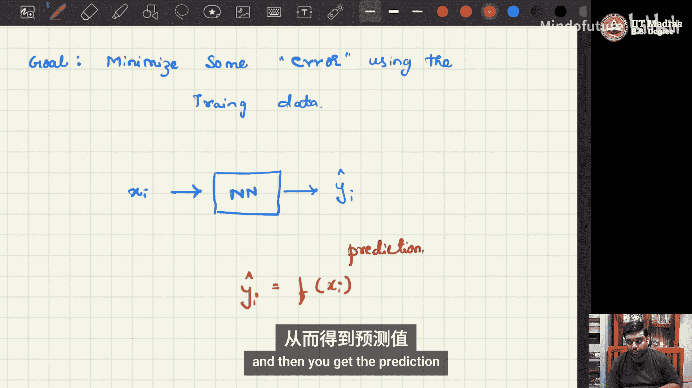

# 005：前向传播与反向传播

## 概述
在本教程中，我们将学习神经网络的两个核心过程：前向传播与反向传播。我们将通过一个简单的多层感知器（MLP）模型，详细解释数据如何从输入流向输出以进行预测（前向传播），以及如何根据预测误差来更新网络权重以最小化损失（反向传播）。理解这两个过程是掌握深度学习，特别是生成式AI模型训练的基础。

---

## 监督学习简介
在监督学习中，我们已知数据的正确答案。目标是学习从输入特征到输出标签的映射函数。训练数据通常表示为一系列数据对 `(X_i, Y_i)`，其中 `X_i` 是输入特征，`Y_i` 是对应的目标标签。我们的目标是找到一个函数 `f`，使得预测值 `Ŷ_i = f(X_i)` 尽可能接近真实值 `Y_i`。衡量接近程度的指标称为损失 `L`，我们的核心任务就是最小化这个损失。

---

## 前向传播过程
上一节我们介绍了监督学习的目标，本节中我们来看看神经网络如何通过前向传播进行预测。

我们构建一个简单的MLP作为示例。假设输入 `X_i` 有两个特征 `(x_i1, x_i2)`。网络结构包括一个输入层（2个节点）、一个隐藏层（2个节点）和一个输出层（1个节点）。这是一个全连接网络，意味着每一层的每个节点都与下一层的所有节点相连。

以下是网络中各部分的命名规则：
*   **激活值**：用 `a` 表示，下标为 `(层号，节点号)`。例如，`a_21` 表示第2层第1个节点的激活值。输入层的激活值就是输入特征本身，即 `a_11 = x_i1`, `a_12 = x_i2`。
*   **权重**：用 `w` 表示，下标为 `(目标层节点，源层节点)`。例如，`w_211` 表示从第1层第1个节点连接到第2层第1个节点的权重。
*   **偏置**：用 `b` 表示，下标为 `(层号，节点号)`。例如，`b_21` 是第2层第1个节点的偏置。
*   **加权和**：在应用激活函数前，节点会计算其输入的加权和，用 `z` 表示，下标规则与 `a` 相同。例如，`z_21 = w_211 * a_11 + w_212 * a_12 + b_21`。

前向传播的计算步骤如下：
1.  计算隐藏层节点的加权和 `z` 和激活值 `a`。我们使用一个激活函数 `g`（如Sigmoid或ReLU）来引入非线性。
    *   `z_21 = w_211 * a_11 + w_212 * a_12 + b_21`
    *   `a_21 = g(z_21)`
    *   同理计算 `a_22`。
2.  计算输出层节点的加权和与激活值，得到最终预测 `Ŷ_i`。
    *   `z_31 = w_311 * a_21 + w_312 * a_22 + b_31`
    *   `Ŷ_i = a_31 = g(z_31)`

这个过程从输入开始，逐层计算，直到产生输出，因此被称为“前向”传播。

---

## 损失计算
在得到预测值后，我们需要衡量预测的误差。损失函数 `L` 的具体形式取决于任务类型。在本教程中，我们以回归任务常用的均方误差（MSE）损失为例。

对于单个数据点，其MSE损失计算公式为：
`L = 1/2 * (Y_i - Ŷ_i)^2`

公式中的 `1/2` 是为了后续求导时形式更简洁。如果有多个数据点，总损失通常是所有数据点损失的平均值。我们的目标就是通过调整网络参数（所有权重 `w` 和偏置 `b`），使这个损失 `L` 最小化。

---

## 反向传播与梯度下降
上一节我们定义了需要最小化的损失，本节中我们来看看如何通过反向传播和梯度下降来更新网络参数。

我们无法直接修改输入数据，只能调整网络的参数（统称为 `θ`）。最小化损失函数的标准方法是梯度下降法。其核心思想是：计算损失函数相对于每个参数的梯度（即导数），然后沿着梯度反方向（即下降最快的方向）更新参数。

对于任意一个权重参数 `w`，其更新公式为：
`w_new = w_old - α * (∂L / ∂w)`

其中 `α` 是一个正数，称为**学习率**，它控制着每次更新的步长。`∂L / ∂w` 就是损失 `L` 对权重 `w` 的梯度，它告诉我们：如果稍微增加 `w`，损失 `L` 会如何变化。

计算 `∂L / ∂w` 需要用到链式法则，因为 `w` 的影响是通过网络层层传递到最终损失 `L` 的。这个过程从损失 `L` 开始，逆向逐层计算梯度，直到最初的权重 `w`，因此被称为“反向”传播或“反向”传递。

让我们以权重 `w_211` 为例，演示梯度计算过程。根据链式法则，梯度 `∂L / ∂w_211` 可以分解为路径上各环节导数的乘积：

`∂L / ∂w_211 = (∂L / ∂Ŷ_i) * (∂Ŷ_i / ∂z_31) * (∂z_31 / ∂a_21) * (∂a_21 / ∂z_21) * (∂z_21 / ∂w_211)`

以下是每个部分的计算：
1.  `∂L / ∂Ŷ_i = -(Y_i - Ŷ_i)` （对MSE损失求导）
2.  `∂Ŷ_i / ∂z_31 = g‘(z_31)`，例如，若使用Sigmoid激活函数，则 `g‘(z) = g(z) * (1 - g(z)) = Ŷ_i * (1 - Ŷ_i)`
3.  `∂z_31 / ∂a_21 = w_311` （`z_31` 对 `a_21` 的偏导就是其系数）
4.  `∂a_21 / ∂z_21 = g‘(z_21)`，即 `a_21 * (1 - a_21)` （假设隐藏层也用Sigmoid）
5.  `∂z_21 / ∂w_211 = a_11` （即 `x_i1`）

将所有这些项相乘，就得到了损失 `L` 对于权重 `w_211` 的完整梯度。然后，我们就可以使用梯度下降公式来更新 `w_211`。对网络中的每一个参数重复此过程，就完成了一轮反向传播更新。

---

## 整体训练流程
现在，我们将前向传播和反向传播结合起来，看看神经网络的整体训练流程。

标准的训练流程是迭代进行的，包含以下步骤：
1.  **数据准备**：将整个训练集划分为若干个小批次（Batch）。
2.  **迭代训练**：对于每一个训练轮次（Epoch），遍历所有小批次数据。
    *   **前向传播**：将当前批次的输入数据 `X_batch` 送入网络，计算得到预测输出 `Ŷ_batch`。
    *   **损失计算**：根据预测 `Ŷ_batch` 和真实标签 `Y_batch` 计算批次损失 `L_batch`。
    *   **反向传播**：计算损失 `L_batch` 对网络所有参数的梯度。
    *   **参数更新**：使用梯度下降法更新所有参数（权重和偏置）。
3.  **评估**：重复步骤2直至达到预设的训练轮次。最后使用未见过的测试数据评估模型性能。

这个过程不断循环，通过大量数据反复调整参数，使得网络的预测能力逐渐提升。

---

## 总结
在本教程中，我们一起学习了神经网络的核心训练机制。
*   我们首先回顾了监督学习的目标：学习映射函数以最小化预测损失。
*   接着，我们通过一个简单的MLP网络，详细阐述了**前向传播**的过程，即数据如何从输入层经隐藏层流向输出层并产生预测。
*   然后，我们定义了**均方误差损失**来衡量预测误差。
*   为了最小化损失，我们引入了**反向传播**和**梯度下降**算法。我们以链式法则为基础，逐步推导了计算损失对某个权重梯度的完整过程。
*   最后，我们概述了结合前向传播和反向传播的**整体训练流程**，包括数据分批、迭代更新等关键步骤。

理解前向传播和反向传播是深入任何深度学习领域的基石。在接下来的教程中，我们将学习如何使用PyTorch等现代框架高效地实现这些过程。