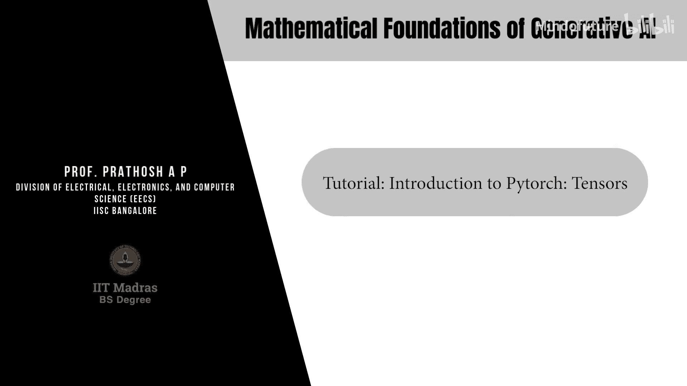
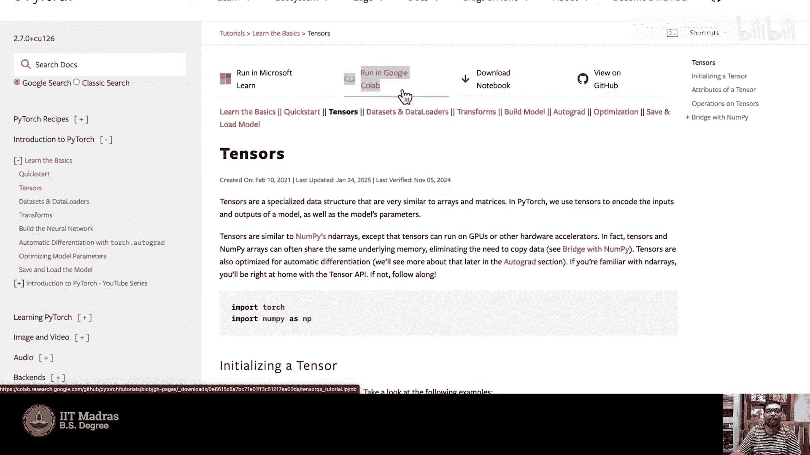
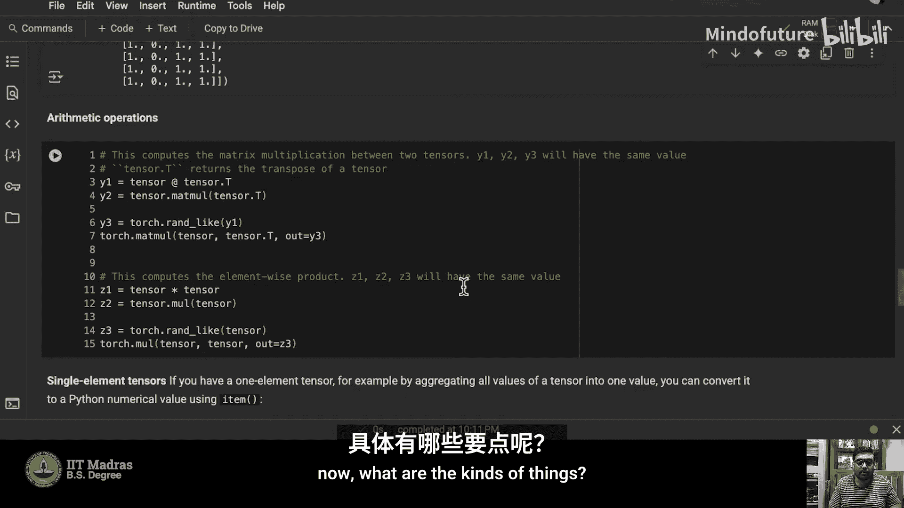
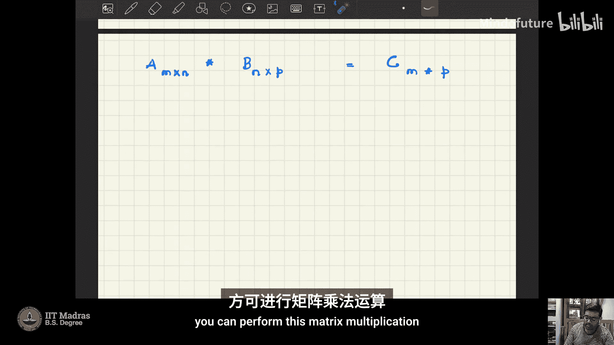
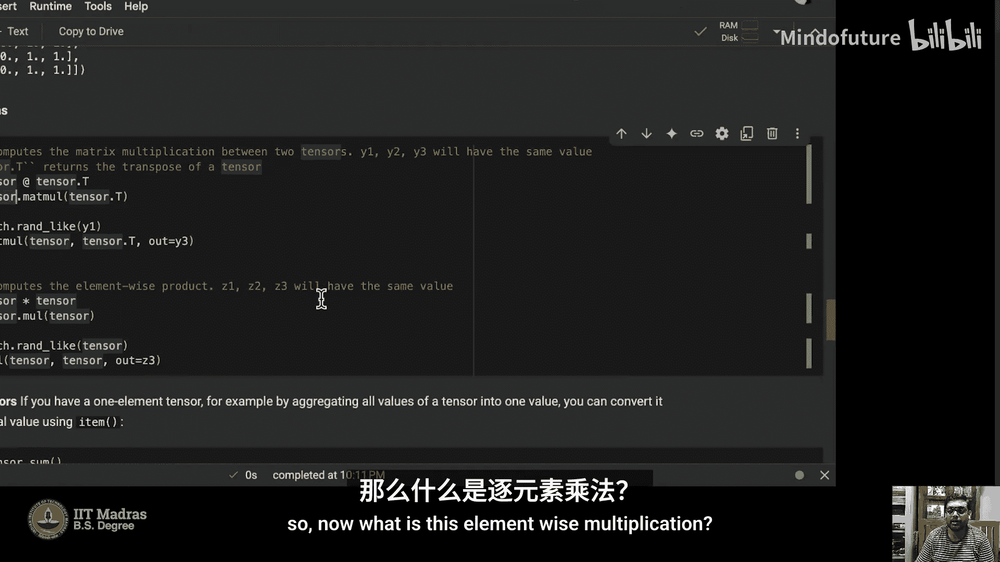
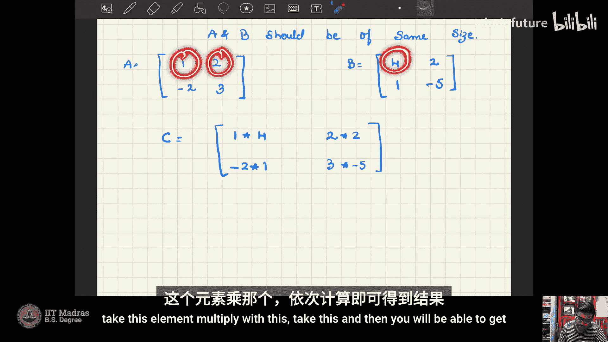
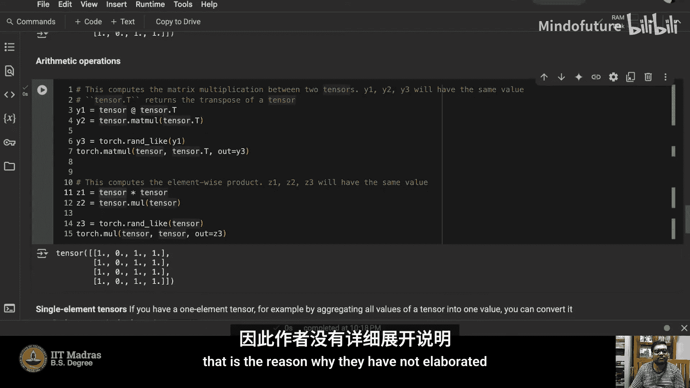
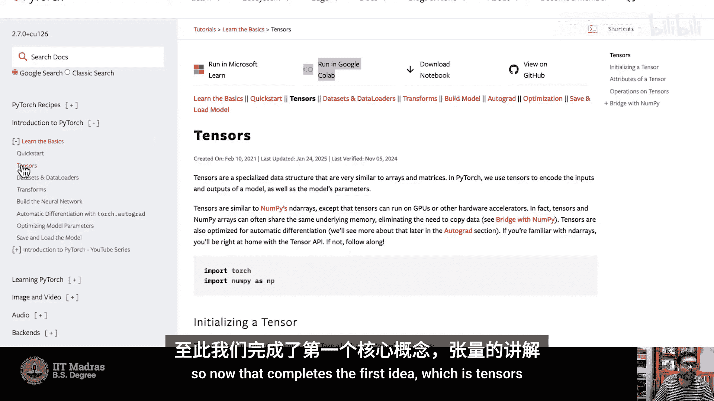

# 006：PyTorch入门与张量基础 🧮

在本教程中，我们将学习PyTorch的基础知识。PyTorch是一个广泛用于实现深度学习模型的库。整个课程中，你将学习大量理论，了解如何从数学上构建模型。此外，你还将学习如何在简单数据集上实现这类模型。我们将使用Google Colab进行本次练习，它为我们提供了GPU访问权限。本课程的编码练习结构设计为无需更多计算资源，我们将实现这些模型的简化版本，并讨论在有计算资源时如何扩展它们。

在之前的教程中，我们探讨了前向传播和反向传播的概念，以及梯度如何计算和整体训练流程。在本教程中，我们将重点学习PyTorch的基础知识。

我们将使用PyTorch。如果有人感兴趣，也可以寻找使用TensorFlow实现类似模型的资源，但本课程的核心讨论将围绕PyTorch展开。

关于本教程的先决条件，我假设你了解多层感知机的基本结构和张量的基本概念。MLP的基本结构我们在之前的教程中讨论过。如果你对卷积神经网络的结构不太熟悉或想复习，可以参考斯坦福大学CS231n课程资源。该资源提供了非常详细的笔记和示例，解释了卷积层的工作原理、参数共享的概念等。你可以查看该资源中的CNN笔记部分。我假设这些先决知识已知，并已提供参考材料。

现在，回到PyTorch。我们将使用公开的标准PyTorch教程，并解释需要更多阐述的部分，在需要时运行代码。在本教程的最后，我们将编写一个简单的结构，读取一些数据集并对其进行操作。这是整体思路。

## 访问教程与Colab环境 🚀

现在，我们开始学习。你可以在浏览器中搜索“PyTorch tutorial”访问官方教程，或直接访问链接 `https://pytorch.org/tutorials/`。这是基础教程，涵盖了大部分核心概念。我们将从基础开始学习，扩展部分你可以自行查看。

我们首先从“快速入门”开始。教程提供了多种运行方式：可以在Colab上运行，可以下载笔记本在本地机器、Visual Studio或Jupyter Notebook上使用，也可以查看GitHub。在本教程中，我将在Colab上运行，以便你熟悉Colab环境和代码执行。

接下来，我们进入“张量”部分。我将在Colab中打开它。

Colab笔记本会有这些对话框。它带有`.ipynb`扩展名，代表交互式Python笔记本。当你运行任何指令或代码时，它需要在某个设备上物理运行。这个设备不是你的本地资源，而是Google服务器分配给你的一块资源，你的代码将在该资源块中运行。这消除了安装包、维护必要包的所有麻烦，我们无需担心这些，可以直接开始学习必要的知识。

我假设你了解Python。如果你对Python不太熟悉，我建议你先学习Python的基础课程。

## 什么是张量？🧱

张量是PyTorch的构建模块。你可以将它们视为一种专门的数据结构，类似于我们熟知的数组或矩阵。如果你使用过NumPy，它有一种叫做`ndarray`（n维数组）的结构，张量与此类似。但关键区别在于，张量可以在GPU和其他硬件加速器上运行。GPU极大地推动了深度学习的发展。因此，你可以在GPU上运行这些张量或对张量的操作，这是使用PyTorch等库的额外优势。

在第一个笔记本中，我们来看看如何创建张量，以及如何对张量进行一些基本操作。

## 创建张量 🛠️

首先，我们需要导入必要的库。使用PyTorch时，第一个需要的库是`torch`，因此需要导入`torch`。对于数据，你可以创建一个列表并将其转换为张量，或者创建一个NumPy数组再转换为张量。对于列表，你不需要导入其他库；如果要使用NumPy数组，则需要导入`numpy`。

让我们运行代码。第一次运行时可能需要一些时间，因为它需要与服务器建立连接。

这些是文本块和代码块。文本块提供更多信息，代码块是你编写和运行代码片段的地方。

我假设你对这些基本概念已经相当熟悉。

现在，你创建了数据。你创建了一个二维数组，这通常被称为矩阵。你试图将这个列表或二维数组转换为张量。如何操作呢？

你只需使用`torch.tensor()`方法，将`data`作为参数传递。这将返回一个张量类型的数据，其中的值保持不变。值的类型不会改变，但数据的类型会改变。`data`是一个列表，你可以使用`type(data)`来检查。现在，你正在改变这个列表的类型。让我们运行一下。

这就是如果你有一个列表，如何将其转换为张量。

另一方面，如果你的数据是NumPy数组，在第一行中，我将我的数据（一个列表）转换为NumPy数组。现在，如何将NumPy数组转换为张量呢？

你使用`torch.from_numpy()`方法，传入转换后的NumPy数组。这样，你就得到了创建的张量。

这意味着，你可以使用列表或NumPy数组来创建张量。

大多数时候，你可能需要创建一个随机张量，或者具有特定值的张量，例如所有值都为1的张量，或特定大小的随机张量。

我们有两种创建方式：一种是直接提供数据，库内部会计算大小并创建相应大小的张量；另一种是直接指定大小。让我们看看这两种方式。

你有这个`x_data`。`x_data`是一个张量，是一个2x2的张量。我想要一个所有值都为1的张量，并且也是2x2的张量。如果`x_data`具有某些特定属性，这些属性也会被传递到新创建的`x_ones`中。此外，如果你想要随机值，你可以传递这个数据并指定数据类型应为`float`。但请注意，`x_data`的数据类型是整数，这个方法会覆盖`x_data`的类型，然后你将得到一个所有值都是浮点数的2x2张量。我们可以打印出来看看。

所有值都是1，你可以看到它的大小是2x2的张量。同样，如果我再次运行，你会看到生成了不同的值，因为你在进行随机采样。

这就是如果你传递与结构相似的数据，如何获得张量。

相反，如果你知道张量的形状，你可以这样做。在这个标准教程中，他们指定张量的形状应为2x3。如果你使用`torch.rand()`方法并传入形状，它将创建一个大小为2x3的随机张量。

如果你想要所有值都为1的张量，可以使用`torch.ones()`，只需将形状传递给这个方法，就会创建一个所有值都为1的张量。`torch.zeros()`则创建一个所有值都为0的张量。

我们可以看到这里创建了一个2x3的张量。第一个是随机张量，第二个是所有值都为1的张量，第三个是所有值都为0的张量。

这意味着，你可以根据已有的数据结构和形状来创建张量，或者直接指定形状来创建。

## 张量的属性 📊

接下来，我们看看张量的一些属性。一个是张量的形状，另一个是每个值的数据类型，以及它在什么设备上运行。在你的系统中，必须有CPU，而张量可以在CPU或GPU上。根据这一点，我可以判断它是在CPU上还是在GPU上。让我们运行看看。

张量的形状是3x4，正如我们在这个块中看到的。然后你可以看到形状和数据类型的属性。`dtype`表示数据类型，这里是`float32`。然后，这些值所在的设备是CPU，我还没有使用GPU。

这些是目前张量的一些属性。

现在，让我们尝试看看如何将张量移动到加速器（如果可用的话）。我们稍后再回到这一点。

## 切片与索引 🔪

这是切片和索引操作。在我们的课程中，我们不会过多需要切片和索引。如果你了解NumPy的切片和索引，它与张量的操作完全相同。你可以查看相关部分。

这里，第一个例子是创建一个所有值都为1的张量，形状是4x4，然后进行一些切片和索引操作。我不会深入讲解这个。

## 连接张量 🔗

如何连接张量？你有一个张量，也就是一个矩阵。如何连接矩阵？问题在于，是需要水平并排连接还是垂直堆叠连接？每当我们说连接张量时，都需要回答这个问题。让我们看看如何操作。`torch.cat()`是用于连接的方法，你需要提供一个张量列表。

这里，所有张量都是相同的，然后你有一个叫做`dim=1`的参数。这个`dim=1`是什么意思？然后你打印结果。让我们看看发生了什么。每个张量都是一个4x4的矩阵，这是已知的。看看这里发生了什么。

你看到... 也许我没有运行它。我仍然有一个... 哦，现在这个张量有1, 2, 3... 它有四行，有多少列？1, 2, 3, 4, 5, 6, 7, 8, 9, 10, 11, 12。是的，它重复了三次。所以，4x4旁边是4x4，再旁边是4x4。现在你有12列和4行。这意味着`dim=1`表示你正在按列连接。如果你想按行连接，只需将维度改为0。

现在你可以看到它已经被连接了。

因此，每当你想要连接时，出现的问题是：你想按列连接还是按行连接？这些可以通过改变连接的维度来处理。

## 矩阵乘法 ✖️

下一个需要的操作是矩阵乘法的概念，这是大多数神经网络中的核心思想。实际上，对于所有实际目的，神经网络中的整个前向传播都可以看作是矩阵乘法。那么，如何执行矩阵乘法呢？我假设你知道矩阵乘法的基本规则。让我再简述一下规则。

如果你有一个矩阵A，大小为`m x n`，另一个矩阵B，大小为`n x p`，那么你可以将它们相乘，得到一个矩阵C，大小为`m x p`。第一个矩阵的列数必须与第二个矩阵的行数匹配，然后你才能执行矩阵乘法。这是一个标准规则。

现在，你有一个大小为4x4的张量。你想用它乘以什么？你有一个4x4的矩阵想相乘，那么选项是什么？你必须有一个`4 x ?`的矩阵才能相乘。

所以，这个4x4的矩阵与`tensor.T`相乘。这里的`.T`是转置操作。`@`符号用于矩阵乘法。

`tensor`是一个4x4的矩阵，它的转置也是一个4x4的矩阵。你将一个4x4的矩阵与另一个4x4的矩阵相乘，结果将是一个4x4的矩阵。

你可以使用`@`，这是方法一。然后你有另一种方法。你可以从第一个张量调用一个方法，即`.matmul()`，然后传入第二个矩阵作为参数。

这与将第一个矩阵与第二个矩阵相乘相同，这是执行矩阵乘法的另一种方式。第三种方式是直接使用库函数`torch.matmul()`，你需要传入两个矩阵A和B，此外，你还需要传入结果矩阵。

这就是为什么你创建一个结果矩阵`y3`，它是一个具有随机值的张量。然后你传入它，将`tensor`与其转置相乘，输出将存储在`y3`中。这些是你可以进行矩阵乘法的三种方式：使用`@`符号，使用第一个矩阵的`.matmul()`方法，或者使用`torch.matmul()`并传入两个矩阵以及存储结果的张量。

## 逐元素乘法 ⚡

另一个我们需要的重要概念是逐元素乘法。让我们看看它是什么。

逐元素乘法是卷积运算中涉及的核心操作之一。要执行逐元素乘法，A和B必须具有相同的大小。

让我们取矩阵A，我放一些随机值，取一个简单的2x2矩阵：`[[1, 2], [-2, 3]]`。第二个矩阵B，也是同样的大小2x2，我取`[[4, 2], [1, -3]]`。如何执行逐元素乘法？C = A * B，结果将是`1*4, 2*2, -2*1, 3*(-3)`。你取每个元素并执行乘法，取这个元素乘以这个，取这个... 然后你就能得到结果。这就是逐元素乘法的概念。

那么，如何做逐元素乘法？你有一个大小为4x4的张量，我们已经创建了，使用`tensor * tensor`，你使用这个星号`*`。或者你可以使用`tensor.mul()`，注意不是`matmul`，`matmul`是矩阵乘法。我假设你现在已经清楚矩阵乘法和逐元素乘法的区别了。

逐元素乘积，第一个张量调用`.mul()`方法，然后传入第二个张量作为参数。或者，如我们之前所见，你可以使用`torch.mul()`，传入两个张量，甚至传入结果张量。

这些是你对张量执行的一些基本操作。你可以舒适地查看。所以，有了这些，我假设你了解了张量的基础知识，知道了张量的属性，如何创建随机张量、全1张量，以及如何执行逐元素乘积和矩阵乘法等基本操作。同样，你可以进行加法和其他操作，这些是琐碎的任务，因此教程没有详细阐述。

## 总结 📝

本节课中，我们一起学习了PyTorch中张量的核心概念与基础操作。我们了解了张量是PyTorch的基本数据结构，类似于NumPy数组但支持GPU加速。我们学习了如何从列表或NumPy数组创建张量，以及如何创建具有特定形状和值（如全1、全0或随机值）的张量。我们还探讨了张量的关键属性，如形状、数据类型和设备位置。最后，我们掌握了连接张量、执行矩阵乘法与逐元素乘法等基本运算的方法。这些知识是构建和理解后续更复杂深度学习模型的重要基石。