# 007：PyTorch数据集与数据加载器 🗂️

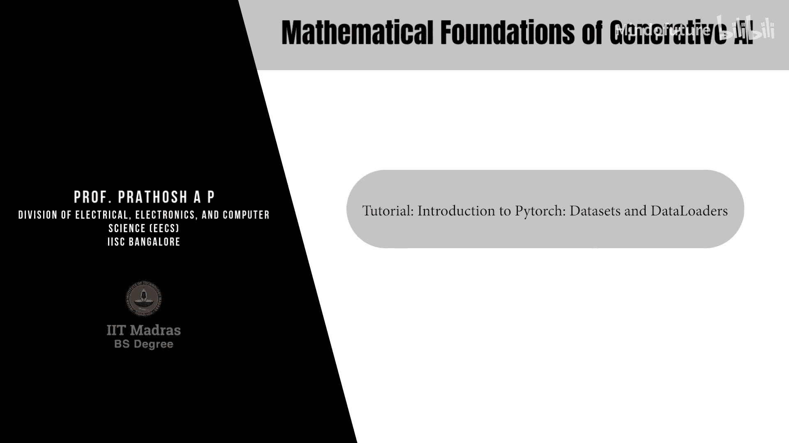

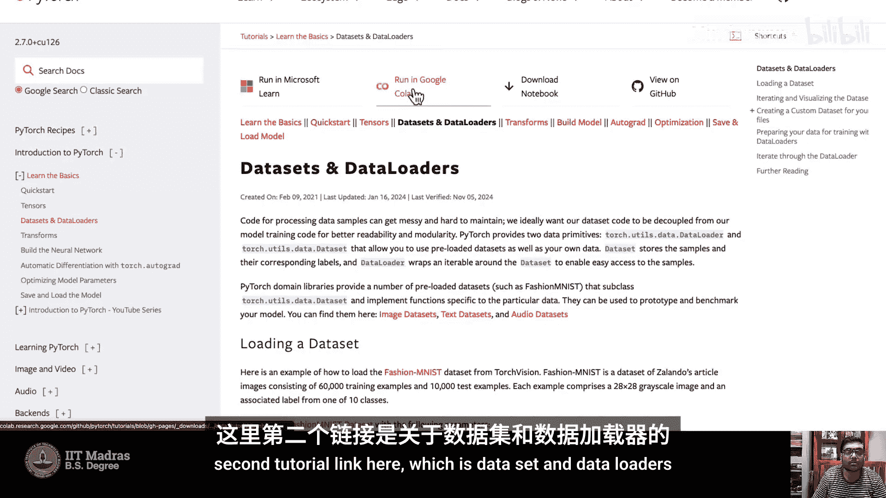

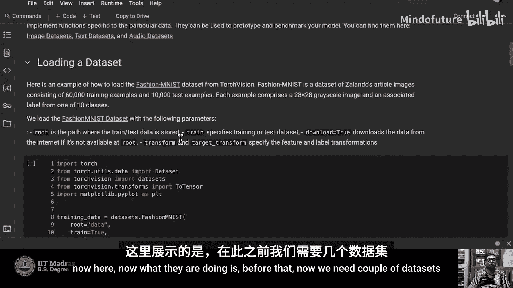

在本节课中，我们将学习如何在PyTorch中处理数据。所有输入模型的数据都需要是张量（Tensor）格式。因此，我们需要了解数据存储在哪里、如何获取，以及如何将其组织成批次（batches）以供模型训练。本节将重点介绍**数据集（Dataset）**和**数据加载器（DataLoader）**这两个核心概念。


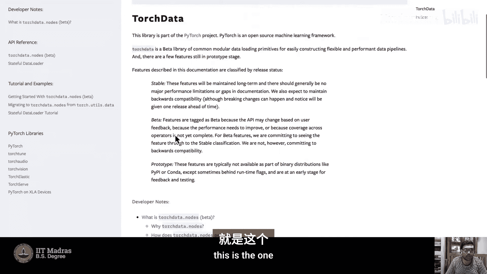


## 内置数据集

上一节我们介绍了张量的基本操作。本节中我们来看看如何获取和处理现成的数据。PyTorch的`torchvision`库提供了一些常用的内置数据集，方便我们快速开始实验。

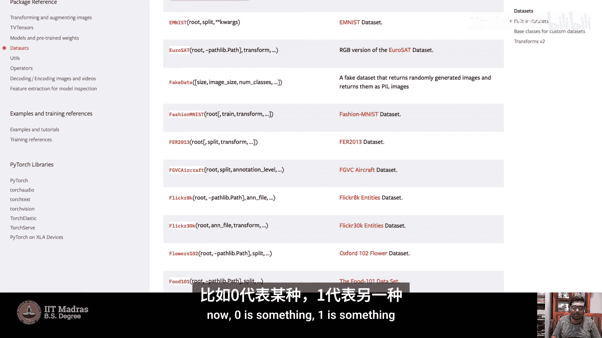

以下是PyTorch中可用的一些内置数据集示例：
*   **图像分类**：CIFAR-10, CIFAR-100, Fashion-MNIST, ImageNet等。
*   **图像检测/分割**：COCO, VOC等。
*   **图像对**：Stereo Matching数据集。
*   **视频分类/预测**：Kinetics, UCF101等。

这些数据集已经过预处理，我们可以直接使用它们进行模型训练和测试。在本教程中，我们将以**Fashion-MNIST**数据集为例。这是一个包含10个类别的图像分类数据集，例如T恤、裤子、鞋子等，类别标签通常用数字0到9表示。

要使用这些内置数据集，我们需要导入必要的库。

```python
import torch
from torchvision import datasets
from torchvision.transforms import ToTensor
import matplotlib.pyplot as plt
```

*   `torch`: PyTorch核心库。
*   `datasets`: 包含内置数据集的模块。
*   `ToTensor`: 一个转换（Transform），用于将PIL图像或NumPy数组转换为PyTorch张量。
*   `matplotlib.pyplot`: 用于可视化图像。

数据集通常分为**训练集**和**测试集**。训练集用于学习输入与输出之间的关系，测试集用于评估学习到的关系。我们可以如下加载Fashion-MNIST数据：

```python
# 加载训练数据
training_data = datasets.FashionMNIST(
    root="data",          # 数据存储的根目录
    train=True,           # 指定加载训练集
    download=True,        # 如果数据不在本地，则下载
    transform=ToTensor()  # 将图像转换为张量
)

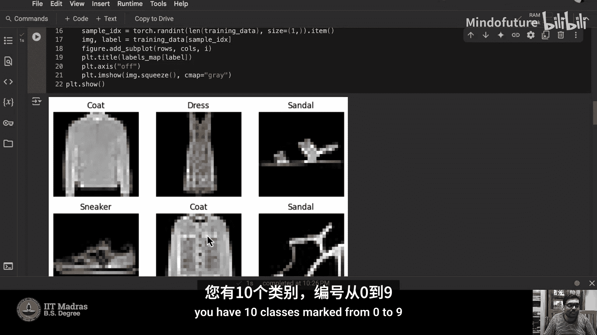

# 加载测试数据
test_data = datasets.FashionMNIST(
    root="data",
    train=False,          # 指定加载测试集
    download=True,
    transform=ToTensor()
)
```
代码解释：
*   `root="data"`: 指定数据存储在当前工作目录下的`data`文件夹中。
*   `download=True`: 如果指定路径下没有数据，则自动从网络下载。
*   `transform=ToTensor()`: 对加载的每张图像应用`ToTensor`转换，将其从PIL格式变为张量格式。

## 自定义数据集

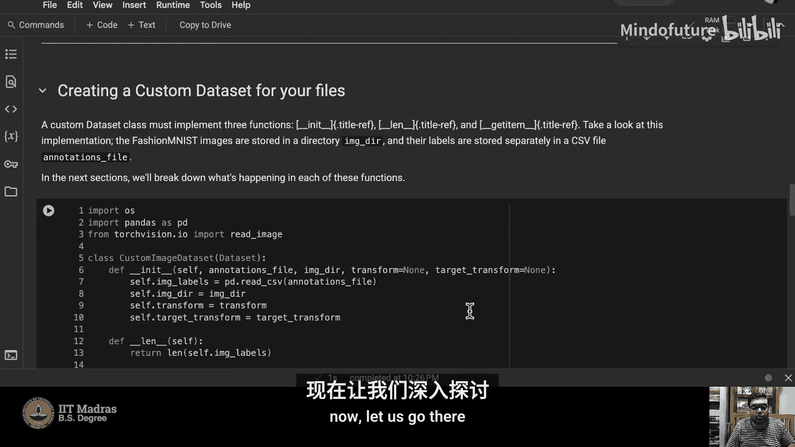

然而，在实际项目中，我们经常需要处理自定义的、私密的或特定领域的数据，这些数据并不在PyTorch的内置仓库中。这时，我们需要创建自己的**自定义数据集（Custom Dataset）**。

一个典型的自定义数据集结构包含两部分：
1.  **图像目录（Image Directory）**：一个文件夹，里面存放着所有的图像文件。
2.  **标注文件（Annotation File）**：通常是一个CSV文件，其中每一行记录了图像相对于图像目录的路径（或图像文件名）以及其对应的标签。

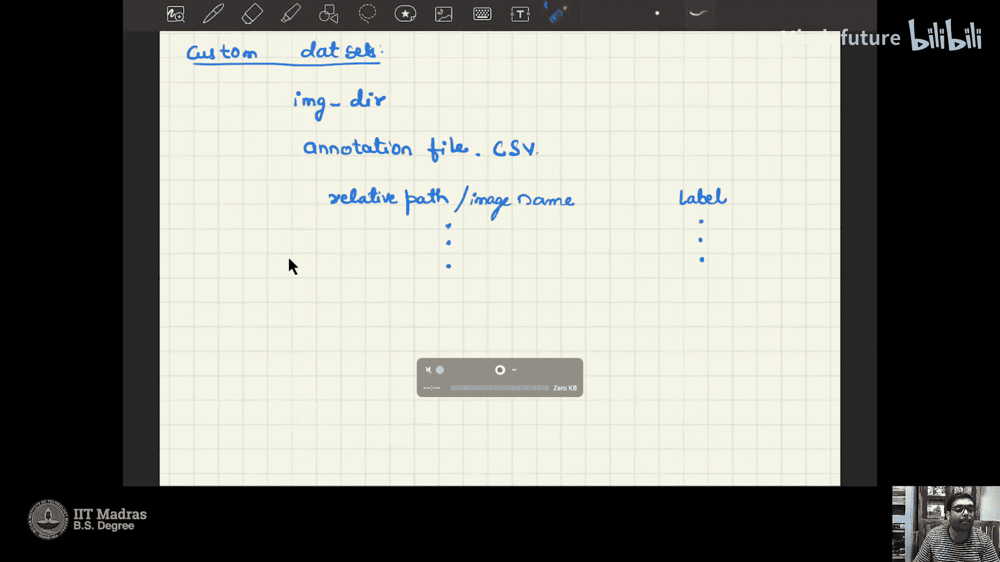

例如，一个标注文件`annotations.csv`的内容可能如下：
```
image_path,label
train/cat.1.jpg,0
train/dog.1.jpg,1
test/cat.2.jpg,0
...
```

为了创建自定义数据集，我们需要继承PyTorch的`torch.utils.data.Dataset`类，并实现两个必要的方法：`__len__`和`__getitem__`。

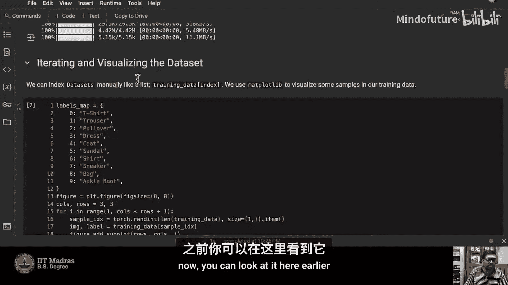

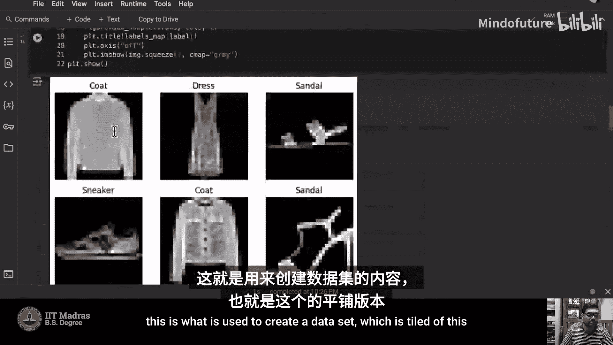

以下是创建自定义数据集类的代码框架：

```python
import os
import pandas as pd
from torchvision.io import read_image
from torch.utils.data import Dataset

class CustomImageDataset(Dataset):
    def __init__(self, annotations_file, img_dir, transform=None, target_transform=None):
        # 读取包含图像路径和标签的CSV文件
        self.img_labels = pd.read_csv(annotations_file)
        # 设置图像目录的路径
        self.img_dir = img_dir
        # 设置特征（图像）的转换函数
        self.transform = transform
        # 设置目标（标签）的转换函数
        self.target_transform = target_transform

    def __len__(self):
        # 返回数据集中的样本总数
        return len(self.img_labels)

    def __getitem__(self, idx):
        # 1. 根据索引idx拼接图像的完整路径
        img_path = os.path.join(self.img_dir, self.img_labels.iloc[idx, 0])
        # 2. 读取图像
        image = read_image(img_path)
        # 3. 获取对应标签
        label = self.img_labels.iloc[idx, 1]
        # 4. 应用转换（如果提供了的话）
        if self.transform:
            image = self.transform(image)
        if self.target_transform:
            label = self.target_transform(label)
        # 5. 返回图像-标签对
        return image, label
```
代码解释：
*   `__init__`: 构造函数，初始化时读取标注文件、设置路径和转换函数。
*   `__len__`: 返回数据集的样本数量，即标注文件的行数。
*   `__getitem__`: 根据给定的索引`idx`，返回对应的单个样本（图像张量和标签）。它通过`os.path.join`拼接完整图像路径，使用`read_image`读取图像，并从标注文件中获取标签。

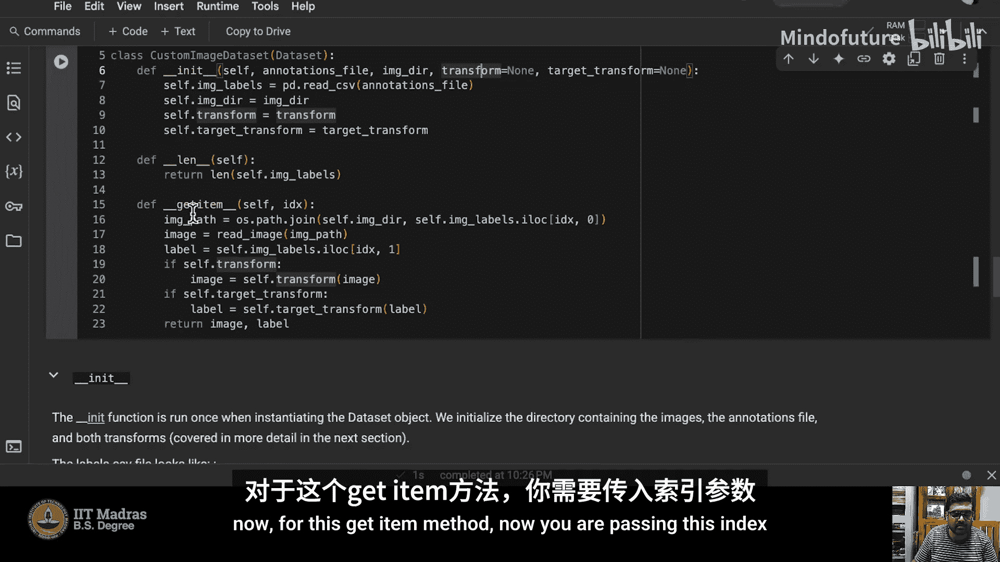

## 数据加载器（DataLoader）

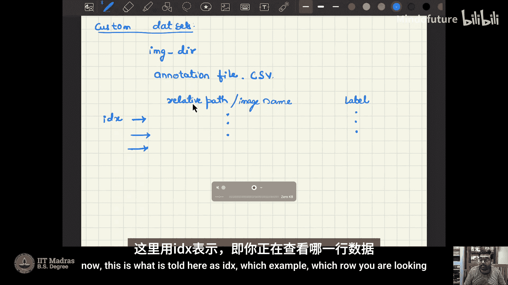

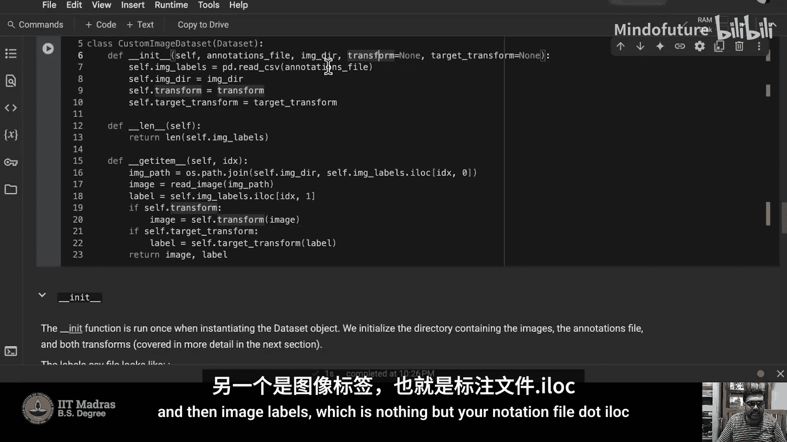

有了数据集（无论是内置的还是自定义的）之后，我们通常不会一次将全部数据送入模型。相反，我们会将数据分成小批次（batches），这种分批处理的方式对于利用GPU并行计算、管理内存以及引入随机性（防止模型过拟合）至关重要。**数据加载器（DataLoader）**就是负责这项工作的工具。

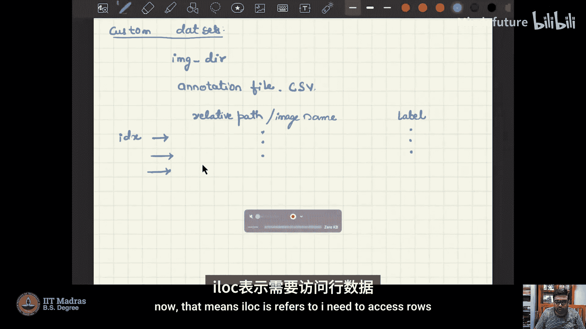

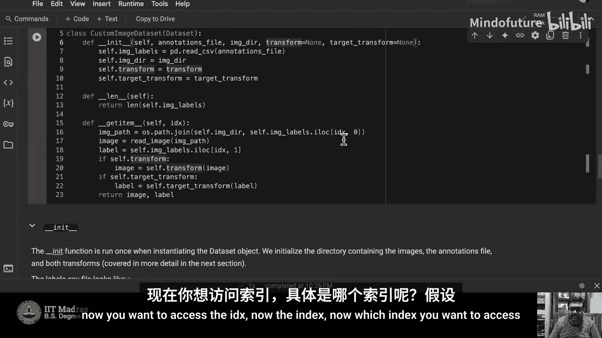

数据加载器围绕数据集创建一个可迭代对象，能够自动完成分批、打乱顺序和多进程数据加载等任务。

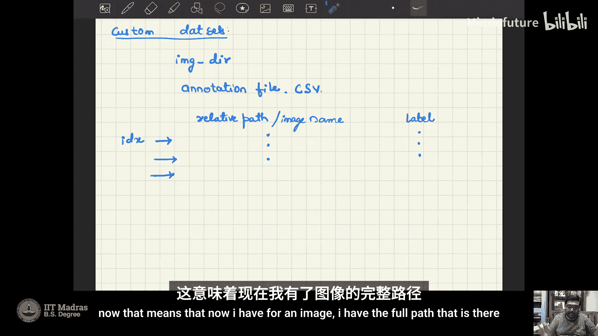

以下是创建数据加载器的示例：

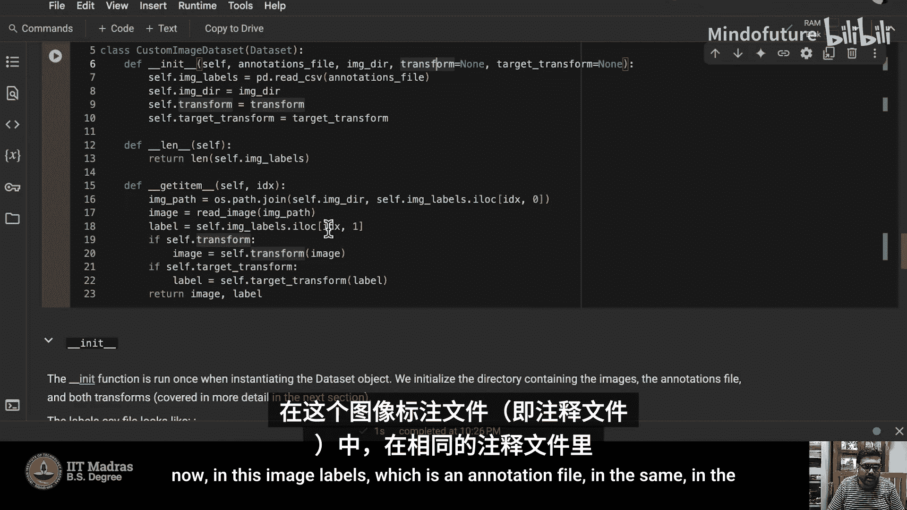

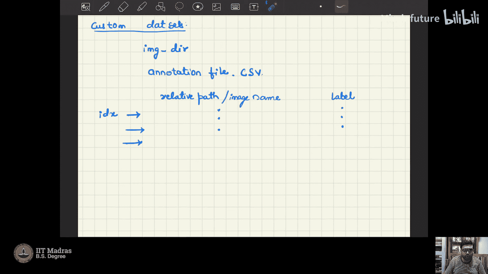

```python
from torch.utils.data import DataLoader

# 为训练数据创建数据加载器
train_dataloader = DataLoader(training_data, batch_size=64, shuffle=True)

# 为测试数据创建数据加载器
test_dataloader = DataLoader(test_data, batch_size=64, shuffle=False)
```
参数解释：
*   `batch_size=64`: 每个批次包含64个样本。
*   `shuffle=True`: 在每个训练周期（epoch）开始时，打乱训练数据的顺序。这有助于模型学习更通用的模式，防止记忆数据顺序。
*   `shuffle=False`: 对于测试数据，通常不需要打乱顺序，因为我们只需要对模型进行一次评估。

创建好数据加载器后，我们可以像迭代器一样使用它：

```python
# 获取一个批次的训练数据
train_features, train_labels = next(iter(train_dataloader))
print(f"特征批次形状: {train_features.size()}") # 输出: torch.Size([64, 1, 28, 28])
print(f"标签批次形状: {train_labels.size()}")   # 输出: torch.Size([64])
```
此时，`train_features`是一个形状为`[64, 1, 28, 28]`的张量，代表64张灰度（通道数为1）的28x28图像。`train_labels`是一个形状为`[64]`的张量，包含这64张图像对应的标签。

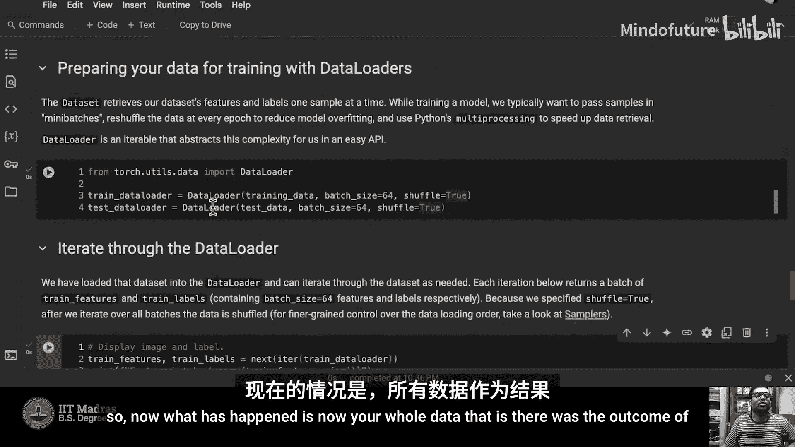

## 总结

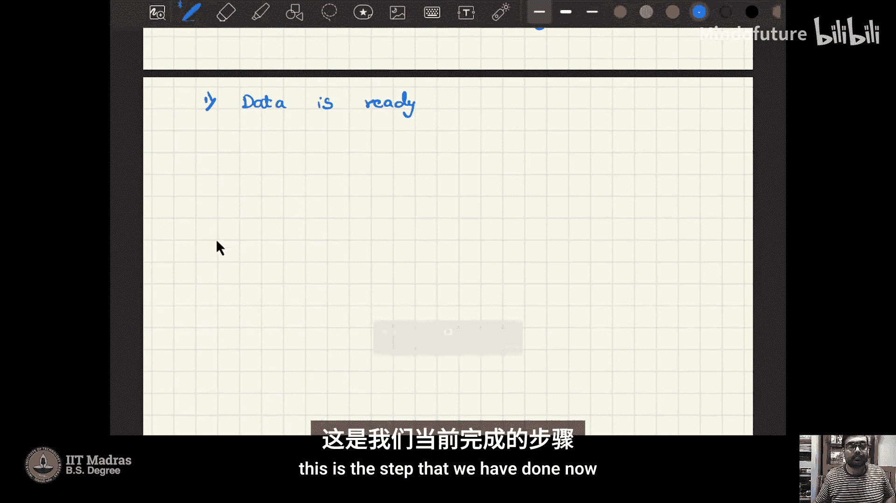

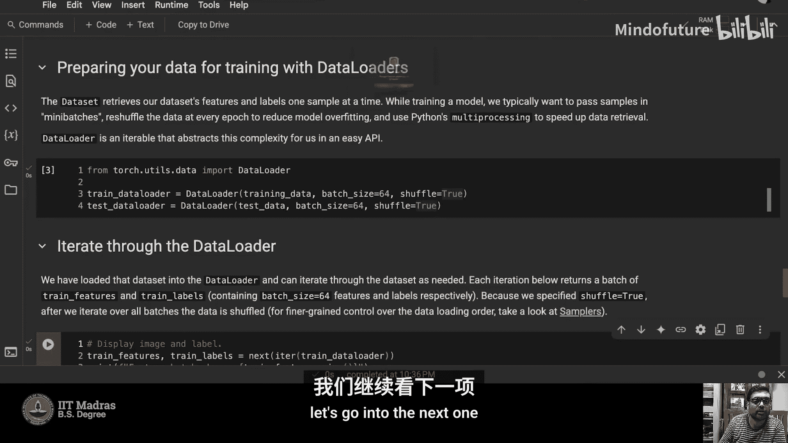

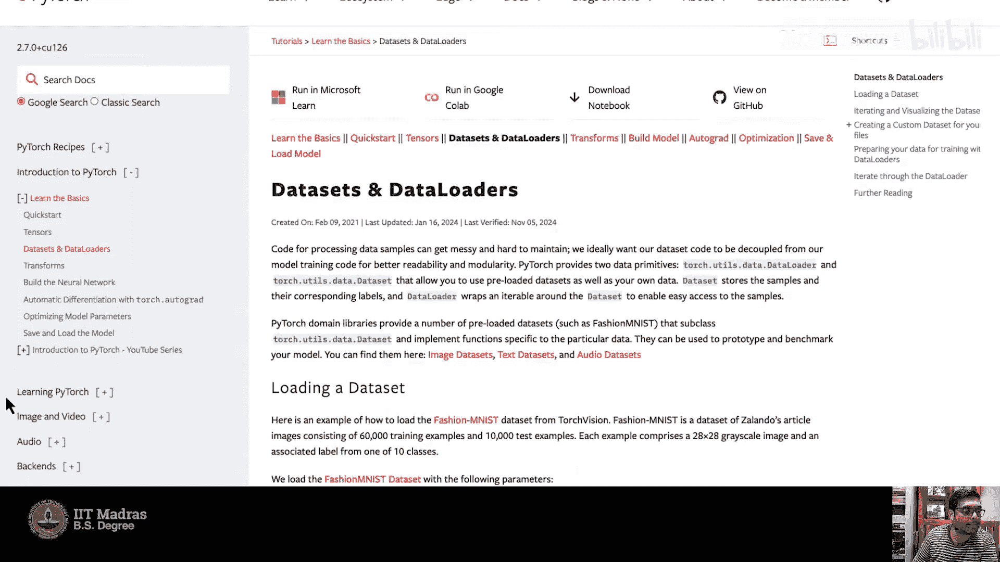


本节课中我们一起学习了PyTorch数据处理的核心组件。我们首先了解了如何使用内置数据集，然后掌握了如何为自定义数据创建数据集类，最后学习了如何使用数据加载器将数据高效地组织成批次供模型使用。数据准备是机器学习流程中的关键第一步，`Dataset`和`DataLoader`的配合使用，使得数据加载、预处理和批处理变得标准化且高效。