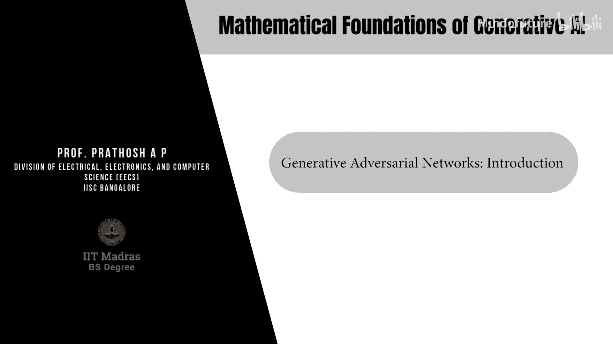
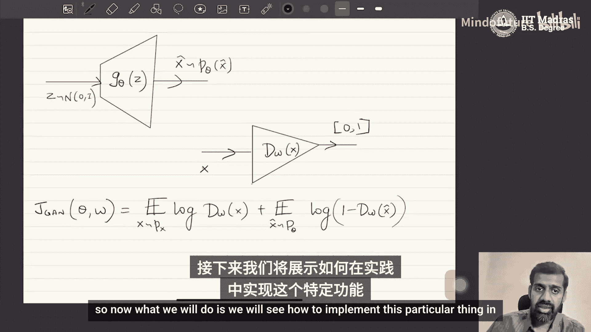

# 010：生成对抗网络介绍



## 概述
在本节课中，我们将学习生成对抗网络（GANs）的核心原理。我们将看到GANs如何作为更广泛的“变分散度最小化”算法框架的一个特例，并详细推导其目标函数和网络架构。

---

## 从变分散度最小化到GANs

上一节我们介绍了变分散度最小化的通用框架。本节中，我们来看看如何将其具体化，以得到著名的生成对抗网络。

首先，我们需要考虑如何表示目标函数中的 **T函数**。根据定义，T函数将数据空间映射到F*函数的定义域。这意味着，根据所选F散度的不同，我们需要调整T网络，使其输出范围与F*的定义域相匹配。

在实践中，这是通过以下方式实现的：我们将T网络（记作 **T_w(x)** ）表示为一个复合函数。它由两部分组成：一个与F散度无关的神经网络 **V_w(x)**，以及一个特定于所选F散度的激活函数 **σ_f**。

具体公式如下：
```
T_w(x) = σ_f( V_w(x) )
```
其中，**V_w(x)** 是一个神经网络，其最后一层是线性层，将输入x映射为一个实数。**σ_f** 是一个激活函数，它将实数映射到特定F散度对应的F*函数的定义域。

因此，整个T网络可以看作先通过V_w将x映射到实数空间R，再通过σ_f映射到F*的定义域。

将T_w(x)的表达式代入之前得到的下界损失函数，我们得到：
```
L(θ, w) = E_{x~P_data}[ T_w(x) ] - E_{x~P_θ}[ f*( T_w(x) ) ]
        = E_{x~P_data}[ σ_f( V_w(x) ) ] - E_{x~P_θ}[ f*( σ_f( V_w(x) ) ) ]
```
这个公式构成了我们优化生成器参数θ和判别器（即T函数）参数w的基础。

---

## GANs：一个具体实例

现在，我们来看变分散度最小化的一个著名特例——生成对抗网络（GANs）。

首先，我们需要选择GAN所使用的F散度。GAN对应的F函数如下：
```
f(u) = u * log(u) - (u + 1) * log(u + 1) + log(4)
```
注意，这个函数与Jensen-Shannon散度相似，但并不完全相同。

根据凸共轭的定义，我们可以求出其对应的F*函数（即f的凸共轭）：
```
f*(t) = -log(1 - e^t)
```
此F*函数的定义域是所有负实数，即 **domain(f*) = R⁻**。

因此，我们需要设计的激活函数σ_f，必须将V_w(x)输出的实数映射到负实数域R⁻。对于GAN，这个激活函数是：
```
σ_f(v) = -log(1 + exp(-v))
```
其中v是V_w(x)的输出标量。可以验证，这个函数的输出始终为负。

---

## 推导GAN的目标函数

接下来，我们将上述F函数、F*函数和激活函数σ_f代入通用的损失函数，并进行代数整理。

以下是关键的推导步骤（建议读者自行验证）：
1.  将 `T_w(x) = σ_f( V_w(x) ) = -log(1 + exp(-V_w(x)))` 代入损失函数。
2.  将 `f*(t) = -log(1 - e^t)` 中的t用 `σ_f( V_w(x) )` 替换。
3.  为了与原始GAN论文的记号一致，我们引入一个新变量 **D_w(x)**，定义为：
    ```
    D_w(x) = 1 / (1 + exp(-V_w(x)))
    ```
    熟悉神经网络的读者会认出，这就是 **Sigmoid函数**。`D_w(x)` 的值域在(0, 1)之间。

经过代入和化简（具体代数过程略），我们得到经典的GAN目标函数：
```
J_GAN(θ, w) = E_{x~P_data}[ log( D_w(x) ) ] + E_{z~P_z}[ log( 1 - D_w( G_θ(z) ) ) ]
```
其中：
*   `G_θ(z)` 是生成器，它将从先验分布（如标准正态分布）中采样的噪声z映射为生成样本 `x̃`。
*   `D_w(x)` 是判别器，它试图区分真实数据 `x`（来自 `P_data`）和生成数据 `x̃`（来自 `P_θ`）。

这个目标函数的意义是：判别器 `D` 试图最大化 `J_GAN`（即正确区分真假），而生成器 `G` 试图最小化 `J_GAN`（即欺骗判别器），两者形成对抗。

---

## GAN的网络架构

根据上述推导，我们可以描绘出GAN的标准架构。

以下是GAN核心组件的结构图：


**架构说明：**

1.  **生成器 (Generator)**：
    *   输入：从简单先验分布（如 `N(0, 1)`）中采样的噪声向量 `z`。
    *   输出：生成的数据样本 `x̃ = G_θ(z)`。生成器 `G_θ` 的目标是使 `x̃` 的分布 `P_θ` 尽可能接近真实数据分布 `P_data`。

2.  **判别器 (Discriminator)**：
    *   输入：一个数据样本，可以是真实数据 `x` 或生成数据 `x̃`。
    *   在原始推导中，判别器内部可视为两部分：
        *   **V_w网络**：一个将输入映射到实数 `v` 的神经网络。
        *   **Sigmoid激活层**：将实数 `v` 转换为 `(0, 1)` 之间的概率值，即 `D_w(x) = sigmoid(v)`。
    *   在实践中，这两部分通常被合并为一个端到端的神经网络 `D_w`。
    *   输出：一个标量概率值，表示输入样本为真实数据的（判别器认为的）概率。

**重要提示**：判别器的输出 `D_w(x)` 是一个介于0和1之间的概率值，它**并不直接等于**我们最初优化的 `T_w(x)` 函数。`T_w(x)` 的值域是负实数。然而，`D_w(x)` 通过Sigmoid函数与 `V_w(x)` 相关联，而 `T_w(x)` 又是 `V_w(x)` 的特定函数（`σ_f(v)`）。因此，优化 `D_w(x)` 等价于间接地优化我们所需的 `T_w(x)` 函数。

---

## 总结

本节课中，我们一起学习了生成对抗网络（GANs）的数学基础。

1.  我们首先回顾了**变分散度最小化**的通用框架，其核心是最大化关于T函数的下界。
2.  接着，我们通过选择特定的**F散度**（`f(u) = u log u - (u+1) log(u+1) + log4`），并将T函数构造为神经网络 `V_w(x)` 与特定激活函数 `σ_f` 的复合，将该框架具体化。
3.  通过代入和代数推导，我们得到了**GAN的标准目标函数**，它表现为生成器 `G` 和判别器 `D` 之间的极大极小博弈。
4.  最后，我们明确了GAN的**网络架构**，包括生成器（将噪声映射为数据）和判别器（区分真实与生成数据），并解释了其与理论推导中T函数的关系。




理解GAN作为变分散度最小化特例的这一视角，有助于我们更深刻地把握其本质，并为理解后续各种GAN变种（如WGAN、f-GAN等）奠定坚实的基础。