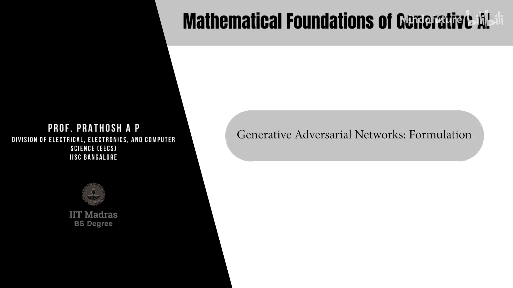
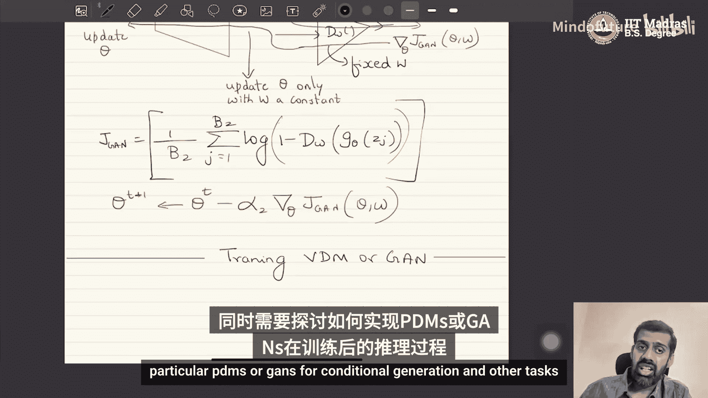

# 011：生成对抗网络（GAN）的实现



在本节课中，我们将学习生成对抗网络（GAN）的具体实现步骤。我们将详细拆解如何交替训练生成器和判别器，并解释每一步背后的数学原理和代码逻辑。

## 概述

生成对抗网络（GAN）的核心思想是通过一个生成器网络和一个判别器网络的对抗训练，来学习真实数据的分布。生成器试图生成足以“欺骗”判别器的假数据，而判别器则试图准确区分真实数据和生成数据。这种对抗过程最终使得生成器能够产生非常逼真的数据。

上一节我们介绍了GAN的理论基础，本节中我们来看看如何将理论转化为实际的训练算法。

## 训练算法详解

GAN的训练过程是交替优化两个神经网络：生成器（G）和判别器（D）。我们假设读者熟悉神经网络的基本训练方法，特别是基于梯度下降的反向传播算法。

### 1. 网络结构与目标函数

我们有两个神经网络：
*   **生成器网络**：`G_theta(z)`，参数为 `theta`。输入为从标准正态分布 `N(0, I)` 采样的噪声 `z`，输出为生成的数据 `x_cap`。
*   **判别器网络**：`D_w(x)`，参数为 `w`。输入为数据 `x`（可以是真实的或生成的），输出一个介于0和1之间的标量，表示 `x` 来自真实分布的概率。这本质上是一个二分类器。

我们的目标是最小化生成数据分布 `P_theta` 与真实数据分布 `P_x` 之间的 `f`-散度。通过推导，这等价于优化以下对抗性目标函数：

**公式：**
`min_theta max_w [ E_{x~P_x}[log D_w(x)] + E_{z~N(0,I)}[log(1 - D_w(G_theta(z)))] ]`

*   判别器 `D` 的目标是**最大化**这个函数（尽可能区分真假）。
*   生成器 `G` 的目标是**最小化**这个函数（使生成的数据尽可能骗过 `D`）。

在实际训练中，我们使用样本平均来近似期望值。假设我们有一个包含 `n` 个样本的真实数据集 `{x_1, ..., x_n}`。

### 2. 训练判别器（固定生成器）

当训练判别器时，我们保持生成器的参数 `theta` 不变。

以下是训练判别器的步骤：

1.  **采样真实数据批次**：从真实数据集中随机抽取一个批次（batch）的样本，记作 `{x_1, ..., x_B1}`。
2.  **采样生成数据批次**：
    *   从标准正态分布 `N(0, I)` 中采样一个批次的噪声向量 `{z_1, ..., z_B2}`。
    *   将这些噪声向量输入**固定的**生成器 `G_theta`，得到生成数据 `{G_theta(z_1), ..., G_theta(z_B2)}`。
3.  **前向传播计算损失**：
    *   将真实数据批次输入判别器 `D_w`，计算 `log D_w(x_i)` 的和。
    *   将生成数据批次输入判别器 `D_w`，计算 `log(1 - D_w(G_theta(z_j)))` 的和。
    *   判别器的损失函数 `J_D` 为这两项之和的负平均（因为我们要最大化原函数，等价于最小化其负数）：
        **公式：** `J_D = -1/B1 * sum_i log D_w(x_i) - 1/B2 * sum_j log(1 - D_w(G_theta(z_j)))`
4.  **反向传播与参数更新**：
    *   计算损失 `J_D` 关于判别器参数 `w` 的梯度。
    *   使用**梯度上升**（因为目标是最大化）更新 `w`：
        **公式：** `w_new = w_old + alpha_D * gradient_w(J_D)`
        其中 `alpha_D` 是判别器的学习率。

**代码逻辑描述（伪代码）：**
```python
# 固定生成器，不计算其梯度
with torch.no_grad():
    z = sample_noise(B2)
    fake_data = generator(z)

# 判别器前向传播
real_score = discriminator(real_data)
fake_score = discriminator(fake_data)

# 计算判别器损失
loss_D = - (torch.log(real_score).mean() + torch.log(1 - fake_score).mean())

# 判别器反向传播与更新
loss_D.backward()
optimizer_D.step() # 执行梯度上升
optimizer_D.zero_grad()
```

### 3. 训练生成器（固定判别器）

当训练生成器时，我们保持判别器的参数 `w` 不变。

以下是训练生成器的步骤：

1.  **采样噪声批次**：从标准正态分布 `N(0, I)` 中采样一个批次的噪声向量 `{z_1, ..., z_B2}`。
2.  **前向传播计算损失**：
    *   将噪声批次输入生成器 `G_theta`，得到生成数据 `{G_theta(z_1), ..., G_theta(z_B2)}`。
    *   将生成数据输入**固定的**判别器 `D_w`，得到判别分数 `D_w(G_theta(z_j))`。
    *   生成器的损失函数 `J_G` 来自目标函数的第二项（第一项与 `theta` 无关）：
        **公式：** `J_G = 1/B2 * sum_j log(1 - D_w(G_theta(z_j)))`
        生成器希望这个值越小越好，意味着 `D_w(G_theta(z))` 越大，即判别器认为生成数据是真实的。
3.  **反向传播与参数更新**：
    *   计算损失 `J_G` 关于生成器参数 `theta` 的梯度。**注意**：梯度需要从判别器的输出反向传播通过整个判别器网络，再传到生成器网络，但在此过程中，判别器的参数 `w` 被锁定，不更新。
    *   使用**梯度下降**更新 `theta`：
        **公式：** `theta_new = theta_old - alpha_G * gradient_theta(J_G)`
        其中 `alpha_G` 是生成器的学习率。

**代码逻辑描述（伪代码）：**
```python
# 采样噪声
z = sample_noise(B2)

# 生成数据
fake_data = generator(z)

# 将生成数据输入固定判别器
fake_score = discriminator(fake_data)

# 计算生成器损失
loss_G = torch.log(1 - fake_score).mean() # 或使用 -torch.log(fake_score).mean() 等改进版本

# 生成器反向传播与更新
loss_G.backward()
optimizer_G.step() # 执行梯度下降
optimizer_G.zero_grad()
```

### 4. 交替训练与停止准则

在实际操作中，我们交替进行步骤2和步骤3：
1.  执行 `k_D` 步判别器训练（每次使用新的数据批次）。
2.  执行 `k_G` 步生成器训练（每次使用新的噪声批次）。
3.  重复以上过程。

`k_D` 和 `k_G` 通常是1，但有时为了训练稳定，可能会让判别器或生成器多训练几步（例如 `k_D=5, k_G=1`）。

GAN没有像传统监督学习那样明确的损失函数收敛点作为停止准则。通常的停止方法是：
*   **视觉检查**：定期查看生成器输出的样本质量。
*   **定量指标**：使用如Inception Score (IS) 或 Fréchet Inception Distance (FID) 等指标来评估生成数据的多样性和真实性，当指标达到满意水平时停止训练。

## 总结

本节课中我们一起学习了生成对抗网络（GAN）的具体实现方法。我们首先回顾了GAN的对抗性目标函数，然后详细拆解了交替训练生成器和判别器的每一步：

1.  **训练判别器**：需要同时使用真实数据和生成器产生的数据，目标是最大化其区分真假的能力。
2.  **训练生成器**：只需要使用噪声数据，通过固定判别器并反向传播梯度，目标是让生成的数据骗过判别器。




这个过程本质上是求解一个极小极大优化问题。通过这种对抗性训练，生成器最终能学习到真实数据的高质量表示。在接下来的课程中，我们将探讨GAN的另一种解释（分类器视角），以及如何对训练好的GAN进行推理，并将其应用于图像合成等条件生成任务。我们也会看到，通过选择不同的 `f`-散度，可以衍生出具有不同特性的GAN变体。