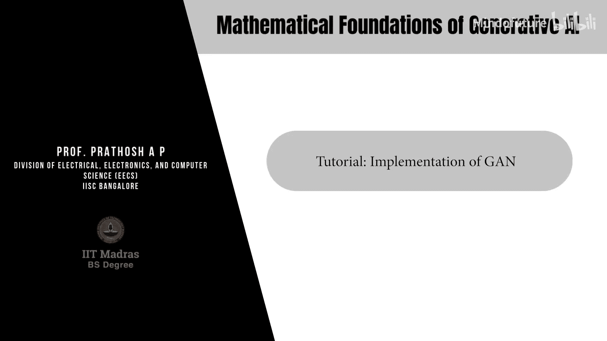
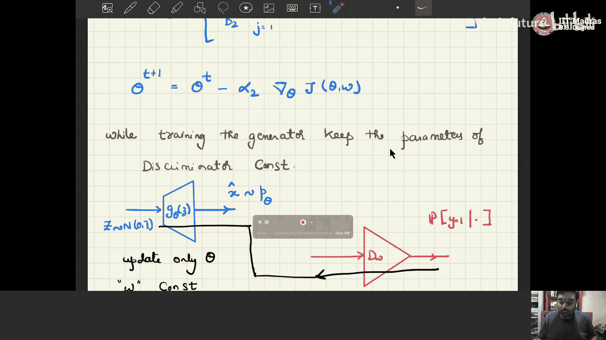
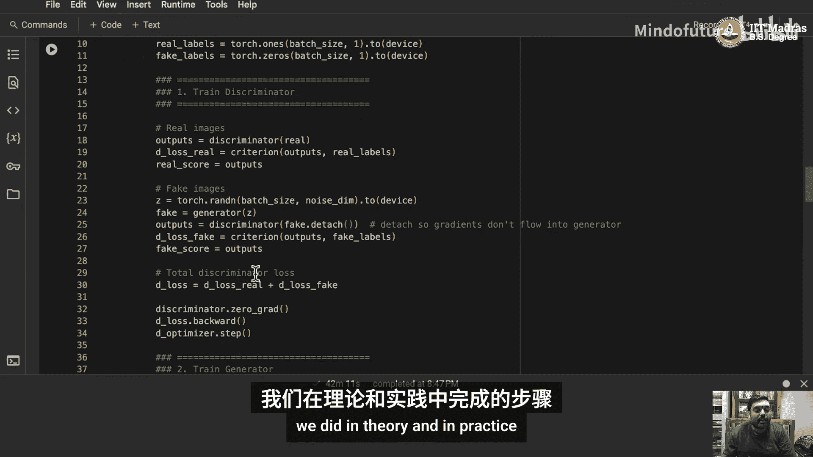
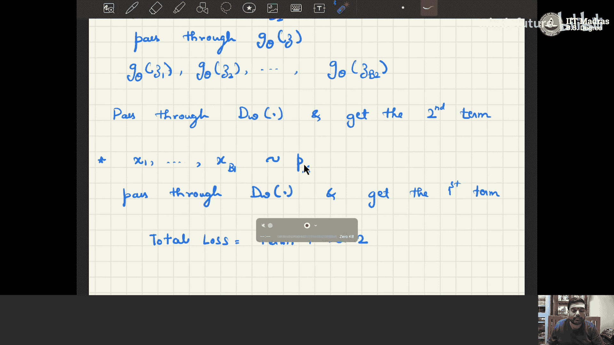
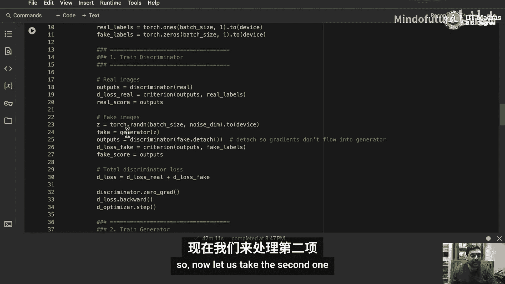
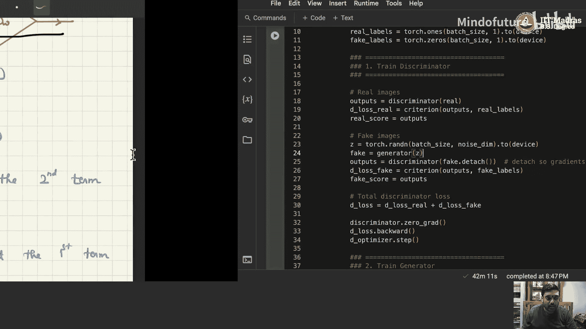
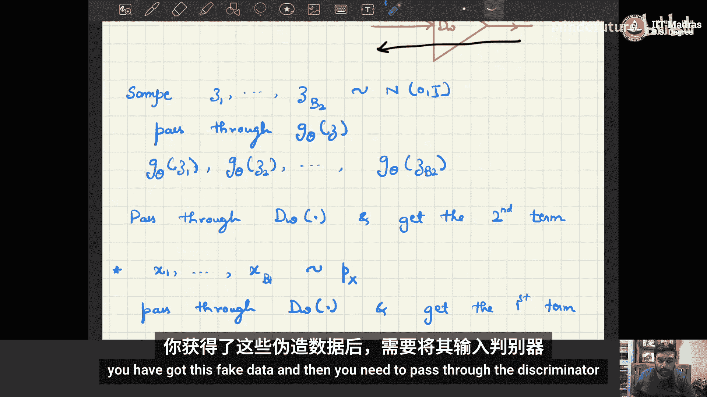
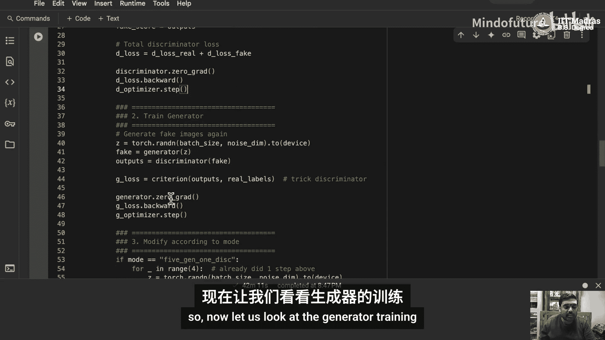
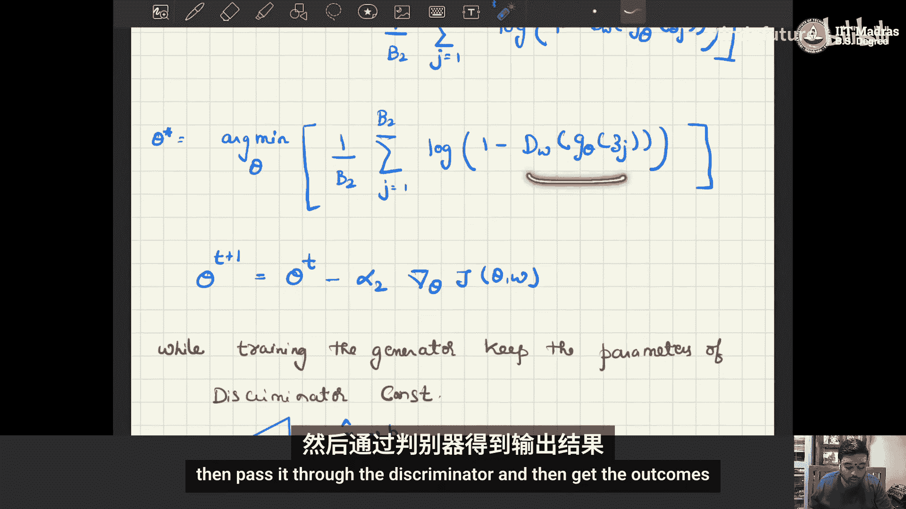
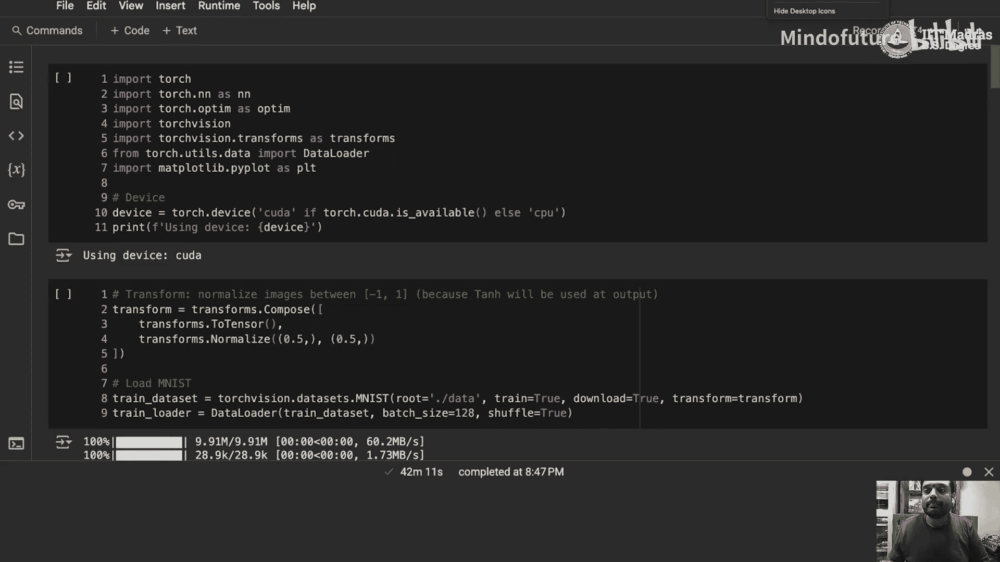

# 012：GAN的实现 🎼



在本教程中，我们将学习如何实现一个基础的生成对抗网络。我们将从理论公式出发，逐步讲解如何用代码构建和训练一个Vanilla GAN，并使用MNIST数据集来生成手写数字图像。

---

## 概述

上一节我们介绍了GAN的数学原理。本节中，我们将把这些理论转化为实际的代码。我们将构建一个包含生成器和判别器的简单多层感知机网络，并使用PyTorch框架来实现训练过程。

---

## 网络结构

以下是GAN中两个核心网络的结构定义。

### 生成器网络

生成器网络的目标是将一个随机噪声向量 `z` 映射成一张逼真的图像。在我们的实现中，`z` 的维度是100，输出图像的维度是28x28（即784）。

**代码描述：**
```python
class Generator(nn.Module):
    def __init__(self, noise_dim=100, image_dim=784):
        super(Generator, self).__init__()
        self.model = nn.Sequential(
            nn.Linear(noise_dim, 256),
            nn.ReLU(),
            nn.Linear(256, 512),
            nn.ReLU(),
            nn.Linear(512, 1024),
            nn.ReLU(),
            nn.Linear(1024, image_dim),
            nn.Tanh()  # 将输出归一化到[-1, 1]
        )
```

### 判别器网络

判别器网络是一个二分类器，用于判断输入图像是真实的（来自数据集）还是虚假的（来自生成器）。输入是展平后的图像（784维），输出是一个概率值。

**代码描述：**
```python
class Discriminator(nn.Module):
    def __init__(self, image_dim=784):
        super(Discriminator, self).__init__()
        self.model = nn.Sequential(
            nn.Linear(image_dim, 512),
            nn.LeakyReLU(0.2),
            nn.Linear(512, 256),
            nn.LeakyReLU(0.2),
            nn.Linear(256, 1),
            nn.Sigmoid()  # 输出概率
        )
```

---

## 损失函数与优化目标

GAN的训练是一个极小极大博弈。我们需要分别优化生成器和判别器。

### 目标函数

从理论推导中，我们得到整体的目标函数为：
**公式：**
`min_G max_D V(D, G) = E_{x~p_data(x)}[log D(x)] + E_{z~p_z(z)}[log(1 - D(G(z)))]`

在实践中，我们使用小批量数据来近似期望值。

### 判别器更新

对于判别器，我们希望最大化 `V(D, G)`。这等价于一个二分类问题：将真实图像分类为1，生成图像分类为0。因此，我们使用二元交叉熵损失。



以下是判别器训练的步骤：
1.  从真实数据分布 `p_data` 中采样一个批次 `{x_1, x_2, ..., x_B1}`。
2.  从先验噪声分布 `p_z`（如标准正态分布）中采样一个批次 `{z_1, z_2, ..., z_B2}`，并通过生成器得到假图像 `{G(z_1), G(z_2), ..., G(z_B2)}`。
3.  计算判别器对真实图像的输出 `D(x)` 和假图像的输出 `D(G(z))`。
4.  判别器的总损失为：`Loss_D = -[log(D(x)) + log(1 - D(G(z)))]`。
5.  在更新判别器参数 `W` 时，保持生成器参数 `θ` 不变，并使用梯度**上升**。

### 生成器更新

对于生成器，我们希望最小化 `V(D, G)`。由于第一项与生成器无关，我们只需最小化第二项：`E_{z~p_z(z)}[log(1 - D(G(z)))]`。

以下是生成器训练的步骤：
1.  从先验噪声分布 `p_z` 中采样一个批次 `{z_1, z_2, ..., z_B2}`。
2.  通过生成器得到假图像 `G(z)`，再通过判别器得到输出 `D(G(z))`。
3.  生成器的损失为：`Loss_G = -log(D(G(z)))`。这里我们选择最大化 `log(D(G(z)))` 来“欺骗”判别器，其效果与最小化原式等价。
4.  在更新生成器参数 `θ` 时，保持判别器参数 `W` 不变，并使用梯度**下降**。

---

## 训练流程

现在，我们来看如何在代码中组织上述训练步骤。核心是交替训练判别器和生成器。

### 训练循环设置

我们设置了三种训练模式：
*   **1:1模式**：每轮迭代更新一次判别器，更新一次生成器。
*   **5 Gen : 1 Disc模式**：每轮迭代更新五次生成器，更新一次判别器。
*   **5 Disc : 1 Gen模式**：每轮迭代更新五次判别器，更新一次生成器。

### 判别器训练步骤

以下是判别器单次训练的关键代码逻辑：

```python
# 1. 训练判别器
# 清零判别器梯度
d_optimizer.zero_grad()

# 计算真实图像的损失
real_output = discriminator(real_images)
real_loss = criterion(real_output, real_labels)  # 希望输出为1

# 生成假图像并计算损失
z = torch.randn(batch_size, noise_dim).to(device)
fake_images = generator(z)
# 使用.detach()阻止梯度传播到生成器
fake_output = discriminator(fake_images.detach())
fake_loss = criterion(fake_output, fake_labels)  # 希望输出为0

# 总损失并反向传播
d_loss = real_loss + fake_loss
d_loss.backward()
d_optimizer.step()  # 只更新判别器参数
```

### 生成器训练步骤

以下是生成器单次训练的关键代码逻辑：

```python
# 2. 训练生成器
# 清零生成器梯度
g_optimizer.zero_grad()





# 再次用噪声生成图像（这次需要梯度）
z = torch.randn(batch_size, noise_dim).to(device)
fake_images = generator(z)
fake_output = discriminator(fake_images)




# 生成器希望假图像被判别为“真”
g_loss = criterion(fake_output, real_labels)  # 使用真实标签“1”作为目标





# 反向传播并更新
g_loss.backward()
g_optimizer.step()  # 只更新生成器参数
```

---

## 代码实现与结果



我们使用MNIST数据集进行训练。在训练过程中，每隔一定轮次，我们使用固定的噪声向量来生成图像，以便直观观察生成质量的演变。



经过50轮训练后，即使在简单的MLP结构下，生成器也开始输出具有一定结构的、类似手写数字的图像。例如，在“1:1”训练模式下，从第10轮到第50轮，生成的图像从模糊的斑点逐渐变得可辨识。

---

## 总结

本节课中我们一起学习了Vanilla GAN的实现方法。我们从理论公式出发，定义了生成器和判别器的网络结构，详细解释了对抗训练的目标函数和交替更新策略，并逐步解析了训练循环中的代码逻辑。通过本教程，你掌握了用PyTorch构建和训练一个基础GAN的核心技能。

为了进一步探索，你可以尝试以下练习：
1.  将网络结构从MLP改为卷积神经网络，观察生成图像质量的提升。
2.  更换更复杂的数据集，观察GAN在不同数据上的表现。




希望本教程对你有所帮助，我们下个教程再见！