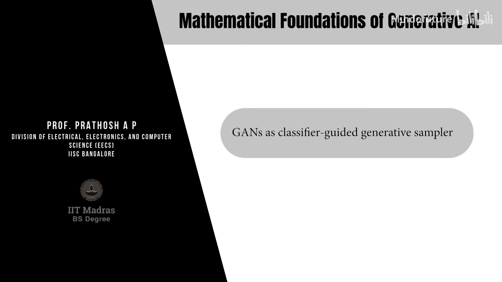
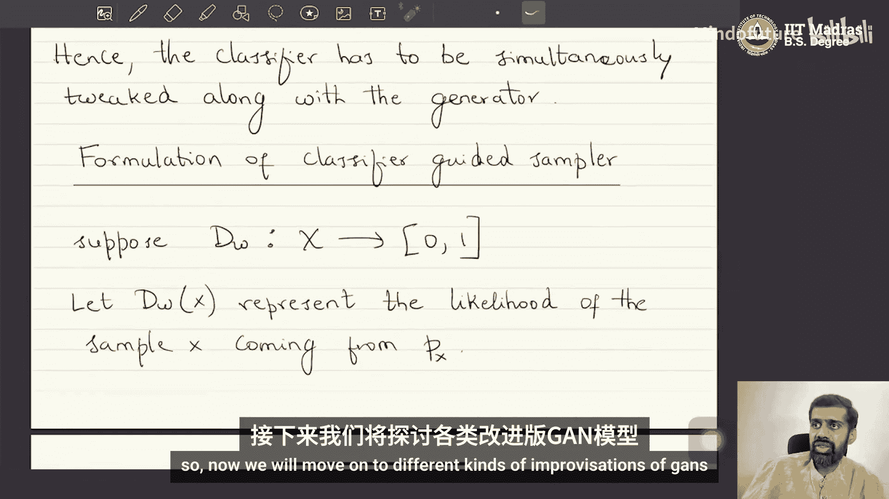

# 013：GAN作为分类器引导的生成采样器



在本节课中，我们将学习生成对抗网络的另一种解读视角：将其视为一个由分类器引导的生成模型。我们将探讨这种视角下的工作原理、潜在问题，以及它与之前学习的变分散度最小化框架的联系。

---

## 概述

在上一节中，我们学习了如何使用变分散度最小化算法来训练生成采样器，并介绍了其特例——生成对抗网络。本节我们将继续深入，目标是了解对朴素GAN的一些改进，并讨论GAN在领域自适应和分布转换等任务中的著名应用。

## 分类器引导视角下的GAN

首先，让我们快速回顾一下GAN。在作为变分散度算法特例的GAN中，我们有两个神经网络：生成器网络和判别器网络。其核心思想是，从一个任意的随机变量（如高斯分布）出发，通过最小化一个分布散度度量，使用神经网络将其变换为我们感兴趣的随机变量。我们使用f-散度作为度量，但直接最小化f-散度不可行，因此我们构造了f-散度的一个下界。构造这个下界本身涉及一个优化问题，由判别器网络解决。因此，我们交替执行两个优化：首先通过最大化问题找到f-散度的下界（训练判别器），然后最小化这个下界（训练生成器）。

现在，我们开始从另一个角度来解读GAN。

### 作为分类器引导的生成采样器

我们可以将GAN解释为一个由分类器引导的生成模型。让我们看看这是如何工作的。

我们有一个数据集，其中的样本 `x` 从真实数据分布 `P_x` 中抽取。同时，我们有一个生成器 `G_θ`，它从一个简单分布（如标准正态分布）中采样 `z`，并输出样本 `x̂ = G_θ(z)`，这些样本服从分布 `P_θ`。

我们的目标始终是让 `P_θ` 尽可能接近 `P_x`。

现在，假设存在一个二元分类器 `D_w`。我们这样定义它：
*   当输入样本 `x` 来自真实分布 `P_x` 时，`D_w(x)` 输出 1。
*   当输入样本 `x̂` 来自生成分布 `P_θ` 时，`D_w(x̂)` 输出 0。

**核心问题**：我们能否利用这个分类器来使 `P_θ` 和 `P_x` 彼此接近？

一个直观的策略是：**不断调整生成器参数 `θ`，直到分类器 `D_w` 无法区分来自 `P_x` 和 `P_θ` 的样本**。当 `P_θ` 与 `P_x` 完全相同时，样本变得不可区分，分类器自然会失败。

然而，这里存在一个关键问题：**分类器的失败，并不必然意味着 `P_θ` 匹配了 `P_x`**。

让我们通过一个反例来说明。

### 一个反例：固定分类器的问题

假设我们的数据是二维的。真实数据 `P_x` 分布在一个簇中（用十字表示），初始的生成数据 `P_θ1` 分布在另一个簇中（用圆点表示）。我们有一个分类器 `D_w1`，其决策边界（一条直线）成功地将两个簇分开。

现在，我们固定分类器 `D_w1`，并调整 `θ` 以使分类器失败。优化器可以很容易地将 `P_θ1` 的整个簇简单地移动到决策边界的另一侧（变成 `P_θ2`）。此时，对于固定的分类器 `D_w1` 来说，`P_θ2` 和 `P_x` 的样本都落在了分类器的同一侧，因此分类器失败了。

但是，`P_θ2` 的分布并没有与 `P_x` 重叠，它们仍然是完全分离的两个簇。我们只是“欺骗”了当前这个固定的分类器，并没有实现分布匹配的目标。

### 解决方案：交替优化分类器与生成器

为了解决上述问题，我们不能固定分类器。**思路是：在调整生成器的同时，也同步地调整（重新训练）分类器**。

回到之前的示意图：
1.  初始状态：`P_θ1` 和 `P_x` 被分类器 `D_w1` 分开。
2.  **生成器步骤**：调整 `θ`，将生成数据移动到 `P_θ2`，使得 `D_w1` 分类失败。
3.  **判别器步骤**：固定生成器，训练一个新的分类器 `D_w2`。`D_w2` 会学习新的决策边界，再次将 `P_θ2` 和 `P_x` 分开。
4.  **生成器步骤**：再次调整 `θ`，将生成数据移动到 `P_θ3`，使得 `D_w2` 分类失败。
5.  如此循环往复...

这个交替过程的目标是，最终找到一个生成分布 `P_θ*`，使得**不存在任何一个分类器**能够可靠地区分 `P_θ*` 和 `P_x`。这通常意味着两个分布已经非常接近或相同。

**注意**：这个过程可能陷入一种“模式崩溃”的困境。例如，生成器可能只在 `P_θ1` 和 `P_θ2` 两个模式之间来回振荡，而分类器也随之在这两个决策边界之间切换，永远无法让 `P_θ` 逼近真正的 `P_x`。这是GAN训练不稳定的一个已知原因。

## 目标函数的形式化

现在，让我们从数学上形式化这个分类器引导的视角。

假设 `D_w(x)` 表示样本 `x` 来自真实分布 `P_x` 的似然（概率）。那么 `1 - D_w(x)` 就表示 `x` 不是来自 `P_x` 的似然。

对于分类器 `D_w`，我们希望它满足两个目标：
1.  对于来自 `P_x` 的真实样本 `x`，最大化其对数似然 `log(D_w(x))`。
2.  对于来自 `P_θ` 的生成样本 `x̂`，最大化其“非真实”的对数似然 `log(1 - D_w(x̂))`。

因此，分类器的综合训练目标是最大化以下期望值：

**公式：分类器目标**
```
max_w [ E_{x~P_x}[log(D_w(x))] + E_{x̂~P_θ}[log(1 - D_w(x̂))] ]
```

对于生成器 `G_θ`，我们的目标是让分类器失败，即**最小化**上述分类器的目标。因此，生成器的目标是：

**公式：生成器目标**
```
min_θ [ E_{x~P_x}[log(D_w(x))] + E_{x̂~P_θ}[log(1 - D_w(x̂))] ]
```

将两者结合起来，我们就得到了GAN的**极小极大博弈**目标：

**公式：GAN的极小极大目标**
```
min_θ max_w [ E_{x~P_x}[log(D_w(x))] + E_{x̂~P_θ}[log(1 - D_w(x̂))] ]
```

在这个框架下：
*   **判别器 `D_w`** 扮演分类器的角色，试图最大化目标，以更好地区分真假样本。
*   **生成器 `G_θ`** 试图最小化同一目标，以“欺骗”判别器，使其无法区分。

这种一方试图最大化而另一方试图最小化同一个目标的对抗性博弈，正是“对抗网络”名称的由来。

## 与变分散度最小化的联系

值得注意的是，从数学角度看，这个分类器引导的视角与之前介绍的变分散度最小化框架是等价的。上面推导出的目标函数 `J(θ, w)` 正是特定f-散度（詹森-香农散度）的一个下界。

*   **构造下界（最大化）** 对应于 **训练判别器/分类器**。
*   **最小化散度（最小化）** 对应于 **训练生成器**。

分类器视角提供了一种更直观的理解：我们通过一个不断进化的“检验员”（分类器）来引导“生产者”（生成器）改进其输出，直到产品（生成样本）足以乱真。

## 总结

本节课中，我们一起学习了生成对抗网络的另一种重要解读——作为分类器引导的生成采样器。我们探讨了以下核心内容：

1.  **基本思想**：通过一个二元分类器区分真实数据与生成数据，并通过对抗性训练使生成数据分布逼近真实数据分布。
2.  **关键问题**：固定分类器会导致生成器通过“欺骗”特定分类器而非真正匹配分布来轻易达到目标。
3.  **解决方案**：采用交替优化策略，同时训练生成器和判别器（分类器），形成一种极小极大博弈。
4.  **目标函数**：我们推导出了GAN的标准对抗性损失函数，并解释了判别器和生成器各自的目标。
5.  **内在联系**：这一视角与变分散度最小化框架在数学上相通，分类器的训练对应于寻找散度下界，生成器的训练对应于最小化该散度。




这种对抗性训练的范式虽然强大，但也因其训练过程的不稳定性（如模式崩溃）而闻名。在接下来的课程中，我们将探讨针对这些问题的各种GAN改进模型。