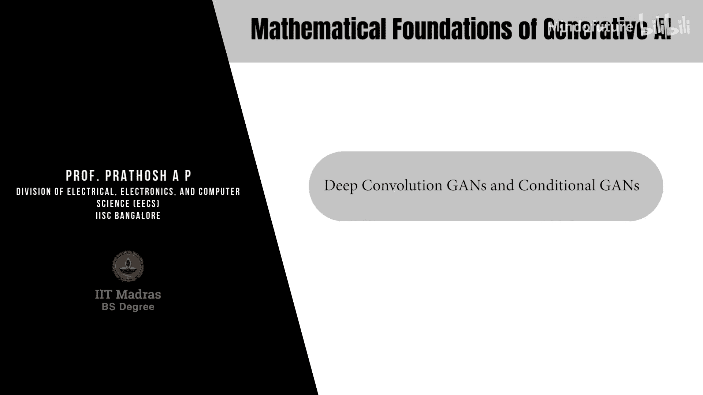
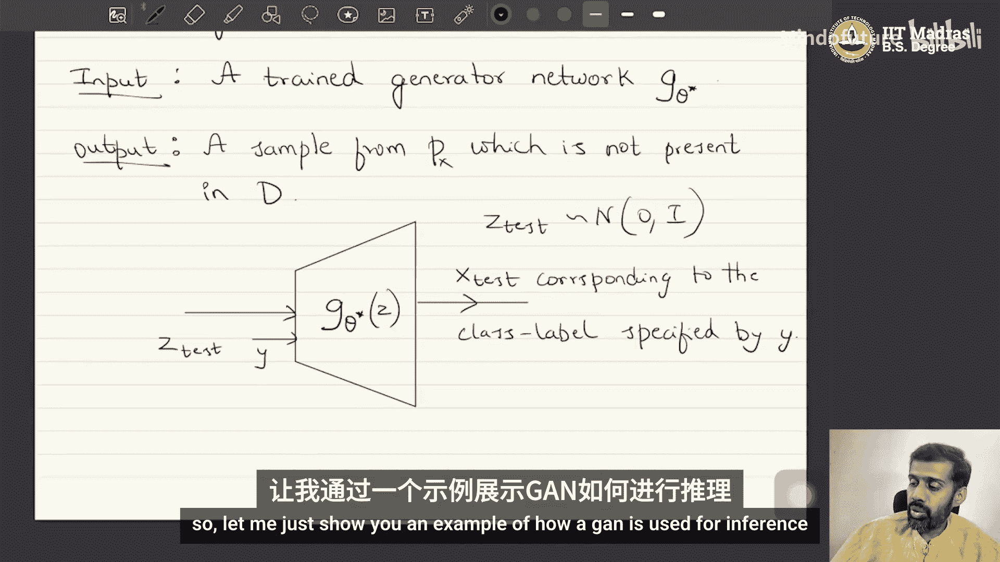
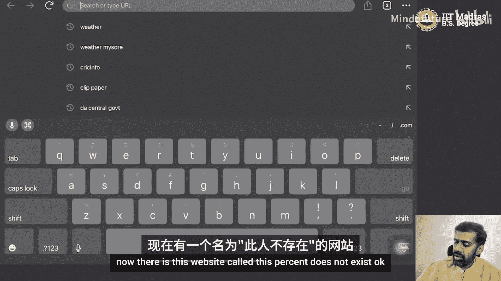
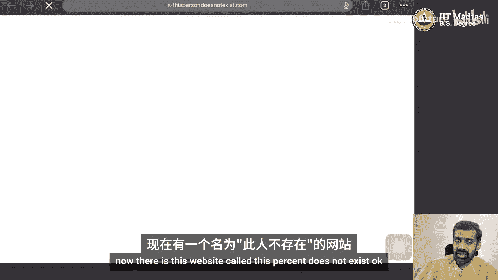
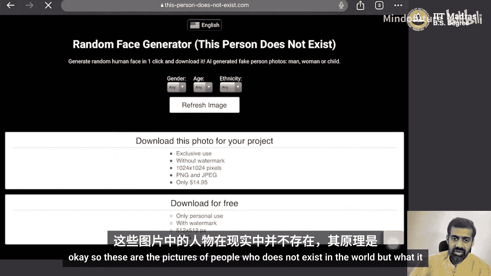
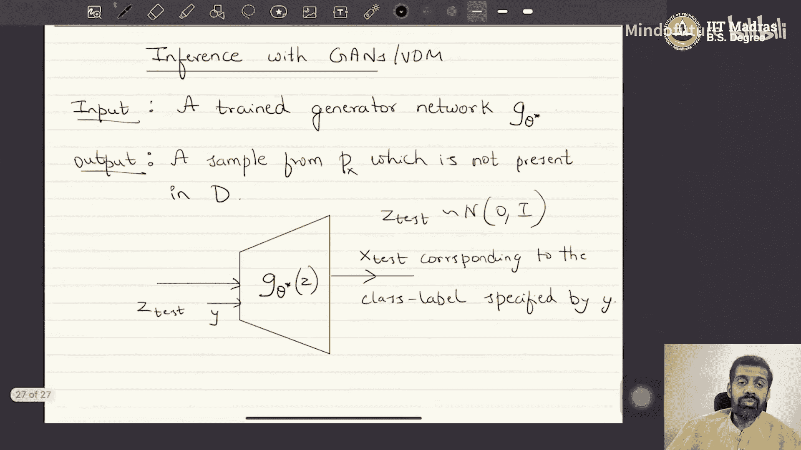

生成式AI的数学基础：P14：深度卷积GAN与条件GAN



在本节课中，我们将学习生成对抗网络（GAN）的两种重要变体：深度卷积GAN（DCGAN）和条件GAN（CGAN）。我们将了解它们如何改进基础GAN架构，以及如何实现条件生成。

---

### 概述

到目前为止，我们讨论的生成模型理论是数据模态无关的，可以应用于图像、语音等任何类型的数据。本节将介绍两种专门针对图像数据或需要条件控制生成的GAN架构改进。

---

### 深度卷积GAN（DCGAN） 🖼️

上一节我们介绍了基础GAN的通用架构。本节中我们来看看专门为图像生成设计的深度卷积GAN。

在典型的GAN中，生成器网络通常是一个多层感知机（MLP）。它接收一个低维噪声向量`z`（例如16维），并通过全连接层逐步增加维度，最终输出`D`维数据（例如展平的图像），之后可能需要重塑为图像格式。

在深度卷积GAN中，生成器网络使用**转置卷积层**（也称为上卷积层）来替代全连接层。这种方法允许网络直接从低维噪声`z`开始，通过转置卷积操作逐步增加空间维度和通道数，最终直接生成具有正确高度、宽度和通道数（例如 `行 × 列 × 3`）的图像，而无需额外的重塑步骤。

以下是DCGAN生成器架构的核心思想：
```python
# 概念性架构示意
输入: z (例如，形状为 [batch_size, 100] 的噪声向量)
层1: 全连接层 -> 重塑为初始特征图
层2: 转置卷积层 (上采样，增加空间尺寸)
层3: 转置卷积层 (继续上采样)
...
输出层: 转置卷积层 -> 图像 (形状为 [batch_size, 高度, 宽度, 3])
```
DCGAN主要应用于图像数据，它使生成器能够更自然地学习图像的空间结构。

---

### 条件GAN（CGAN） 🎯

之前我们学习的是无条件生成，生成器无法控制输出样本的类别。但在实际应用中，我们通常希望根据特定条件（如类别标签或文本描述）生成样本。这就是条件GAN要解决的问题。

条件GAN的目标是学习**条件分布** `P(x|y)`，而不是边际分布 `P(x)`。这里，`y` 是条件变量，例如图像的类别标签或文本嵌入向量。

为了实现条件生成，我们需要对GAN的架构进行一个关键修改：

以下是构建条件GAN所需的步骤：
1.  **数据准备**：需要成对的数据 `(x, y)`，其中 `x` 是数据样本（如图像），`y` 是对应的条件（如类别标签）。
2.  **修改生成器**：生成器 `G_θ` 的输入除了噪声向量 `z`，还需要加入条件变量 `y`。即 `x̂ = G_θ(z, y)`。
3.  **修改判别器**：判别器 `D_w` 的输入除了数据样本 `x`（或生成样本 `x̂`），也需要加入条件变量 `y`。即判别器需要判断 `(x, y)` 这个配对是否来自真实数据分布。

相应地，目标函数也修改为条件形式：
`J(θ, w) = E_{(x,y)~P_{data}}[log D_w(x|y)] + E_{z~p(z), y}[log(1 - D_w(G_θ(z, y)|y))]`

对于离散的类别标签 `y`，通常使用**独热编码**将其转换为向量后，输入给生成器和判别器。

---

### GAN的推理过程 🔍

在训练好GAN之后，我们如何使用它进行生成（即推理）呢？

推理的目标是利用训练好的生成器 `G_θ*` 产生新的、不在原始训练集中的数据样本。

以下是进行推理的步骤：
1.  **无条件GAN推理**：从先验分布（如标准正态分布）中采样一个噪声向量 `z_test`，然后将其输入训练好的生成器：`x_test = G_θ*(z_test)`。`x_test` 即是从学习到的分布 `P_θ` 中生成的新样本。
2.  **条件GAN推理**：除了噪声向量 `z_test`，还需要指定一个条件 `y`（例如，想要生成的图像类别）。然后将两者一起输入生成器：`x_test = G_θ*(z_test, y)`。这样就能生成符合指定条件 `y` 的新样本。



一个著名的例子是网站“This Person Does Not Exist”。每次刷新页面，都会从一个训练好的StyleGAN生成器中生成一张不存在的人脸图片。这展示了无条件GAN的推理能力。若使用条件GAN，则可以控制生成人脸的特定属性，如性别、年龄等。






---

### 总结

本节课我们一起学习了两种重要的GAN变体：
1.  **深度卷积GAN（DCGAN）**：通过使用转置卷积层，使生成器能够更有效地生成图像，无需后处理的重塑操作。
2.  **条件GAN（CGAN）**：通过向生成器和判别器同时输入条件信息（如类别标签），实现了对生成样本内容的控制，使其能根据特定条件进行生成。






我们还了解了如何使用训练好的GAN模型进行推理，以生成新的数据样本。这些架构改进极大地增强了GAN的实用性和可控性。