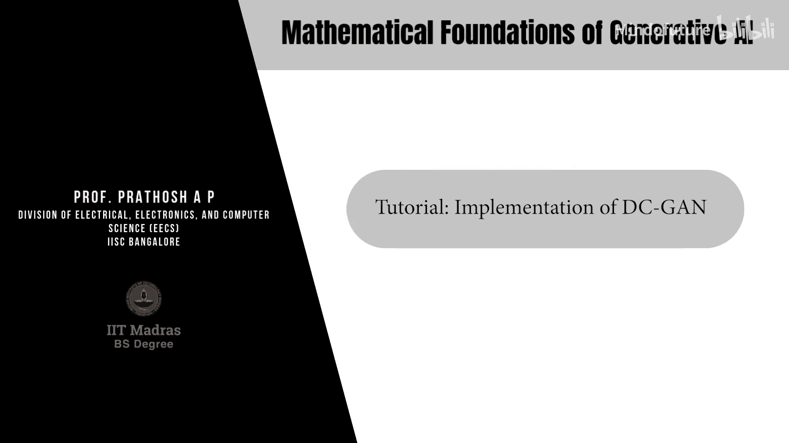
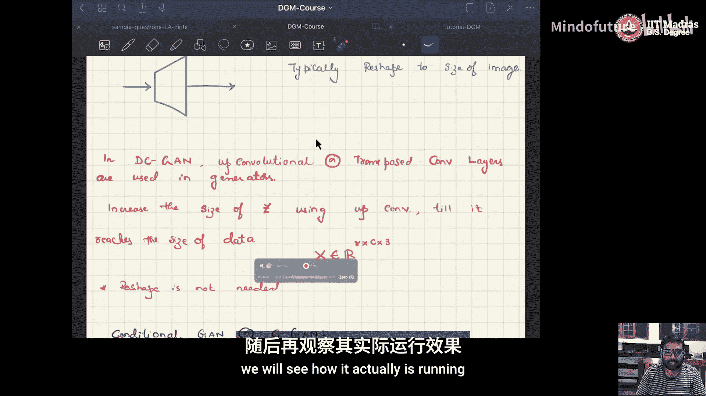
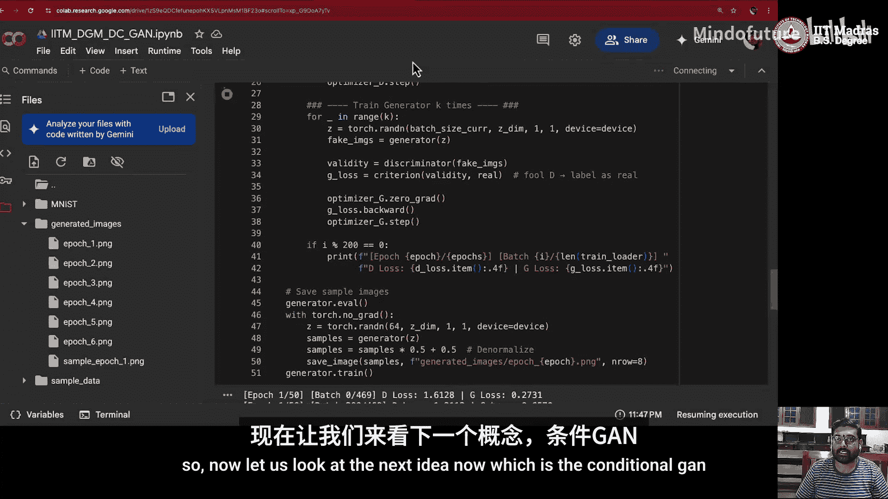
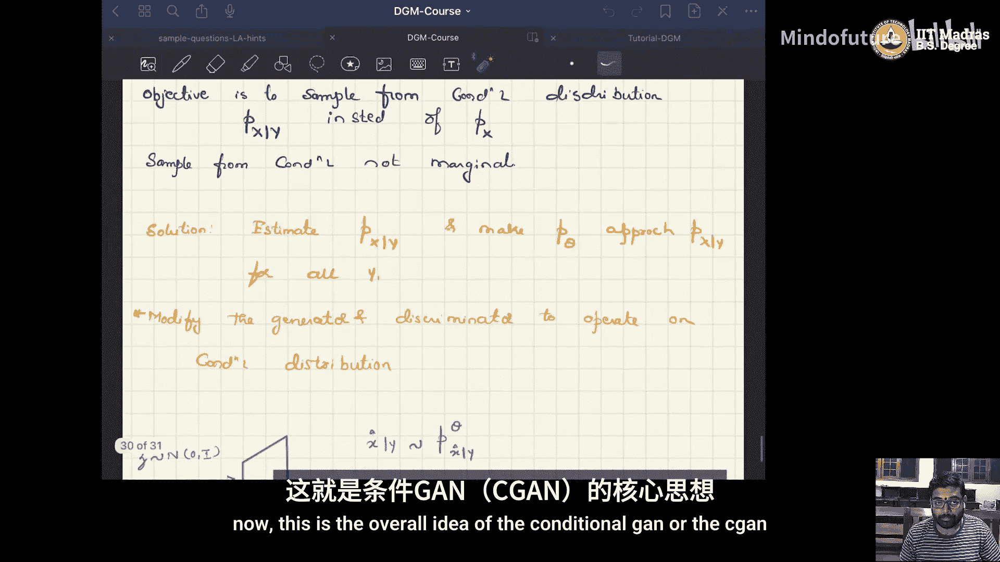
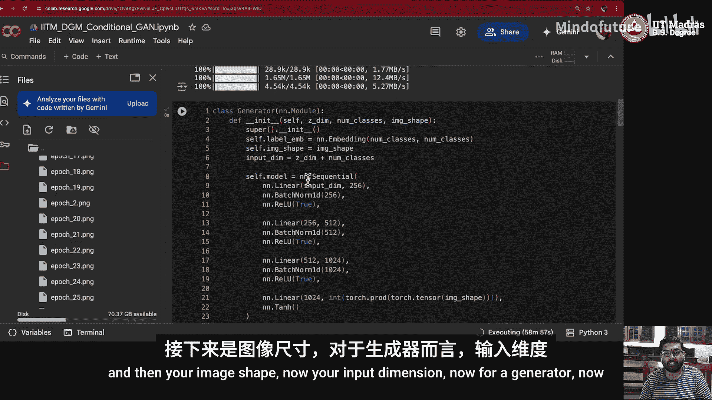
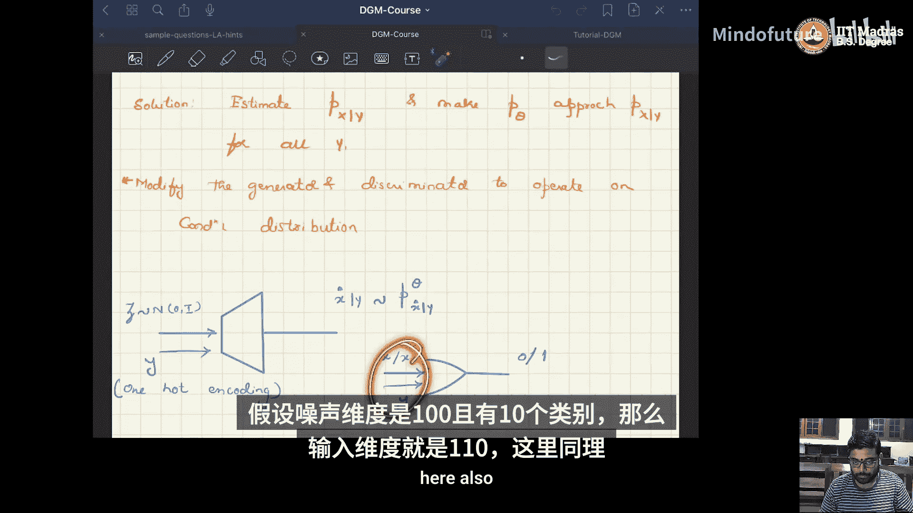
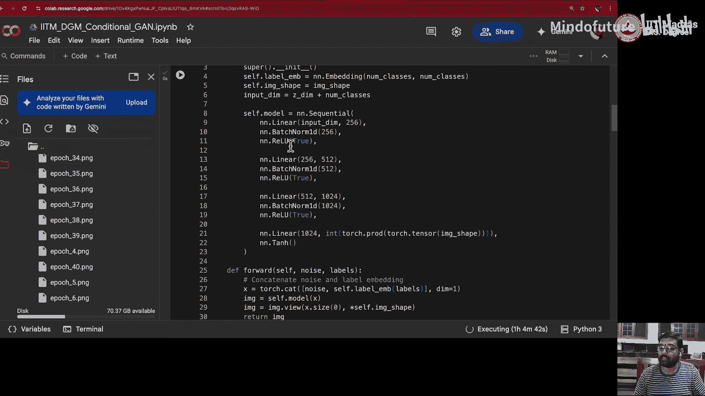
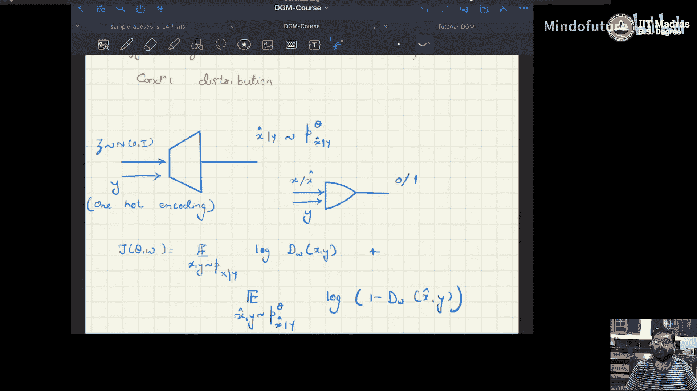

# 015：DC-GAN与条件GAN的实现 🎼



在本教程中，我们将学习两种生成对抗网络（GAN）的实现：深度卷积GAN（DC-GAN）和条件GAN（C-GAN）。我们将重点探讨DC-GAN中生成器所使用的转置卷积（或称分数步长卷积）原理，并了解如何通过条件信息来控制生成图像的类别。

## 转置卷积（上采样卷积）原理

上一节我们介绍了朴素GAN（Vanilla GAN），其生成器使用多层感知机（MLP）。在本节中，我们将看到DC-GAN的生成器使用了一种不同的操作：转置卷积（Transposed Convolution），也称为上卷积（Up Convolution）或分数步长卷积（Convolution with Fractional Stride）。

在典型的卷积操作中，输出尺寸会小于输入尺寸。其公式可以表示为：
`H_out = floor((H_in + 2*padding - kernel_size) / stride) + 1`

然而，在转置卷积中，输出尺寸会大于输入尺寸。其输出尺寸的计算公式为：
`H_out = (H_in - 1) * stride - 2 * input_padding + kernel_size + output_padding`



例如，对于一个输入尺寸为 `7x7`，使用 `4x4` 卷积核，步长为 `2`，输入填充为 `1`，输出填充为 `1` 的转置卷积层，其输出尺寸计算如下：
`H_out = (7 - 1) * 2 - 2 * 1 + 4 + 1 = 15`
因此，`7x7` 的输入被转换成了 `15x15` 的输出。

为了更直观地理解，我们可以看一个一维的例子。假设输入为 `[A, B, C]`，步长为 `2`。转置卷积首先会在元素间插入零值，得到 `[A, 0, B, 0, C, 0]`。然后，一个大小为 `3` 的卷积核会在这个扩展后的序列上进行滑动卷积操作，从而产生一个更长的输出序列。这就是转置卷积实现上采样的基本原理。

## DC-GAN 架构与代码实现

理解了转置卷积后，我们来看DC-GAN的架构。在DC-GAN中，生成器由一系列转置卷积块构成，它将一个低维的噪声向量 `z` 逐步上采样，直至达到目标图像尺寸。判别器则使用标准的卷积层来处理图像。

以下是实现中的关键参数和步骤概述：

**关键参数设置**
*   `batch_size = 128`
*   `z_dim = 100` （噪声向量维度）
*   `image_size = 28` （MNIST图像尺寸）
*   `channels = 1` （灰度图通道数）
*   `epochs = 50`
*   `learning_rate = 2e-4`
*   优化器使用 `Adam`，其中 `beta1 = 0.5`

**生成器网络结构**
生成器是一个 `nn.Sequential` 模块，它接收噪声向量 `z`，并通过多个转置卷积层逐步生成图像。

以下是生成器核心层的示例代码结构：
```python
self.model = nn.Sequential(
    # 将噪声向量映射到更高维度的特征图
    nn.ConvTranspose2d(z_dim, 256, kernel_size=4, stride=1, padding=0, bias=False),
    nn.BatchNorm2d(256),
    nn.ReLU(True),
    # 上采样过程
    nn.ConvTranspose2d(256, 128, kernel_size=4, stride=2, padding=1, bias=False),
    nn.BatchNorm2d(128),
    nn.ReLU(True),
    # 输出层，生成单通道图像
    nn.ConvTranspose2d(128, channels, kernel_size=4, stride=2, padding=1, bias=False),
    nn.Tanh() # 将输出值约束在[-1, 1]区间
)
```

**判别器网络结构**
判别器接收图像作为输入，使用标准卷积层提取特征，最后通过一个全连接层和Sigmoid激活函数输出一个概率值，判断图像是真实的还是生成的。



以下是判别器的示例代码结构：
```python
self.model = nn.Sequential(
    # 输入为图像
    nn.Conv2d(channels, 64, kernel_size=4, stride=2, padding=1),
    nn.LeakyReLU(0.2, inplace=True),
    # 更深层的特征提取
    nn.Conv2d(64, 128, kernel_size=4, stride=2, padding=1),
    nn.BatchNorm2d(128),
    nn.LeakyReLU(0.2, inplace=True),
    # 展平并分类
    nn.Flatten(),
    nn.Linear(128 * 7 * 7, 1), # 假设经过两层卷积后特征图尺寸为7x7
    nn.Sigmoid()
)
```

**训练过程**
训练循环与朴素GAN类似，但通常建议对生成器进行更多次的更新。在本例中，设置每训练判别器1次，就训练生成器3次（`k=3, p=1`）。经过多个epoch的训练后，DC-GAN生成的图像质量明显优于使用MLP的朴素GAN。



## 条件GAN（C-GAN）的原理与实现

无论是朴素GAN还是DC-GAN，我们都无法控制生成图像的类别。条件GAN（C-GAN）通过在生成器和判别器的输入中引入类别标签信息来解决这个问题，从而学习条件分布 `P(X|Y)`。

**核心思想**
*   **生成器**：输入不再是单纯的噪声 `z`，而是噪声 `z` 与目标类别标签 `y`（通常经过嵌入或独热编码）的拼接。
*   **判别器**：输入不再是单纯的图像 `x`，而是图像 `x` 与其对应真实标签 `y` 的拼接。对于生成图像，则拼接生成时使用的条件标签。





**代码实现要点**
以下是条件GAN中网络结构的关键修改：

**生成器输入**：
`generator_input_dim = z_dim + num_classes`

**判别器输入**：
`discriminator_input_dim = image_flattened_size + num_classes`

在训练循环中，需要同时向生成器和判别器提供标签信息。对于从真实数据集中取出的批次，使用其真实标签。对于生成器，则需要为其创建对应的条件标签（例如，我们希望生成数字“7”的图像）。

**当前实现的局限与改进**
本教程示例中的条件GAN为了简化，生成器仍使用了MLP结构，因此生成的图像较为模糊。一个有效的改进练习是：**将条件GAN中的MLP生成器替换为DC-GAN中使用的转置卷积结构**。结合条件信息和更强大的卷积架构，有望生成更清晰、更可控的特定类别图像。

## 总结 🎯



在本节课中，我们一起学习了两种重要的GAN变体：
1.  **DC-GAN**：其生成器使用**转置卷积层**进行上采样，能够生成比朴素GAN质量更高的图像。判别器使用标准卷积层处理图像。
2.  **条件GAN（C-GAN）**：通过在生成器和判别器的输入中**拼接类别标签信息**，实现了对生成图像类别的控制，使其能够按需生成特定类别的图像。




两者的训练流程与朴素GAN基本一致，都遵循交替优化生成器和判别器的模式。通过将DC-GAN的上采样架构与C-GAN的条件控制机制相结合，可以构建出更强大、更可控的图像生成模型。