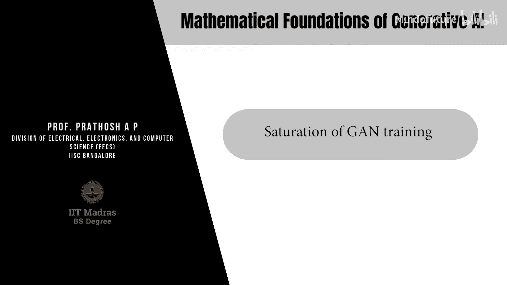
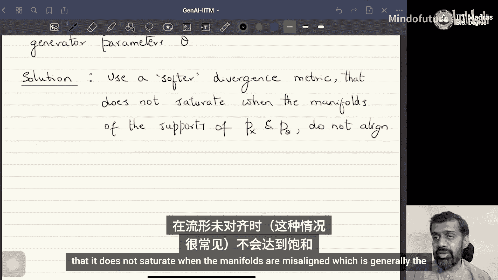

# 016：W4L10-GAN训练的饱和

在本节课中，我们将继续探讨对抗学习。具体来说，我们将研究如何改进对抗学习以使其训练过程更稳定。此外，我们还将了解对抗学习在生成建模之外的几个应用示例。

## 问题：为什么GAN训练不稳定？

上一节我们介绍了基于f散度最小化的对抗学习框架。其核心是构造f散度的下界，然后通过一个极小极大优化问题（鞍点优化问题）来最小化这个下界。这种方法也被称为对抗优化。

然而，这种方法存在两个主要问题。首先，由于它是一个鞍点问题，很难找到最优解。其次，任何基于f散度的最小化都可能导致训练不稳定。

大多数GAN及其变体都基于f散度。我们从一个f散度开始，构造其下界，然后尝试最小化它。我们通过交替优化生成器和判别器来实现这一点。但问题是，我们在最小化阶段构建的生成器的好坏，很大程度上取决于我们为f散度计算的下界（即判别器的学习效果）有多好。

那么，核心问题是：是什么导致了GAN训练如此困难和/或不稳定？我们将分析一些可能的原因，并探讨一种可能的补救措施。

## 流形假设

整个分析基于一个称为“流形假设”的假说。

流形假设的核心思想是：我们在实践中观察到的数据（无论是图像、文本还是任何其他类型的数据）都存在于环境空间中的一个非常低维的流形上。

这意味着，真实数据的分布（如图像）位于环境空间中的一个低维流形上。

为了理解“流形”，我们可以将其视为环境空间中的一个低维子空间。例如，想象在三维空间中拿着一张纸，纸上的所有点都可以看作是三维环境空间中的一个二维子空间。再比如，拿着一根理论上厚度为零的线，线上的所有点都位于一个一维流形上，尽管这些点可以用三个坐标表示，但它们实际上存在于一个一维子空间中。

这是一个假说，因为我们无法确定地测试数据是否真的位于低维流形上。但根据大量经验证据，我们可以认为获得的数据确实位于非常低维的流形上。

一个具有说服力的例子是：假设我们进行一个实验，填充一个28x28的网格（代表一张图像）。我们抛一枚概率为p的硬币，如果正面朝上，则将像素值设为1（黑色），如果反面朝上，则设为0（白色）。问题是，通过这种随机实验，生成具有语义意义（例如看起来像字母）的图像的概率是多少？这个概率极低。这类似于著名的“猴子打字机”问题：一只猴子随机打字，打出莎士比亚作品的概率微乎其微。

在这个例子中，所有通过上述随机实验生成的图像都可以表示在一个784维的二进制空间中。所有具有语义意义的图像也是这个空间的成员。但在这个所有可能结果的巨大空间中，那些对应语义上有意义图像的点所占的子空间（流形）非常小。因为在整个可能的结果中，通过随机实验最终生成有意义图像的概率非常低。

将此扩展到自然图像：在所有可能的图像（包括各种噪声图像）中，我们在实践中获得的数据所占据的流形，与环境空间相比，维度非常低。这个随机实验是为了让你大致理解为什么流形假设可能是成立的。

## 流形假设对GAN训练的影响

现在的问题是：这如何影响f散度最小化或GAN训练？

回想一下，我们处理的两个分布 Px（真实数据分布）和 Pθ（生成数据分布）都是定义在 R^D 上的分布。由于真实数据和生成数据都位于低维流形上，因此 Px 和 Pθ 的支撑集（即密度函数非零的区域）很可能没有对齐。

“支撑集”是指对应密度函数取非零值的集合。由于真实数据和生成数据位于不同的低维流形上，Px 和 Pθ 的支撑集（即这两个流形）很可能不一致（即没有对齐）。

接下来是一个关键定理：可以证明，当两个感兴趣分布 Px 和 Pθ 的支撑集没有完美对齐时，总可以学习到一个完美的判别器（即具有100%准确率的判别器）。

这意味着，在GAN训练中，如果判别器变得过于强大，能够以100%的准确率区分真实数据和生成数据，那么生成器的训练就会“饱和”。因为此时，我们为生成器计算的梯度会消失，生成器无法再获得有效的更新信号。

在极小极大优化问题的背景下，这意味着如果我们没有为f散度构造一个非常紧的下界，那么最小化这个较弱的下界就没有意义。

因此，针对这个问题的一个常见经验性补救措施是：在交替训练生成器和判别器时，不要以相同的频率训练它们。通常建议较少地训练判别器，以防止其变得过于强大，从而避免生成器训练饱和。但这只是一种经验性的解决方法。

## 问题的理论根源与解决方案

那么，问题的理论根源是什么？可以进一步证明，当你能找到一个准确率100%的判别器时，真实数据与生成数据之间的f散度将变得与生成器参数θ无关。正是这一点导致了GAN训练的饱和。

因此，我们需要一个更根本的解决方案。这个解决方案是：使用一个“更柔和”的散度度量。

所谓“更柔和”，是指这个度量不会在分布支撑集（流形）没有对齐时就达到饱和。我们知道，由于流形假设，流形很可能不会对齐。我们需要的度量是：即使流形没有对齐，它也能量化流形之间的距离，而不是简单地饱和。

换句话说，问题出在f散度上。大多数常用的f散度（如Jensen-Shannon散度、KL散度、皮尔逊卡方距离等）在流形不重叠时都会饱和，这不是我们想要的。

因此，解决方案是提出一种新的度量，它在流形未对齐时不会饱和，而这通常是实际情况。

通常情况确实如此。

## 总结

本节课中，我们一起学习了GAN训练不稳定的一个核心原因。我们首先介绍了**流形假设**，即真实数据存在于高维环境空间的低维流形上。基于此，我们分析了当真实数据分布Px和生成数据分布Pθ的支撑集（流形）未对齐时，总可以找到一个**完美的判别器**（准确率100%）。这会导致生成器训练的梯度消失，即训练**饱和**。问题的根源在于传统的**f散度**度量（如JS散度）在此情况下会失效。因此，我们需要一种**更柔和的散度度量**，它即使在流形未对齐时也能有效衡量分布间的距离，从而为生成器提供持续的优化信号。这为后续介绍Wasserstein距离等更稳定的度量方法奠定了基础。