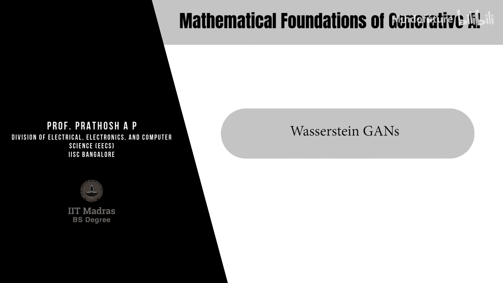
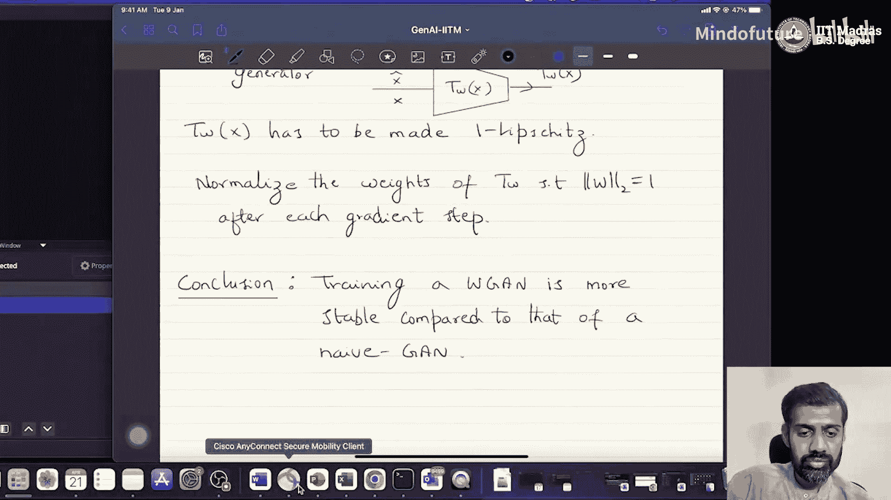

# 017：Wasserstein GAN 🎼



在本节课中，我们将学习一种改进生成对抗网络（GAN）训练稳定性的方法——Wasserstein GAN。我们将探讨传统GAN在数据流形不重叠时遇到的问题，并引入一种名为Wasserstein距离（或最优传输距离）的度量来解决它。最后，我们将看到如何利用这个距离构建更稳定的WGAN。

## 从F散度到最优传输

上一节我们介绍了F散度作为衡量分布差异的度量。然而，当两个分布的支撑集（即数据实际存在的区域）不重叠时，F散度会达到饱和，导致梯度消失，使得GAN训练失败。

本节中，我们来看看另一种不会饱和的度量族——Wasserstein距离，它源于**最优传输**的思想。

## 理解最优传输与Wasserstein距离

Wasserstein距离的核心思想是：衡量将一个概率分布“搬运”成另一个概率分布所需的最小“工作量”。

### 直观解释：离散分布的例子

为了便于理解，我们考虑两个一维离散概率分布。我们可以用直方图表示它们。

*   **分布Px**：在位置x1, x2, ..., xk上有一定的概率质量。
*   **分布Px_cap**：在位置x1_cap, x2_cap, ..., xl_cap上有一定的概率质量。

我们的目标是将Px“改造”成Px_cap。这意味着我们需要重新分配Px在各个点上的质量，使其最终形态与Px_cap一致。

以下是实现这一目标的关键概念：

*   **传输方案**：每一个具体的质量搬运方法（例如，从x1搬多少质量到x1_cap，多少到x2_cap等）都对应一个**联合分布**。这个联合分布描述了从Px的每个点到Px_cap的每个点的质量转移量。
*   **传输成本**：将质量从一个点x搬运到另一个点x_cap需要做功。这个功可以量化为两点间的距离乘以搬运的质量，即 `距离(x, x_cap) * 质量(x, x_cap)`。
*   **方案总成本**：一个完整传输方案的总成本（或平均做功）就是所有点对之间的搬运成本之和。数学上，这等于在**该联合分布（传输方案）**下，`距离(x, x_cap)`的期望值：`E_(x, x_cap)~π [ ||x - x_cap|| ]`。

### Wasserstein距离的数学定义

给定两个分布Px和Px_cap，它们之间的（一阶）Wasserstein距离定义为所有可能传输方案中的最小成本。

**公式**：
`W(Px, Px_cap) = min_(π ∈ Π) E_(x, x_cap)~π [ ||x - x_cap|| ]`

其中：
*   `π` 是一个**联合分布**，它是Px和Px_cap的一个可能传输方案。
*   `Π` 是所有满足边际分布为Px和Px_cap的联合分布的集合。即，对`π`关于x_cap积分得到Px，关于x积分得到Px_cap。

**直观理解**：如果两个分布非常接近，那么将其中一个“搬”成另一个所需的最小工作量就很小，因此Wasserstein距离也小。反之，如果分布相距甚远，最小工作量就大，距离也大。**关键在于，即使两个分布的支撑集完全不重叠，这个“最小工作量”仍然是一个有意义的、非饱和的数值**。

## 从距离到生成模型：Wasserstein GAN (WGAN)

我们的目标仍然是训练生成器G_θ，使其产生的分布P_θ尽可能接近真实数据分布Px。现在，我们选择最小化它们之间的Wasserstein距离，即：`min_θ W(Px, P_θ)`。

直接计算Wasserstein距离的极小值很困难。幸运的是，**Kantorovich-Rubinstein对偶性**提供了一个等价形式：

**公式**：
`W(Px, P_θ) = max_(||f||_L ≤ 1) [ E_(x~Px)[f(x)] - E_(z~Pz)[f(G_θ(z))] ]`

这个对偶形式将最小化问题转化为一个最大化问题：
*   `f` 是一个函数，它需要满足 **1-Lipschitz连续** 的约束（即其梯度的范数几乎处处不大于1）。
*   我们需要找到一个在约束条件下的最优函数`f`，使得两个期望的差最大。这个最大值就是Wasserstein距离。

### 构建WGAN

这个对偶形式与原始GAN的目标非常相似！我们可以这样构建WGAN：

1.  **判别器变为评论家**：函数`f`由一个神经网络`T_w`（称为评论家）来参数化。它的任务是最大化 `E[T_w(真实数据)] - E[T_w(生成数据)]`。
2.  **生成器**：生成器`G_θ`的任务是最小化上述差值，即让评论家的输出差变小。
3.  **关键约束**：必须确保评论家网络`T_w`满足1-Lipschitz约束。

因此，WGAN的优化目标是一个极小极大问题：
`min_θ max_(w: ||T_w||_L ≤ 1) [ E_(x~Px)[T_w(x)] - E_(z~Pz)[T_w(G_θ(z))] ]`

### 如何实施Lipschitz约束？

确保神经网络满足严格的Lipschitz约束是研究课题。一个简单有效的实践方法是：**在每次梯度更新后，将评论家网络`T_w`所有权重裁剪到一个固定的小区间内**（例如[-0.01, 0.01]）。这被称为**权重裁剪**。

**代码示意（训练循环核心）**：
```python
# 训练评论家 (多次)
for _ in range(n_critic_steps):
    real_data = ...
    fake_data = generator(noise)
    critic_real = critic(real_data)
    critic_fake = critic(fake_data)
    # Wasserstein 损失
    loss_critic = -(torch.mean(critic_real) - torch.mean(critic_fake))
    loss_critic.backward()
    critic_optimizer.step()
    # 权重裁剪，实施 Lipschitz 约束
    for p in critic.parameters():
        p.data.clamp_(-0.01, 0.01)

# 训练生成器
gen_fake = critic(fake_data)
loss_generator = -torch.mean(gen_fake) # 最大化评论家对假数据的评分
loss_generator.backward()
generator_optimizer.step()
```

## 总结

本节课中我们一起学习了Wasserstein GAN的核心思想。

1.  **问题**：传统GAN使用的F散度在数据流形不重叠时会饱和，导致训练不稳定。
2.  **解决方案**：引入**Wasserstein距离**作为分布差异的度量，它衡量了分布间转换的最小“工作量”，即使支撑集不重叠也不会饱和。
3.  **对偶形式**：通过Kantorovich-Rubinstein对偶，将最小化Wasserstein距离转化为一个易于求解的极大极小问题，形式类似原始GAN。
4.  **WGAN架构**：将判别器改为**评论家**，其目标是最大化真实数据与生成数据评分之差；生成器则试图最小化这个差。**关键改进**是必须对评论家网络施加**1-Lipschitz约束**，实践中常通过权重裁剪实现。
5.  **优势**：WGAN的训练通常比标准GAN**更稳定**，梯度行为更良好，减少了模式崩溃等问题。




因此，在应用GAN时，使用Wasserstein距离构建的WGAN是一个更可靠的选择。在下一个模块中，我们将探讨GAN在生成任务之外的一些应用。