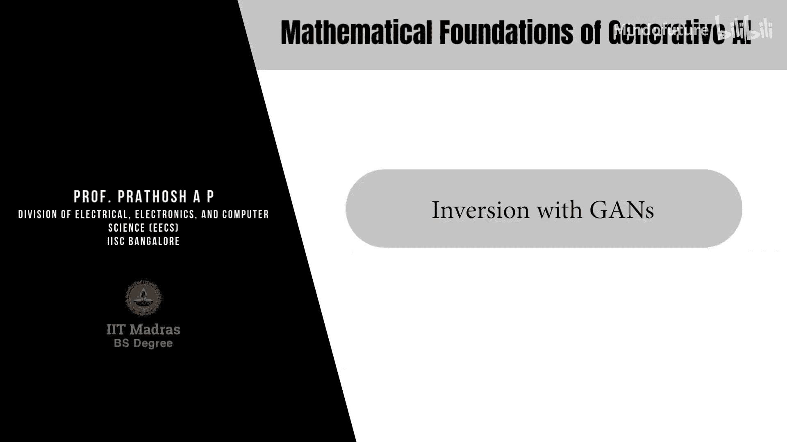
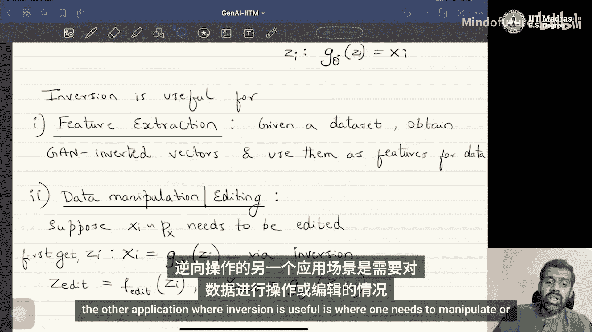

# 018：基于GAN的反演

## 概述
在本节课中，我们将要学习生成对抗网络中的一个重要概念——反演。我们将探讨什么是GAN反演，为什么它是有用的，以及如何实现它。

---

## 继续讨论生成对抗网络与对抗学习

上一节我们介绍了GAN的基本原理，本节中我们来看看GAN的反演。

### 什么是GAN反演？
在目前我们所见的朴素GAN中，我们可以从一个任意的输入空间生成数据。通常的过程是：我们有一个生成器，它从我们感兴趣的数据分布中采样。这个生成器的输入是来自正态分布的样本，它会输出接近目标数据分布 `P_data` 的样本。这个过程可以表示为：

**公式：** `G: Z -> X`，其中 `Z ~ N(0, I)`，`X ~ P_data`。

现在，假设我们想要“反转”这个过程。这意味着什么呢？具体来说，给定一个从数据分布 `P_x` 中采样的数据点 `x_i`，我们的目标是找到对应的潜在变量 `z_i`。也就是说，找到一个 `z_i`，使得训练好的生成器 `G_θ*` 满足：

**公式：** `G_θ*(z_i) = x_i`

这个问题被称为“反演”问题。在训练后，我们可以从正态分布中采样并生成数据点，但朴素GAN没有提供方法来根据给定的数据点找到对应的潜在变量 `z`。

### 为什么需要反演？
在探讨如何解决反演问题之前，我们先了解一下为什么它很重要。反演主要有两个应用场景：

以下是反演的两个主要用途：

1.  **特征提取**：一个训练良好的GAN已经隐式地学习了数据的分布。如果我们能够反转生成器函数，那么通过反演得到的向量就代表了数据的某种特征表示。由于 `z` 的维度通常远低于原始数据，因此反演可以得到数据的低维特征表示，这些特征可以用于分类或其他下游任务。
2.  **数据操控或编辑**：假设我们有一个特定的图像，我们想使用GAN来编辑它。朴素GAN本身不支持编辑任务，因为它只能从分布中采样并生成数据。但是，如果我们能先通过反演得到该图像对应的潜在向量 `z_i`，然后对这个向量进行编辑（例如，通过一个编辑函数 `f_edit`），最后再将编辑后的向量 `z_edit` 输入生成器，就能生成编辑后的新图像 `x_edit`。

**数据编辑流程可以概括为：**
1.  给定数据点 `x_i`。
2.  通过反演找到对应的 `z_i`，使得 `G_θ*(z_i) ≈ x_i`。
3.  对 `z_i` 应用编辑函数：`z_edit = f_edit(z_i)`。
4.  生成编辑后的数据：`x_edit = G_θ*(z_edit)`。

因此，找到能够生成特定数据点的输入向量 `z` 是非常重要的。

---

## 总结
本节课中我们一起学习了GAN反演的概念。我们明确了反演的目标是：给定一个数据点 `x`，找到其对应的潜在空间向量 `z`，使得生成器能够重建它。我们还探讨了反演的两个关键应用：一是作为特征提取器，为数据提供低维表示；二是作为数据编辑的基础，通过修改潜在向量来实现对生成内容的操控。理解反演是深入利用GAN模型能力的重要一步。