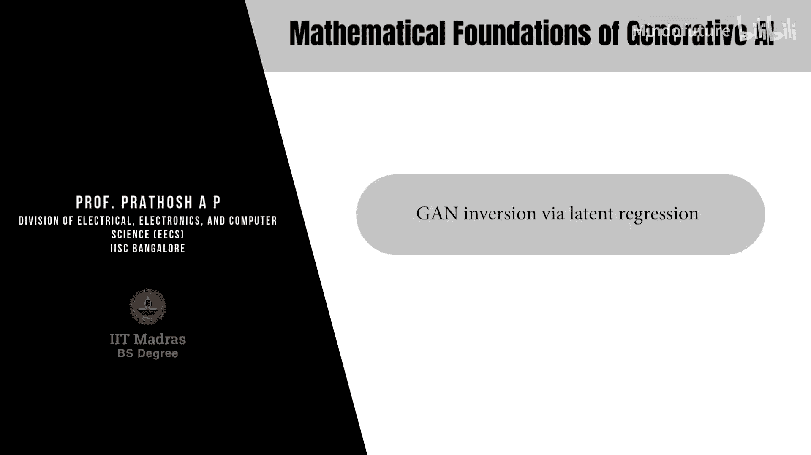
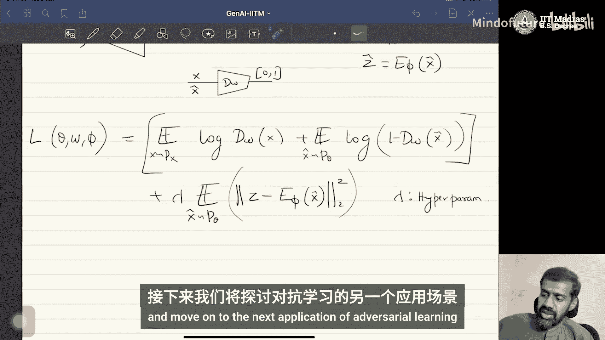

生成式AI的数学基础：P19：通过潜在回归进行GAN反演



在本节课中，我们将学习另一种实现GAN反演的方法——潜在回归法。我们将探讨其基本原理、网络结构、损失函数设计，并与之前介绍的BiGAN方法进行比较。

上一节我们介绍了通过联合分布匹配进行反演的BiGAN方法。本节中，我们来看看另一种被称为“潜在回归”的反演技术。

潜在回归法与BiGAN非常相似，但核心思想不同。它不是通过最小化联合分布匹配问题来显式地解决反演，而是采用回归的思路。

以下是潜在回归法的基本框架：

*   **编码器网络**：该方法仍然需要一个编码器网络。没有编码器，就无法实现反演。这个编码器网络接收数据点 **x** 作为输入，并直接回归（预测）出对应的潜在向量 **ẑ**。我们可以将其表示为 **ẑ = E_φ(x)**，其中 **E_φ** 是编码器网络，**φ** 是其参数。
*   **判别器网络**：判别器 **D_w** 的功能与标准GAN中完全一致。它的任务是区分真实数据 **x**（来自真实分布 **P_x**）和生成数据 **x̂**（来自生成器分布 **P_θ**）。
*   **生成器网络**：生成器 **G_θ** 的功能也与标准GAN中一致，它接收一个随机潜在向量 **z**，并生成数据 **x̂ = G_θ(z)**。

现在，我们来看看如何训练这个模型。潜在回归法的损失函数是在标准GAN损失的基础上，增加了一个回归项。

标准GAN的对抗损失部分如下：
```
L_adv = E_{x~P_x}[log D_w(x)] + E_{z~P_z}[log(1 - D_w(G_θ(z)))]
```
其中，第一项鼓励判别器识别真实数据，第二项鼓励生成器生成以假乱真的数据。

为了训练编码器进行反演，我们增加一个回归损失项。这个损失项衡量的是生成数据 **x̂** 所对应的原始潜在向量 **z**，与编码器预测的潜在向量 **ẑ** 之间的差异。通常使用L2范数（均方误差）来衡量：
```
L_reg = || z - E_φ(G_θ(z)) ||^2
```
这里，**z** 是生成 **x̂** 时使用的原始潜在向量，**E_φ(G_θ(z))** 是编码器对生成数据 **x̂** 进行编码后得到的预测向量 **ẑ**。

最终的联合损失函数是这两部分的加权和：
```
L_total = L_adv + λ * L_reg
```
其中，**λ** 是一个超参数，用于控制回归损失在总损失中的权重。

在训练过程中，生成器参数 **θ**、判别器参数 **w** 和编码器参数 **φ** 这三个网络被同时训练。具体来说，对于一个由特定 **z** 生成的 **x̂**，我们将其输入编码器，计算预测的 **ẑ**，然后通过回归损失 **L_reg** 计算编码器的梯度并进行更新。生成器和判别器则主要通过对抗损失 **L_adv** 进行更新。

潜在回归法与BiGAN的关键区别在于对判别器的处理方式：
*   在**BiGAN**中，判别器被修改为接收数据-潜在向量对 **(x, z)** 或 **(x̂, z)** 作为输入，并学习区分来自联合分布的这些对。
*   在**潜在回归**中，判别器没有被修改，它仍然像在标准GAN中一样工作。额外的编码器网络只是简单地尝试回归输入潜在向量，因此得名“回归器”。它通过向标准GAN损失添加一个回归成本来训练编码器。

然而，研究发现，与这种简单或朴素的回归方法相比，修改判别器并求解联合分布匹配问题通常能产生更好的反演质量。潜在回归和BiGAN是文献中常用的两种GAN反演技术，当然也存在许多其他方法。




本节课中，我们一起学习了通过潜在回归进行GAN反演的方法。我们了解了其网络结构由生成器、判别器和一个额外的编码器组成，其损失函数结合了标准GAN的对抗损失和一个潜在向量回归损失。最后，我们将其与BiGAN方法进行了对比，指出了判别器角色和训练目标上的核心差异。