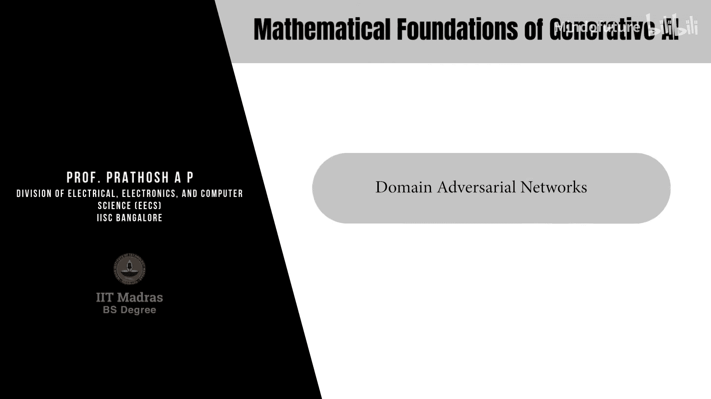
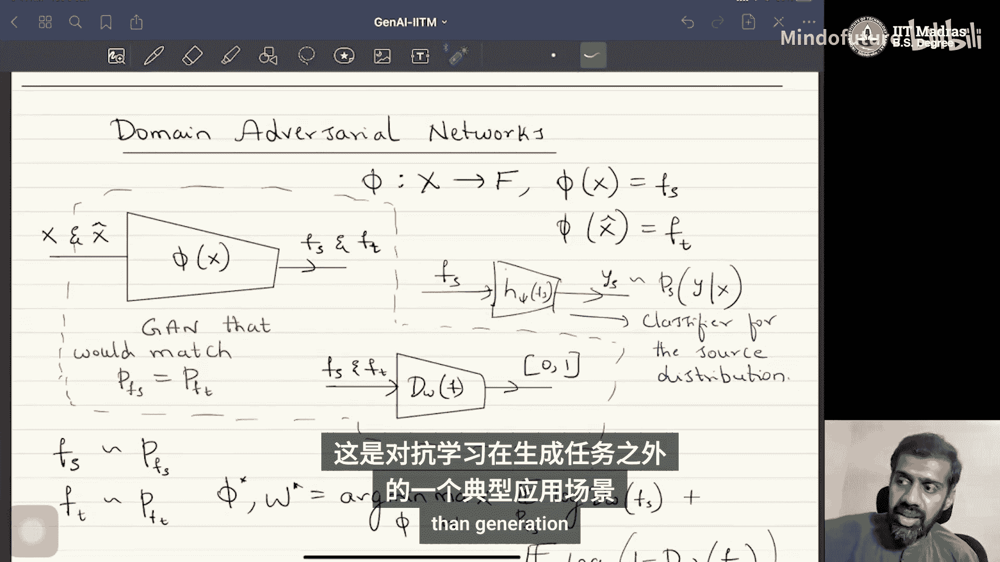

# 020：领域对抗网络 🎼

在本节课中，我们将学习对抗学习的另一个重要应用：**领域适应**。我们将探讨如何利用对抗学习的思想来解决训练数据（源领域）与测试数据（目标领域）分布不一致的问题，即**领域偏移**。

## 什么是领域偏移？

上一节我们介绍了对抗学习在生成模型中的应用。本节中，我们来看看它如何解决一个不同的问题：领域偏移。

领域偏移是一个实际问题。假设我们有一个**源分布** \( D_S \)，从中采样得到带标签的数据集 \( \{ (x_i, y_i) \} \)，其中 \( (x, y) \sim P_S(x, y) \)。我们的任务是训练一个分类器。

在标准的分类任务中，分类器旨在估计条件分布 \( P(y|x) \)。然而，在实际应用中，测试时的数据可能来自一个不同的分布，即**目标分布** \( D_T \)，其中 \( (x, y) \sim P_T(x, y) \)，且 \( P_T \neq P_S \)。

在这种情况下，仅在源数据 \( D_S \) 上训练的分类器或回归器，在目标数据 \( D_T \) 上的性能通常会显著下降。

## 领域偏移的实例

为了更直观地理解，让我们看一个例子。以下是PACS数据集的示例，它包含来自四个不同领域的数据：照片、艺术绘画、卡通和素描。

人类可以轻易识别出每个图像中的物体类别，无论它来自哪个领域。但是，如果一个神经网络仅在“照片”领域的数据上训练，当测试时遇到“素描”领域的数据时，其分类性能可能会很差。

因此，领域适应（Domain Adaptation）的核心问题是：**我们能否找到一种方法，使得在源数据上训练的分类器，在与源分布相似但不完全相同的目标分布上也能表现良好？**

## 无监督领域适应问题设定

我们关注的问题称为**无监督领域适应**。其设定如下：
*   **源数据**：我们有来自源分布 \( P_S \) 的样本 \( \{ (x_i, y_i) \}_{i=1}^N \)，包含数据和标签。
*   **目标数据**：我们有来自目标分布 \( P_T \) 的样本 \( \{ \hat{x}_j \}_{j=1}^M \)，但**没有对应的标签**。

这是一个很实际的假设，因为收集数据本身相对容易，但获取准确的标签往往成本高昂。

问题的目标是：给定 \( D_S \) 和 \( D_T \)，学习一个**特征表示**或**分类器**，使其在源数据和目标数据上都能表现良好。

## 使用对抗学习解决领域适应

接下来，我们看看如何利用对抗学习来解决这个问题。我们将使用一种称为**领域对抗网络**的方法。

其核心思想是：**学习一个特征提取器，使得它提取的源领域特征和目标领域特征的分布尽可能一致**。这样，基于源特征训练的分类器就能自然地适用于目标特征。

以下是网络结构：

1.  **特征提取器** \( \phi(x) \)：这是一个神经网络，将输入数据（无论是源数据 \( x \) 还是目标数据 \( \hat{x} \)）映射到一个特征空间 \( \mathcal{F} \)。对于源数据，它输出特征 \( f_S = \phi(x) \)，其分布为 \( P(f_S) \)。对于目标数据，输出特征 \( f_T = \phi(\hat{x}) \)，其分布为 \( P(f_T) \)。
2.  **领域判别器** \( D_W(f) \)：这是一个判别器网络，输入是特征 \( f_S \) 或 \( f_T \)，目标是判断该特征来自源领域还是目标领域。它输出一个介于0和1之间的值。
3.  **标签分类器** \( h(f_S) \)：这是一个标准的分类器，**仅使用源数据的特征** \( f_S \) 来预测其标签 \( y \)。

整个网络的训练过程是一个对抗博弈：

*   **领域判别器 \( D_W \)** 的目标是**最大化**其区分能力。其损失函数为：
    \[
    L_{adv}(D) = \mathbb{E}_{f_S \sim P(f_S)}[\log D_W(f_S)] + \mathbb{E}_{f_T \sim P(f_T)}[\log(1 - D_W(f_T))]
    \]
*   **特征提取器 \( \phi \)** 的目标是**双重**的：
    *   **对抗目标**：**最小化**领域判别器的性能，即“欺骗”判别器，让它无法区分特征是来自源领域还是目标领域。这通过最大化判别器的损失（或最小化其负值）来实现，从而促使 \( P(f_S) \) 和 \( P(f_T) \) 的分布对齐。
    *   **分类目标**：**最小化**标签分类器的损失（如交叉熵损失），确保提取的特征对分类任务是有用的。其损失函数为：
        \[
        L_{cls}(\phi, h) = \mathbb{E}_{(x,y) \sim P_S}[-\log h(\phi(x))_y]
        \]
*   **标签分类器 \( h \)** 的目标是**最小化**其在源数据上的分类误差 \( L_{cls} \)。

**关键点**：特征提取器 \( \phi \) 同时接收来自分类损失和对抗损失的梯度。这迫使它学习到既对分类任务有效，又对领域变化不敏感（即领域无关）的特征。

## 训练与推理过程

在训练阶段，我们联合优化特征提取器 \( \phi \)、领域判别器 \( D_W \) 和标签分类器 \( h \)。优化问题可以表述为一个**极小极大**问题：
\[
\min_{\phi, h} \max_{D_W} \left( L_{cls}(\phi, h) - \lambda L_{adv}(\phi, D_W) \right)
\]
其中 \( \lambda \) 是一个权衡两项损失的参数。

在推理阶段，对于来自目标领域的新测试样本 \( \hat{x}_{test} \)，我们：
1.  将其输入训练好的特征提取器 \( \phi^* \)，得到特征 \( f_{T, test} = \phi^*(\hat{x}_{test}) \)。
2.  将 \( f_{T, test} \) 输入训练好的标签分类器 \( h^* \)，得到预测标签 \( \hat{y}_{test} = h^*(f_{T, test}) \)。

由于对抗训练确保了 \( P(f_S) \approx P(f_T) \，因此分类器 \( h^* \) 在目标特征上的行为与在源特征上是一致的，从而实现了跨领域的有效分类。

## 总结

本节课中，我们一起学习了对抗学习在生成任务之外的一个重要应用——**领域对抗网络**。

*   我们首先认识了**领域偏移**问题，即训练与测试数据分布不一致导致的模型性能下降。
*   然后，我们介绍了**无监督领域适应**的问题设定：拥有带标签的源数据和不带标签的目标数据。
*   核心解决方案是**领域对抗网络**，它通过一个对抗性训练框架，迫使特征提取器学习**领域无关**的特征。
*   特征提取器同时优化两个目标：**欺骗领域判别器**以实现特征分布对齐，以及**最小化分类误差**以保证特征的有效性。
*   最终，仅在源数据上训练的分类器，可以成功地应用于目标数据，因为它使用的是领域无关的特征表示。

这种方法展示了对抗学习思想的强大与灵活性，它不仅能够生成数据，还能帮助模型学习更鲁棒、更具泛化能力的特征表示。