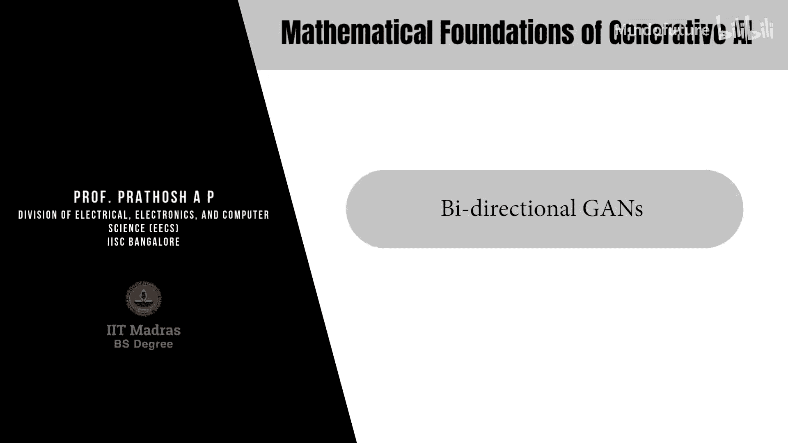
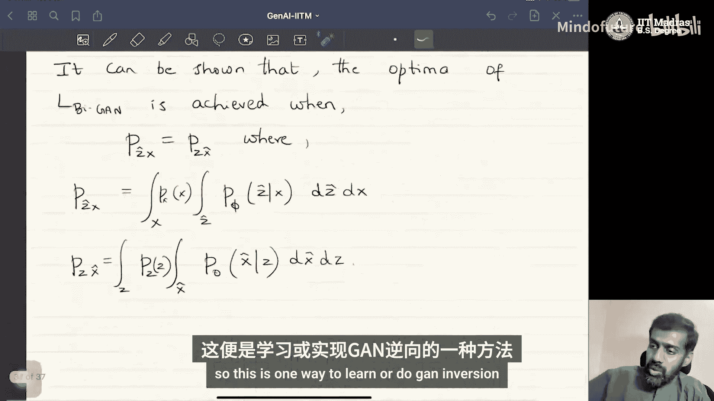

# 021：双向GAN

## 概述
在本节课中，我们将学习一种名为**双向生成对抗网络**的GAN变体。我们将探讨如何修改标准GAN的架构，使其不仅能够从随机噪声生成数据，还能为给定的真实数据样本找到对应的输入噪声向量，即实现**反演**功能。

---

## 双向GAN的架构

上一节我们介绍了标准GAN的基本结构。本节中我们来看看双向GAN在架构上的关键变化。

在标准GAN中，我们有两个神经网络：生成器 `G_θ(z)` 和判别器 `D_w(x)`。生成器将来自正态分布的噪声向量 `z` 映射到数据分布，判别器则区分真实数据 `x` 和生成数据 `G_θ(z)`。

在双向GAN中，除了生成器和判别器，我们引入了第三个网络：**编码器**或**反演器** `E_φ(x)`。这个编码器网络的作用是，接收来自真实数据空间 `x` 的样本，并将其映射回输入噪声空间 `z`。我们称其输出为 `ẑ`。

以下是双向GAN的三个核心组件：
*   **生成器**：`x̂ = G_θ(z)`，其中 `z ~ p_z`。
*   **编码器**：`ẑ = E_φ(x)`，其中 `x ~ p_data`。
*   **判别器**：`D_w(·, ·)`，其输入和功能发生了关键变化。

---

## 判别器的改进

在标准GAN中，判别器处理的是单个数据点。为了实现反演，双向GAN对判别器的任务进行了重新设计。

判别器不再仅仅区分单个的真实数据点 `x` 和生成数据点 `x̂`。相反，它被设计来区分**数据对**的联合分布。

以下是判别器需要区分的两种数据对：
1.  **真实数据对**：`(x, E_φ(x))`，即一个真实样本 `x` 及其通过编码器得到的潜在向量 `ẑ`。
2.  **生成数据对**：`(G_θ(z), z)`，即一个噪声向量 `z` 及其通过生成器得到的数据 `x̂`。

如果判别器无法区分这两类数据对，就意味着 `(x, ẑ)` 的联合分布与 `(x̂, z)` 的联合分布相匹配。这间接保证了编码器 `E_φ` 能够为真实数据 `x` 找到“正确”的潜在表示 `z`。

---

## 目标函数与训练

基于上述架构，我们可以定义双向GAN的优化目标。

双向GAN的目标函数 `L_BiGAN` 涉及三个网络的参数：生成器参数 `θ`、编码器参数 `φ` 和判别器参数 `w`。其公式如下：

`L_BiGAN(θ, φ, w) = E_{x~p_data}[log D_w(x, E_φ(x))] + E_{z~p_z}[log(1 - D_w(G_θ(z), z))]`

对应的优化问题是：
*   **最小化** `L_BiGAN` 关于生成器参数 `θ` 和编码器参数 `φ`。
*   **最大化** `L_BiGAN` 关于判别器参数 `w`。

训练过程与标准GAN类似，采用交替优化：
1.  从真实数据分布 `p_data` 中采样一个批次 `x`，通过编码器得到 `ẑ`。
2.  从先验噪声分布 `p_z` 中采样一个批次 `z`，通过生成器得到 `x̂`。
3.  将数据对 `(x, ẑ)` 和 `(x̂, z)` 输入判别器 `D_w`。
4.  计算损失，并反向传播梯度以同时更新生成器 `G_θ`、编码器 `E_φ` 和判别器 `D_w` 的参数。

---

## 工作原理与总结

为什么这种设计能够工作？其背后的理论保证是，当上述目标函数达到纳什均衡时，可以证明最优解满足以下条件：

`p_data(x) * p_φ(ẑ|x) = p_z(z) * p_θ(x̂|z)`

这意味着真实数据 `x` 与编码输出 `ẑ` 的联合分布，等于先验噪声 `z` 与生成数据 `x̂` 的联合分布。当这两个联合分布一致时，编码器 `E_φ` 就成为了生成器 `G_θ` 的有效反演器。

本节课中我们一起学习了双向GAN。我们了解到，通过引入一个编码器网络并让判别器区分数据对而非单个数据点，我们可以训练一个既能生成数据又能为任何给定数据找到对应潜在表示的GAN模型。训练完成后，生成器 `G_θ*` 可用于从噪声生成数据，而编码器 `E_φ*` 则可用于实现反演，即 `ẑ = E_φ*(x)`。这是实现GAN反演的一种有效方法。