# 022：Bi-GAN的实现 🧠

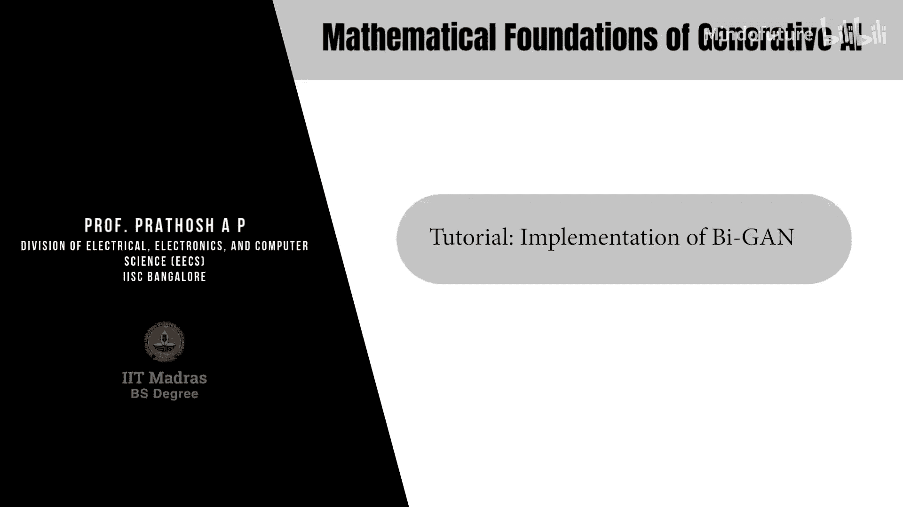

在本节课中，我们将学习双向生成对抗网络（Bi-GAN）的核心概念与代码实现。Bi-GAN在标准GAN的基础上增加了一个编码器网络，旨在学习从数据空间到潜在空间的映射，从而实现潜在向量的“反演”。

## 标准GAN回顾

上一节我们介绍了标准GAN的基本结构。在标准GAN中，生成器网络 **G** 将来自正态分布的潜在向量 **z** 映射到图像空间。判别器网络 **D** 则接收真实图像或生成图像，并输出一个标量（0或1）来判断其真伪。

## Bi-GAN的核心思想 🎯

本节中，我们来看看Bi-GAN的改进之处。Bi-GAN引入了一个编码器网络 **E**，其目标是将真实图像 **x** 映射回潜在空间，得到一个编码后的潜在向量 **ẑ**。这使得网络能够学习数据的双向映射。

Bi-GAN的网络结构包含三个部分：
*   **生成器 (G)**: 从潜在空间到数据空间。`G(z) -> x̃`
*   **编码器 (E)**: 从数据空间到潜在空间。`E(x) -> ẑ`
*   **判别器 (D)**: 接收一个“数据-潜在向量”对 `(x, z)`，判断该对是来自真实数据分布 `(x, E(x))` 还是生成数据分布 `(G(z), z)`。

以下是Bi-GAN的优化目标（鞍点问题）公式：

**min_{G, E} max_{D} V(D, G, E)**

其中价值函数 **V** 定义为：

`V(D, G, E) = E_{x~p_data(x)}[log D(x, E(x))] + E_{z~p_z(z)}[log(1 - D(G(z), z))]`

## 代码实现详解 💻

理解了理论框架后，我们现在进入代码实现环节。我们将使用PyTorch框架来构建Bi-GAN。

### 1. 初始化与数据准备

首先，我们需要设置基本参数并准备数据。

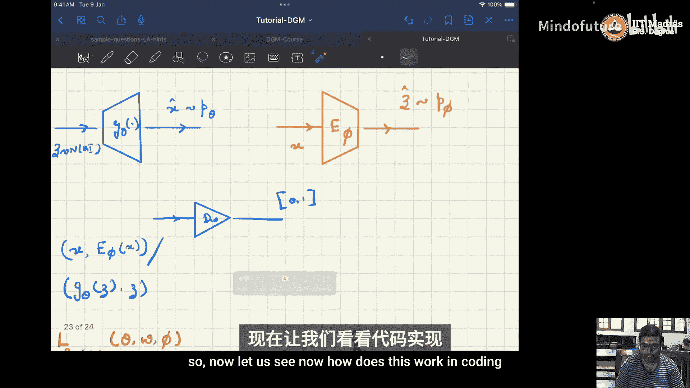

```python
import torch
import torch.nn as nn
import torch.optim as optim
from torchvision import datasets, transforms

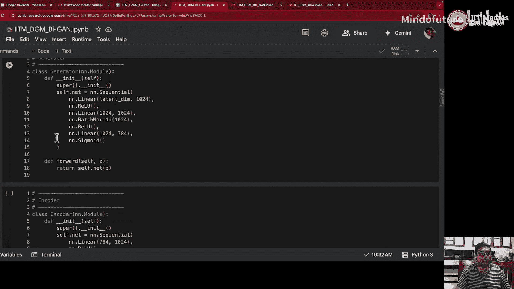

# 参数设置
device = torch.device("cuda" if torch.cuda.is_available() else "cpu")
batch_size = 128
latent_dim = 50
epochs = 50
learning_rate = 0.0002

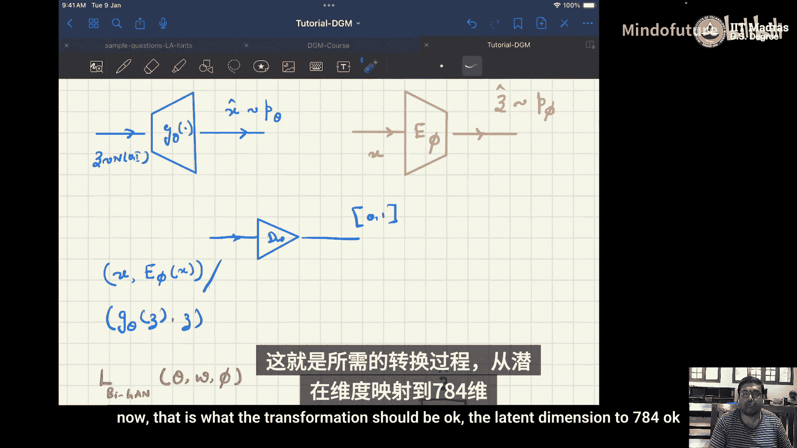

# 数据转换与加载（以MNIST为例）
transform = transforms.Compose([
    transforms.ToTensor(),
    transforms.Normalize((0.5,), (0.5,))
])
train_dataset = datasets.MNIST(root='./data', train=True, download=True, transform=transform)
train_loader = torch.utils.data.DataLoader(dataset=train_dataset, batch_size=batch_size, shuffle=True)
```

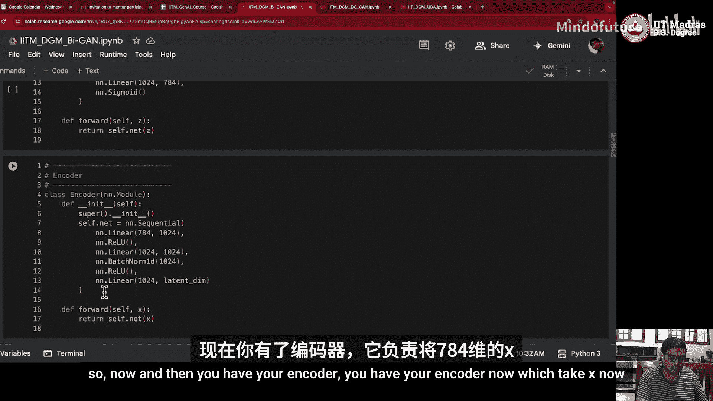

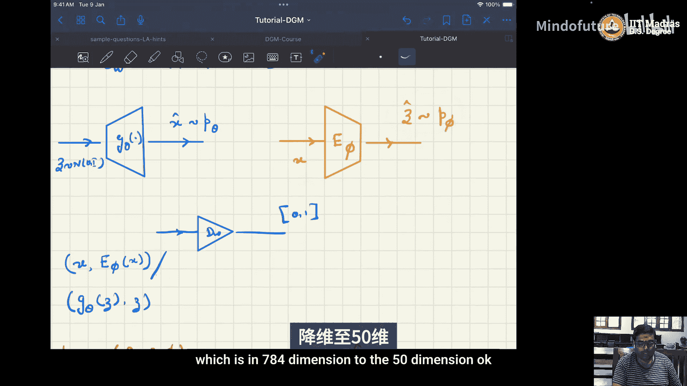

### 2. 网络结构定义

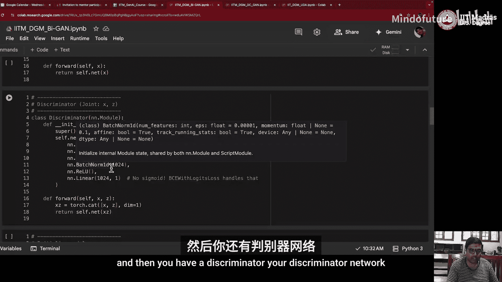

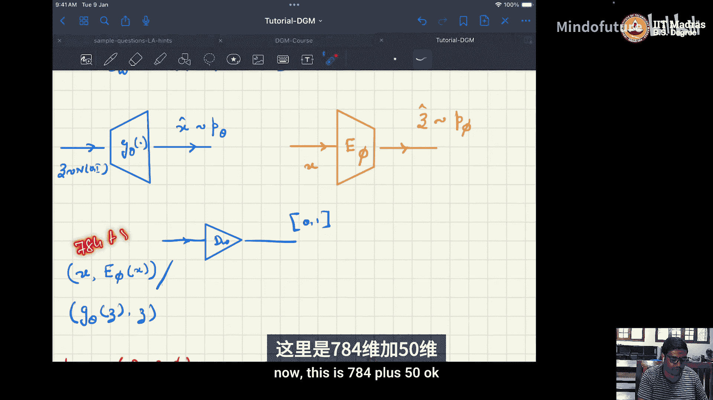

接下来，我们定义生成器、编码器和判别器网络。

**生成器网络**：将潜在向量转换为图像。
```python
class Generator(nn.Module):
    def __init__(self, latent_dim):
        super(Generator, self).__init__()
        self.model = nn.Sequential(
            nn.Linear(latent_dim, 256),
            nn.ReLU(),
            nn.Linear(256, 512),
            nn.ReLU(),
            nn.Linear(512, 784), # MNIST图像展平后为28*28=784
            nn.Tanh() # 输出值归一化到[-1, 1]
        )
    def forward(self, z):
        return self.model(z)
```

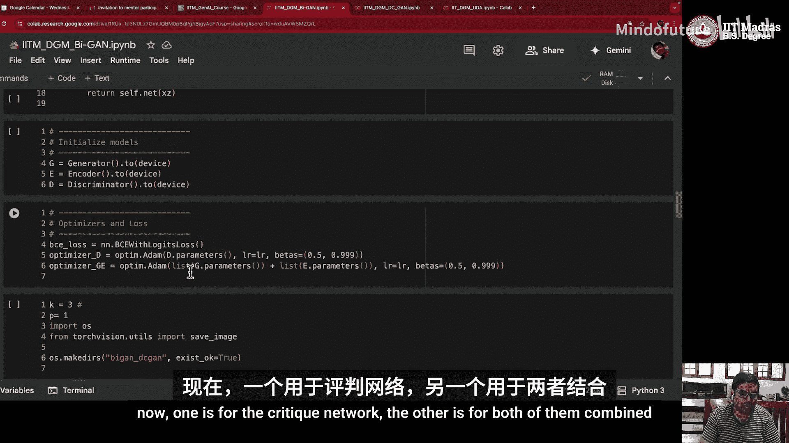

**编码器网络**：将图像编码为潜在向量。
```python
class Encoder(nn.Module):
    def __init__(self, latent_dim):
        super(Encoder, self).__init__()
        self.model = nn.Sequential(
            nn.Linear(784, 512),
            nn.ReLU(),
            nn.Linear(512, 256),
            nn.ReLU(),
            nn.Linear(256, latent_dim)
        )
    def forward(self, x):
        return self.model(x)
```

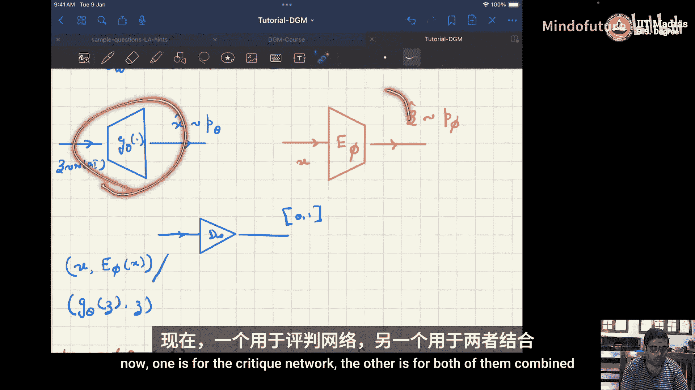

**判别器网络**：接收图像和潜在向量的拼接，判断其来源。
```python
class Discriminator(nn.Module):
    def __init__(self, latent_dim):
        super(Discriminator, self).__init__()
        # 输入维度：图像(784) + 潜在向量(latent_dim)
        input_dim = 784 + latent_dim
        self.model = nn.Sequential(
            nn.Linear(input_dim, 512),
            nn.ReLU(),
            nn.Linear(512, 256),
            nn.ReLU(),
            nn.Linear(256, 1),
            nn.Sigmoid() # 输出一个概率值
        )
    def forward(self, x, z):
        # 将图像x和潜在向量z在特征维度上拼接
        input_vec = torch.cat([x, z], dim=1)
        return self.model(input_vec)
```

### 3. 模型、损失函数与优化器实例化

以下是初始化模型和优化器的步骤。
```python
# 实例化网络
G = Generator(latent_dim).to(device)
E = Encoder(latent_dim).to(device)
D = Discriminator(latent_dim).to(device)


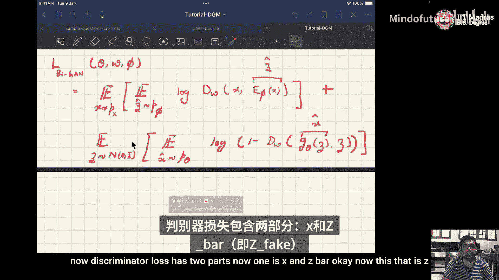

# 损失函数：二元交叉熵
criterion = nn.BCELoss()

# 优化器
# 判别器优化器
d_optimizer = optim.Adam(D.parameters(), lr=learning_rate, betas=(0.5, 0.999))
# 生成器和编码器共享一个优化器
ge_optimizer = optim.Adam(list(G.parameters()) + list(E.parameters()), lr=learning_rate, betas=(0.5, 0.999))
```

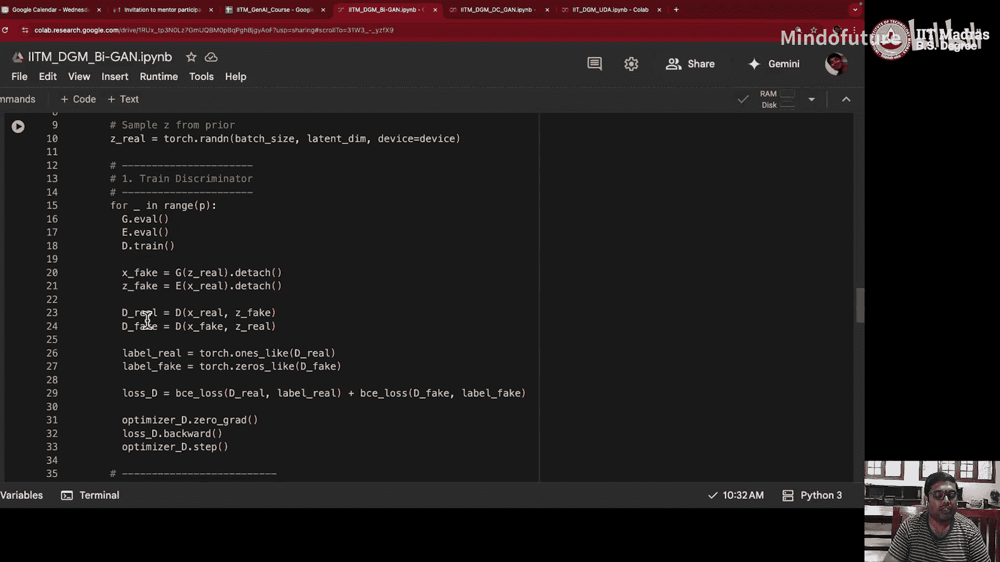

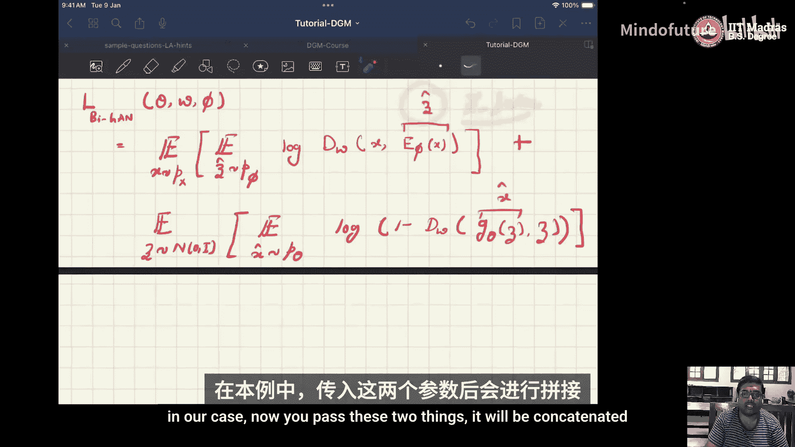

### 4. 训练循环

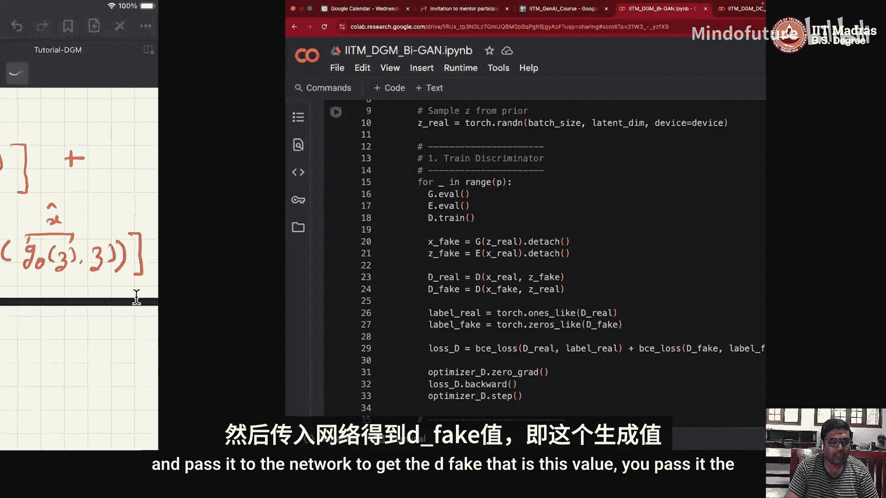

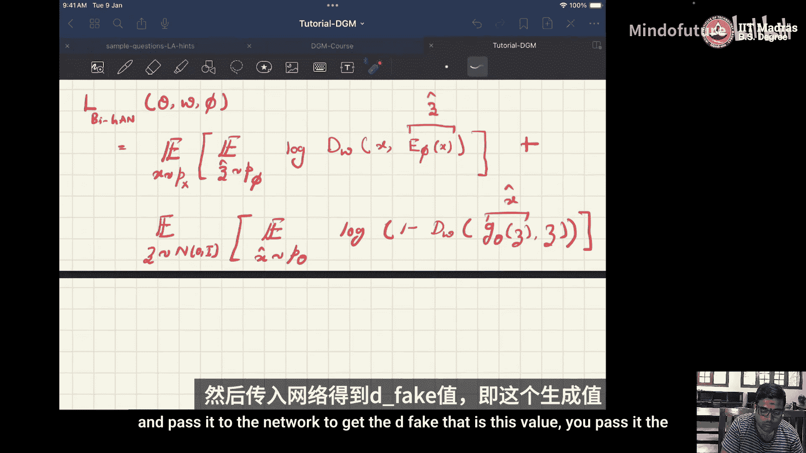

训练过程分为两步：先训练判别器，再训练生成器和编码器。

```python
for epoch in range(epochs):
    for i, (real_imgs, _) in enumerate(train_loader):
        # 将真实图像转移到设备并展平
        real_imgs = real_imgs.view(-1, 784).to(device)
        batch_size = real_imgs.size(0)

        # 创建标签
        real_labels = torch.ones(batch_size, 1).to(device)
        fake_labels = torch.zeros(batch_size, 1).to(device)

        # ---------------------
        #  训练判别器 (D)
        # ---------------------
        D.train()
        G.eval()
        E.eval()

        d_optimizer.zero_grad()

        # 来自真实数据的损失
        z_fake = E(real_imgs) # 编码器为真实图像生成潜在向量
        d_real_output = D(real_imgs, z_fake.detach()) # 判别器判断(真实图像, 编码向量)
        d_real_loss = criterion(d_real_output, real_labels)

        # 来自生成数据的损失
        z_real = torch.randn(batch_size, latent_dim).to(device) # 随机潜在向量
        fake_imgs = G(z_real) # 生成器生成图像
        d_fake_output = D(fake_imgs.detach(), z_real) # 判别器判断(生成图像, 原始向量)
        d_fake_loss = criterion(d_fake_output, fake_labels)

        # 总判别器损失及反向传播
        d_loss = d_real_loss + d_fake_loss
        d_loss.backward()
        d_optimizer.step()

        # -----------------------------
        #  训练生成器与编码器 (G & E)
        # -----------------------------
        D.eval()
        G.train()
        E.train()

        ge_optimizer.zero_grad()

        # 生成器与编码器的对抗损失
        # 目标：让判别器将生成数据对判断为“真实”
        z_real_ge = torch.randn(batch_size, latent_dim).to(device)
        fake_imgs_ge = G(z_real_ge)
        z_fake_ge = E(fake_imgs_ge)
        d_output_fake = D(fake_imgs_ge, z_fake_ge)
        g_loss = criterion(d_output_fake, real_labels) # 希望判别器输出1

        # 编码器的重构一致性损失（可选，可增强稳定性）
        # 目标：让编码器对生成图像编码后，得到的向量接近原始输入向量
        consistency_loss = nn.MSELoss()(z_fake_ge, z_real_ge)
        total_ge_loss = g_loss + 0.5 * consistency_loss # 加权求和

        total_ge_loss.backward()
        ge_optimizer.step()

        # 打印训练信息
        if i % 200 == 0:
            print(f"Epoch [{epoch}/{epochs}], Step [{i}/{len(train_loader)}], "
                  f"D Loss: {d_loss.item():.4f}, G&E Loss: {total_ge_loss.item():.4f}")
```

### 5. 生成样本

训练完成后，我们可以使用生成器从随机噪声中创建新的图像。
```python
# 切换到评估模式
G.eval()
with torch.no_grad():
    # 生成随机噪声
    sample_z = torch.randn(16, latent_dim).to(device)
    # 生成图像
    generated_imgs = G(sample_z).view(-1, 1, 28, 28).cpu()
    # 此时 generated_imgs 可以用于可视化
```

## 总结 📝

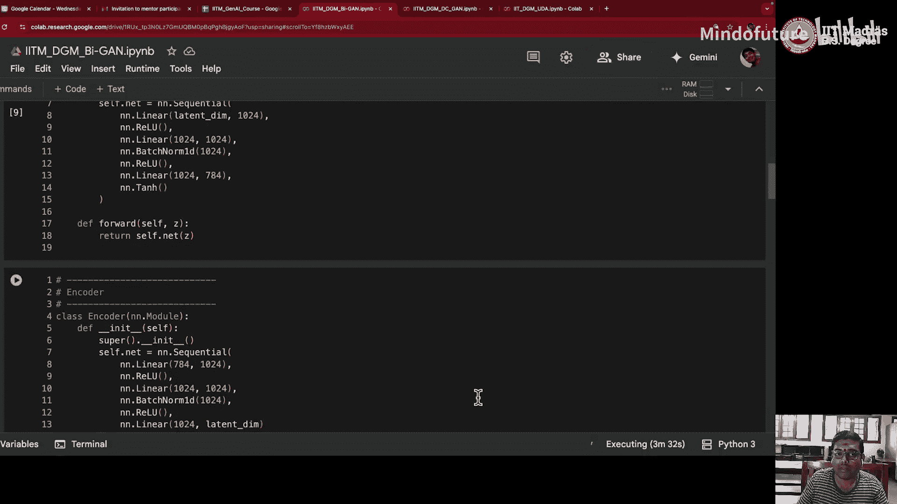


本节课中我们一起学习了双向生成对抗网络（Bi-GAN）的原理与实现。我们首先回顾了标准GAN的局限性，然后重点介绍了Bi-GAN如何通过引入一个编码器网络来实现数据空间与潜在空间的双向映射。我们详细剖析了其目标函数，并一步步完成了从网络定义、损失计算到训练循环的完整PyTorch代码实现。Bi-GAN的核心优势在于其编码器能够学习有意义的潜在表示，为图像编辑、插值等任务奠定了基础。