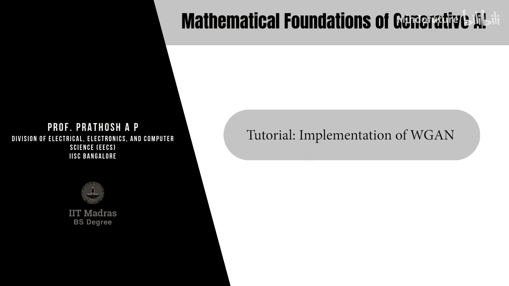
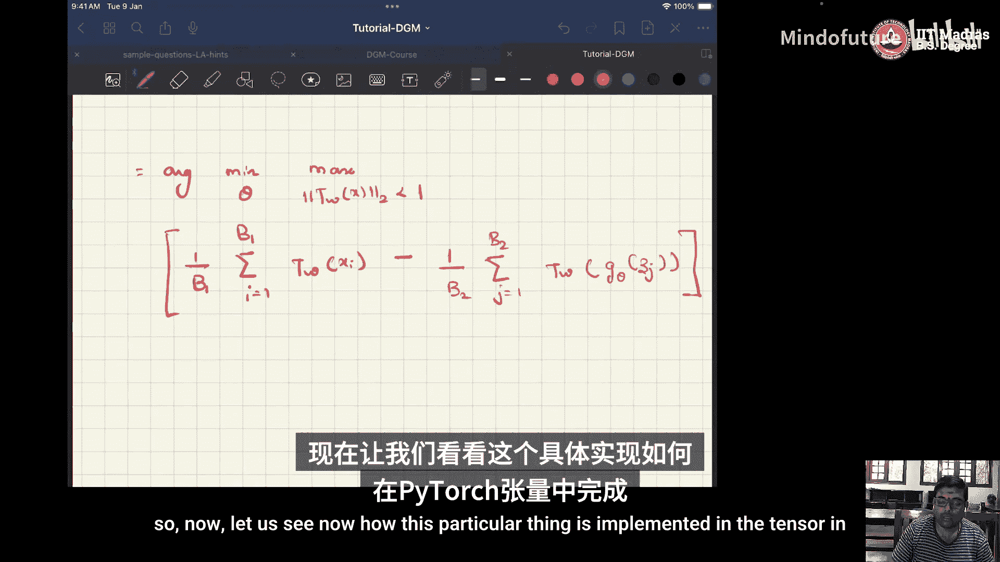
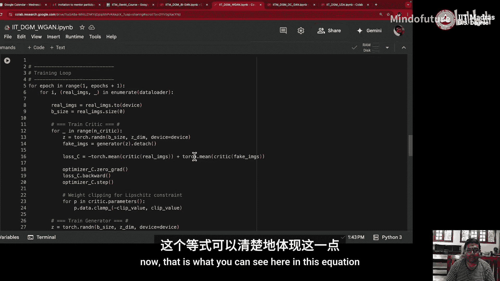
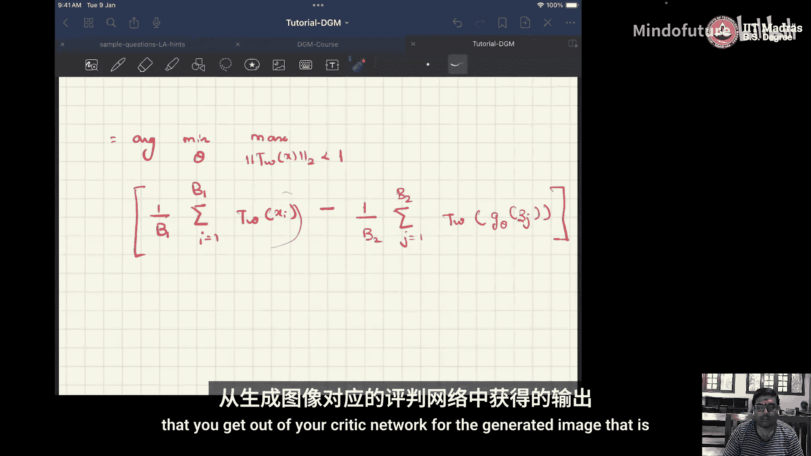
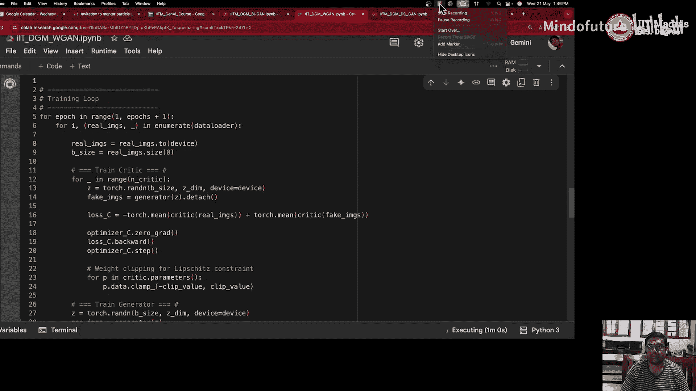

# 024：WGAN的实现 🚀



在本教程中，我们将学习如何用代码实现Wasserstein GAN。我们将从理解Wasserstein距离的核心概念开始，然后逐步构建并解释一个完整的PyTorch实现。

## 概述

在之前的课程中，我们学习了训练传统GAN时可能遇到的鞍点问题和梯度饱和问题。为了解决这些问题，我们引入了Wasserstein GAN。WGAN使用Wasserstein距离（也称为Earth Mover‘s Distance）作为损失函数，从而提供了更稳定的训练过程。本节中，我们将深入探讨Wasserstein距离的数学定义，并动手实现一个WGAN模型。

## Wasserstein距离（Earth Mover‘s Distance）📏

为了理解WGAN，我们首先需要理解其核心度量——Wasserstein距离。它衡量的是将一个概率分布“移动”成另一个概率分布所需的最小“工作量”。

### 数学定义

考虑两个连续的概率分布 \( P_X \) 和 \( P_{\hat{X}} \)。它们之间的Wasserstein距离定义为：

\[
W(P_X, P_{\hat{X}}) = \inf_{\gamma \in \Pi(P_X, P_{\hat{X}})} \mathbb{E}_{(x, \hat{x}) \sim \gamma} [\|x - \hat{x}\|]
\]

其中：
*   \( \Pi(P_X, P_{\hat{X}}) \) 是所有联合分布 \( \gamma(x, \hat{x}) \) 的集合，这些联合分布的边缘分布分别是 \( P_X \) 和 \( P_{\hat{X}} \)。即：
    \[
    \int \gamma(x, \hat{x}) d\hat{x} = P_X(x) \quad \text{和} \quad \int \gamma(x, \hat{x}) dx = P_{\hat{X}}(\hat{x})
    \]
*   \( \inf \) 表示下确界（最小值）。
*   这个公式可以理解为：在所有将质量从 \( P_X \) “运输”到 \( P_{\hat{X}} \) 的“运输方案” \( \gamma \) 中，找到总运输成本（距离的期望）最小的那个方案。

### 离散化示例

为了更直观地理解，我们来看一个离散分布的例子。

假设有两个离散分布 \( P_X \) 和 \( P_{\hat{X}} \)，它们的支撑点都是 {1, 2, 3, 4}。

*   \( P_X \) 的概率质量： [0.4, 0.3, 0.2, 0.1]
*   \( P_{\hat{X}} \) 的概率质量： [0.1, 0.2, 0.3, 0.4]

我们的目标是找到将 \( P_X \) 重新分配成 \( P_{\hat{X}} \) 的最小成本方案。一个可能的“运输方案”（运输矩阵）如下所示：

| 从\到 | \(\hat{X}_1\) (0.1) | \(\hat{X}_2\) (0.2) | \(\hat{X}_3\) (0.3) | \(\hat{X}_4\) (0.4) | **行和 (P_X)** |
| :--- | :---: | :---: | :---: | :---: | :---: |
| **\(X_1\) (0.4)** | 0.1 | 0.2 | 0.1 | 0.0 | **0.4** |
| **\(X_2\) (0.3)** | 0.0 | 0.0 | 0.2 | 0.1 | **0.3** |
| **\(X_3\) (0.2)** | 0.0 | 0.0 | 0.0 | 0.2 | **0.2** |
| **\(X_4\) (0.1)** | 0.0 | 0.0 | 0.0 | 0.1 | **0.1** |
| **列和 (P_{\hat{X}})** | **0.1** | **0.2** | **0.3** | **0.4** | **1.0** |

在这个矩阵中，每个单元格 \( \lambda_{ij} \) 表示从 \( X_i \) 移动到 \( \hat{X}_j \) 的质量。矩阵的**行和**必须等于 \( P_X \) 的原始质量，**列和**必须等于目标分布 \( P_{\hat{X}} \) 的质量。这就是“边缘化”约束。

Wasserstein距离就是所有满足此约束的运输方案中，计算 \( \sum_{i,j} \lambda_{ij} \cdot \|X_i - \hat{X}_j\| \) 并取最小值。

## WGAN的损失函数 ⚖️

理解了Wasserstein距离后，我们来看WGAN的损失函数。根据Kantorovich-Rubinstein对偶性，Wasserstein距离可以转化为一个最大化问题。WGAN的损失函数定义如下：

\[
\min_{G} \max_{D \in \mathcal{D}} \mathbb{E}_{x \sim P_{data}}[D(x)] - \mathbb{E}_{z \sim P_{z}}[D(G(z))]
\]

其中：
*   \( G \) 是生成器，\( z \) 来自先验分布（如标准正态分布 \( \mathcal{N}(0, I) \)）。
*   \( D \) 是判别器（在WGAN中常称为Critic评论家）。关键区别在于，\( D \) 的输出不再是一个概率，而是一个分数，用于衡量输入图像的真实性。
*   \( \mathcal{D} \) 是所有1-Lipschitz函数的集合。这个约束保证了 \( D \) 的梯度不会过大，是Wasserstein距离对偶形式成立的条件。

在实践中，我们通过**权重裁剪（Weight Clipping）** 来近似实现1-Lipschitz约束，即将Critic网络的所有参数 \( w \) 限制在某个区间内，例如 \([-c, c]\)。

在代码中，对于一批次数据，损失函数具体计算为：

**Critic损失（最大化）**：
\[
L_{critic} = \frac{1}{B_1} \sum_{i=1}^{B_1} D(x^{(i)}) - \frac{1}{B_2} \sum_{j=1}^{B_2} D(G(z^{(j)}))
\]
我们通过**最小化** \( -L_{critic} \) 来更新Critic的参数。

**生成器损失（最小化）**：
\[
L_{generator} = -\frac{1}{B_2} \sum_{j=1}^{B_2} D(G(z^{(j)}))
\]
即，生成器希望它生成的图像能获得Critic给出的高分。

## PyTorch代码实现 🛠️

上一节我们介绍了WGAN的理论基础，本节中我们来看看如何用PyTorch实现它。以下是实现的关键步骤和代码解析。

### 1. 导入库与设置参数

首先，导入必要的PyTorch模块并设置训练超参数。




```python
import torch
import torch.nn as nn
import torch.optim as optim
from torchvision import datasets, transforms
from torch.utils.data import DataLoader
import os

# 设备配置
device = torch.device(‘cuda‘ if torch.cuda.is_available() else ‘cpu‘)

# 超参数
batch_size = 128
epochs = 20
lr = 1e-4
n_critic = 5  # 每训练一次生成器，训练Critic的次数
clip_value = 0.01  # 权重裁剪值
image_size = 28
channels = 1
latent_dim = 128

# 数据转换
transform = transforms.Compose([
    transforms.ToTensor(),
    transforms.Normalize((0.5,), (0.5,))  # 将图像像素值归一化到[-1, 1]
])

# 加载MNIST数据集
dataset = datasets.MNIST(root=‘./data‘, train=True, transform=transform, download=True)
dataloader = DataLoader(dataset, batch_size=batch_size, shuffle=True)
```

### 2. 构建生成器网络

生成器将随机噪声向量 `z` 转换为图像。我们使用转置卷积层进行上采样。

```python
class Generator(nn.Module):
    def __init__(self, latent_dim, channels):
        super(Generator, self).__init__()
        self.init_size = image_size // 4
        self.fc = nn.Linear(latent_dim, 128 * self.init_size ** 2)

        self.conv_blocks = nn.Sequential(
            nn.BatchNorm2d(128),
            nn.Upsample(scale_factor=2),
            nn.Conv2d(128, 128, 3, stride=1, padding=1),
            nn.BatchNorm2d(128, 0.8),
            nn.LeakyReLU(0.2, inplace=True),
            nn.Upsample(scale_factor=2),
            nn.Conv2d(128, 64, 3, stride=1, padding=1),
            nn.BatchNorm2d(64, 0.8),
            nn.LeakyReLU(0.2, inplace=True),
            nn.Conv2d(64, channels, 3, stride=1, padding=1),
            nn.Tanh()  # 输出值在[-1, 1]之间
        )

    def forward(self, z):
        out = self.fc(z)
        out = out.view(out.shape[0], 128, self.init_size, self.init_size)
        img = self.conv_blocks(out)
        return img
```

### 3. 构建Critic网络

Critic网络接收图像并输出一个分数。注意，它**不使用Sigmoid激活函数**，并且我们使用LeakyReLU。

```python
class Critic(nn.Module):
    def __init__(self, channels):
        super(Critic, self).__init__()

        def critic_block(in_filters, out_filters, bn=True):
            block = [nn.Conv2d(in_filters, out_filters, 3, 2, 1),
                     nn.LeakyReLU(0.2, inplace=True),
                     nn.Dropout2d(0.25)]
            if bn:
                block.append(nn.BatchNorm2d(out_filters, 0.8))
            return block

        self.model = nn.Sequential(
            *critic_block(channels, 16, bn=False),
            *critic_block(16, 32),
            *critic_block(32, 64),
            *critic_block(64, 128),
        )

        # 输出层：将特征图展平后通过一个线性层输出一个分数
        self.adv_layer = nn.Linear(128 * 2 * 2, 1)  # 经过4次stride=2，28x28 -> 2x2

    def forward(self, img):
        out = self.model(img)
        out = out.view(out.shape[0], -1)
        validity = self.adv_layer(out)
        return validity
```

### 4. 初始化模型与优化器

```python
# 初始化生成器和Critic
generator = Generator(latent_dim, channels).to(device)
critic = Critic(channels).to(device)

# 使用RMSprop优化器（原论文推荐）
optimizer_G = optim.RMSprop(generator.parameters(), lr=lr)
optimizer_C = optim.RMSprop(critic.parameters(), lr=lr)
```

### 5. 训练循环



以下是训练过程的核心循环，它体现了WGAN与原始GAN在训练步骤上的主要区别。



```python
for epoch in range(epochs):
    for i, (imgs, _) in enumerate(dataloader):

        # 配置输入
        real_imgs = imgs.to(device)

        # ---------------------
        #  训练 Critic (判别器)
        # ---------------------
        optimizer_C.zero_grad()

        # 从先验分布采样噪声
        z = torch.randn(imgs.shape[0], latent_dim).to(device)
        # 生成假图像
        fake_imgs = generator(z).detach()  # 阻断梯度流向生成器

        # 计算Critic的损失
        loss_critic = -torch.mean(critic(real_imgs)) + torch.mean(critic(fake_imgs))

        # 反向传播并优化
        loss_critic.backward()
        optimizer_C.step()

        # 权重裁剪：强制实施Lipschitz约束
        for p in critic.parameters():
            p.data.clamp_(-clip_value, clip_value)

        # -----------------
        #  训练生成器
        # -----------------
        # 每训练 n_critic 次 Critic，训练一次生成器
        if i % n_critic == 0:
            optimizer_G.zero_grad()

            # 在新的噪声上训练生成器
            gen_imgs = generator(z)
            # 生成器希望Critic对假图像打高分
            loss_generator = -torch.mean(critic(gen_imgs))

            loss_generator.backward()
            optimizer_G.step()

        # 打印训练状态
        if i % 100 == 0:
            print(f“[Epoch {epoch}/{epochs}] [Batch {i}/{len(dataloader)}] ”
                  f“[D loss: {loss_critic.item():.6f}] [G loss: {loss_generator.item():.6f}]“)

    # 每个epoch结束后，可以保存生成的图像样例
    # save_image(gen_imgs.data[:25], ‘images/%d.png‘ % epoch, nrow=5, normalize=True)
```

**关键点解析：**
1.  **Critic损失**：计算真实图像得分的负均值与假图像得分均值的和。我们通过最小化其负值来最大化原始目标。
2.  **权重裁剪**：在每次Critic参数更新后，我们将其所有参数裁剪到 `[-clip_value, clip_value]` 范围内。这是WGAN实现1-Lipschitz约束的简单而有效的方法。
3.  **生成器训练频率**：通常，Critic会比生成器训练得更频繁（例如 `n_critic=5`），以确保在更新生成器之前，Critic是一个相对较好的近似。

## 总结

在本节课中，我们一起学习了Wasserstein GAN的实现。我们从Wasserstein距离的直观概念和数学定义出发，理解了它如何解决传统GAN训练不稳定的问题。然后，我们详细剖析了WGAN的损失函数及其对偶形式，并重点强调了1-Lipschitz约束的重要性及其通过权重裁剪的实现方式。




最后，我们一步步实现了一个用于MNIST数据集的WGAN PyTorch模型，涵盖了网络结构定义、损失计算、权重裁剪以及交替训练的关键循环。通过本教程，你应该能够掌握WGAN的核心思想，并具备动手实现一个基本WGAN的能力。在后续的探索中，你可以尝试改进权重裁剪（如使用梯度惩罚WGAN-GP），或将模型应用于更复杂的数据集。