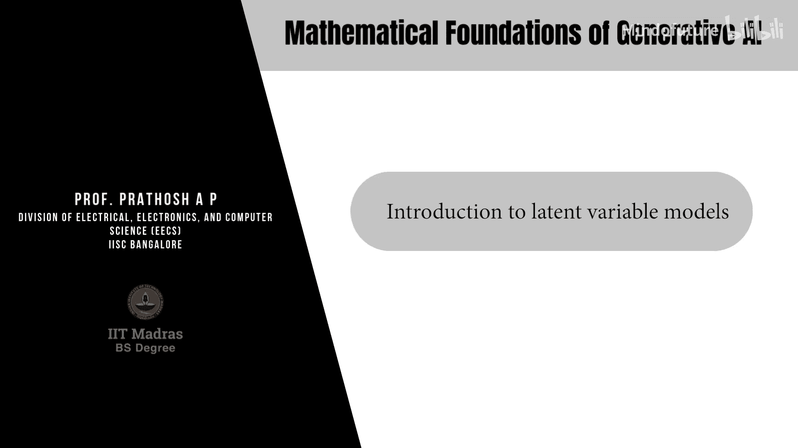

# 025：潜在变量模型介绍 🧠

在本节课中，我们将学习生成式模型的另一个重要家族——潜在变量模型。我们将定义什么是潜在变量模型，并探讨其学习的一般原理。著名的变分自编码器和扩散模型都属于这个家族。

## 什么是潜在变量模型？

假设我们有一组数据向量，它们根据一个未知的底层分布 **P** 独立同分布地抽取。在生成式建模中，我们通常用一个由参数 **θ** 参数化的模型分布 **P_θ** 来近似这个真实分布。

在生成对抗网络中，**P_θ** 被隐式地建模为生成器网络输出的分布。而在潜在变量模型中，定义有所不同。

**定义**：一个潜在变量模型
在潜在变量模型中，模型分布 **P_θ(x)** 被定义为数据变量 **x** 与潜在变量 **z** 的联合分布的边缘分布。具体公式如下：

- 当 **z** 是离散变量时：**P_θ(x) = Σ_z P_θ(x, z)**
- 当 **z** 是连续变量时：**P_θ(x) = ∫ P_θ(x, z) dz**

这里的 **z** 被称为**潜在**、**隐藏**或**未观测**的随机变量。它的关键特征在于，我们收集的数据只来自变量 **x**，而 **z** 是完全不被观测到的。

从直观上理解，**z** 代表了与每个数据点相关的额外信息。例如，如果 **x** 是图像，那么 **z** 可以表示图像中物体的方向、大小或数量等特征。从数学构造上讲，这个隐藏变量被引入建模框架，用以表示数据中未被直接观测到的某些特征或信息。

上述求和或积分操作在概率论中称为**边缘化**：对两个随机变量的联合分布，通过对其中一个变量求和或积分，可以得到另一个变量的分布。

## 潜在变量模型的学习

在潜在变量模型中，我们不仅需要估计模型参数 **θ**，还需要联合估计潜在变量 **z** 的分布。对于数据集中的每个数据点 **x_i**，我们都假设存在一个对应的潜在变量实例 **z_i**。

引入这个额外的随机变量有两个主要好处：首先，它可以使数学上的学习过程变得可行或更容易；其次，它能提供关于数据的丰富信息。

## 潜在变量模型的类型与示例

潜在变量可以根据其性质分为离散型和连续型，这决定了模型的不同用途。

### 示例1：离散潜在变量

当潜在变量 **z** 是离散的，意味着它可以取 **M** 个可能值中的一个。数据变量 **x** 通常是连续的（例如在 **R^D** 中）。

在这种情况下，对于每个数据点 **x_i**，其对应的潜在变量 **z_i** 会将它分配到 **M** 个类别中的一个。这实质上是一种**聚类**或**无监督分类**。

以下是此类模型的例子：
*   **高斯混合模型**： 将数据建模为多个高斯分布的混合，每个分布对应一个潜在的类别。
*   **K均值聚类**： 一种将数据划分到K个簇的经典算法。

因此，具有离散潜在空间的潜在变量模型可用于将数据自动分类到不同的组别中。

### 示例2：连续潜在变量

当潜在变量 **z** 也是连续的（例如在 **R^K** 中），情况则不同。

在这种情况下，对于每个数据点 **x_i**，其对应的潜在变量 **z_i** 代表了一个**特征向量**。通常，潜在空间的维度 **K** 远小于数据空间的维度 **D**。因此，**z_i** 可以被视为高维数据 **x_i** 的一个**低维表示**或**编码**。

**自编码器**就是这类模型的一个典型例子。它通过学习将数据压缩到低维潜在空间，然后再重建回来，从而学习数据的有效表示。

## 潜在变量模型作为生成模型

除了用于特征提取或聚类，大多数潜在变量模型也可以直接用作**生成模型**。这正是本课程关注的重点。

作为生成模型，潜在变量模型的工作流程通常是：先从潜在变量的先验分布中采样一个 **z**，然后通过条件分布 **P_θ(x|z)** 生成数据 **x**。寻找给定数据对应的潜在特征，反而成了生成建模过程中的一个副产品。

## 总结

本节课我们一起学习了潜在变量模型的基础概念。我们了解到，潜在变量模型通过引入一个未观测的隐藏变量 **z** 来定义数据分布 **P_θ(x)**。根据 **z** 是离散还是连续，模型可以分别应用于数据聚类或降维与特征提取。更重要的是，这个框架天然支持生成建模，为我们接下来深入学习变分自编码器和扩散模型奠定了重要的理论基础。