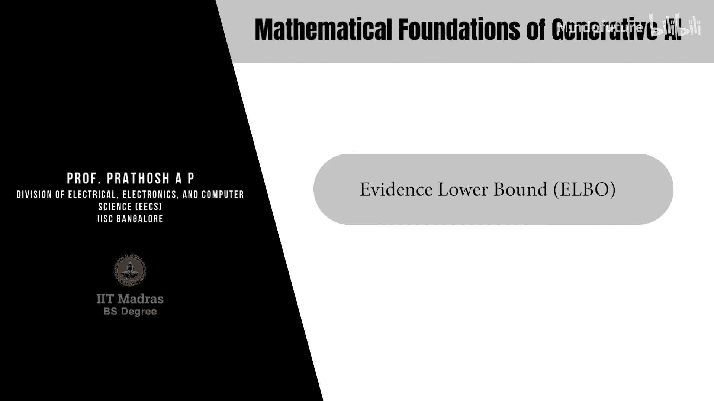

生成式AI的数学基础：P26：证据下界（ELBO）

在本节课中，我们将学习构建潜变量模型的通用原理，并重点介绍一个核心概念——证据下界（ELBO）。我们将看到，如何通过最大化ELBO来近似解决潜变量模型中的最大似然估计问题。

---

### 潜变量模型的学习原理

上一节我们介绍了潜变量模型的基本概念。本节中，我们来看看如何学习一个潜变量模型。我们将要介绍的原理是一个通用原理，适用于从高斯混合模型（GMM）到扩散模型在内的所有潜变量模型类别。

假设我们拥有数据 **D**，这些数据是从一个未知的真实数据分布 **P(x)** 中采样得到的。我们有一个参数为 **θ** 的潜变量模型 **P_θ**。为简化数学表达，我们假设潜变量 **Z** 是连续的，但所有推导同样适用于离散潜变量。

潜变量模型定义了观测变量 **X** 与潜变量 **Z** 的联合分布 **P_θ(x, z)**。我们的目标，是找到能够最好地拟合数据 **D** 的模型参数 **θ**。

### 从最小化KL散度到最大似然估计

我们通常通过最小化分布间的KL散度来估计参数。具体来说，我们希望最小化真实分布 **P(x)** 与模型分布 **P_θ(x)** 之间的KL散度：

**目标：min_θ KL( P(x) || P_θ(x) )**

根据KL散度的定义，我们可以将其展开：

**KL( P(x) || P_θ(x) ) = ∫ P(x) log[ P(x) / P_θ(x) ] dx = H(P) - ∫ P(x) log P_θ(x) dx**

其中，**H(P)** 是数据分布的熵，与参数 **θ** 无关。因此，最小化KL散度等价于最大化 **∫ P(x) log P_θ(x) dx**，即最大化 **log P_θ(x)** 在真实数据分布 **P(x)** 下的期望值。

**log P_θ(x)** 被称为**对数似然函数**。因此，这个估计参数的过程被称为**最大似然估计（MLE）**。我们可以利用从 **P(x)** 中采样的数据，通过大数定律来近似计算这个期望。

### 潜变量模型中的似然计算挑战

在潜变量模型中，观测数据的边际似然 **P_θ(x)** 需要通过积分（或求和）潜变量得到：

**P_θ(x) = ∫ P_θ(x, z) dz**

因此，我们的对数似然函数 **L(θ)** 变为：

**L(θ) = log P_θ(x) = log ∫ P_θ(x, z) dz**

这里出现了一个问题：我们需要对 **log** 函数内部的**积分（期望）** 进行优化。直接估计“对数的期望”在统计上非常困难，因为我们无法简单地将采样平均移到对数外面。

### 引入变分分布与Jensen不等式

为了处理这个“log-of-integral”的形式，我们引入一个任意的关于潜变量 **Z** 的分布 **Q(z|x)**，称为**变分分布**。我们在积分中乘除这个分布：

**L(θ) = log ∫ Q(z|x) * [ P_θ(x, z) / Q(z|x) ] dz**

现在，积分内部可以看作是函数 **g(z) = P_θ(x, z) / Q(z|x)** 在分布 **Q(z|x)** 下的期望。因此：

**L(θ) = log E_{z~Q(z|x)} [ P_θ(x, z) / Q(z|x) ]**

接下来，我们应用**Jensen不等式**。由于 **log** 函数是凹函数，根据Jensen不等式，“期望的对数”大于等于“对数的期望”：

**log E[·] ≥ E[ log(·) ]**

将此不等式应用于我们的似然函数，我们得到：

**L(θ) ≥ E_{z~Q(z|x)} [ log( P_θ(x, z) / Q(z|x) ) ]**

### 证据下界（ELBO）的定义

不等式右侧的项，即为**证据下界（Evidence Lower BOund, ELBO）**，记作 **J(θ, Q)**：

**ELBO: J(θ, Q) = E_{z~Q(z|x)} [ log P_θ(x, z) - log Q(z|x) ]**

在贝叶斯框架中，数据 **x** 的似然 **P_θ(x)** 被称为“证据”。ELBO是这个证据的一个**下界**。通过最大化这个下界，我们间接地最大化了证据（似然）本身。

重要的是，ELBO是模型参数 **θ** 和变分分布 **Q(z|x)** 的**联合函数**。**Q(z|x)** 通常被称为**变分后验分布**，因为它近似了真实但难以计算的后验分布 **P_θ(z|x)**。

### 最终优化问题

因此，原始的、难以直接求解的最大似然估计问题：

**原始问题：max_θ L(θ) = max_θ log P_θ(x)**

被转化为一个可以迭代优化的近似问题：

**近似问题：max_{θ, Q} J(θ, Q) = max_{θ, Q} E_{z~Q(z|x)} [ log P_θ(x, z) - log Q(z|x) ]**

这个优化问题涉及两个部分：
1.  优化模型参数 **θ**，以更好地生成数据。
2.  优化变分分布 **Q(z|x)**，以更紧地逼近证据下界，从而更准确地近似真实后验。

---

本节课中我们一起学习了构建潜变量模型的通用学习框架。我们了解到，直接最大化边际似然是困难的，因此我们引入了变分分布 **Q(z|x)** 并利用Jensen不等式，构造出了证据下界（ELBO）。最终，我们通过**联合优化模型参数 θ 和变分分布 Q** 来最大化ELBO，从而近似地实现最大似然估计。这个 **max_{θ, Q} ELBO** 的公式，是变分自编码器（VAE）、扩散模型等众多生成式AI模型的共同数学基础。