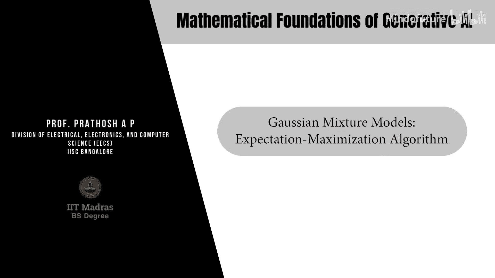

# 027：高斯混合模型与期望最大化算法

在本节课中，我们将学习生成式AI中一个核心的数学工具——期望最大化算法，并以高斯混合模型为例，展示如何利用该算法学习潜变量模型的参数。我们将理解为什么直接优化某些模型的对数似然函数是困难的，以及如何通过优化其下界来解决问题。

## 概述

上一节我们介绍了潜变量模型的基本概念和证据下界。本节中，我们来看看如何通过期望最大化算法，具体地求解一个经典的潜变量模型——高斯混合模型。

## 潜变量模型与优化目标

首先，让我们快速回顾一下核心思想。我们从潜变量模型开始，该模型定义为观测数据变量 **x** 和某个未观测的潜变量 **z** 的联合分布或边际分布。我们的目标是找到参数 **θ**，以最小化真实数据分布 **p(x)** 与模型分布 **p_θ(x)** 之间的KL散度。这等价于最大化数据的期望对数似然。

然而，由于我们不知道潜变量 **z** 的具体取值，目标是在学习模型参数的同时，也学习潜变量 **z** 的分布。我们引入 **q(z|x)** 作为给定 **x** 时潜变量 **z** 的密度函数。

我们从想要优化的对数似然函数开始：
`log p_θ(x) = log ∫ p_θ(x, z) dz`

由于对数内部是期望，难以直接计算，我们利用琴生不等式构造了对数似然的一个下界，称为证据下界：
`ELBO = E_{z~q(z|x)}[log (p_θ(x, z) / q(z|x))]`

现在，我们不再直接最大化对数似然，而是最大化这个下界。证据下界是模型参数 **θ** 和潜变量分布 **q(z|x)** 的函数。因此，我们需要同时找出最优的 **θ** 和 **q(z|x)**。

## 期望最大化算法

一个自然的问题是，最大化目标函数的下界是最优的吗？答案是否定的，但这通常是可行的。可以证明，使用一种称为期望最大化的特定算法来优化这个下界，能够保证我们希望优化的似然函数值不会下降。不过，这不能保证达到全局最优。然而，对于潜变量模型，我们无法直接优化对数似然，因此优化其下界是必要的途径。

在任何潜变量生成模型中，我们都要解决以下优化问题：
**找到 θ 和 q，以最大化证据下界 ELBO。**

解决这个问题的方式在不同模型中有所不同。接下来，我们看一个来自经典机器学习的例子。

## 高斯混合模型示例

高斯混合模型是一个具有离散潜空间的潜变量模型。这意味着潜变量 **z** 可以取 M 个值中的一个。

在GMM中，模型分布 **p_θ(x)** 定义为：
`p_θ(x) = Σ_{j=1}^{M} p_θ(z=j) * p_θ(x | z=j)`

其中：
*   `p_θ(z=j)` 是潜变量取第 j 个值的先验概率，我们记作 **α_j**。
*   `p_θ(x | z=j)` 是给定潜变量取值 j 时，数据 **x** 的条件分布，我们将其建模为高斯分布：`N(x; μ_j, Σ_j)`。

因此，GMM的完整形式是：
`p_θ(x) = Σ_{j=1}^{M} α_j * N(x; μ_j, Σ_j)`

每个数据点 **x** 的似然是多个高斯分布的线性组合。模型的参数 **θ** 包括：所有混合权重 **{α_1, ..., α_M}**，所有均值向量 **{μ_1, ..., μ_M}**，以及所有协方差矩阵 **{Σ_1, ..., Σ_M}**。其中，α_j 在0和1之间，且总和为1。

我们的目标是通过优化ELBO来估计这些参数。

## EM算法迭代过程

如何优化同时关于 **θ** 和 **q** 的ELBO呢？一种有效的方法是使用迭代算法，交替固定其中一个变量，优化另一个变量。这个算法就是期望最大化算法。

算法步骤如下：
1.  随机初始化参数 **θ^(0)** 和分布 **q^(0)**。
2.  对于迭代次数 t = 0, 1, 2, ...：
    *   **E步（期望步）**：固定当前参数 **θ^(t)**，找到能最大化ELBO的潜变量分布 **q^(t+1)**。
    *   **M步（最大化步）**：固定刚找到的分布 **q^(t+1)**，找到能最大化ELBO的模型参数 **θ^(t+1)**。

可以证明，按照EM算法迭代，数据的对数似然值 `log p_θ(x)` 不会下降。

## GMM中EM步骤的具体形式

对于高斯混合模型，E步和M步有解析解。

**E步**：在固定参数 **θ** 的情况下，最大化ELBO的最优 **q(z|x)** 恰好是模型的后验分布 `p_θ(z|x)`。根据贝叶斯定理：
`q*(z=j|x) = p_θ(z=j|x) = [α_j * N(x; μ_j, Σ_j)] / [Σ_{k=1}^{M} α_k * N(x; μ_k, Σ_k)]`
这计算的是数据点 **x** 属于第 j 个高斯成分的概率（即“软分配”）。

**M步**：在固定分布 **q(z|x)** 为 E 步计算的结果后，通过最大化ELBO来更新参数 **θ**。这可以通过对ELBO表达式分别关于 **α_j**, **μ_j**, **Σ_j** 求导并令导数为零来实现。

更新公式如下（假设有 N 个数据点 {x_1, ..., x_N}）：
*   **更新混合权重**：`α_j^(new) = (1/N) Σ_{i=1}^{N} q*(z_i=j | x_i)`
*   **更新均值**：`μ_j^(new) = [Σ_{i=1}^{N} q*(z_i=j | x_i) * x_i] / [Σ_{i=1}^{N} q*(z_i=j | x_i)]`
*   **更新协方差**：`Σ_j^(new) = [Σ_{i=1}^{N} q*(z_i=j | x_i) * (x_i - μ_j^(new))(x_i - μ_j^(new))^T] / [Σ_{i=1}^{N} q*(z_i=j | x_i)]`

直观上，E步计算每个数据点对每个高斯成分的“归属度”，M步则根据这个归属度重新计算每个高斯成分的参数（均值、方差）和混合权重。

## EM算法的局限与扩展

EM算法能够成功应用于GMM，关键原因在于我们可以精确计算出后验分布 `p_θ(z|x)`。然而，对于更复杂、更通用的潜变量模型（例如我们想要用强大的神经网络来表示分布），后验分布 `p_θ(z|x)` 通常是无法直接计算的。

如果 `p_θ(z|x)` 无法计算，EM算法就失效了，因为我们无法执行E步来得到最优的 **q**。

这就引出了后续课程的核心问题：**如何学习那些后验分布 `p_θ(z|x)` 未知的潜变量模型？**

像变分自编码器和扩散模型这样的神经网络生成模型，正是为了解决这个问题而设计的。它们通过使用神经网络来近似这些难以处理的分布，从而扩展了潜变量模型的学习能力。

## 总结

本节课中我们一起学习了期望最大化算法及其在高斯混合模型中的应用。我们了解到：
1.  对于包含未观测变量的模型，直接优化对数似然是困难的，因此我们转而优化其下界——证据下界。
2.  EM算法通过交替执行E步（估计潜变量分布）和M步（更新模型参数）来优化ELBO。
3.  在高斯混合模型中，E步和M步都有解析解，使得参数估计变得直接。
4.  EM算法的有效性依赖于后验分布 `p_θ(z|x)` 的可计算性。对于更复杂的模型，我们需要像VAE和扩散模型那样，采用新的方法来近似后验分布。

在接下来的模块中，我们将探讨如何使用变分自编码器来构建神经潜变量模型。