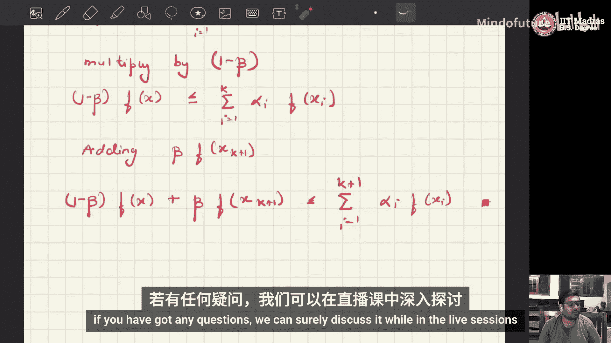

# 029：詹森不等式证明

在本节课中，我们将学习并证明詹森不等式。这个不等式是推导隐变量模型（如变分自编码器）中证据下界（ELBO）的核心数学工具。我们将从凸函数的定义开始，逐步完成离散随机变量情况下的证明。

## 凸函数定义

在证明詹森不等式之前，我们需要理解凸函数的概念。

一个函数 **f: R → R** 是凸的，如果对于定义域内任意两点 **x** 和 **y**，以及任意标量 **λ ∈ [0, 1]**，以下不等式成立：

**f(λx + (1-λ)y) ≤ λf(x) + (1-λ)f(y)**

这个定义意味着，连接函数图像上任意两点的线段，总是位于函数图像的上方（或重合）。

## 詹森不等式陈述

现在，我们来正式陈述詹森不等式。

设 **f: R → R** 是一个凸函数。设 **X** 是一个随机变量，其期望 **E[X]** 存在。那么，詹森不等式指出：

**f(E[X]) ≤ E[f(X)]**

换句话说，一个凸函数在期望值处的函数值，小于或等于该函数值的期望。

## 离散随机变量的证明

我们将针对离散随机变量 **X** 的情况进行证明。证明将采用数学归纳法。

以下是证明的步骤概述：

**基础步骤 (n=2)**
当只有两个点时，不等式直接由凸函数的定义得出。

**归纳假设**
我们假设不等式对于 **n = k** 个点成立。

**归纳步骤**
我们需要证明，在假设成立的前提下，不等式对于 **n = k+1** 个点也成立。

### 详细证明过程

设 **x₁, x₂, ..., xₙ ∈ R**，以及对应的权重 **α₁, α₂, ..., αₙ**，满足每个 **αᵢ > 0** 且它们的总和为1：**∑ᵢ αᵢ = 1**。

我们希望证明，对于凸函数 **f**，有：
**f(∑ᵢ αᵢ xᵢ) ≤ ∑ᵢ αᵢ f(xᵢ)**

**1. 基础步骤 (n=2)**
当 n=2 时，设 α₁ + α₂ = 1。根据凸函数定义：
**f(α₁ x₁ + α₂ x₂) ≤ α₁ f(x₁) + α₂ f(x₂)**
这恰好就是我们要证明的不等式形式。基础步骤成立。

**2. 归纳假设**
假设对于某个整数 **k ≥ 2**，不等式对 **n = k** 成立。即，假设对于任意满足 ∑ᵢ₌₁ᵏ αᵢ = 1 的权重，有：
**f(∑ᵢ₌₁ᵏ αᵢ xᵢ) ≤ ∑ᵢ₌₁ᵏ αᵢ f(xᵢ)**

**3. 归纳步骤 (n = k+1)**
现在考虑 **n = k+1** 的情况。我们有权重 α₁, α₂, ..., αₖ₊₁，满足 ∑ᵢ₌₁ᵏ⁺¹ αᵢ = 1。

我们进行如下操作：
*   令 **β = αₖ₊₁**。那么，剩下的权重之和为 **1 - β = ∑ᵢ₌₁ᵏ αᵢ**。
*   定义新的归一化权重：**α̃ᵢ = αᵢ / (1 - β)**，其中 i = 1, ..., k。显然，∑ᵢ₌₁ᵏ α̃ᵢ = 1。
*   定义一个新的点：**x̃ = ∑ᵢ₌₁ᵏ α̃ᵢ xᵢ**。

现在，我们从左边的不等式开始推导：
**f(∑ᵢ₌₁ᵏ⁺¹ αᵢ xᵢ) = f( (1-β) * (∑ᵢ₌₁ᵏ α̃ᵢ xᵢ) + β * xₖ₊₁ )**
**= f( (1-β) x̃ + β xₖ₊₁ )**

由于 **f** 是凸函数，根据定义（n=2的情况），有：
**f( (1-β) x̃ + β xₖ₊₁ ) ≤ (1-β) f(x̃) + β f(xₖ₊₁)**   ... (1)

现在，我们对 **f(x̃)** 应用归纳假设（因为 **x̃** 是 k 个点 **xᵢ** 以权重 **α̃ᵢ** 的加权平均，且 ∑ α̃ᵢ = 1）：
**f(x̃) = f(∑ᵢ₌₁ᵏ α̃ᵢ xᵢ) ≤ ∑ᵢ₌₁ᵏ α̃ᵢ f(xᵢ)**   ... (2)

将不等式(2)代入不等式(1)：
**(1-β) f(x̃) + β f(xₖ₊₁) ≤ (1-β) * (∑ᵢ₌₁ᵏ α̃ᵢ f(xᵢ)) + β f(xₖ₊₁)**

将 **α̃ᵢ = αᵢ / (1-β)** 代回：
**= (1-β) * (∑ᵢ₌₁ᵏ (αᵢ/(1-β)) f(xᵢ)) + β f(xₖ₊₁)**
**= ∑ᵢ₌₁ᵏ αᵢ f(xᵢ) + αₖ₊₁ f(xₖ₊₁)**
**= ∑ᵢ₌₁ᵏ⁺¹ αᵢ f(xᵢ)**

因此，我们得到了一个完整的链条：
**f(∑ᵢ₌₁ᵏ⁺¹ αᵢ xᵢ) ≤ ∑ᵢ₌₁ᵏ⁺¹ αᵢ f(xᵢ)**

这正好是 **n = k+1** 时的不等式。归纳步骤完成。

根据数学归纳法原理，詹森不等式对任意正整数 **n** 都成立。

## 总结

本节课中，我们一起学习了詹森不等式的证明。
1.  我们首先回顾了凸函数的定义。
2.  然后，我们正式陈述了詹森不等式：对于一个凸函数 **f** 和随机变量 **X**，有 **f(E[X]) ≤ E[f(X)]**。
3.  接着，我们针对离散随机变量的情况，使用数学归纳法完成了严谨的证明。证明的关键在于巧妙地构造归一化权重和应用归纳假设。

这个不等式是理解生成式AI中许多优化目标（如最大化ELBO）的基石。对于连续随机变量的情况，证明思路类似，但会涉及积分而非求和，你可以尝试将其作为练习。