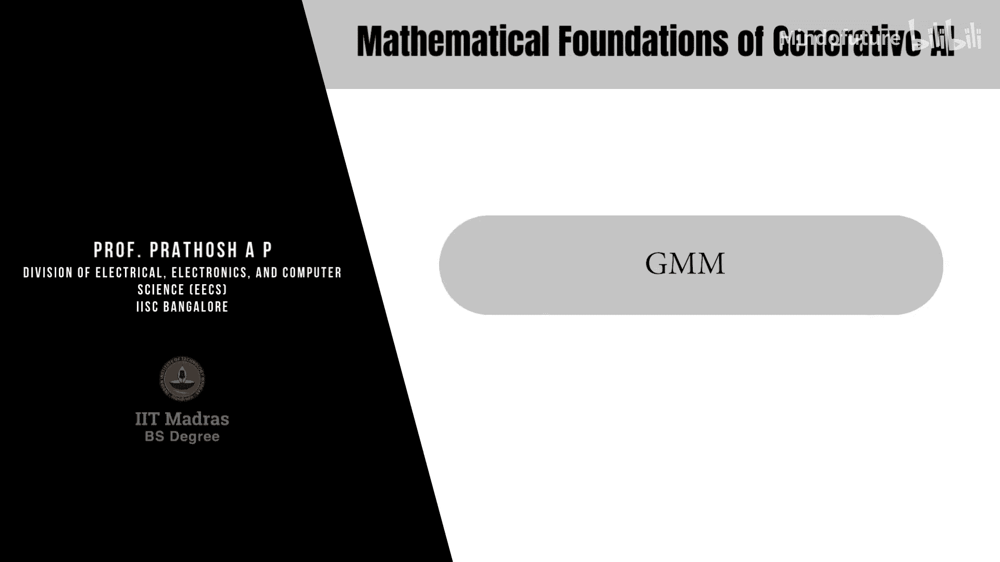

# 030：高斯混合模型与EM算法

在本节课中，我们将学习高斯混合模型（GMM）以及用于其参数估计的期望最大化（EM）算法。我们将从定义问题开始，逐步推导EM算法的E步和M步，并最终总结出完整的算法流程。

---

## 问题定义

高斯混合模型是潜变量模型的一个特例，其中潜变量 **Z** 是离散的。我们假设数据点 **X** 是从某个数据分布中独立同分布采样得到的。

*   **观测变量**：**X** ∈ ℝ^d
*   **潜变量**：**Z** 是一个离散随机变量，取值范围为 {1, 2, ..., K}

对于任意一个数据点 **x_i**，其概率可以表示为K个高斯分布的加权和：

**p(x_i) = Σ_{k=1}^{K} π_k * N(x_i | μ_k, Σ_k)**

其中：
*   **π_k** 是混合系数，满足 Σ_{k=1}^{K} π_k = 1。
*   **N(x_i | μ_k, Σ_k)** 是第k个高斯分布的概率密度函数。

---

## 责任值

在推导算法之前，我们需要引入一个关键概念：责任值 **γ(z_k)**。它表示在给定观测数据 **x_i** 的条件下，该数据点由第k个高斯分量生成的后验概率。

根据贝叶斯定理，责任值的计算公式为：

**γ(z_{ik}) = p(z_k | x_i) = [π_k * N(x_i | μ_k, Σ_k)] / [Σ_{j=1}^{K} π_j * N(x_i | μ_j, Σ_j)]**

这个值在E步中会被计算。

---

## 对数似然函数与EM算法框架

我们的目标是最大化观测数据的对数似然函数：

**log p(X) = Σ_{i=1}^{N} log [ Σ_{k=1}^{K} π_k * N(x_i | μ_k, Σ_k) ]**

直接优化这个函数是困难的，因为对数内部有求和。EM算法通过迭代方式解决这个问题，每次迭代分为两步：

1.  **E步（期望步）**：固定模型参数（π, μ, Σ），计算每个数据点对每个高斯分量的责任值 **γ(z_{ik})**。
2.  **M步（最大化步）**：固定责任值 **γ(z_{ik})**，重新估计模型参数（π, μ, Σ）以最大化期望似然。

上一节我们定义了问题和责任值，本节中我们来看看如何通过EM算法的M步来更新模型参数。

---

## M步：参数更新推导

在M步中，我们需要更新混合系数 **π_k**、均值 **μ_k** 和协方差 **Σ_k**。这是一个带约束（Σ π_k = 1）的优化问题，需要使用拉格朗日乘子法。

我们构建拉格朗日函数 **L**：

**L = Σ_{i=1}^{N} log [ Σ_{k=1}^{K} π_k * N(x_i | μ_k, Σ_k) ] + λ ( Σ_{k=1}^{K} π_k - 1 )**

接下来，我们分别对 **π_k**、**μ_k** 和 **Σ_k** 求偏导并令其为零。

### 1. 更新混合系数 π_k

对 **L** 关于 **π_k** 求偏导并置零，经过推导可得：

**π_k = (1/N) * Σ_{i=1}^{N} γ(z_{ik}) = N_k / N**

其中 **N_k = Σ_{i=1}^{N} γ(z_{ik})**，可以理解为属于第k个分量的数据点的“有效”数量。

### 2. 更新均值 μ_k

对 **L** 关于 **μ_k** 求偏导并置零，经过推导可得：

**μ_k = (1/N_k) * Σ_{i=1}^{N} γ(z_{ik}) * x_i**

新的均值是所有数据点的加权平均，权重是每个数据点属于该分量的责任值。

### 3. 更新协方差 Σ_k

对 **L** 关于 **Σ_k** 求偏导并置零，经过类似的推导可得：

**Σ_k = (1/N_k) * Σ_{i=1}^{N} γ(z_{ik}) * (x_i - μ_k)(x_i - μ_k)^T**

新的协方差是基于新的均值 **μ_k** 计算的数据点的加权协方差。

---

## 完整的EM算法流程

以下是用于高斯混合模型的EM算法的标准步骤：

1.  **初始化**：设置均值 **μ_k**、协方差 **Σ_k** 和混合系数 **π_k** 的初始值。计算初始对数似然值。
2.  **E步**：使用当前参数计算责任值 **γ(z_{ik})**。
    *   **γ(z_{ik}) = [π_k * N(x_i | μ_k, Σ_k)] / [Σ_{j=1}^{K} π_j * N(x_i | μ_j, Σ_j)]**
3.  **M步**：使用当前责任值重新估计参数。
    *   **N_k = Σ_{i=1}^{N} γ(z_{ik})**
    *   **μ_k^{new} = (1/N_k) Σ_{i=1}^{N} γ(z_{ik}) x_i**
    *   **Σ_k^{new} = (1/N_k) Σ_{i=1}^{N} γ(z_{ik}) (x_i - μ_k^{new})(x_i - μ_k^{new})^T**
    *   **π_k^{new} = N_k / N**
4.  **评估**：计算新的对数似然值。
    *   **log p(X) = Σ_{i=1}^{N} log [ Σ_{k=1}^{K} π_k^{new} * N(x_i | μ_k^{new}, Σ_k^{new}) ]**
5.  **检查收敛**：如果对数似然值或参数的变化未收敛（例如，小于某个阈值），则返回第2步（E步）。否则，算法停止。

---

## 总结

本节课中我们一起学习了高斯混合模型及其核心训练算法——期望最大化算法。
*   我们首先定义了GMM，它是一个由多个高斯分布加权组合而成的概率模型。
*   然后，我们引入了“责任值”这一关键概念，它度量了每个数据点属于各个高斯分量的概率。
*   接着，我们详细推导了EM算法的M步，展示了如何利用责任值来更新模型的三个参数：混合系数 **π_k**、均值 **μ_k** 和协方差 **Σ_k**。
*   最后，我们给出了从初始化到收敛的完整EM算法迭代步骤。

理解GMM和EM算法为学习更复杂的生成式模型（如变分自编码器）奠定了重要的数学基础。