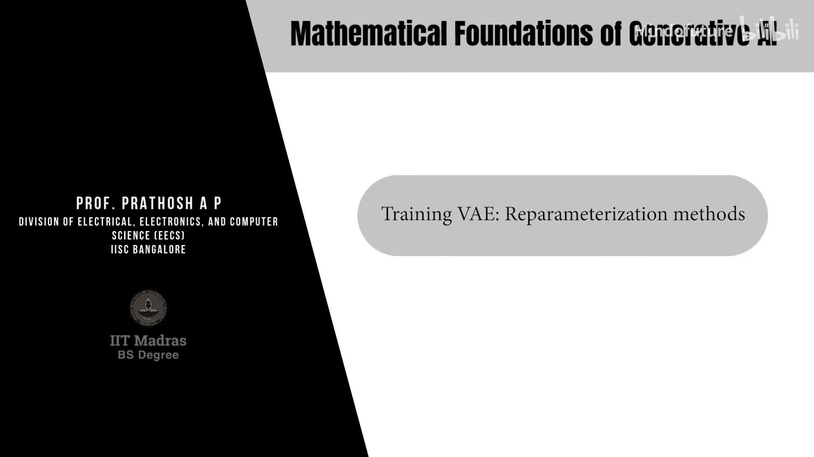
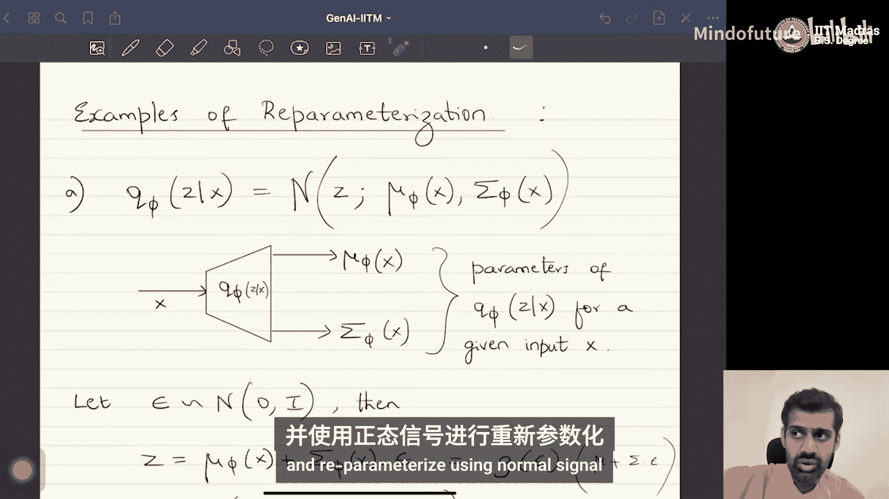

# 031：训练VAE-重参数化方法

在本节课中，我们将学习变分自编码器训练过程中的一个核心技巧——重参数化。我们将了解为什么直接计算编码器参数的梯度会遇到困难，以及如何通过重参数化技巧巧妙地解决这个问题。

## 数据流回顾

在深入梯度计算之前，让我们先回顾一下VAE内部的数据流，以便更好地理解后续关于梯度和计算的讨论。

在VAE中，我们有两个神经网络：编码器和解码器。数据样本 **x** 作为输入传递给编码器网络，编码器网络输出潜在分布 **Q_φ(z|x)** 的参数。由于这是一个概率神经网络，我们需要通过该分布进行采样来获得一个 **z** 的样本。具体来说，我们利用编码器网络预测的分布参数，采样得到一个或多个 **z** 点，这个采样得到的潜在向量 **z** 将作为输入传递给解码器网络。解码器网络随后输出条件数据分布 **p_θ(x|z)** 的参数。

以下是三个关键步骤：
1.  数据输入编码器，得到 **Q_φ(z|x)** 的参数。
2.  在神经网络外部进行采样，从潜在分布中获得样本 **z**。
3.  将采样得到的 **z** 作为输入传递给解码器网络，解码器输出 **p_θ(x|z)** 的参数。

这就是数据在VAE中流动的过程。请注意，流程中存在一个采样步骤，它发生在神经网络外部。这是一个需要关注的关键点，因为它会在梯度计算中带来挑战。采样过程不是一个网络，而是发生在编码器和解码器神经网络之外的一个操作。

## 梯度计算问题

现在让我们开始进行梯度计算。我们需要查看损失函数 **L**（即ELBO），并计算该损失函数相对于编码器参数 **φ** 和解码器参数 **θ** 的梯度。

让我们回顾一下损失函数。我们的损失函数包含两项：第一项是条件期望数据似然，第二项是KL散度。为了便于参考，我们将损失函数写在这里：

**L(θ, φ; x) = E_{z~Q_φ(z|x)}[log p_θ(x|z)] - D_{KL}(Q_φ(z|x) || p(z))**

我们需要计算这个表达式相对于编码器参数 **φ** 和解码器参数 **θ** 的梯度。因此，总共有四个梯度项需要计算：
1.  ELBO第一项相对于 **φ** 的梯度。
2.  ELBO第二项相对于 **φ** 的梯度。
3.  ELBO第一项相对于 **θ** 的梯度。
4.  ELBO第二项相对于 **θ** 的梯度。

让我们从计算相对于编码器参数 **φ** 的梯度开始。这意味着我们需要计算第一项（期望项）相对于 **φ** 的梯度。

这个期望项的形式是 **E_{z~Q_φ(z|x)}[log p_θ(x|z)]**。请注意，期望是针对分布 **Q_φ(z|x)** 计算的，并且我们条件依赖的变量 **z** 也是从 **Q_φ(z|x)** 中采样得到的。这个项以两种方式依赖于 **φ**：一是期望所基于的分布 **Q_φ**，二是条件变量 **z** 的采样也依赖于 **Q_φ**。

为了简化表示，我们用一个通用形式来描述这个问题。假设我们需要计算函数 **f_ψ(v)** 相对于分布 **p_ψ(v)** 的期望的梯度，且梯度是针对参数 **ψ** 的。在我们的具体问题中，**v** 对应 **z**，**p_ψ(v)** 对应 **Q_φ(z|x)**，**f_ψ(v)** 对应 **log p_θ(x|z)**。

根据定义，期望是积分：**∇_ψ E_{v~p_ψ(v)}[f_ψ(v)] = ∇_ψ ∫ f_ψ(v) p_ψ(v) dv**。梯度是线性算子，可以移到积分内部：**∫ ∇_ψ [f_ψ(v) p_ψ(v)] dv**。

现在应用乘积求导法则：
**∫ [ (∇_ψ f_ψ(v)) p_ψ(v) + f_ψ(v) (∇_ψ p_ψ(v)) ] dv**

第一项 **∫ (∇_ψ f_ψ(v)) p_ψ(v) dv** 可以写成一个期望：**E_{v~p_ψ(v)}[∇_ψ f_ψ(v)]**。这一项可以通过从分布 **p_ψ(v)** 中采样并计算样本平均值来近似估计。

然而，第二项 **∫ f_ψ(v) (∇_ψ p_ψ(v)) dv** **不是**一个期望。因为 **∇_ψ p_ψ(v)** 是概率密度函数的梯度，它本身不是一个概率密度函数（其积分不一定为1）。因此，这个积分不能解释为某个随机变量的期望，也就无法使用样本平均值来近似计算。

这意味着我们需要的梯度 **∇_φ E_{z~Q_φ(z|x)}[log p_θ(x|z)]** **无法直接计算**。从数据流图来看，问题的根源在于编码器和解码器之间的采样步骤。如果我们将整个流程（编码器 -> 采样 -> 解码器）视为一个计算图，为了将梯度从解码器输出反向传播回编码器输入，梯度必须穿过采样操作。但采样是一个**不可微分**的操作，因此梯度无法通过。

## 重参数化技巧

为了解决这个梯度无法计算的问题，原始VAE论文的作者提出了一种称为**重参数化技巧**的解决方案。

重参数化是统计学中的一种常用技术，其核心思想是：**使用一个确定性函数和另一个辅助随机变量来表示原随机变量**。

具体思路是，将我们从中采样的分布 **p_ψ(v)**，用另一个**独立于参数 ψ** 的辅助随机变量来表示。

假设存在一个辅助随机变量 **ε**，它服从某个分布 **p(ε)**，且 **p(ε)** 独立于参数 **ψ**。同时，存在一个确定性函数 **g_ψ**，使得原随机变量 **v** 可以表示为 **v = g_ψ(ε)**。

那么，原来的期望可以重写为：
**E_{v~p_ψ(v)}[f_ψ(v)] = E_{ε~p(ε)}[f_ψ(g_ψ(ε))]**

这个等式的依据是统计学中的**Law of the Unconscious Statistician (LOTUS)**。它表明，一个随机变量函数的期望，可以通过该随机变量的变换以及变换后变量的分布来计算。

这样做的好处是什么？现在，我们需要计算的梯度变成了：
**∇_ψ E_{v~p_ψ(v)}[f_ψ(v)] = ∇_ψ E_{ε~p(ε)}[f_ψ(g_ψ(ε))]**

关键的变化在于，**期望现在是对分布 p(ε) 求取的，而 p(ε) 不依赖于参数 ψ**。因此，我们可以将梯度算子移入期望内部（因为期望运算不再依赖于 ψ）：
**= E_{ε~p(ε)}[∇_ψ f_ψ(g_ψ(ε))]**

现在，这个梯度**可以计算**了！因为它是一个期望，我们可以通过从 **p(ε)** 中采样 **ε**，计算内部函数 **∇_ψ f_ψ(g_ψ(ε))** 的梯度，然后取样本平均值来近似：
**≈ (1/M) Σ_{j=1}^{M} ∇_ψ f_ψ(g_ψ(ε^{(j)}))**, 其中 **ε^{(j)} ~ p(ε)**

本质上，重参数化技巧将采样过程的随机性“转移”到了一个与模型参数无关的辅助变量 **ε** 上。原来的随机变量 **v** 变成了一个关于 **ε** 和参数 **ψ** 的确定性函数 **g_ψ(ε)**。这样，梯度就可以顺利地从 **f_ψ** 通过确定性的函数 **g_ψ** 反向传播到参数 **ψ**，而无需经过不可微的采样操作。

## 重参数化示例

以下是两种常见的重参数化方法示例：

**1. 仿射变换（适用于高斯分布）**
这是在VAE中最常用的方法。我们通常假设潜在后验分布 **Q_φ(z|x)** 是一个高斯分布，其均值 **μ_φ(x)** 和方差 **σ_φ²(x)** 由编码器网络输出。

我们可以如下进行重参数化：
令 **ε ~ N(0, I)**，即标准正态分布。
定义 **z = μ_φ(x) + σ_φ(x) ⊙ ε**，其中 **⊙** 表示逐元素相乘（若为多维）。
那么，**z** 将服从分布 **N(μ_φ(x), diag(σ_φ²(x)))**。这里的确定性函数 **g** 就是仿射变换：**g_φ(ε, x) = μ_φ(x) + σ_φ(x) ⊙ ε**。

**2. 逆变换采样（适用于任意连续分布）**
这是一种更通用的方法。设随机变量 **Z** 的累积分布函数为 **F_z(z)**。
令 **ε ~ Uniform(0, 1)**，即均匀分布。
定义 **z = F_z^{-1}(ε)**，即CDF的逆函数。
那么，**z** 将服从原来的分布。这里的确定性函数 **g** 就是逆CDF函数：**g(ε) = F_z^{-1}(ε)**。

在VAE的常规实践中，通常采用第一种方法，即假设 **Q_φ(z|x)** 为高斯分布，并使用仿射变换进行重参数化。选择高斯分布和这种重参数化方式主要是为了计算和实现的便利性。

## 总结

本节课中，我们一起学习了变分自编码器训练的关键——重参数化技巧。

我们首先回顾了VAE的数据流，指出了编码器与解码器之间不可微的采样步骤是梯度计算的主要障碍。直接计算损失函数中期望项相对于编码器参数的梯度时，会得到一个无法通过采样估计的项，导致梯度无法传播。

为了解决这个问题，我们引入了重参数化技巧。其核心思想是将原始随机变量 **z** 表示为一个确定性函数 **g_φ(ε)** 和一个辅助随机变量 **ε** 的组合，其中 **ε** 来自一个与参数 **φ** 无关的固定分布。这样，随机性被转移到了 **ε** 上，而 **z** 相对于 **φ** 的依赖性变成了确定性的、可微的。通过这种方式，梯度可以顺利通过计算图进行反向传播，使得编码器网络的训练成为可能。

我们还介绍了两种具体的重参数化方法：适用于高斯分布的仿射变换和适用于任意连续分布的逆变换采样法。在VAE的实际实现中，普遍采用高斯分布假设配合仿射变换的方法。

理解重参数化技巧是掌握VAE训练原理的重要一步，它巧妙地将概率模型中的采样问题与神经网络的可微分训练结合了起来。