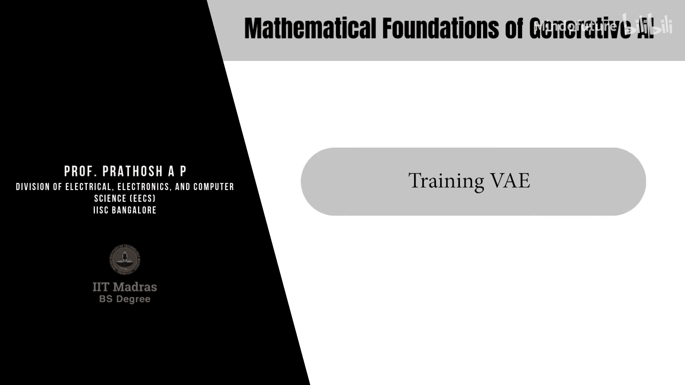
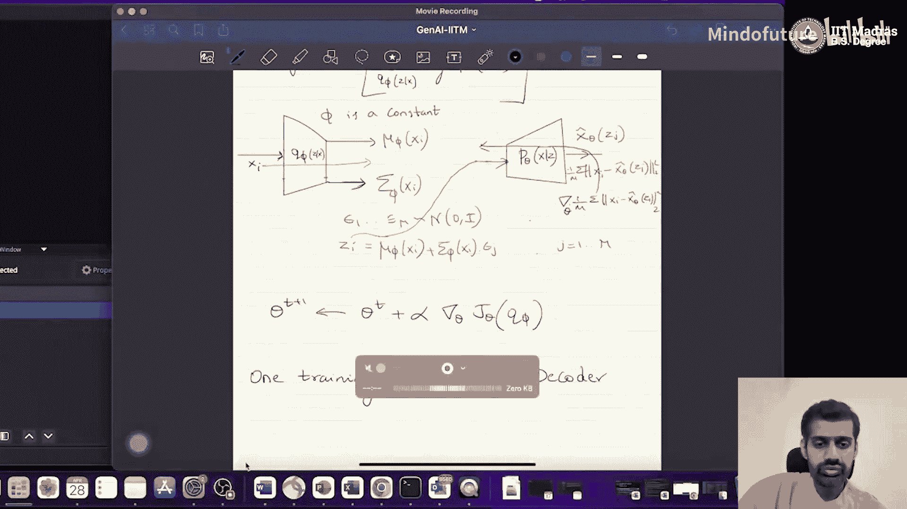

# 032：训练变分自编码器 (VAE) 🧠

在本节课中，我们将学习如何训练变分自编码器。我们将详细探讨损失函数的计算、梯度传播，以及解决训练难题的关键技术——重参数化技巧。

---

## 概述

变分自编码器的训练目标是最大化证据下界。这个目标函数包含两项：第一项是重构数据的对数似然期望，第二项是编码器输出的分布与先验分布之间的KL散度。训练的核心挑战在于计算第一项对编码器参数的梯度，因为其中涉及对随机变量的采样。我们将使用重参数化技巧来解决这个梯度计算问题。

## 重参数化技巧

上一节我们介绍了VAE的损失函数。本节中我们来看看如何计算其梯度，特别是处理涉及采样的期望项。

给定一个输入数据样本 `Xi`，它通过编码器网络，得到均值 `μ_φ(Xi)` 和方差 `σ_φ(Xi)`。然后，我们从标准正态分布 `N(0, I)` 中采样一个随机变量 `ε`。潜在变量 `Z` 通过以下重参数化公式得到：
`Z = μ_φ(Xi) + σ_φ(Xi) * ε`

这个操作将原本从 `q_φ(z|x)` 的采样，转换成了从一个与网络参数 `φ` 无关的固定分布 `p(ε)` 中采样 `ε`，再通过一个确定性函数 `g` 得到 `Z`。这使得梯度可以顺利通过采样操作反向传播。

## 前向传播流程

以下是训练过程中，针对一个数据样本 `Xi` 的前向传播步骤：

1.  **编码**：将 `Xi` 输入编码器网络，得到均值 `μ_φ(Xi)` 和方差 `σ_φ(Xi)`。
2.  **采样**：从标准正态分布 `N(0, I)` 中独立采样 `M` 个随机变量 `ε_1, ..., ε_M`。此步骤在神经网络外部进行。
3.  **重参数化**：对于每个 `ε_j`，计算对应的潜在向量 `Z_j = μ_φ(Xi) + σ_φ(Xi) * ε_j`。
4.  **解码**：将每个 `Z_j` 输入解码器网络，得到重构输出 `x̂_θ(Z_j)`。解码器输出被解释为给定 `Z` 时 `x` 的分布（例如高斯分布）的参数（如均值）。
5.  **计算损失**：计算损失函数的两部分。
    *   **重构项**：计算负对数似然的蒙特卡洛估计：`L_recon = -1/M * Σ_j ||Xi - x̂_θ(Z_j)||²`（假设解码输出为高斯分布且方差为单位矩阵）。
    *   **KL散度项**：计算 `q_φ(z|Xi)`（均值为 `μ_φ(Xi)`，方差为 `σ_φ(Xi)` 的高斯分布）与先验分布 `p(z)`（通常为标准正态分布 `N(0, I)`）之间的KL散度。此项有解析解：
        `L_KL = -1/2 * [log det(σ_φ(Xi)) - K + tr(σ_φ(Xi)) + ||μ_φ(Xi)||²]`
        其中 `K` 是潜在空间的维度。

## 反向传播与参数更新

损失函数的梯度需要分别对编码器参数 `φ` 和解码器参数 `θ` 进行计算。

### 更新编码器参数 (φ)

我们需要计算总损失 `L = L_recon + L_KL` 对 `φ` 的梯度。

1.  **重构项梯度**：计算 `L_recon` 对 `φ` 的梯度。由于重参数化，梯度可以从 `L_recon` 反向传播，经过解码器网络（此时 `θ` 固定），再通过重参数化操作 `Z = μ_φ(Xi) + σ_φ(Xi) * ε`，最终到达编码器输出 `μ_φ` 和 `σ_φ`。
2.  **KL散度项梯度**：`L_KL` 对 `φ` 的梯度可以直接根据其解析公式计算，因为它只依赖于编码器的输出 `μ_φ` 和 `σ_φ`。
3.  **合并梯度**：将上述两项梯度相加，得到总损失对 `φ` 的梯度。
4.  **反向传播**：将这个总梯度继续反向传播通过编码器网络，更新编码器参数 `φ`。

### 更新解码器参数 (θ)

我们需要计算总损失 `L` 对 `θ` 的梯度。注意，`L_KL` 项与 `θ` 无关，其梯度为零。

1.  **重构项梯度**：计算 `L_recon` 对 `θ` 的梯度。在前向传播中，`Z_j` 是通过固定 `φ` 得到的。在反向传播时，梯度从 `L_recon` 直接反向传播通过解码器网络（此时 `φ` 固定，`θ` 为变量），更新解码器参数 `θ`。梯度不需要经过编码器或重参数化步骤。

## 训练步骤总结

本节课中我们一起学习了变分自编码器的完整训练流程：

1.  对一个数据样本 `Xi` 执行前向传播，获得编码器输出、采样潜在变量、解码器输出，并计算重构损失和KL散度损失。
2.  **更新编码器**：
    *   计算重构损失对编码器参数 `φ` 的梯度（利用重参数化技巧使梯度可通）。
    *   计算KL散度损失对 `φ` 的解析梯度。
    *   将两个梯度相加，反向传播更新 `φ`。
3.  **更新解码器**：
    *   计算重构损失对解码器参数 `θ` 的梯度（KL散度项梯度为零）。
    *   反向传播该梯度以更新 `θ`。
4.  对数据集中的所有样本重复步骤1-3，完成一个训练周期（epoch）。迭代多个周期直至模型收敛。

通过交替更新编码器和解码器，VAE学会了将数据压缩到有结构的潜在空间，并能从该空间生成新的数据样本。在下一模块中，我们将探讨如何使用训练好的VAE进行数据生成和特征提取。