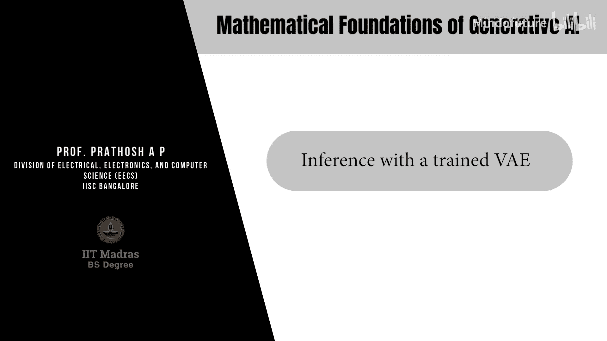

# 033：使用训练好的VAE进行推理

## 概述
在本节课中，我们将学习如何使用训练好的变分自编码器进行推理。我们将回顾VAE的训练过程，然后探讨其在数据生成和潜在后验推断等任务中的应用，并简要介绍一些针对VAE缺点的改进方法。

## 回顾：变分自编码器的训练
上一节我们介绍了如何训练变分自编码器。本节中，我们先快速回顾其训练流程。

VAE在架构上包含两个用于近似分布的神经网络。

*   **编码器网络**：输入一个数据样本 `x`，输出潜在后验分布 `Q_φ(z|x)` 的参数。
*   **解码器网络**：输入一个从潜在后验分布 `Q_φ(z|x)` 中采样的 `z`，输出数据似然分布 `P_θ(x|z)` 的参数。

在典型实现中，`Q_φ(z|x)` 被假设为一个高斯分布，其均值 `μ_φ(x)` 和方差 `Σ_φ(x)` 由编码器预测。方差矩阵通常被设定为对角矩阵，因此编码器只需输出K维的均值向量和对角方差向量。

为了从 `Q_φ(z|x)` 中采样 `z` 并允许梯度反向传播，我们使用重参数化技巧：
`z = μ_φ(x) + Σ_φ(x)^(1/2) * ε`，其中 `ε` 采样自标准正态分布 `N(0, I)`。

VAE的优化目标是最大化证据下界，其损失函数为：
`L(θ, φ; x) = E_{z~Q_φ(z|x)}[log P_θ(x|z)] - D_{KL}(Q_φ(z|x) || P(z))`
其中，`P(z)` 是先验分布，通常设为标准正态分布 `N(0, I)`。KL散度项有解析解：
`D_{KL} = -1/2 * Σ_{j=1}^{K} (1 + log(σ_j^2) - μ_j^2 - σ_j^2)`

我们通过梯度下降法交替更新编码器参数 `φ` 和解码器参数 `θ`。

## 使用训练好的VAE进行推理
现在，假设VAE已经训练完成。我们来看看如何将其用于不同的推理任务。

### 1. 数据生成（采样）
VAE本质上是一个潜在变量生成模型，因此可用于数据生成。

以下是使用VAE进行采样的步骤：

1.  **从先验分布采样**：采样一个新的潜在变量 `z_new` 来自先验分布 `P(z)`，即标准正态分布 `N(0, I)`。
2.  **通过解码器生成**：将 `z_new` 输入到训练好的解码器网络中。解码器输出 `x̂_θ(z_new)`，即条件分布 `P_θ(x|z_new)` 的参数（通常是均值）。

**原理**：在训练过程中，损失函数的KL散度项会迫使所有 `x` 对应的后验分布 `Q_φ(z|x)` 都接近先验 `P(z)`（即 `N(0, I)`）。因此，在推理时，直接从 `N(0, I)` 采样 `z` 等价于从某个 `Q_φ(z|x)` 采样。解码器已学会将这样的 `z` 映射回数据空间。

得到解码器的输出 `x̂_θ(z_new)` 后，有两种方式获得新数据点：
*   **直接使用均值**：将 `x̂_θ(z_new)` 本身作为生成的数据点。
*   **从分布中采样**：因为 `P_θ(x|z)` 通常被建模为以 `x̂_θ(z)` 为均值、单位矩阵为方差的高斯分布，所以我们可以从 `N(x̂_θ(z_new), I)` 中采样一个点 `x_new` 作为生成的数据。

**注意**：在数据生成任务中，我们只使用解码器，编码器不被使用。

### 2. 潜在后验推断（特征提取）
VAE也可以用作特征提取器，为输入数据计算一个低维的潜在表示（嵌入）。

以下是使用VAE进行特征提取的步骤：

1.  **使用编码器**：将测试数据点 `x_test` 输入到训练好的编码器网络中。
2.  **获取分布参数**：编码器输出后验分布 `Q_φ(z|x_test)` 的参数，即均值向量 `μ_φ(x_test)` 和对角方差矩阵 `Σ_φ(x_test)`。
3.  **计算嵌入**：数据点 `x_test` 的潜在嵌入（特征向量）可以通过以下方式获得：
    *   **使用均值**：直接取 `μ_φ(x_test)` 作为嵌入向量。这是一种常见选择。
    *   **从后验采样**：从分布 `N(μ_φ(x_test), Σ_φ(x_test))` 中采样一个点 `z_test` 作为嵌入。对于同一个 `x_test`，可以采样多次得到多个嵌入。

**应用**：得到的低维嵌入 `z_test` 可以用于多种下游任务，例如：
*   作为特征输入给分类器。
*   在其上构建新的生成模型（例如，在潜在空间而非原始数据空间进行生成）。

**优势**：通过编码器，原始高维数据（D维）被压缩到一个更低维（K维，K << D）的潜在空间，获得了数据的紧凑表示。

## 总结
本节课中，我们一起学习了如何使用训练好的变分自编码器进行推理。

*   **数据生成**：我们利用VAE的解码器部分。通过从标准正态先验分布中采样一个潜在变量 `z`，并将其输入解码器，可以生成新的数据样本。这体现了VAE作为生成模型的核心能力。
*   **特征提取**：我们利用VAE的编码器部分。通过将数据输入编码器，可以获得其对应的潜在后验分布的参数（均值和方差），进而得到数据在低维潜在空间中的嵌入表示。这种紧凑的特征可用于各种后续分析任务。

这种“编码器用于特征提取，解码器用于数据生成”的模式，是编码器-解码器类模型的通用范式。