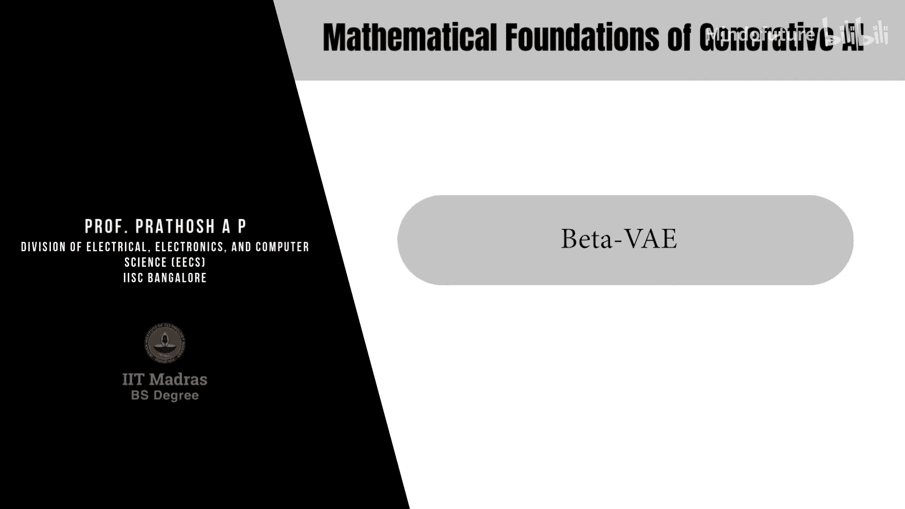
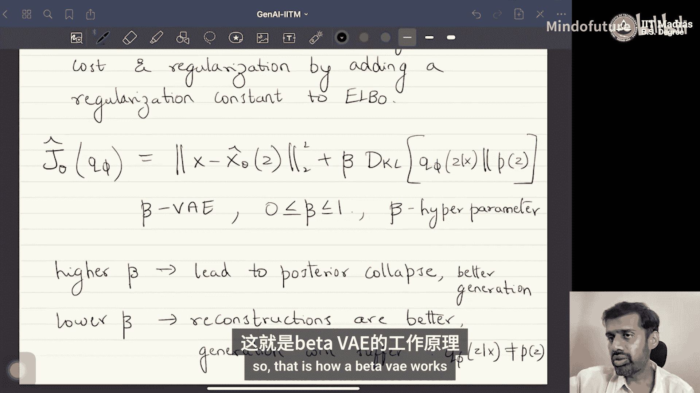

# 034：Beta-VAE

## 概述
在本节课中，我们将学习变分自编码器（VAE）的一个改进版本——Beta-VAE。我们将探讨标准VAE中存在的“后验坍塌”问题，理解其成因，并学习如何通过引入一个超参数β来平衡重构质量与潜在空间的正则化，从而解决该问题。

---

## 从标准VAE到其改进
上一节我们介绍了变分自编码器的基本框架。本节中，我们来看看对标准VAE的第一个重要改进。

### 后验坍塌问题
考虑标准VAE的工作流程。存在一个编码器网络和一个解码器网络。给定输入数据`x`，编码器会输出后验分布`Q_φ(z|x)`的参数。解码器则从该分布中采样一个`z`，并以此生成`P_θ(x|z)`的参数。

在VAE的损失函数（ELBO）中，第二项是KL散度项，用于衡量`Q_φ(z|x)`与先验分布`P(z)`（通常是标准正态分布）之间的差异。这项损失被最小化。

如果这项损失被过度优化，会发生什么？对于所有输入`x`，`Q_φ(z|x)`都会被强制变得与`P(z)`完全相同。例如，无论输入什么`x`，编码器都被训练为输出均值为0、方差为1的正态分布。

这种现象被称为**后验坍塌**。因为潜在后验分布对于所有输入`x`都“坍塌”成了同一个特定的分布（即先验分布）。

后验坍塌会带来一个问题：解码器将难以区分不同的输入样本。假设有两个输入样本`x_i`和`x_j`，由于它们的后验分布`Q_φ(z|x_i)`和`Q_φ(z|x_j)`都相同，从这两个分布中采样得到的潜在变量`z_i`和`z_j`将来自完全相同的分布。因此，解码器在尝试重构原始输入`x_i`和`x_j`时会遇到困难，导致重构损失（ELBO的第一项）性能下降。

### 解决方案：将VAE视为正则化自编码器
为了解决后验坍塌问题，我们首先需要重新审视VAE的损失函数。VAE的损失函数`J(θ, φ)`可以写作：
`J(θ, φ) = E[log P_θ(x|z)] - D_KL(Q_φ(z|x) || P(z))`

*   **第一项是重构项**：它促使解码器从潜在变量`z`中准确地重构出原始输入`x`。这体现了“自编码”的核心思想——将数据编码到潜在空间再解码回来。
*   **第二项是KL散度项**：它促使潜在变量的分布`Q_φ(z|x)`接近我们预设的先验分布`P(z)`。这可以看作是对潜在空间的一种**正则化**。

因此，VAE可以视为一个**带有潜在空间正则化的自编码器**，有时也被称为正则化自编码器。

在经典的机器学习正则化中，损失函数通常形如：
`L(θ) = [成本函数] + λ * [正则化函数]`
其中，`λ`是一个**正则化常数**，用于控制正则化的强度。`λ`值越大，模型越倾向于被正则化（可能欠拟合）；`λ`值越小，模型越倾向于拟合数据（可能过拟合）。`λ`在偏差-方差权衡中起着关键作用。

观察标准VAE的损失函数，我们发现它缺少这样一个显式的正则化常数`λ`。这意味着我们无法灵活地控制重构损失和正则化损失之间的权衡，从而难以避免后验坍塌。

---

## Beta-VAE：引入权衡参数
一个简单的改进方法就是为KL散度项添加一个正则化常数`β`。修改后的损失函数为：
`J_β(θ, φ) = E[log P_θ(x|z)] - β * D_KL(Q_φ(z|x) || P(z))`
这个公式就是**Beta-VAE**。其中，`β`是一个介于0和1之间的超参数。

*   当`β = 1`时，就是标准的VAE。
*   `β`成为一个可以调节的设计选择。

以下是`β`值的影响：

*   **较高的`β`值**：赋予KL散度项更大的权重，强调潜在空间必须严格符合先验分布。这可能导致**后验坍塌**。然而，这也有一个好处：由于训练时`Q_φ(z|x)`被强制接近`P(z)`，在生成新数据时，直接从先验分布`P(z)`中采样并输入解码器会得到更好的效果。因此，**较高的`β`有利于生成质量**。
*   **较低的`β`值**：降低了对KL散度项的要求，允许潜在空间保留更多关于输入`x`的信息。这减轻了后验坍塌，使得不同输入对应的后验分布更容易区分，从而**提高了重构质量**。但代价是，由于`Q_φ(z|x)`与`P(z)`差异较大，从先验`P(z)`中采样生成的样本质量可能会下降。

因此，`β`在**重构质量**与**生成质量**之间提供了一个明确的权衡杠杆。

在实践中，当需要实现VAE时，通常会实现Beta-VAE，并将`β`作为一个超参数。开发者会根据具体应用的需求（是更看重数据重构的保真度，还是更看重生成样本的多样性/质量），在验证集上调整`β`的值，以达到最佳平衡。

---

## 总结
本节课中，我们一起学习了Beta-VAE。我们首先分析了标准VAE中后验坍塌问题的成因，即KL散度项过度正则化导致潜在空间失去区分度。接着，我们通过将VAE解读为一种正则化自编码器，引出了通过添加超参数`β`来控制正则化强度的解决方案。最后，我们详细探讨了`β`值如何影响模型在数据重构和样本生成之间的权衡。Beta-VAE是理解和应用VAE家族模型的一个重要基础。