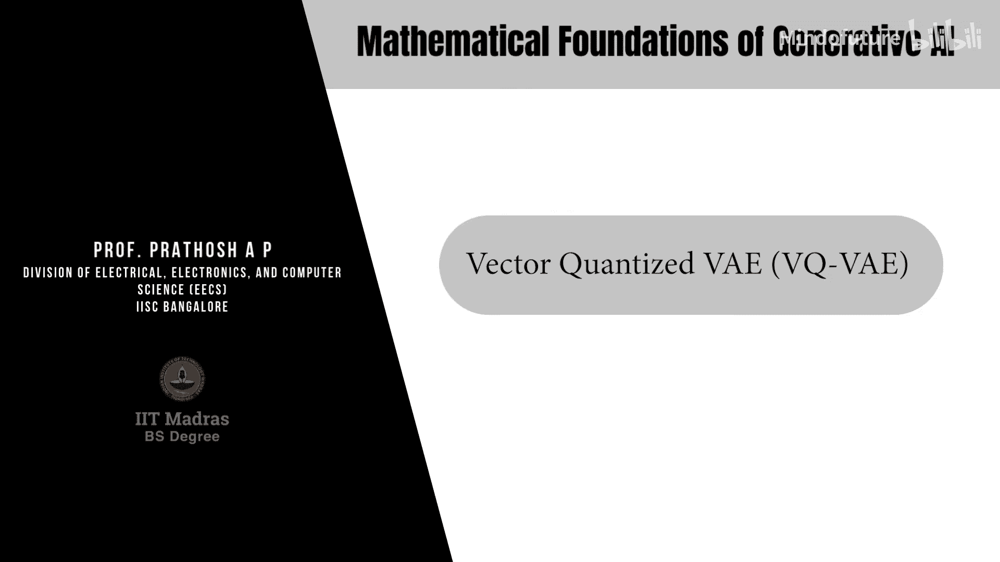
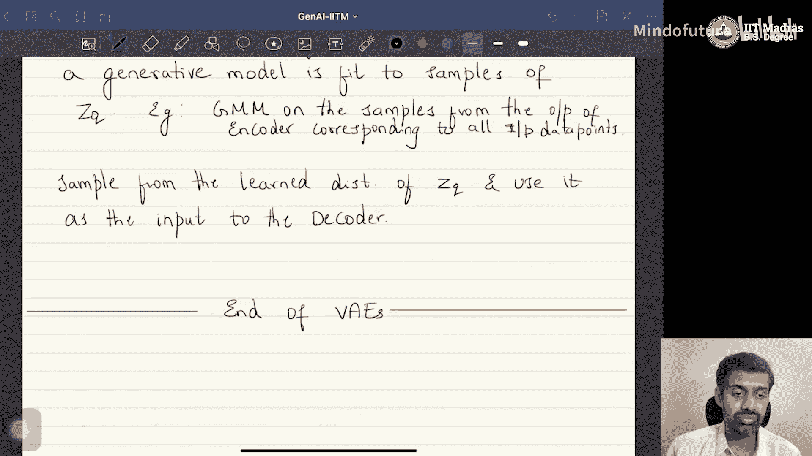
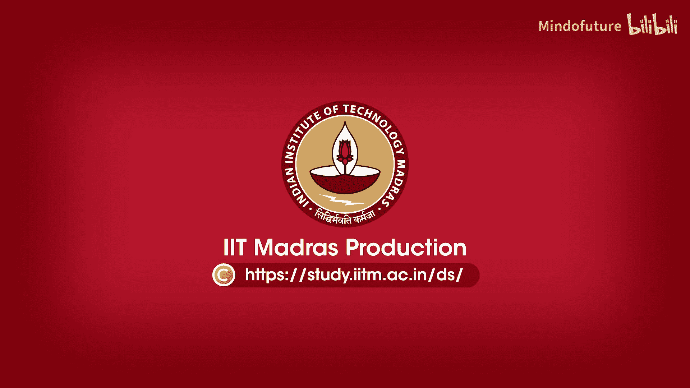

生成式AI的数学基础：P35：矢量量化变分自编码器（VQ-VAE）

## 概述

在本节课中，我们将学习变分自编码器（VAE）的一个重要改进版本——矢量量化变分自编码器（VQ-VAE）。我们将了解其核心思想、工作原理、训练方法以及如何进行推断和生成。

---

## 核心思想：离散的潜在空间

上一节我们介绍了标准VAE，其潜在空间是连续的。本节中我们来看看VQ-VAE的核心改进：它将潜在空间离散化。

在标准VAE中，潜在变量`z`通常来自连续分布（如标准正态分布）。然而，对于图像、语音、文本等实际数据，用离散的潜在符号来表示更为直观。例如：
*   **语音** 可以由有限的音素组合构成。
*   **文本** 本身就是由离散的字符或词元组成。
*   **图像** 也可以看作由线条、形状、颜色等基本元素组合而成。

因此，VQ-VAE将潜在空间设计为离散的，这更符合许多实际数据的本质。

## VQ-VAE的架构与工作原理

VQ-VAE同样包含编码器和解码器，但与标准VAE不同，其编码器是确定性的。

以下是VQ-VAE的工作流程：
1.  **编码**：编码器 `E` 接收输入数据点 `x`，输出一个向量 `z_e(x)`。
2.  **矢量量化**：系统维护一个可学习的**潜在字典** `L`，其中包含 `M` 个 `K` 维向量：`{z_1, z_2, ..., z_M}`。量化过程是找到字典中与 `z_e(x)` 最接近的向量：
    `j* = argmin_j || z_e(x) - z_j ||`
    然后，用该向量 `z_j*` 作为量化后的潜在表示 `z_q(x)`。
3.  **解码**：解码器 `D` 接收量化后的向量 `z_q(x)`，并尝试重建原始输入，输出 `x'`。

在实践中，为了更有效地表示复杂数据（如图像），编码器的输出 `z_e(x)` 通常是一个 `K x P` 的矩阵，其中每一列都是一个 `K` 维向量。随后，**对矩阵的每一列独立进行上述矢量量化操作**，最终得到一个由 `P` 个离散字典向量组成的矩阵，作为解码器的输入。

## 如何训练VQ-VAE

VQ-VAE的训练目标函数包含两部分：

**损失函数公式：**
`L = || x - D(z_q(x)) ||^2 + || sg[z_e(x)] - z_q ||^2 + β || z_e(x) - sg[z_q] ||^2`

以下是损失函数各部分的解释：
*   **重建损失**：`|| x - D(z_q(x)) ||^2`，确保解码器能准确重建输入。
*   **字典学习损失**：`|| sg[z_e(x)] - z_q ||^2`，使用停止梯度操作符 `sg[...]`，将编码器输出视为常数，更新字典向量 `z_j`，使其向编码器输出靠近。
*   **承诺损失**：`β || z_e(x) - sg[z_q] ||^2`，同样使用 `sg[...]`，将量化向量 `z_q` 视为常数，促使编码器输出靠近其被量化到的字典向量。`β` 是一个超参数。

在训练过程中，我们不仅优化编码器 `E` 和解码器 `D` 的参数，**还会通过梯度下降更新潜在字典 `L` 中的所有向量**。

## 如何使用VQ-VAE进行推断

训练好VQ-VAE后，我们可以用它进行两种主要操作：嵌入提取和生成。

### 嵌入提取（后验推断）

这个过程用于获取输入数据的离散潜在表示。
1.  将输入 `x_test` 输入训练好的编码器 `E`，得到输出 `z_e(x_test)`。
2.  对该输出的每一列（若为矩阵），在潜在字典 `L` 中寻找最近的向量进行替换（矢量量化）。
3.  得到的量化矩阵 `z_q(x_test)` 就是该数据的嵌入表示。

### 生成新样本

在VQ-VAE中生成新样本比在标准VAE中更复杂，因为我们没有对潜在空间 `z_q` 显式地定义一个简单的先验分布（如标准正态分布）。

生成新样本的步骤是：
1.  **学习潜在空间的分布**：首先，用训练好的VQ-VAE编码器处理所有训练数据，收集得到的所有量化潜在向量 `{z_q}`，形成一个数据集。
2.  **训练一个额外的生成模型**：在这个 `{z_q}` 数据集上，训练另一个生成模型（例如自回归模型、GAN或另一个VAE）。这个模型学会了如何生成新的、合理的 `z_q` 样本。
3.  **采样与解码**：从新训练好的生成模型中采样出一个新的 `z_q` 样本，将其输入VQ-VAE的解码器 `D`，即可生成新的数据点 `x_new`。

由于这个两步过程较为繁琐，**VQ-VAE在现实中更多被用作强大的特征提取器**，而非直接的生成模型。例如，在著名的图像生成模型Stable Diffusion中，就使用了一个预训练的VQ-VAE的潜在空间作为其扩散过程的起点。

---

## 总结

本节课我们一起学习了矢量量化变分自编码器（VQ-VAE）。
*   其核心思想是将连续VAE的潜在空间**离散化**，通过一个可学习的**字典**进行**矢量量化**。
*   我们分析了它的**架构**、**训练目标函数**（包含重建、字典学习和承诺损失）以及**训练过程**。
*   最后，我们探讨了如何使用它进行**嵌入提取**，以及通过训练一个额外的生成模型来**生成新样本**的间接方法。VQ-VAE因其强大的特征表示能力，常作为更复杂生成模型（如扩散模型）的组件。

接下来，我们将进入另一个前沿的生成模型家族——**去噪扩散概率模型（扩散模型）**，它实际上是层次化VAE的一个特例，并构成了当前图像生成领域许多顶尖模型的基础。