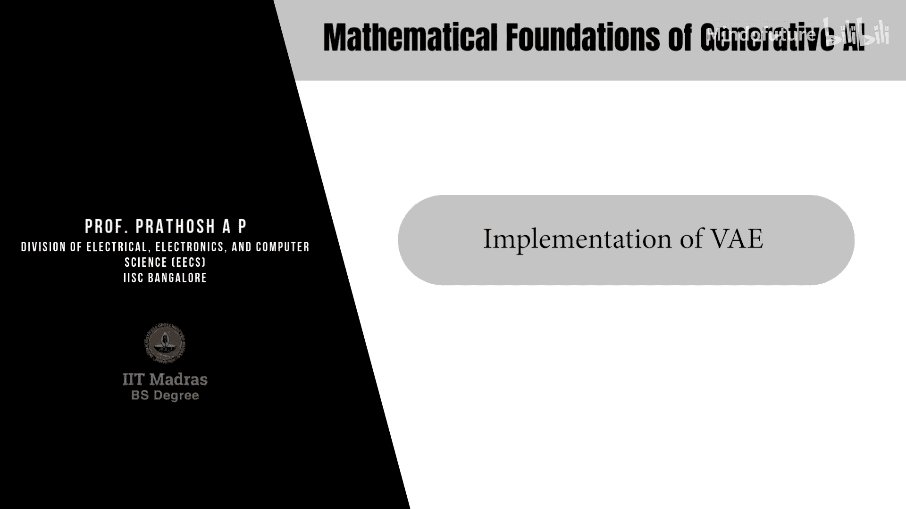
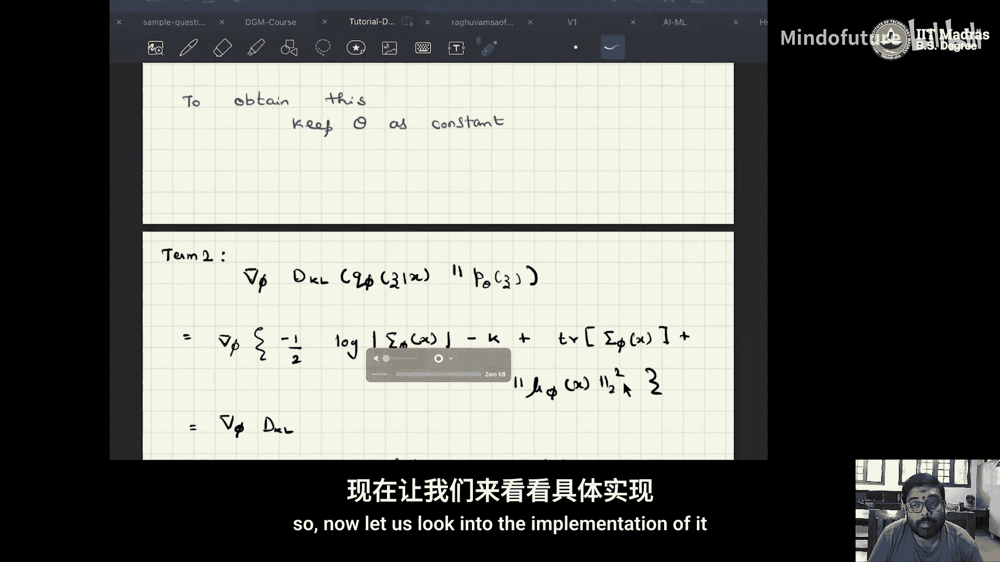
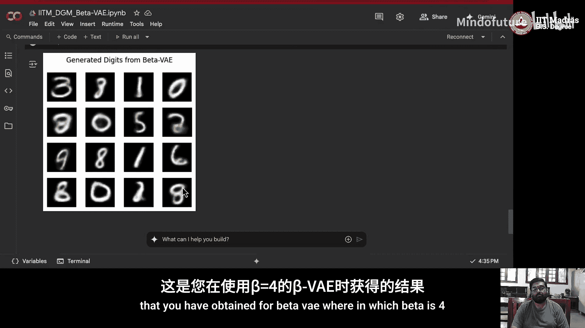
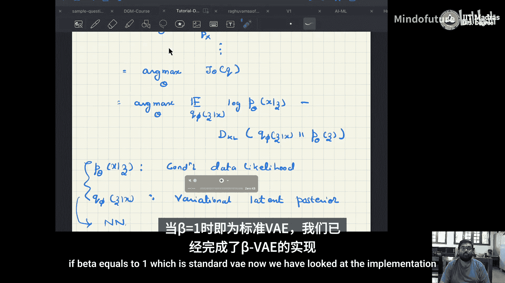
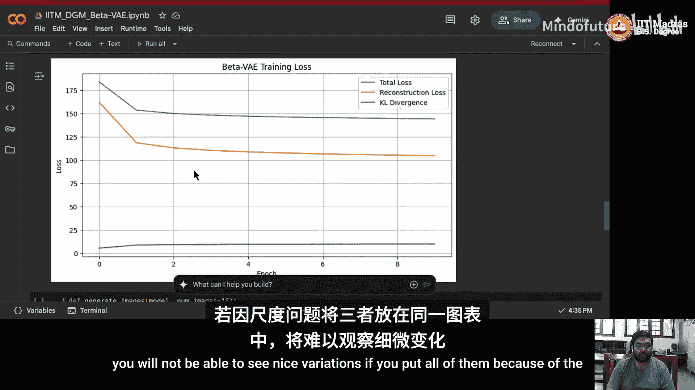
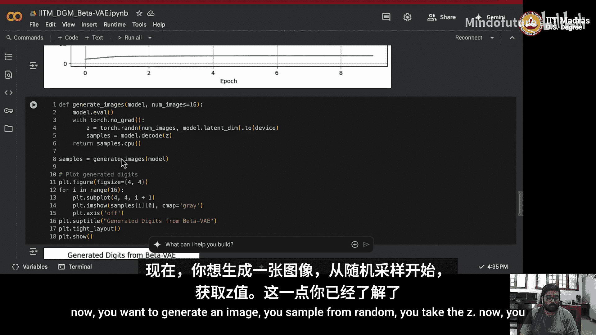
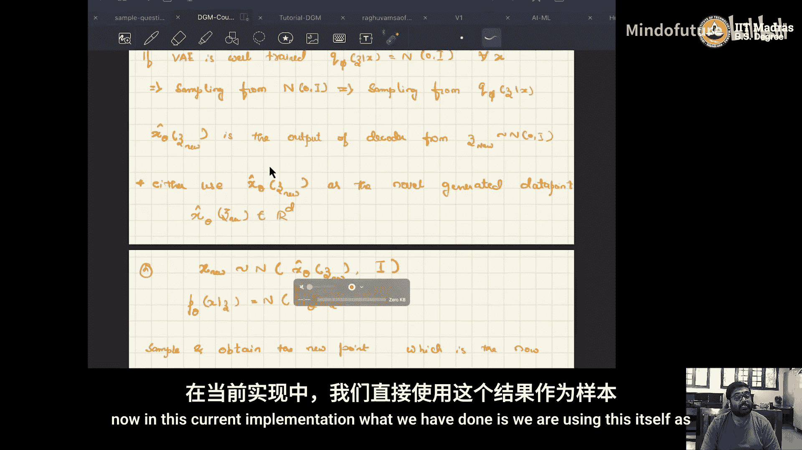
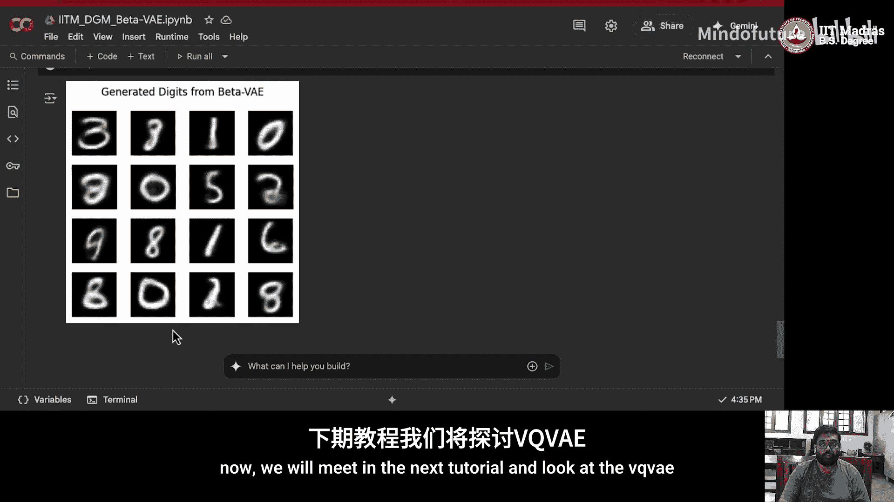

# 036：变分自编码器的实现 🎼



在本教程中，我们将学习如何实现变分自编码器。我们将回顾VAE的核心概念，详细解析其前向传播与反向传播过程，并最终通过一个具体的代码示例来展示如何构建和训练一个VAE模型。

## 变分自编码器回顾

上一节我们介绍了变分自编码器的基本概念。VAE是一种隐变量模型。给定数据集 `D = {x_i}_{i=1}^n`，其中 `x_i` 是从真实数据分布 `p(x)` 中独立同分布采样得到的，`x_i ∈ R^d`。

隐变量模型需要满足的条件是：
`p_θ(x) = ∫ p_θ(x, z) dz`，其中 `z ∈ R^k`，通常在实现中 `k` 远小于 `d`。

我们的目标是找到最优参数 `θ*`，以最小化真实数据分布 `p(x)` 与模型分布 `p_θ(x)` 之间的KL散度。这等价于最大化证据下界：
`J(θ, φ) = E_{q_φ(z|x)}[log p_θ(x|z)] - KL(q_φ(z|x) || p_θ(z))`。

其中：
*   `p_θ(x|z)` 被称为**条件数据似然**，由解码器建模。
*   `q_φ(z|x)` 被称为**变分隐变量后验**，由编码器建模。

我们使用神经网络来参数化这两个分布。编码器模型输入 `x`，输出隐变量后验分布 `q_φ(z|x)` 的参数（均值和方差）。解码器模型输入 `z`，输出数据生成分布 `p_θ(x|z)` 的参数。

## VAE的结构与流程

以下是VAE的核心结构示意图：


具体流程如下：
1.  **编码器**：输入数据 `x`，输出隐变量分布的均值 `μ_φ(x)` 和对角协方差矩阵的元素 `σ_φ(x)`（假设为高斯分布）。
2.  **重参数化**：为了进行可微分的采样，我们使用重参数化技巧：`z = μ_φ(x) + σ_φ(x) ⊙ ε`，其中 `ε ~ N(0, I)`。
3.  **解码器**：将采样得到的 `z` 输入解码器，输出重构数据 `x̂_θ` 或生成分布的参数。

### 前向传播过程

现在，让我们回顾一下VAE的前向传播步骤：

以下是前向传播的四个步骤：
1.  **编码**：给定数据 `x_i ∈ D`，将其输入编码器，得到均值 `μ_φ(x_i)` 和方差 `σ_φ(x_i)`。
2.  **采样噪声**：从标准正态分布 `N(0, I)` 中采样 `M` 个噪声向量 `ε_1, ..., ε_M`。这一步在神经网络计算图之外。
3.  **重参数化**：通过公式 `z_i = μ_φ(x_i) + σ_φ(x_i) ⊙ ε_i` 计算得到隐变量样本 `z_1, ..., z_M`。
4.  **解码**：将 `z_1, ..., z_M` 输入解码器，计算得到重构数据 `x̂_θ(z_i)`。

## 参数优化：反向传播

前向传播完成后，我们需要通过反向传播来优化模型参数。我们的目标函数包含两项，需要优化的参数有两组：编码器参数 `φ` 和解码器参数 `θ`。因此，我们需要计算四个梯度项。

### 训练编码器

要训练编码器（参数 `φ`），我们需要计算目标函数关于 `φ` 的梯度，这涉及两项。

**第一项梯度（重构项）**：
我们需要计算 `∇_φ E_{q_φ(z|x)}[log p_θ(x|z)]`。
通过重参数化，期望可转化为对噪声 `ε` 的期望，并通过蒙特卡洛采样近似：
`≈ (1/M) Σ_{j=1}^M ∇_φ log p_θ(x | g_φ(ε_j, x))`。

假设 `p_θ(x|z)` 是各向同性的高斯分布 `N(x̂_θ(z), I)`，则 `log p_θ(x|z)` 正比于 `-||x - x̂_θ(z)||^2`。
因此，该项的梯度正比于 `(1/M) Σ_{j=1}^M ∇_φ ||x_i - x̂_θ(z_j)||^2`。
这本质上是重构数据与原始数据之间的均方误差的梯度。如果数据（如图像像素）值在0到1之间，并且解码器输出使用了Sigmoid激活函数，此损失函数可视为二元交叉熵损失。

**第二项梯度（KL散度项）**：
我们需要计算 `∇_φ KL(q_φ(z|x) || p_θ(z))`。
我们假设先验 `p_θ(z)` 为标准正态分布 `N(0, I)`，变分后验 `q_φ(z|x)` 为对角高斯分布 `N(μ_φ(x), diag(σ_φ^2(x)))`。此时KL散度有解析解：
`KL = -1/2 Σ_{i=1}^k (1 + log(σ_i^2) - μ_i^2 - σ_i^2)`。
其中 `k` 是隐空间的维度。该项与 `θ` 无关。

**编码器参数更新**：
综合以上两项，编码器参数 `φ` 的更新公式为：
`φ_{t+1} = φ_t + α * ∇_φ J(θ, φ)`，其中梯度 `∇_φ J` 由重构项梯度和KL散度项梯度相加得到。

### 训练解码器

要训练解码器（参数 `θ`），我们需要计算目标函数关于 `θ` 的梯度。

**第一项梯度（重构项）**：
我们需要计算 `∇_θ E_{q_φ(z|x)}[log p_θ(x|z)]`。
与编码器训练类似，通过重参数化和蒙特卡洛采样，其梯度近似为 `(1/M) Σ_{j=1}^M ∇_θ log p_θ(x | z_j)`。
在计算此梯度时，反向传播在解码器处停止，不会继续流向编码器。

**第二项梯度（KL散度项）**：
`∇_θ KL(q_φ(z|x) || p_θ(z))`。如前所述，在标准VAE设定下，此项与 `θ` 无关，因此梯度为零。

**解码器参数更新**：
解码器参数 `θ` 的更新公式为：
`θ_{t+1} = θ_t + α * ∇_θ J(θ, φ)`，其中梯度 `∇_θ J` 仅由重构项的梯度构成。

**关于后验坍塌的提醒**：在优化过程中，KL散度项会迫使所有输入 `x` 对应的变分后验 `q_φ(z|x)` 都接近标准正态先验 `N(0, I)`。这可能导致“后验坍塌”问题，即不同输入对应的隐变量分布差异过小，模型无法有效区分它们，从而影响生成样本的多样性。

## VAE的代码实现

理论部分介绍完毕，现在让我们来看一个具体的实现。以下是使用PyTorch实现一个卷积VAE（在MNIST数据集上）的关键部分。

### 1. 导入库与准备数据

```python
import torch
import torch.nn as nn
import torch.optim as optim
from torchvision import datasets, transforms
from torch.utils.data import DataLoader
import matplotlib.pyplot as plt



# 数据转换：将图像转换为Tensor
transform = transforms.Compose([transforms.ToTensor()])
train_dataset = datasets.MNIST(root='./data', train=True, download=True, transform=transform)
train_loader = DataLoader(train_dataset, batch_size=128, shuffle=True)
```

### 2. 定义Beta-VAE模型

我们实现一个Beta-VAE，其中超参数 `beta` 用于加权KL散度项。当 `beta=1` 时，即为标准VAE。

```python
class BetaVAE(nn.Module):
    def __init__(self, latent_dim=20):
        super(BetaVAE, self).__init__()
        self.latent_dim = latent_dim
        
        # 编码器
        self.encoder = nn.Sequential(
            nn.Conv2d(1, 32, kernel_size=4, stride=2, padding=1), # 28x28 -> 14x14
            nn.ReLU(),
            nn.Conv2d(32, 64, kernel_size=4, stride=2, padding=1), # 14x14 -> 7x7
            nn.ReLU(),
            nn.Conv2d(64, 128, kernel_size=3, stride=2, padding=1), # 7x7 -> 4x4
            nn.ReLU(),
            nn.Flatten(), # 输出形状: 128 * 4 * 4 = 2048
            nn.Linear(128 * 4 * 4, 256),
            nn.ReLU()
        )
        # 输出隐变量的均值和对数方差（为了数值稳定性）
        self.fc_mu = nn.Linear(256, latent_dim)
        self.fc_logvar = nn.Linear(256, latent_dim)
        
        # 解码器
        self.decoder_input = nn.Linear(latent_dim, 256)
        self.decoder = nn.Sequential(
            nn.Linear(256, 128 * 4 * 4),
            nn.ReLU(),
            nn.Unflatten(1, (128, 4, 4)), # 重塑为 (128, 4, 4)
            nn.ConvTranspose2d(128, 64, kernel_size=3, stride=2, padding=1), # 4x4 -> 7x7
            nn.ReLU(),
            nn.ConvTranspose2d(64, 32, kernel_size=4, stride=2, padding=1), # 7x7 -> 14x14
            nn.ReLU(),
            nn.ConvTranspose2d(32, 1, kernel_size=4, stride=2, padding=1), # 14x14 -> 28x28
            nn.Sigmoid() # 将输出压缩到 [0, 1] 区间
        )
    
    def encode(self, x):
        h = self.encoder(x)
        mu = self.fc_mu(h)
        logvar = self.fc_logvar(h)
        return mu, logvar
    
    def reparameterize(self, mu, logvar):
        std = torch.exp(0.5 * logvar)
        eps = torch.randn_like(std)
        return mu + eps * std
    
    def decode(self, z):
        h = self.decoder_input(z)
        reconstruction = self.decoder(h)
        return reconstruction
    
    def forward(self, x):
        mu, logvar = self.encode(x)
        z = self.reparameterize(mu, logvar)
        reconstruction = self.decode(z)
        return reconstruction, mu, logvar
```

### 3. 定义损失函数

```python
def loss_function(recon_x, x, mu, logvar, beta=4):
    # 重构损失：二元交叉熵（因为输入和输出都在0-1之间）
    BCE = nn.functional.binary_cross_entropy(recon_x, x, reduction='sum')
    # KL散度损失
    KLD = -0.5 * torch.sum(1 + logvar - mu.pow(2) - logvar.exp())
    # 总损失 = 重构损失 + beta * KL损失
    total_loss = BCE + beta * KLD
    return total_loss, BCE, KLD
```

### 4. 训练循环

```python
device = torch.device("cuda" if torch.cuda.is_available() else "cpu")
model = BetaVAE(latent_dim=20).to(device)
optimizer = optim.Adam(model.parameters(), lr=1e-3)

epochs = 10
beta = 4

for epoch in range(epochs):
    model.train()
    train_loss = 0
    recon_losses = 0
    kld_losses = 0
    
    for batch_idx, (data, _) in enumerate(train_loader):
        data = data.to(device)
        optimizer.zero_grad()
        
        recon_batch, mu, logvar = model(data)
        loss, BCE, KLD = loss_function(recon_batch, data, mu, logvar, beta)
        
        loss.backward()
        train_loss += loss.item()
        recon_losses += BCE.item()
        kld_losses += KLD.item()
        
        optimizer.step()
    
    avg_loss = train_loss / len(train_loader.dataset)
    avg_recon = recon_losses / len(train_loader.dataset)
    avg_kld = kld_losses / len(train_loader.dataset)
    print(f'Epoch {epoch+1}, Total Loss: {avg_loss:.4f}, Recon Loss: {avg_recon:.4f}, KLD Loss: {avg_kld:.4f}')
```

### 5. 生成新样本

训练完成后，我们可以从隐变量的先验分布 `N(0, I)` 中采样，然后通过解码器生成新图像。

```python
model.eval()
with torch.no_grad():
    # 从标准正态分布采样隐变量
    z_sample = torch.randn(64, 20).to(device) # 生成64个样本
    # 通过解码器生成图像
    generated = model.decode(z_sample).cpu()
    # 可视化生成的图像
    # ... (绘图代码)
```

以下是训练过程中损失下降的示意图，以及当 `beta=4` 时模型生成的手写数字样本示例：









## 总结与建议

在本节课中，我们一起学习了变分自编码器的实现。我们从理论出发，回顾了VAE的证据下界目标函数，详细推导了其前向传播和针对编码器、解码器的反向传播梯度更新过程。随后，我们通过一个具体的PyTorch代码示例，展示了如何构建一个卷积Beta-VAE模型，包括网络结构定义、重参数化技巧、损失计算以及训练循环。

**核心要点总结**：
1.  VAE通过编码器-解码器结构，并引入重参数化技巧，实现了对概率生成模型的可微分训练。
2.  目标函数包含**重构损失**和**KL散度正则项**，后者迫使隐变量分布接近预设的先验分布（如标准正态分布）。
3.  超参数 `beta` 平衡了重构能力与隐空间正则化的强度。`beta=1` 是标准VAE。调整 `beta` 会影响生成图像的质量和多样性。
4.  训练时，编码器的梯度来自重构项和KL散度项，而解码器的梯度仅来自重构项。



**练习建议**：
*   尝试调整 `beta` 的值（例如0.25, 0.5, 1, 2, 4, 8），观察训练损失曲线和生成样本质量的变化。
*   增加训练轮数（epochs），观察重构效果是否提升。
*   尝试更改隐变量维度 `latent_dim`，观察其对模型容量和生成结果的影响。
*   了解“后验坍塌”现象，并思考如何通过改进模型结构或目标函数来缓解它。


通过本教程，你应该已经掌握了实现和训练一个基本VAE模型的能力。在接下来的教程中，我们将探讨更先进的生成模型，如VQ-VAE。




