生成式AI的数学基础：6：VQ-VAE的实现 🎼

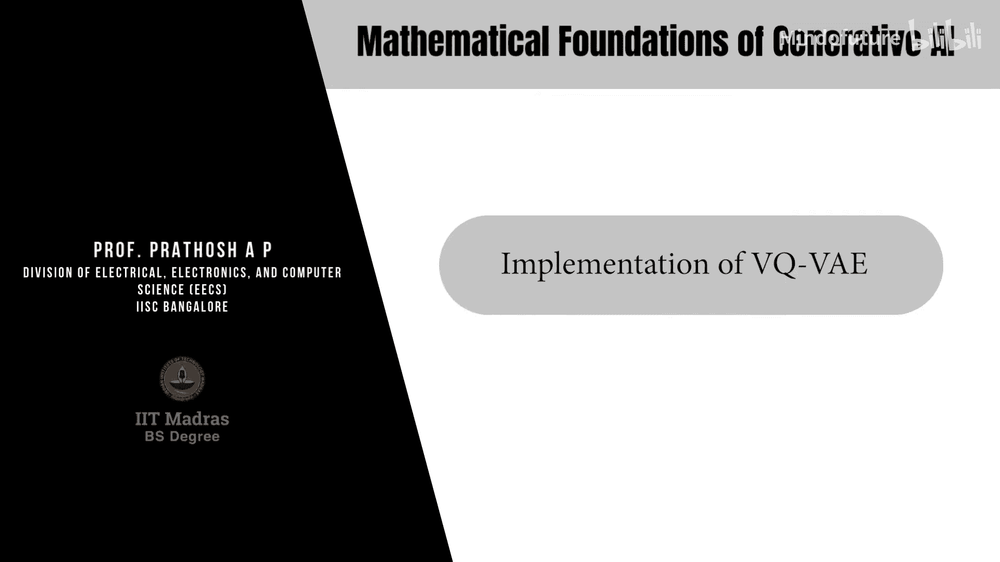

在本教程中，我们将学习一种变分自编码器的变体，称为向量量化变分自编码器。VQ-VAE与之前学习的标准VAE和β-VAE的主要区别在于，其潜在空间是离散的。

现在，我们将了解如何使用这些潜在向量来构建一个可学习的字典，通常称为码本。然后，我们将探讨其工作原理。

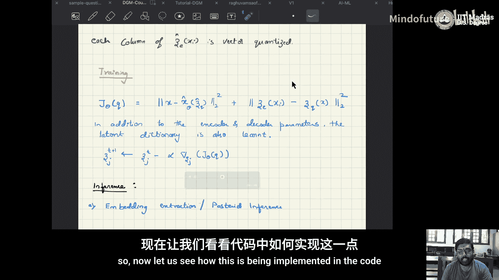

其优化目标函数包含标准的重构损失。此外，还包含一个潜在向量与量化后向量之间的均方误差损失。

接下来，让我们看看如何在代码中实现它。

以下是所需的库，我们现在应该很熟悉了。这里使用了一个向量量化器，它是VQ-VAE网络的一部分。我们先查看这个网络，然后深入了解向量量化器。

在VQ-VAE网络中，编码器部分包含卷积层，解码器部分包含转置卷积层。在前向传播方法中，输入通过编码器得到潜在表示 `z`，然后将 `z` 通过量化器得到量化后的结果。量化后的向量再通过解码器以获得重构输出。最后，计算重构损失，并利用该损失更新网络权重。

VQ-VAE可用于嵌入提取，也称为后验推断，也可用于样本生成。现在，让我们具体查看向量量化器。

向量量化器包含一定数量的嵌入向量，每个嵌入向量具有特定的维度。此外，还涉及一个称为“承诺损失”的项。我们将在查看向量量化器代码时详细讨论它。

首先，`num_embeddings` 参数定义了码本或字典的大小，即需要多少个离散向量。`embedding_dim` 参数定义了码本中每个向量的维度。`commitment_cost` 是一个标量，用于权衡两个特定的损失项。

接着，创建一个嵌入矩阵，其大小为 `num_embeddings` × `embedding_dim`。如果设 `num_embeddings` 为 K，`embedding_dim` 为 D，那么就创建了一个 K × D 的字典。权重的初始化采用均匀分布，范围从 `-1/num_embeddings` 到 `1/num_embeddings`。这个初始化步骤不是必须的。

第一步是获得潜在表示 `z`。让我们回顾一下 `z` 是如何得到的。

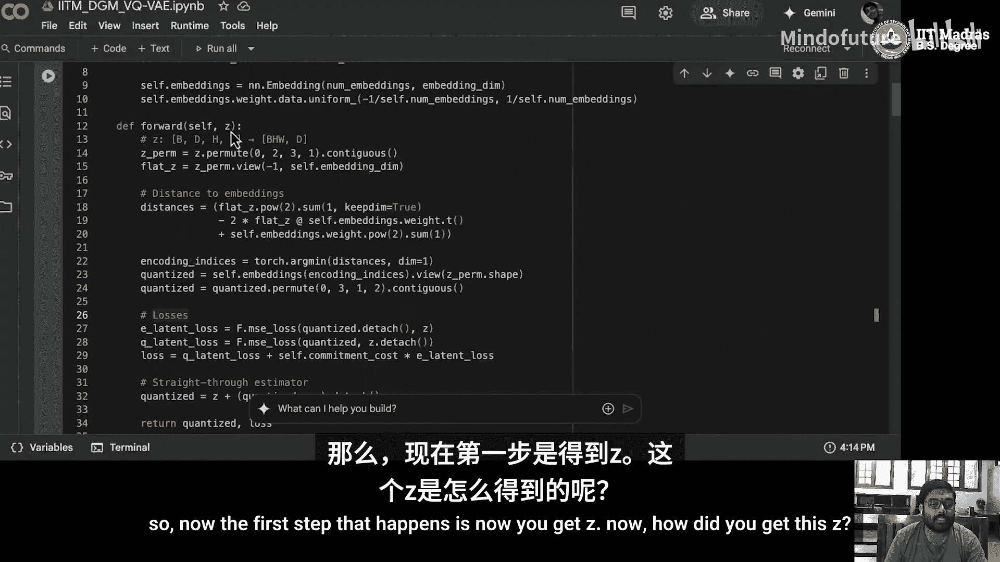

输入 `x` 通过编码器，得到该 `x` 对应的编码后潜在表示 `z`。

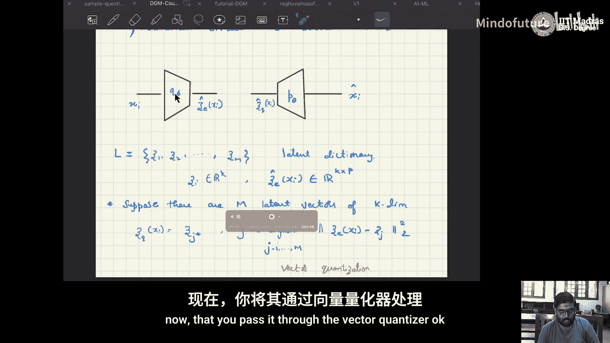

然后，`z` 被送入向量量化器。现在，让我们看看 `z` 的维度以更好地理解。这里的维度是 `32 × 7 × 7`。实际上，这是嵌入维度乘以空间维度 `7 × 7`。输入维度格式为 `(B, D, H, W)`，即批次大小、通道数、高度、宽度。

接着，对维度进行置换，将格式从 `(B, D, H, W)` 转换为 `(B, H, W, D)`，即把通道维度 `D` 移到最后。然后，将其转换为一个矩阵，大小为 `(B*H*W, D)`。这两个步骤在代码中完成。

之后，需要为每个输入向量在码本中找到最近的嵌入向量。为此，计算每个输入向量与码本中所有嵌入向量之间的距离，并找到最小距离对应的索引。这代表了最近的嵌入向量。

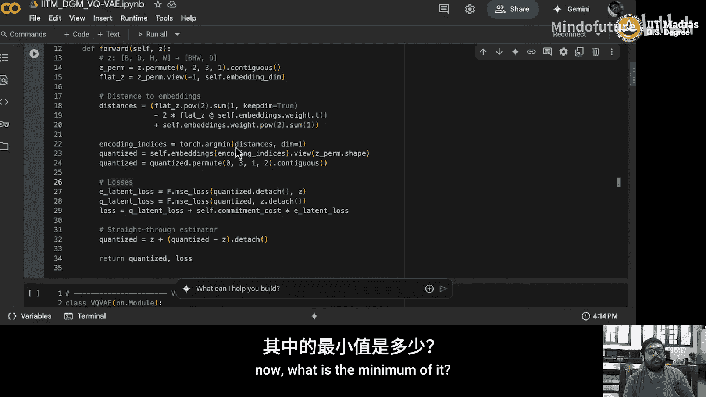

通过这个过程，我们得到了最近的嵌入向量。

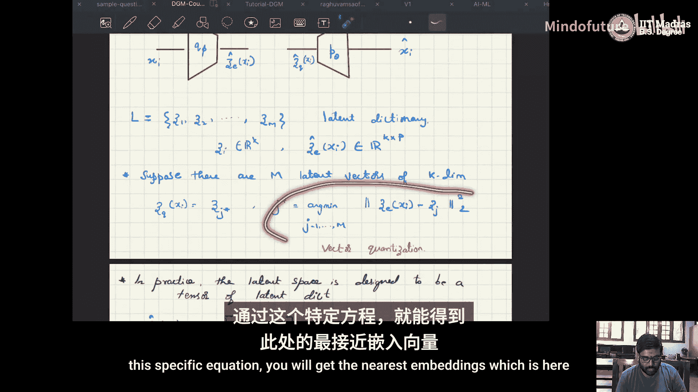

一旦获得最近的嵌入向量，就需要将其重塑并传递给解码器。为此，首先将其重塑为 `(B, H, W, D)` 的格式。具体做法是，先使用 `.view` 方法将其转换为向量，然后根据参数 `z_shape` 改变形状。接着，使用 `.permute(0, 3, 1, 2)` 将其维度顺序转换为 `(B, D, H, W)`。这样就得到了量化后的向量 `quantized`。

量化完成后，接下来是计算损失。这部分非常关键。

我们之前提到了“承诺损失”。承诺损失鼓励编码器的输出 `z` 靠近量化后的嵌入向量 `z_q`。为了实现这一点，代码中执行了 `.detach()` 操作。这是为了防止梯度通过码本反向传播。

另一方面，在码本损失中，我们希望更新码本的可学习参数，将嵌入向量拉向编码器的输出。在这里，我们阻止了从编码器到码本的梯度，以防止编码器基于这部分损失进行训练。

最后，使用 `commitment_cost` 这个标量来权衡这两种损失。通过调整 `commitment_cost`，可以控制对承诺损失的重视程度。

计算完损失后，将量化后的结果和损失返回。以上就是网络结构的相关内容。

接下来是标准的训练流程：创建VQ-VAE实例，设置优化器等。

训练时，将模型设置为训练模式，获取输入 `x` 并将其移至相应设备。然后将 `x` 送入模型，得到重构输出 `x_hat` 和VQ损失。

我们需要计算重构损失。回忆一下目标函数，它由重构损失和VQ损失组成。

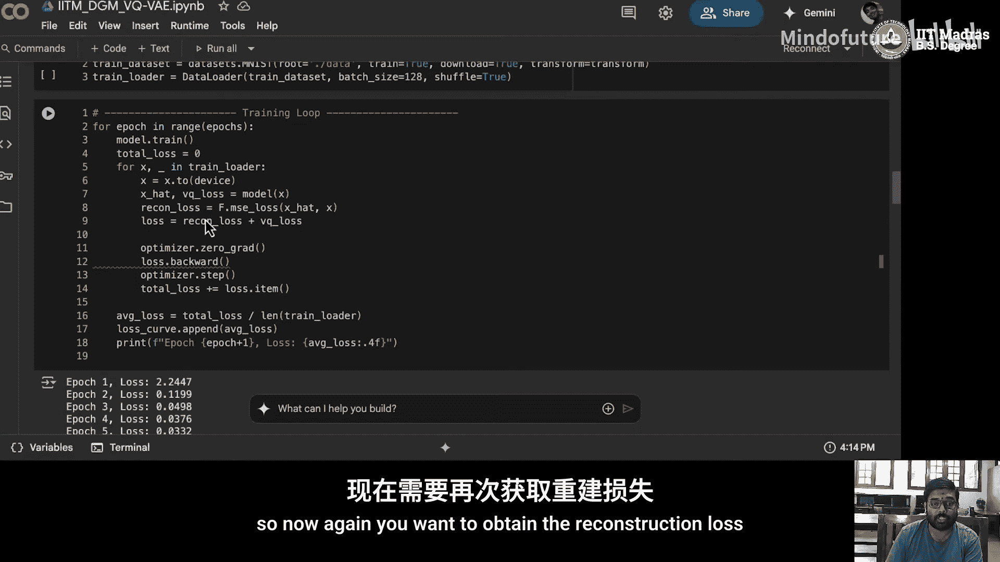

VQ损失来自向量量化器，重构损失是均方误差。将两者相加得到总损失。

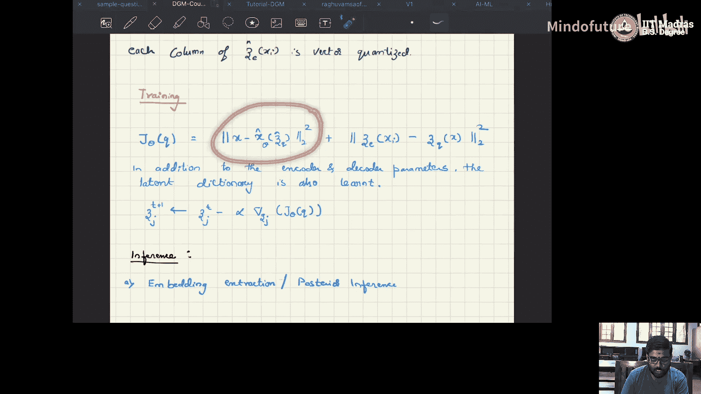

然后，通过 `loss.backward()` 计算梯度，并使用优化器更新网络权重。同时，进行一些日志记录以跟踪损失变化。

训练完成后，可以进行重构。这里展示了两种方式：一种是将 `x` 通过编码器得到 `z`，再将 `z` 量化后通过解码器得到重构输出；另一种是完整的流程。第一张图是原始图像，第二张图是重构图像。这是对输入进行重构的标准过程。

一个重要的问题是：如何进行采样生成新样本？这涉及到从学习到的离散潜在分布中进行采样。

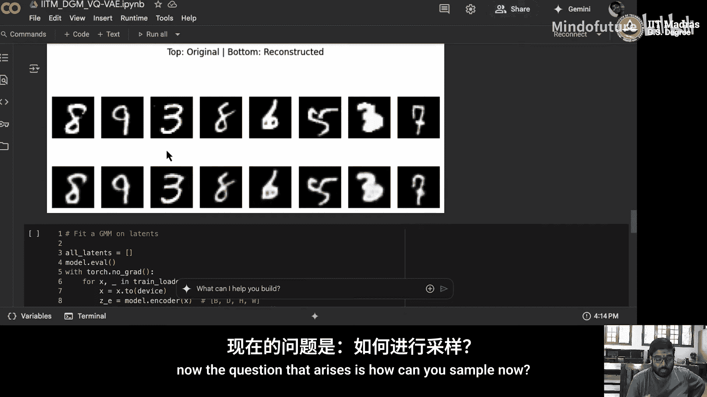

为了从该分布中采样，我们需要知道其分布形式。一种方法是训练一个高斯混合模型来拟合这个分布。

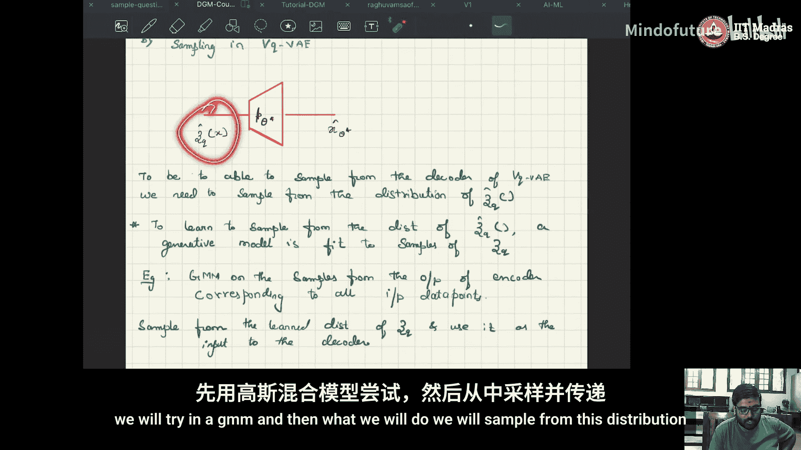

具体做法是，首先获取所有训练数据的潜在表示。

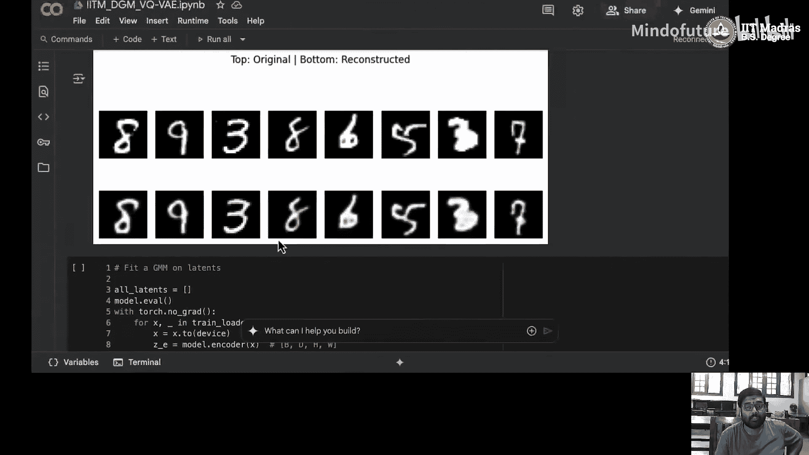

将模型设置为评估模式，然后仅通过编码器获取所有潜在表示 `z`。对 `z` 进行维度置换和重塑，并将其收集到一个列表中。

现在，我们有了所有潜在表示的集合。接下来，使用Scikit-learn的`GaussianMixture`模型来训练一个GMM。这里设置了100个混合成分，但这会导致训练时间很长，因此可以酌情减少成分数量（如20-30个）。用所有潜在表示来拟合这个GMM。

拟合好GMM后，从中采样新的潜在向量。然后，对于每个采样得到的潜在向量，计算其与码本中所有嵌入向量之间的距离，并找到距离最小的那个嵌入向量。

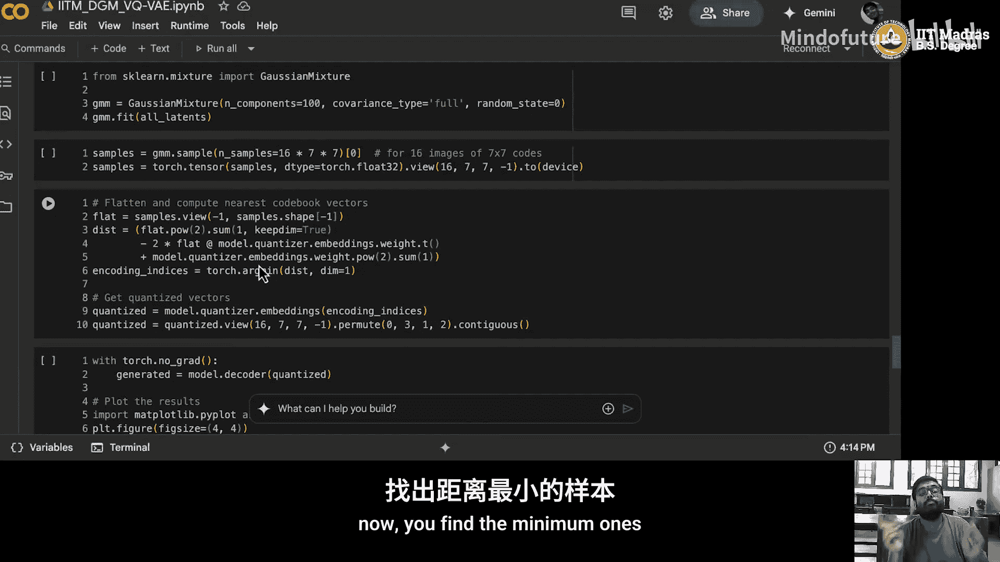

这个过程就是为采样的潜在向量找到最近的码本嵌入。

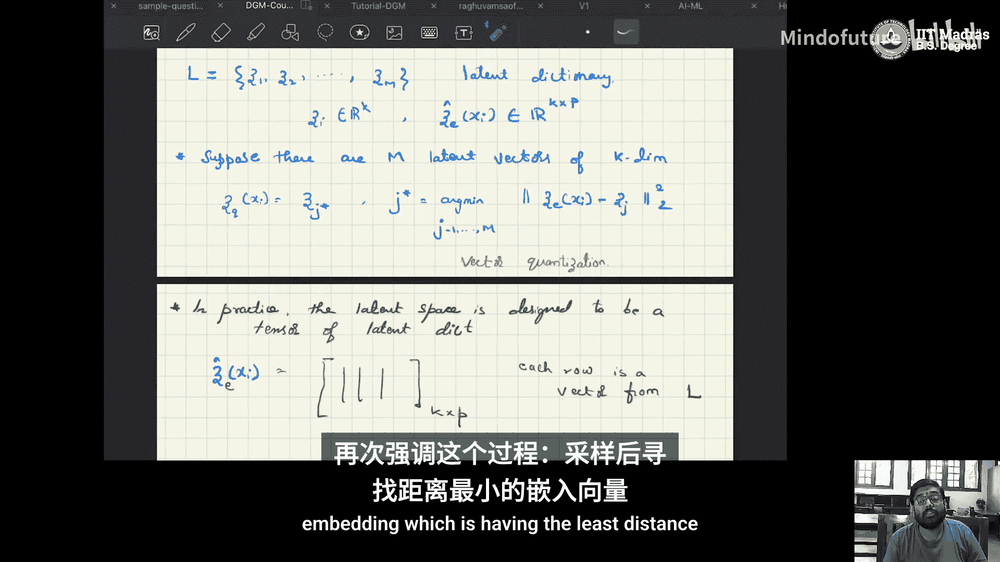

最后，将这个找到的嵌入向量通过解码器，生成新的样本图像。需要注意的是，示例中生成的图像质量较差，这是因为GMM没有经过充分训练，而不是VQ-VAE结构本身的问题。如果使用更少的混合成分并充分训练GMM，采样生成的效果会更好。这留作一个练习。

VQ-VAE的核心思想是拥有一个离散的潜在空间，它可以用于获取数据的嵌入表示，也可以用于生成新的样本。

本节课我们一起学习了向量量化变分自编码器的基本原理和实现步骤，包括其离散潜在空间、码本学习、损失函数构成以及如何进行样本生成。我们将在下一个教程中继续探讨其他主题。

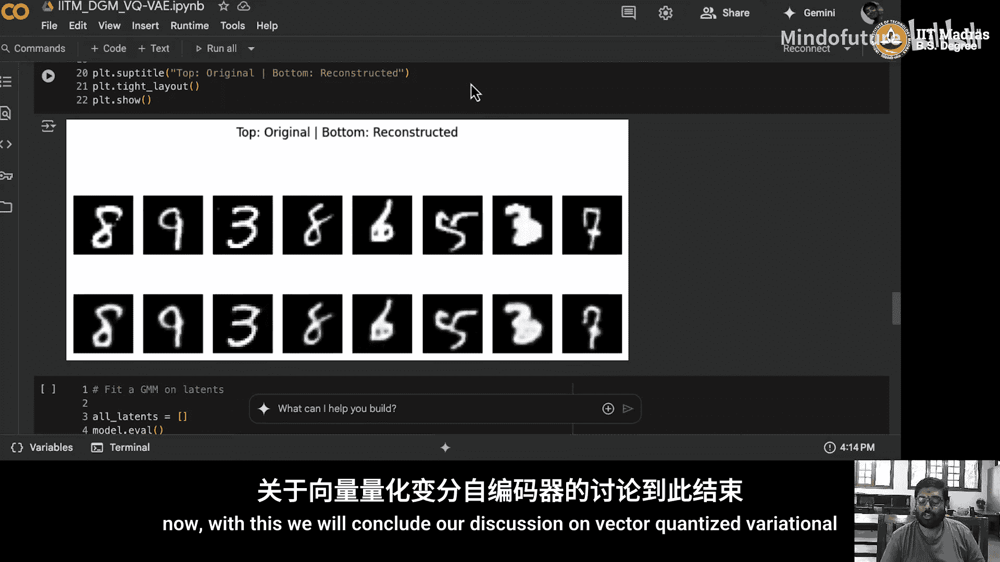

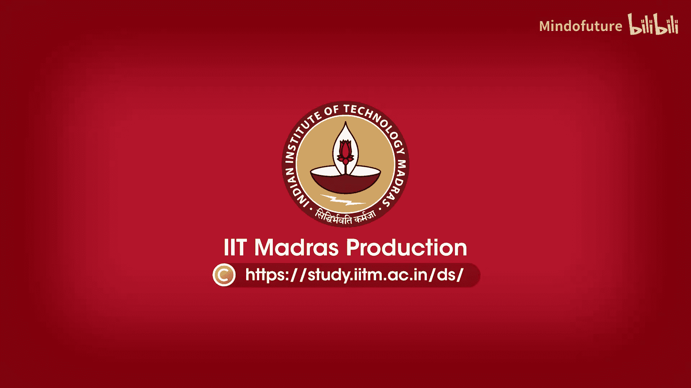

