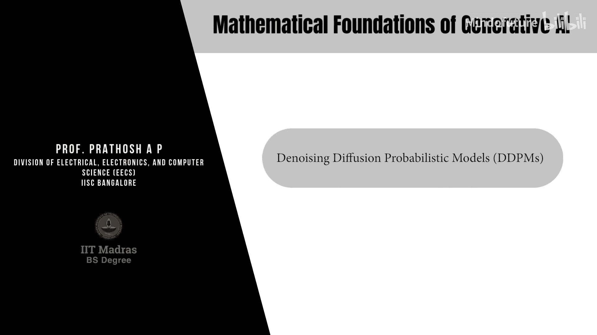
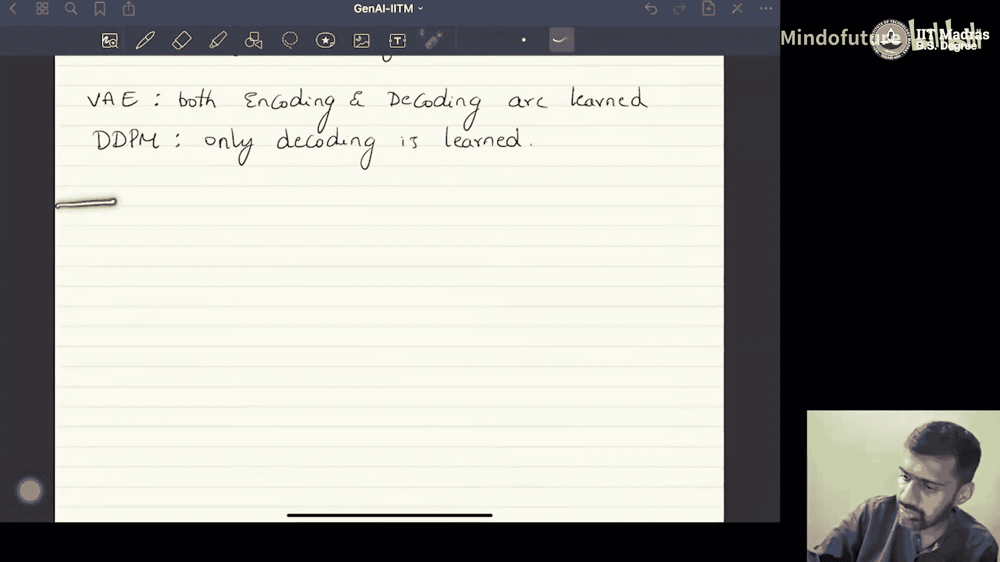
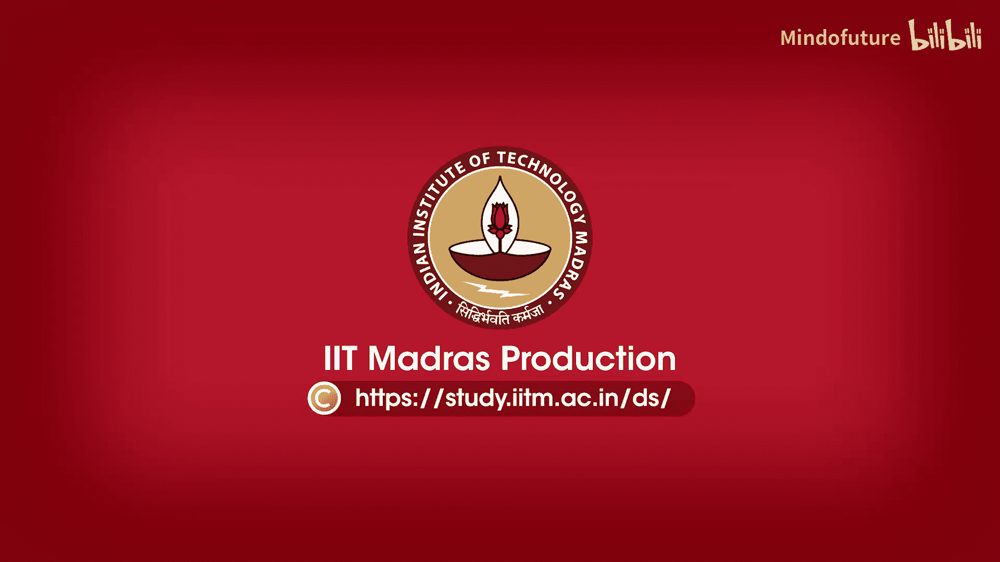

# 038：去噪扩散概率模型（DDPMs）🎼

在本节课中，我们将学习去噪扩散概率模型，简称DDPMs或扩散模型。这些模型是当前条件图像生成等任务的最先进技术。我们将从潜变量模型的角度来理解扩散模型，并将其视为分层变分自编码器的一种特殊形式。

## 概述

我们面临的问题是：给定一个从未知分布 `p(x)` 中独立同分布采样的数据集 `D = {x1, x2, ..., xn}`。生成式建模的目标是学习如何从这个未知分布 `p(x)` 中进行采样。

DDPMs 从潜变量模型的角度来解决这个问题。具体来说，我们可以将 DDPMs 视为一类称为**分层变分自编码器**的潜变量生成模型的特殊案例。

## 从变分自编码器到分层变分自编码器

首先，让我们回顾一下标准变分自编码器的基本思想。

在VAE中，我们有一个数据空间 `x` 和一个潜空间 `z`。编码过程将数据从数据空间投影到潜空间，解码过程则从潜空间映射回数据空间。整个过程通过最小化证据下界来优化。

**公式表示：**
*   编码分布：`q_φ(z|x)`
*   解码分布：`p_θ(x|z)`

在分层变分自编码器中，情况有所不同。与VAE只有一个潜空间不同，分层VAE拥有**多个潜空间**，并以分层方式组织。

**过程描述：**
1.  **编码**：数据首先被投影到第一个潜空间 `z1`，然后从 `z1` 转移到第二个潜空间 `z2`，依此类推，直到第 `T` 个潜空间 `zT`。
2.  **解码**：过程与编码相反，从 `zT` 开始，逐步映射回 `z(T-1)`，`z(T-2)`，最终回到数据空间 `x`。

这种设计的直觉在于：将数据的所有信息压缩到一个低维潜空间的一步转换可能很困难。而以分层、“缓慢”的方式进行多次投影，可能使数据的编码和重建（解码）变得更加容易。

## 扩散模型的三个核心特性

扩散模型可以看作是一种具有以下三个特定属性的分层变分自编码器：

1.  **多个潜空间**：与分层VAE一样，DDPM包含一系列潜变量 `z1, z2, ..., zT`。
2.  **维度一致**：在DDPM中，**所有潜空间的维度都与数据空间的维度相同**。这与VAE通常使用低维潜空间的做法不同。
3.  **固定的编码过程**：这是最关键的区别。在DDPM中，**编码过程是一个固定的、非学习的概率过程**。只有解码过程是需要学习的。

**对比总结：**
*   在 **VAE** 中，编码和解码过程都是可学习的。
*   在 **DDPM** 中，只有解码过程是可学习的；编码过程是固定的。

这种设计的直觉部分来源于随机微分方程理论。在生成式建模中，我们最终需要的是从潜空间到数据空间的映射（解码器）。如果我们有一个固定的、将数据“扩散”到潜空间的编码过程，那么只要我们能学会逆转这个过程，就得到了一个生成模型。因此，编码过程本身并不一定需要是可学习的。

## 构建与学习扩散模型

上一节我们介绍了扩散模型作为分层VAE的特殊形式及其核心特性。本节中，我们来看看如何具体构建和学习一个扩散模型。

基于以上特性，一个DDPM的框架可以概括如下：
*   **前向过程（编码）**：这是一个固定的马尔可夫链，逐步向数据 `x` 添加高斯噪声，经过 `T` 步后，数据逐渐变为纯噪声 `zT`。这个过程是预先定义且不可学习的。
*   **反向过程（解码）**：这是一个需要学习的马尔可夫链，其目标是学习如何从噪声 `zT` 开始，逐步去噪，最终重建出数据 `x`。这个过程通过神经网络参数化。

学习的目标是训练反向过程的神经网络，使其能够准确地逆转前向的加噪过程。通过优化一个与变分下界相关的目标函数，模型最终学会从简单的噪声分布中生成复杂的数据样本。

## 总结

本节课中，我们一起学习了去噪扩散概率模型的基础。我们首先回顾了生成式建模的问题定义，然后从潜变量模型的视角出发，将DDPM理解为一种特殊的分层变分自编码器。我们重点阐述了DDPM的三个核心特性：多个潜空间、潜空间与数据空间维度一致，以及编码过程固定、仅解码过程可学习。这些特性为理解扩散模型如何通过逐步去噪从噪声中生成数据奠定了理论基础。