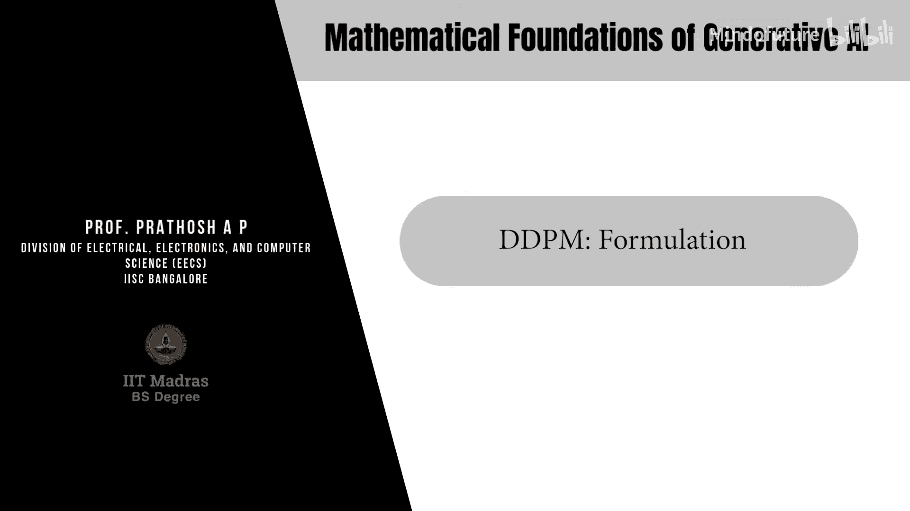
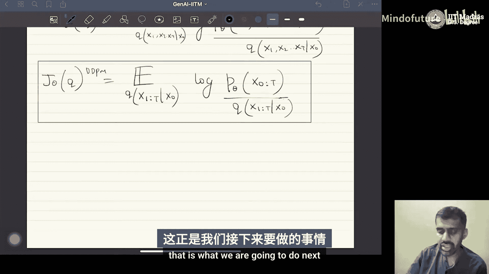
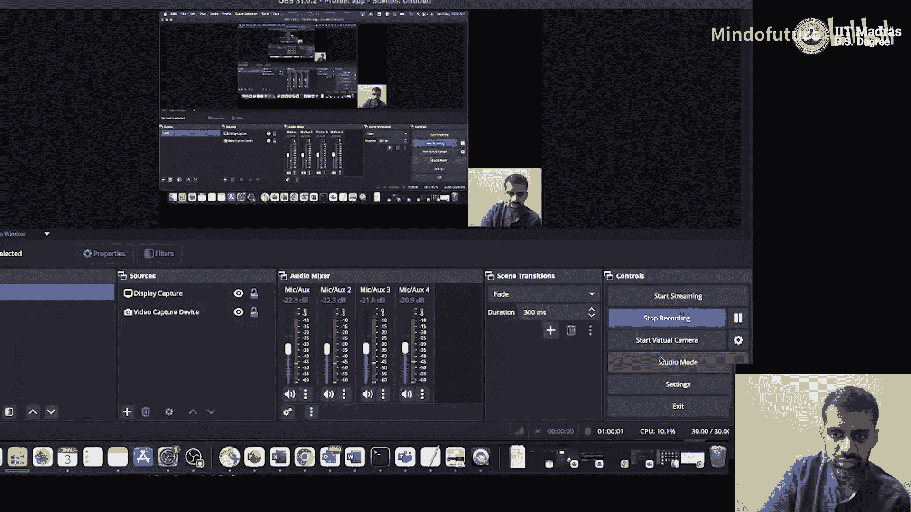

# 039：DDPM公式推导

## 概述
在本节课中，我们将学习去噪扩散概率模型（DDPM）的数学公式。我们将了解其前向过程（编码）和反向过程（解码）的定义，并推导出其核心的训练目标——证据下界（ELBO）。我们将看到DDPM如何通过一个固定的、逐步添加噪声的前向过程，以及一个可学习的、逐步去噪的反向过程来生成数据。

## 前向过程（编码）🔀
上一节我们介绍了DDPM的基本概念，本节中我们来看看其数学形式化定义。首先，我们需要明确DDPM中的符号约定。在DDPM文献中，数据点本身用 **x₀** 表示，而一系列潜在变量则用 **x₁, x₂, ..., x_T** 表示。请注意，这与我们之前在VAE中使用 **z** 表示潜在变量的习惯不同，但为了与主流文献保持一致，我们在此采用DDPM的符号体系。

前向过程，也称为编码过程，是一个固定的、非学习的随机过程。它从一个数据点 **x₀** 开始，通过一系列步骤逐步向其添加高斯噪声，最终得到一个纯噪声 **x_T**。

以下是前向过程的定义步骤：
1.  从数据点 **x₀** 开始。
2.  第一步：**x₁ = √α₁ * x₀ + √(1-α₁) * ε₁**，其中 **ε₁ ~ N(0, I)**。
3.  第二步：**x₂ = √α₂ * x₁ + √(1-α₂) * ε₂**，其中 **ε₂ ~ N(0, I)**。
4.  以此类推，第t步：**x_t = √α_t * x_{t-1} + √(1-α_t) * ε_t**，其中 **ε_t ~ N(0, I)**。

这里的 **α₁, α₂, ..., α_T** 是介于0和1之间的固定标量，构成了所谓的“方差表”。**ε_t** 是从标准正态分布中采样的噪声向量。这个过程可以直观地理解为：从一张清晰的图片（**x₀**）开始，每一步都为其添加一点噪声，经过足够多的步骤T后，图片就变成了完全无意义的噪声（**x_T**）。

从概率角度看，这个前向过程定义了一个一阶马尔可夫链。这意味着给定前一个状态 **x_{t-1}**，当前状态 **x_t** 的条件分布独立于更早的历史状态。

因此，我们可以将每一步的转移概率定义为高斯分布：
**q(x_t | x_{t-1}) = N(x_t; √α_t * x_{t-1}, (1-α_t) * I)**

## 模型定义（反向过程）🔄
在定义了固定的前向过程之后，我们需要定义模型本身，即反向过程或解码过程。与VAE不同，在DDPM中，只有反向过程是需要学习的。

模型定义了数据 **x₀** 和所有潜在变量 **x₁:T** 的联合分布。我们假设反向过程也是一个一阶马尔可夫链，但它的转移概率是带有可学习参数的高斯分布。

模型分布 **p_θ** 定义如下：
**p_θ(x₀, x₁, ..., x_T) = p_θ(x_T) * ∏_{t=1}^{T} p_θ(x_{t-1} | x_t)**

其中，每一步的反向转移概率被建模为高斯分布：
**p_θ(x_{t-1} | x_t) = N(x_{t-1}; μ_θ(x_t, t), Σ_θ(x_t, t))**

这里的 **μ_θ** 和 **Σ_θ** 是以 **x_t** 和时间步 **t** 为输入、由神经网络参数化的函数，它们是我们要学习的核心。反向过程的目标是：从一个纯噪声 **x_T ~ N(0, I)** 开始，通过这个学习到的马尔可夫链，一步步“去噪”，最终生成一个逼真的数据样本 **x₀**。

## 证据下界（ELBO）推导🎯
现在，我们有了前向过程 **q**（固定）和模型分布 **p_θ**（可学习）。为了训练模型参数 **θ**，我们需要最大化数据 **x₀** 的似然 **p_θ(x₀)**。与VAE一样，我们通过最大化其证据下界（ELBO）来间接最大化这个似然。

DDPM的ELBO形式如下：
**L = E_{q(x_{1:T} | x₀)} [ log( p_θ(x₀, x_{1:T}) / q(x_{1:T} | x₀) ) ]**

将我们之前定义的联合分布代入，并经过一系列代数推导（利用马尔可夫链的性质和贝叶斯定理），这个ELBO可以分解为以下几项：
1.  **重构项**：衡量模型从第一个潜在变量 **x₁** 重建数据 **x₀** 的能力。
2.  **先验匹配项**：确保最终噪声 **x_T** 与标准正态先验匹配。
3.  **去噪匹配项（核心）**：这是一系列项的总和，每一项都衡量了反向过程的一步 **p_θ(x_{t-1} | x_t)** 与前向过程对应的后验分布 **q(x_{t-1} | x_t, x₀)** 之间的相似度。

其中，**去噪匹配项** 是训练的关键。一个重要的推导结果是，前向过程的后验分布 **q(x_{t-1} | x_t, x₀)** 也是一个高斯分布，其均值是 **x_t**、**x₀** 和噪声 **ε** 的线性组合。

这使得ELBO的目标可以简化为一个非常直观的形式：训练神经网络 **ε_θ** 来预测在前向过程中添加到 **x_{t-1}** 上以得到 **x_t** 的噪声 **ε**。也就是说，对于任意时间步 **t**，我们：
1.  从数据 **x₀** 开始，根据前向过程采样得到 **x_t**。
2.  模型 **ε_θ** 以 **x_t** 和时间 **t** 为输入，尝试预测所使用的噪声 **ε**。
3.  训练目标是最小化预测噪声与实际噪声之间的均方误差。

最终，我们得到简化的训练目标函数：
**L_simple(θ) = E_{t, x₀, ε} [ || ε - ε_θ( √ᾱ_t * x₀ + √(1-ᾱ_t) * ε, t ) ||² ]**
其中 **ᾱ_t = ∏_{i=1}^{t} α_i**。

## 总结
本节课中，我们一起学习了DDPM的核心数学公式。
*   我们明确了DDPM的符号：**x₀** 是数据，**x₁,...,x_T** 是潜在变量。
*   我们定义了**固定的前向过程**：一个通过添加高斯噪声将数据逐渐变为纯噪声的马尔可夫链。
*   我们定义了**可学习的反向过程模型**：一个通过去噪从噪声生成数据的马尔可夫链，其参数由神经网络预测。
*   我们推导了DDPM的**证据下界（ELBO）**，并展示了如何通过简化，将训练目标转化为一个**噪声预测任务**。即训练一个网络 **ε_θ**，使其能够预测在任何给定时间步 **t** 和带噪数据 **x_t** 的情况下所添加的噪声。这个简单而强大的目标是DDPM能够成功生成高质量数据的关键。