# 040：U-Net架构详解 🧠

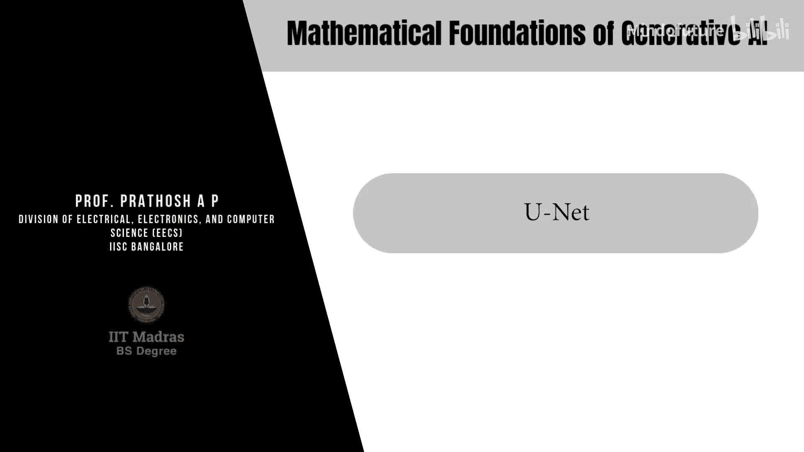

在本节课中，我们将学习一种名为U-Net的有趣新架构。U-Net架构主要用于图像分割任务。

## 什么是图像分割？

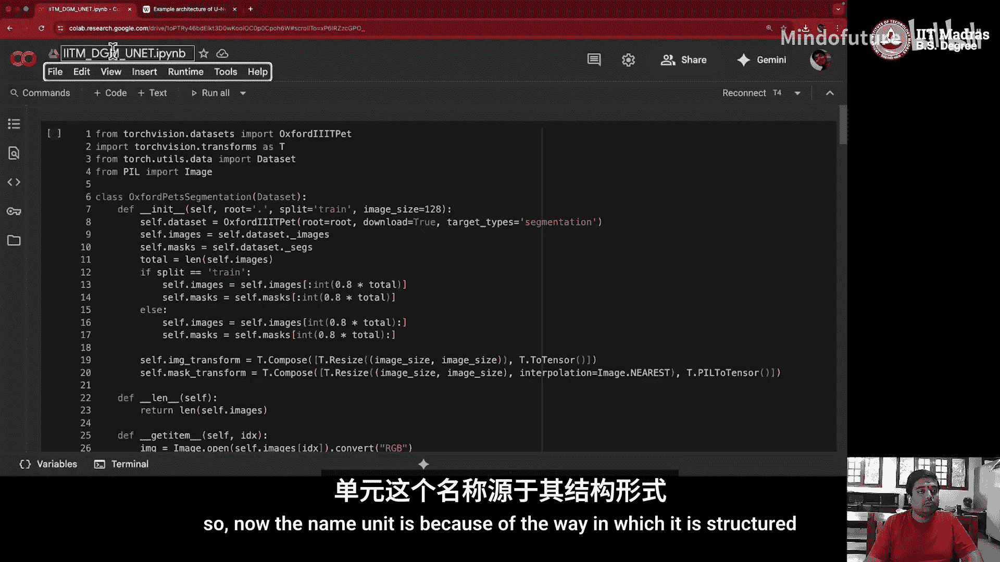

图像分割是指，给定一张图像，我们需要识别出图像中我们感兴趣的区域。例如，在一张包含动物的图片中，动物本身就是我们感兴趣的区域。我们的目标是能够区分动物、前景和背景。

这意味着我们需要为图像中的**每一个像素**预测它属于哪个类别或对象。例如，如果图像中有三种对象，那么每个像素就属于这三种类别之一。因此，模型的输出是一个与输入图像尺寸相同的“掩码”（mask），其中每个像素位置包含多个值（对应每个类别的概率）。由于这是一个逐像素的分类问题，我们通常使用交叉熵损失函数。

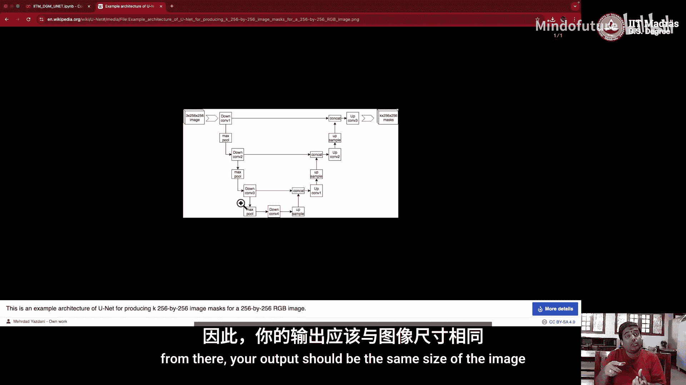

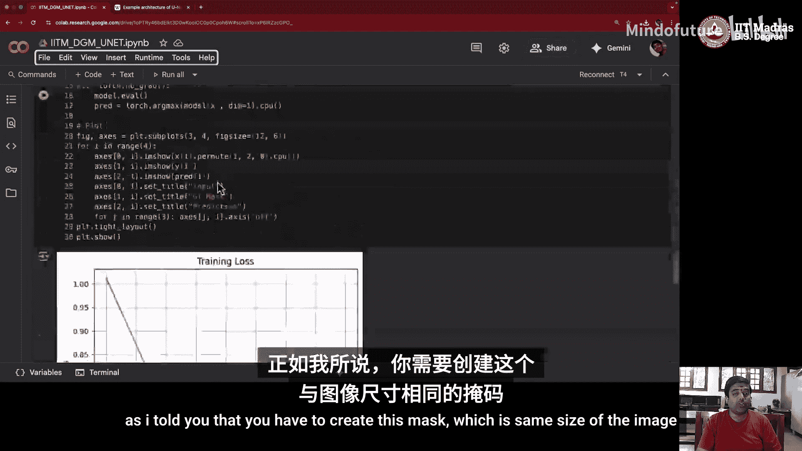

## U-Net架构概览

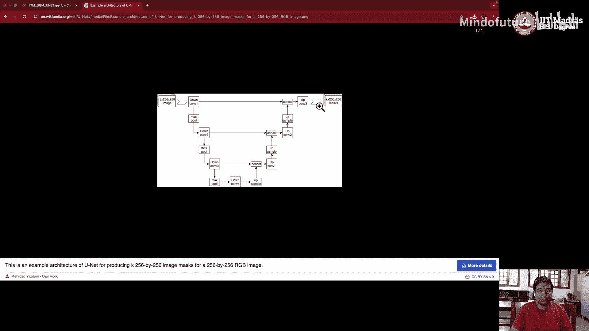

U-Net的名称来源于其独特的“U”形结构。如下图所示，该结构主要包含以下几个部分：

*   **编码器（Encoder）**：位于“U”形的左侧下降部分，负责通过卷积操作逐步提取特征并缩小特征图尺寸。
*   **瓶颈（Bottleneck）**：位于“U”形的底部，是编码器提取到的最深层特征表示。
*   **解码器（Decoder）**：位于“U”形的右侧上升部分，负责通过转置卷积（Transposed Convolution）逐步上采样，恢复特征图尺寸。
*   **横向连接（Lateral Connections）**：连接编码器和解码器对应层的跳跃连接。它们将编码器提取的细节特征传递到解码器，帮助模型在恢复尺寸时保留更多空间信息。

最终，解码器的输出是一个与原始输入图像尺寸相同的掩码。

## 使用Oxford Pets数据集

为了理解U-Net如何工作，我们使用Oxford Pets数据集。这是一个标准的图像分割数据集。

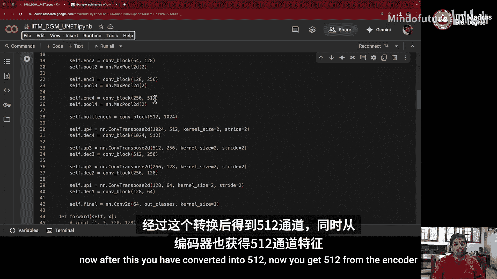

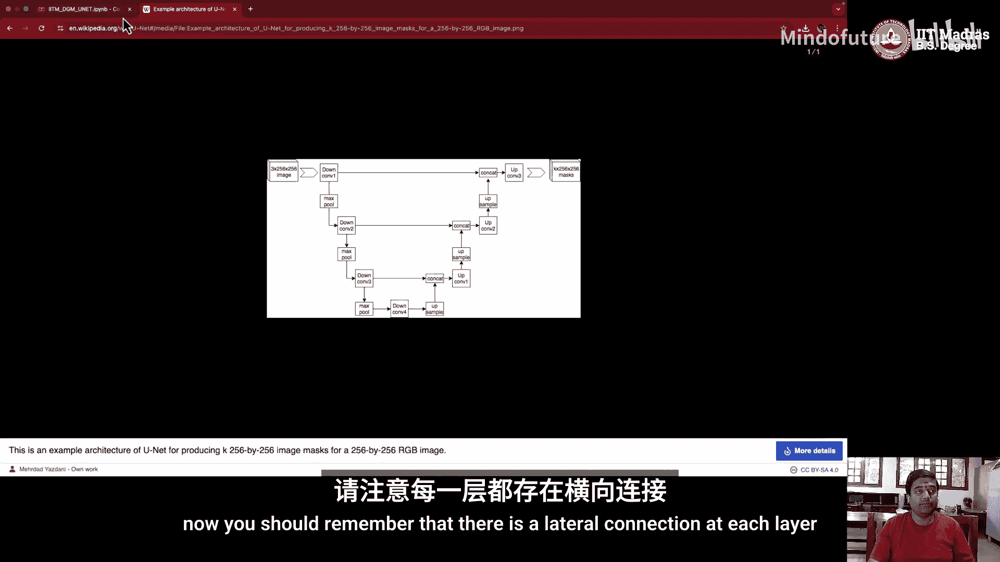

以下是数据加载和处理的基本步骤，我们假设你已经熟悉PyTorch的基本操作：
1.  初始化图像和掩码路径。
2.  将数据集的80%划分为训练集，20%划分为测试集（比例可根据需要调整）。
3.  定义数据转换（如归一化、调整尺寸等）。
4.  在`__getitem__`方法中返回具体的图像和掩码对。

## 一个简单的U-Net实现

现在，让我们深入查看一个简单的U-Net模型实现。该模型接受3通道（RGB）输入，并输出1通道的掩码。

**初始化方法（`__init__`）**
我们首先定义一个卷积块（`conv_block`），它由两个连续的卷积层组成。每个卷积层后都跟随ReLU激活函数。卷积核大小为3，填充为1，步长为1（默认值），这样可以保持特征图尺寸不变。

以下是编码器部分的构建过程：
```python
# 编码器路径：通道数逐渐增加，特征图尺寸通过最大池化（MaxPool2d）逐渐减半
self.enc1 = conv_block(in_channels=3, out_channels=64)
self.pool1 = nn.MaxPool2d(2)
self.enc2 = conv_block(64, 128)
self.pool2 = nn.MaxPool2d(2)
self.enc3 = conv_block(128, 256)
self.pool3 = nn.MaxPool2d(2)
self.enc4 = conv_block(256, 512)
self.pool4 = nn.MaxPool2d(2)
self.bottleneck = conv_block(512, 1024)
```

接下来是解码器部分，它使用转置卷积进行上采样，并通过横向连接与编码器的特征进行拼接（`torch.cat`）：
```python
# 解码器路径：通过转置卷积上采样，并与编码器对应层的特征拼接
self.upconv4 = nn.ConvTranspose2d(1024, 512, kernel_size=2, stride=2)
self.dec4 = conv_block(1024, 512) # 输入通道1024 = 512(上采样输出) + 512(编码器enc4输出)
self.upconv3 = nn.ConvTranspose2d(512, 256, kernel_size=2, stride=2)
self.dec3 = conv_block(512, 256) # 输入通道512 = 256 + 256
self.upconv2 = nn.ConvTranspose2d(256, 128, kernel_size=2, stride=2)
self.dec2 = conv_block(256, 128) # 输入通道256 = 128 + 128
self.upconv1 = nn.ConvTranspose2d(128, 64, kernel_size=2, stride=2)
self.dec1 = conv_block(128, 64) # 输入通道128 = 64 + 64
self.final_conv = nn.Conv2d(64, out_channels, kernel_size=1)
```

**前向传播方法（`forward`）**
在前向传播过程中，数据流清晰地展示了U-Net的工作方式。我们以一个假设的输入 `x`（形状为 `[1, 3, 128, 128]`，即1张128x128的RGB图像）为例：

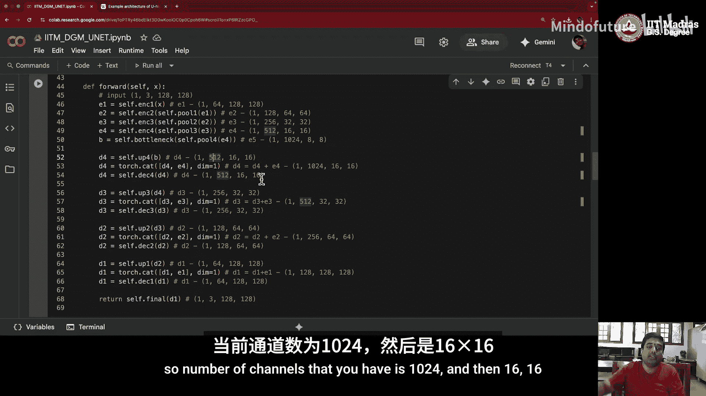

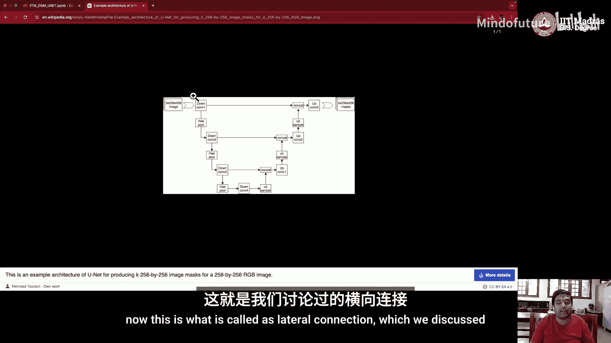

1.  **编码过程**：输入 `x` 依次通过 `enc1 -> pool1 -> enc2 -> pool2 -> enc3 -> pool3 -> enc4 -> pool4 -> bottleneck`。经过每个池化层后，特征图尺寸减半，通道数按设定增加。最终，在瓶颈层得到深层特征表示。
2.  **解码与融合过程**：从瓶颈层开始，首先进行转置卷积上采样（`upconv4`），将特征图尺寸放大。然后，将上采样的结果与**编码器`enc4`的输出**（在编码过程中已保存）沿通道维度进行拼接。拼接后的特征通过解码器卷积块（`dec4`）处理。
3.  重复步骤2的过程（`upconv3` 与 `enc3` 拼接后过 `dec3`；`upconv2` 与 `enc2` 拼接后过 `dec2`；`upconv1` 与 `enc1` 拼接后过 `dec1`），逐步恢复特征图尺寸并融合多尺度信息。
4.  **最终输出**：经过最后一个解码器块后，通过一个1x1卷积（`final_conv`）将通道数映射到目标输出通道数（例如，二分类分割为1通道），得到与输入图像同尺寸的预测掩码。

## 训练流程

训练U-Net遵循标准的深度学习流程：
1.  从训练数据加载器中获取批次数据（图像 `x` 和真实掩码 `y`）。
2.  将数据和模型移至GPU设备。
3.  前向传播获取预测掩码。
4.  计算逐像素交叉熵损失：`loss = criterion(predictions, y)`。
5.  反向传播计算梯度：`loss.backward()`。
6.  使用优化器（如Adam）更新模型权重：`optimizer.step()`。
7.  循环多个周期（Epoch），并监控训练损失和验证指标。

由于我们仅训练了很少的周期（例如5个），初始的预测结果可能不理想。训练更多周期后，模型性能会显著提升。

## 总结与展望

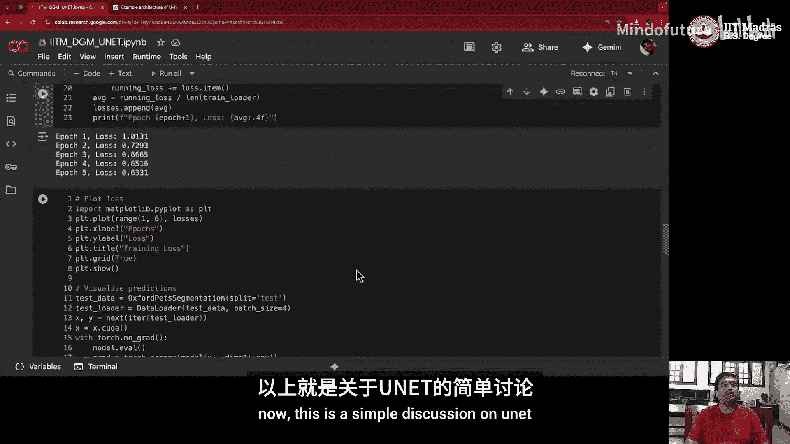

本节课我们一起学习了U-Net架构。它的核心特点是**编码器-解码器结构**、**瓶颈层**以及关键的**横向连接**。这些连接确保了在解码（上采样）过程中，能够利用编码阶段捕获的细节特征，从而生成更精确的分割掩码。

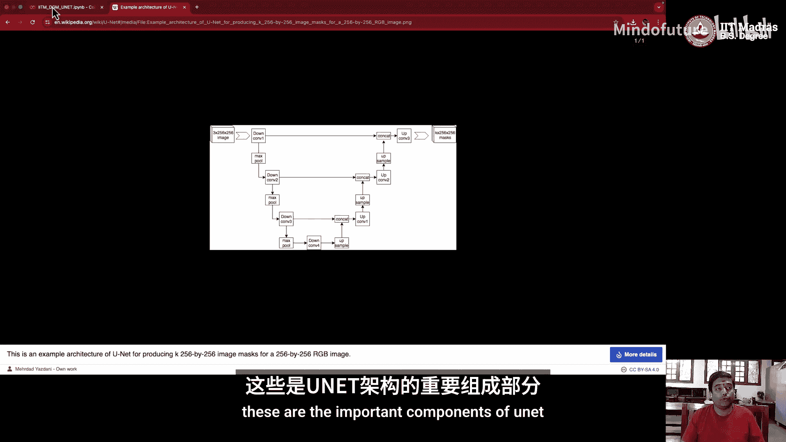

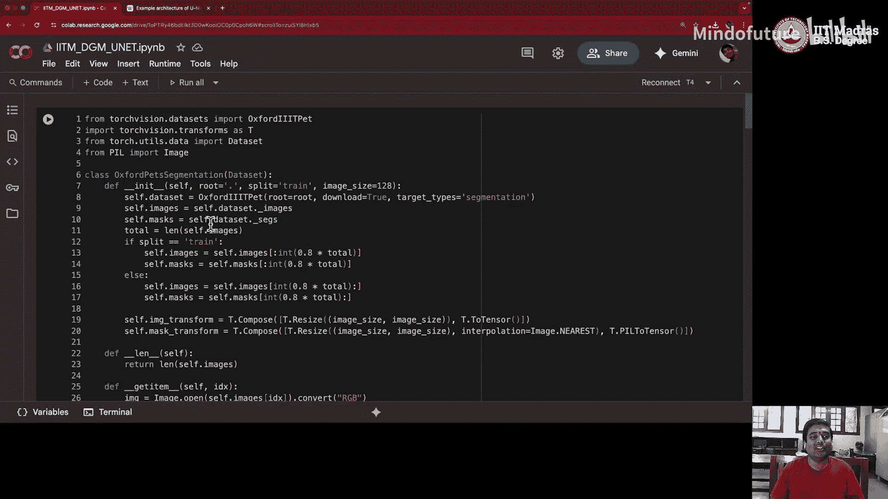

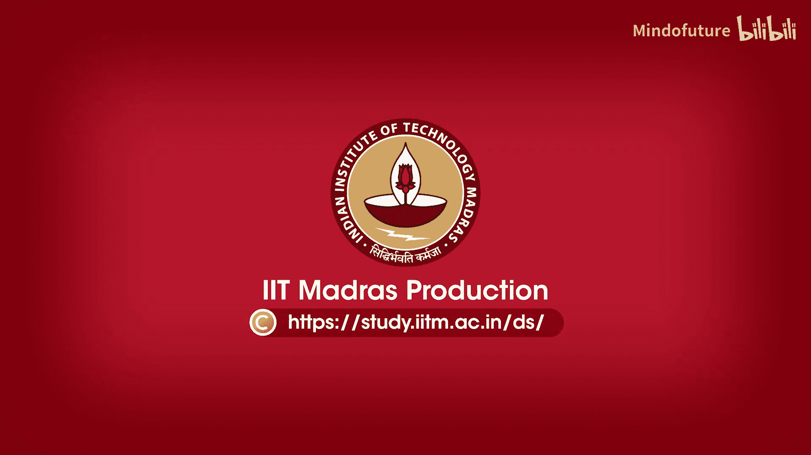

U-Net不仅是强大的图像分割工具，其设计思想也被广泛应用于其他生成式模型。在接下来的课程中，当我们实现**去噪扩散概率模型（DDPM）** 时，将会看到如何利用U-Net架构来预测噪声，并最终生成全新的图像。我们下节课再见！