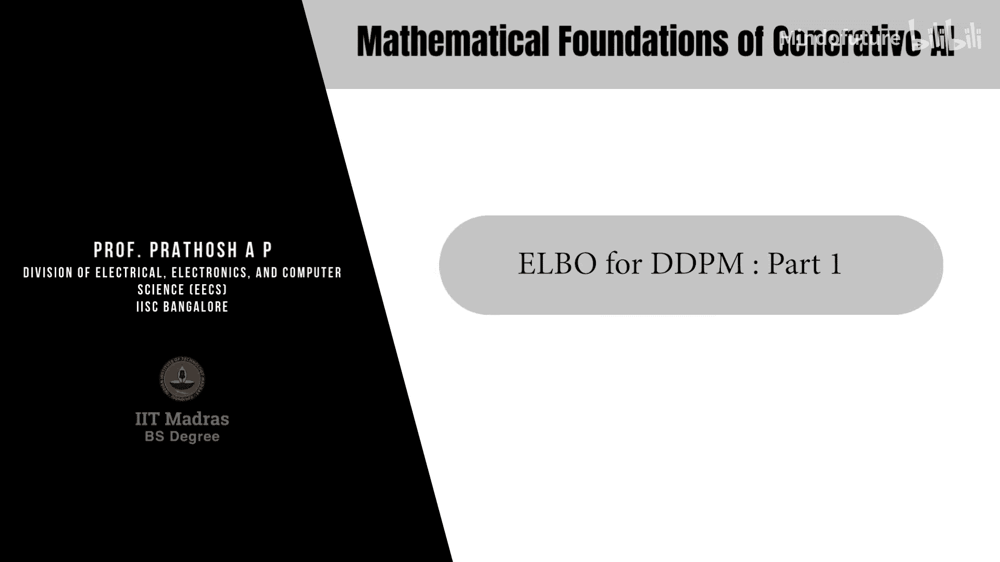
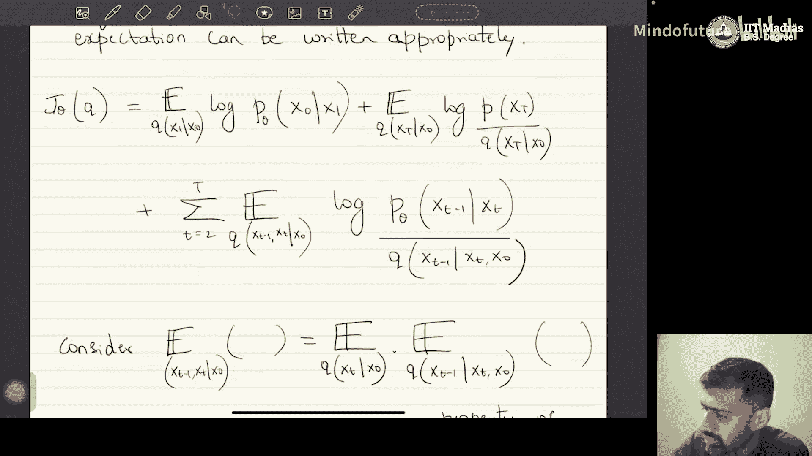

# 041：DDPM的ELBO推导 - 第一部分



在本节课中，我们将继续探讨去噪扩散概率模型。具体来说，我们将推导DDPM对应的目标函数——证据下界。这是本模块的核心目标。

## 概述

首先，让我们快速回顾一下之前的内容。我们使用分层变分自编码器的框架构建了DDPM模型。DDPM是一个潜变量模型，其潜空间是一个马尔可夫链，且所有潜变量的维度与数据空间相同。我们写出了数据与潜变量的联合分布，这与VAE中的 `P(x, Z)` 类似。

DDPM中数据与潜变量的联合分布由以下公式给出：
```
p_θ(x_0:T) = p(x_T) * ∏_{t=1}^{T} p_θ(x_{t-1} | x_t)
```
这个公式源于我们假设在反向（解码）过程中，潜变量遵循一阶马尔可夫链。我们还假设反向过程中的马尔可夫转移分布是一个高斯分布，其均值 `μ_θ(x_t)` 和方差 `σ_θ(x_t)` 是可学习的参数。我们将通过标准的ELBO优化来学习这些参数。

基于此，我们写出了适用于任何潜变量生成模型的证据下界标准方程，即我们的目标函数。对于DDPM，该方程具有特定的形式。

## ELBO目标函数推导

上一节我们介绍了DDPM的模型框架，本节中我们来看看如何具体推导其ELBO表达式。我们的目标是优化DDPM的证据下界。

首先，我们写出标准ELBO的通用形式：
```
L = E_{q(z|x)} [ log( p_θ(x, z) / q(z|x) ) ]
```
对于DDPM，其中 `x_0` 是数据变量，`x_1` 到 `x_T` 是 `T` 个潜变量。`q` 代表固定的、非学习的正向（编码）过程。

我们的目标是将DDPM中定义的编码分布 `q` 和解码分布 `p_θ` 代入上述方程，得到一个可以在DDPM上下文中优化的表达式。接下来，我们将逐步进行代数推导。

### 展开ELBO表达式

考虑ELBO中的对数项（暂时忽略外部的期望）：
```
log [ p_θ(x_0:T) / q(x_1:T | x_0) ]
```
根据DDPM的定义：
*   `p_θ(x_0:T) = p(x_T) * ∏_{t=1}^{T} p_θ(x_{t-1} | x_t)`
*   由于正向过程是一阶马尔可夫过程，`q(x_1:T | x_0) = ∏_{t=1}^{T} q(x_t | x_{t-1})`

将定义代入，得到：
```
log [ p(x_T) * ∏_{t=1}^{T} p_θ(x_{t-1} | x_t) ] - log [ ∏_{t=1}^{T} q(x_t | x_{t-1}) ]
```
利用对数的性质，可以将其写为和的形式。为了代数推导的便利，我们将分子和分母中关于 `t=1` 的项单独提出：
```
= log [ p(x_T) * p_θ(x_0 | x_1) / q(x_1 | x_0) ] + log [ ∏_{t=2}^{T} ( p_θ(x_{t-1} | x_t) / q(x_t | x_{t-1}) ) ]
```
观察第二项，分子是反向条件概率，分母是正向条件概率。为了简化，我们希望用同一方向（最好是反向）的分布来表示它们。

### 利用贝叶斯定理重写分母

考虑第二项的分母 `q(x_t | x_{t-1})`。由于正向过程是一阶马尔可夫过程，增加条件 `x_0` 不会改变分布：
```
q(x_t | x_{t-1}) = q(x_t | x_{t-1}, x_0)
```
现在，我们对等式右边应用贝叶斯定理（针对三个随机变量）：
```
q(x_t | x_{t-1}, x_0) = [ q(x_{t-1} | x_t, x_0) * q(x_t | x_0) ] / q(x_{t-1} | x_0)
```
这个变换的关键在于，它将正向分布 `q(x_t | x_{t-1})` 用反向条件分布 `q(x_{t-1} | x_t, x_0)` 表示了出来。`q(x_{t-1} | x_t, x_0)` 具有直观意义：它表示在已知起始点 `x_0` 和当前点 `x_t` 的情况下，前一个点 `x_{t-1}` 的分布。这可以看作是一种“真实”的反向分布，为我们学习参数化的 `p_θ(x_{t-1} | x_t)` 提供了一个参考目标。

### 代入并简化ELBO

将贝叶斯定理的结果代回ELBO的第二项：
```
第二项 = log [ ∏_{t=2}^{T} ( p_θ(x_{t-1} | x_t) / ( [q(x_{t-1} | x_t, x_0) * q(x_t | x_0)] / q(x_{t-1} | x_0) ) ) ]
      = log [ ∏_{t=2}^{T} ( p_θ(x_{t-1} | x_t) * q(x_{t-1} | x_0) / [ q(x_{t-1} | x_t, x_0) * q(x_t | x_0) ] ) ]
```
现在，ELBO的对数项变为三项之和：
1.  第一项：`log [ p(x_T) * p_θ(x_0 | x_1) / q(x_1 | x_0) ]`
2.  第二项：`log [ ∏_{t=2}^{T} ( p_θ(x_{t-1} | x_t) / q(x_{t-1} | x_t, x_0) ) ]`
3.  第三项：`log [ ∏_{t=2}^{T} ( q(x_{t-1} | x_0) / q(x_t | x_0) ) ]`

让我们简化第三项。它是一个连乘积的比值：
```
∏_{t=2}^{T} [ q(x_{t-1} | x_0) / q(x_t | x_0) ] = [q(x_1|x_0)/q(x_2|x_0)] * [q(x_2|x_0)/q(x_3|x_0)] * ... * [q(x_{T-1}|x_0)/q(x_T|x_0)]
```
可以看到，中间项全部被约去，最终只剩下：
```
= q(x_1 | x_0) / q(x_T | x_0)
```
因此，第三项简化为 `log [ q(x_1 | x_0) / q(x_T | x_0) ]`。

### 合并项并引入期望

现在，将第一项 `p(x_T) * p_θ(x_0 | x_1) / q(x_1 | x_0)` 与简化后的第三项 `q(x_1 | x_0) / q(x_T | x_0)` 合并。`q(x_1 | x_0)` 项被约去，得到：
```
合并项 = log [ p(x_T) * p_θ(x_0 | x_1) / q(x_T | x_0) ]
```
最终，ELBO内部的对数项可以写为：
```
log [ p_θ(x_0 | x_1) ] + log [ p(x_T) / q(x_T | x_0) ] + ∑_{t=2}^{T} log [ p_θ(x_{t-1} | x_t) / q(x_{t-1} | x_t, x_0) ]
```
现在，我们需要将之前忽略的外部期望 `E_{q(x_1:T | x_0)}[ ... ]` 加回来。由于期望的线性性质，我们可以将其分配到每一项上。每一项只依赖于部分随机变量，因此期望可以相应地简化：

*   第一项 `log p_θ(x_0 | x_1)` 只依赖于 `x_1`，其期望为 `E_{q(x_1 | x_0)}[ log p_θ(x_0 | x_1) ]`。
*   第二项 `log [ p(x_T) / q(x_T | x_0) ]` 只依赖于 `x_T`，其期望为 `E_{q(x_T | x_0)}[ log (p(x_T) / q(x_T | x_0)) ]`。
*   第三项求和中的每一项 `log [ p_θ(x_{t-1} | x_t) / q(x_{t-1} | x_t, x_0) ]` 依赖于 `x_{t-1}` 和 `x_t`。其期望可以写为：
    ```
    E_{q(x_t | x_0)} [ E_{q(x_{t-1} | x_t, x_0)} [ log ( p_θ(x_{t-1} | x_t) / q(x_{t-1} | x_t, x_0) ) ] ]
    ```
    内层的期望正是KL散度的定义。

## 总结

本节课中，我们一起学习了DDPM证据下界推导的第一部分。我们通过一系列代数操作，将ELBO表达式从通用形式转化为适用于DDPM的具体形式。关键步骤包括：
1.  代入DDPM的联合分布和变分后验分布。
2.  利用正向过程的马尔可夫性。
3.  应用贝叶斯定理将正向条件概率用反向条件概率表示，从而引入了“真实”反向分布 `q(x_{t-1} | x_t, x_0)`。
4.  通过合并和约简项，最终得到了一个包含三项的表达式。
5.  重新引入外部期望，并利用条件期望的性质，将第三项中的期望写成了KL散度的形式。




这个推导过程虽然代数上有些复杂，但清晰地展示了DDPM优化目标的结构。在下一节中，我们将进一步分析这些项的具体含义，并展示它们如何导向一个可行的训练目标。