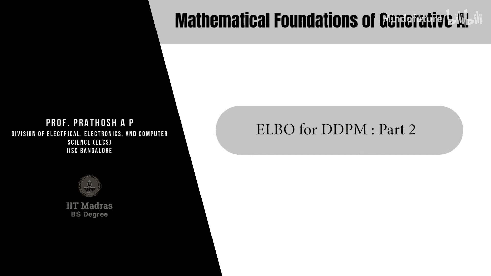
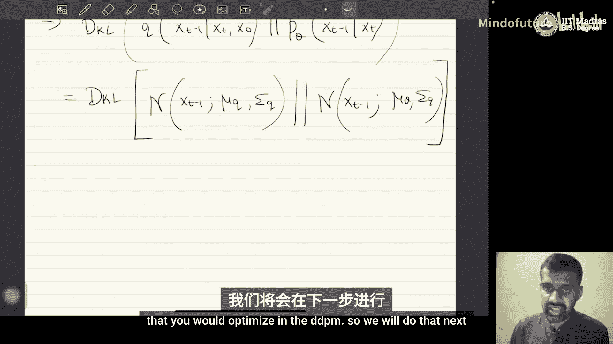

# 042：DDPM的ELBO推导 - 第二部分

在本节课中，我们将继续推导去噪扩散概率模型（DDPM）的证据下界（ELBO）。我们将利用条件期望的性质重写ELBO，并将其分解为三个具有明确含义的项。最后，我们将重点分析其中最重要的“一致性项”，并展示如何计算其内部的KL散度。

## 利用条件期望性质重写ELBO

上一节我们得到了ELBO的初步形式。本节中，我们将利用条件期望的性质对其进行重写和分解。

条件期望的性质允许我们将期望内的求和项进行拆分。应用此性质后，ELBO可以展开为以下三项之和：

*   **第一项**：`E_{q(x_1|x_0)} [log p_θ(x_0 | x_1)]`
*   **第二项**：`- Σ_{t=2}^T E_{q(x_t|x_0)} [D_KL( q(x_t | x_0) || p(x_t) )]`
*   **第三项**：`- Σ_{t=2}^T E_{q(x_t|x_0)} [ D_KL( q(x_{t-1} | x_t, x_0) || p_θ(x_{t-1} | x_t) ) ]`

现在，我们可以识别每一项的含义：
*   第一项是**数据条件似然**的期望，通常称为**重构项**。
*   第二项是**先验匹配项**，它试图让给定数据时潜变量的条件分布 `q(x_t | x_0)` 匹配其先验分布 `p(x_t)`。
*   第三项是**一致性项**或**去噪匹配项**，这是DDPM中特有的关键项。

## 理解ELBO的三项构成

以下是ELBO三项的详细说明：

1.  **重构项**：`E_{q(x_1|x_0)} [log p_θ(x_0 | x_1)]`
    *   此项与变分自编码器（VAE）中的重构损失类似，目标是基于第一个潜变量 `x_1` 来重建原始数据 `x_0`。

2.  **先验匹配项**：`- Σ_{t=2}^T D_KL( q(x_t | x_0) || p(x_t) )`
    *   此项也与VAE中的KL正则项类似，目的是让所有时间步 `t` 的潜变量后验分布 `q(x_t | x_0)` 都接近其先验分布 `p(x_t)`（通常为标准正态分布）。**此项与模型参数 θ 无关，在优化时可以忽略。**

3.  **一致性项**：`- Σ_{t=2}^T E_{q(x_t|x_0)} [ D_KL( q(x_{t-1} | x_t, x_0) || p_θ(x_{t-1} | x_t) ) ]`
    *   这是DDPM的核心。`q(x_{t-1} | x_t, x_0)` 是根据前向过程定义的、已知的、真实的去噪步骤。`p_θ(x_{t-1} | x_t)` 是模型要学习的去噪步骤。最小化它们之间的KL散度，就是让模型学习的去噪过程与真实的反向去噪过程保持一致。

我们的优化目标是找到参数 θ* 以最大化ELBO。由于先验匹配项是常数，优化重点在于重构项和一致性项。重构项相对简单，而一致性项的计算则需要进一步推导。

## 计算一致性项中的KL散度

接下来，我们专注于计算一致性项中的KL散度：`D_KL( q(x_{t-1} | x_t, x_0) || p_θ(x_{t-1} | x_t) )`。这需要我们知道两个分布的具体形式。

首先，计算已知的真实分布 `q(x_{t-1} | x_t, x_0)`。利用贝叶斯定理，我们可以将其转化为前向过程中已知的分布：
`q(x_{t-1} | x_t, x_0) = [q(x_t | x_{t-1}, x_0) * q(x_{t-1} | x_0)] / q(x_t | x_0) = [q(x_t | x_{t-1}) * q(x_{t-1} | x_0)] / q(x_t | x_0)`

根据前向过程的定义，`q(x_t | x_{t-1})` 是已知的高斯分布。因此，问题转化为求解边缘分布 `q(x_t | x_0)` 和 `q(x_{t-1} | x_0)`。

### 推导 `q(x_t | x_0)` 的解析形式

前向过程定义为：`x_t = √α_t * x_{t-1} + √(1-α_t) * ε_{t-1}`，其中 `ε ~ N(0, I)`。
通过递归展开 `x_t` 直到 `x_0`，我们可以得到一个重要结论：
`x_t = √(ᾱ_t) * x_0 + √(1 - ᾱ_t) * ε`，其中 `ᾱ_t = Π_{i=1}^{t} α_i`，`ε ~ N(0, I)`。

这意味着 `q(x_t | x_0)` 也是一个高斯分布：
`q(x_t | x_0) = N(x_t; √(ᾱ_t) * x_0, (1 - ᾱ_t)I )`
**这个性质非常关键：它表明我们可以直接从原始数据 `x_0` 和噪声 `ε` 采样得到任意中间时刻 `t` 的加噪数据 `x_t`，而无需逐步进行 `t` 次前向扩散步骤。** 这极大地简化了训练过程。

同理，`q(x_{t-1} | x_0) = N(x_{t-1}; √(ᾱ_{t-1}) * x_0, (1 - ᾱ_{t-1})I )`。

### 得到 `q(x_{t-1} | x_t, x_0)` 的分布

现在，我们将已知的三个高斯分布（`q(x_t | x_{t-1})`， `q(x_{t-1} | x_0)`， `q(x_t | x_0)`）代入贝叶斯公式。通过“配方法”对 `x_{t-1}` 进行配方，可以证明 `q(x_{t-1} | x_t, x_0)` 也是一个高斯分布。

其均值和方差如下：
*   **均值 μ_q**：`μ_q = [ √α_t * (1 - ᾱ_{t-1}) * x_t + √(ᾱ_{t-1}) * (1 - α_t) * x_0 ] / (1 - ᾱ_t)`
*   **方差 Σ_q**：`Σ_q = [(1 - α_t) * (1 - ᾱ_{t-1}) / (1 - ᾱ_t)] * I`

其中所有 `α` 和 `ᾱ` 都是预先定义的标量调度参数。因此，给定 `x_t` 和 `x_0`，`μ_q` 和 `Σ_q` 都是可计算的。

### 设定模型分布 `p_θ(x_{t-1} | x_t)`

在DDPM中，我们将学习到的反向过程也建模为高斯分布：`p_θ(x_{t-1} | x_t) = N(x_{t-1}; μ_θ, Σ_θ)`。
为了简化，通常将方差 `Σ_θ` 设为与真实分布 `q` 的方差 `Σ_q` 相同的固定值（或另一个固定调度）。这样，模型只需要学习预测均值 `μ_θ`。

### 计算高斯分布之间的KL散度

现在，一致性项中的KL散度变成了两个高斯分布之间的KL散度：
`D_KL( q(x_{t-1} | x_t, x_0) || p_θ(x_{t-1} | x_t) ) = D_KL( N(x_{t-1}; μ_q, Σ_q) || N(x_{t-1}; μ_θ, Σ_q) )`

当两个高斯分布的方差相同时，它们之间的KL散度有一个非常简洁的形式（忽略常数项）：
`D_KL ∝ || μ_q - μ_θ ||^2`

**这意味着，最小化这个KL散度，等价于最小化模型预测的均值 `μ_θ` 与真实去噪分布的均值 `μ_q` 之间的均方误差（MSE）。** 这为训练DDPM提供了一个清晰且易于实现的目标函数。

## 总结

本节课中，我们一起学习了DDPM的ELBO推导的第二部分：
1.  我们将ELBO分解为**重构项**、**先验匹配项**和**一致性项**。
2.  我们推导了前向过程的一个重要性质：`q(x_t | x_0)` 是高斯分布，允许直接从 `x_0` 采样 `x_t`。
3.  我们计算了真实的反向去噪分布 `q(x_{t-1} | x_t, x_0)`，并证明它也是高斯分布。
4.  通过设定模型分布 `p_θ` 也为高斯分布，我们将一致性项的优化目标简化为：**让模型预测的去噪均值 `μ_θ` 尽可能接近真实去噪均值 `μ_q`**。

这为下一节最终推导出DDPM简洁的训练目标——预测所添加的噪声——奠定了坚实的基础。