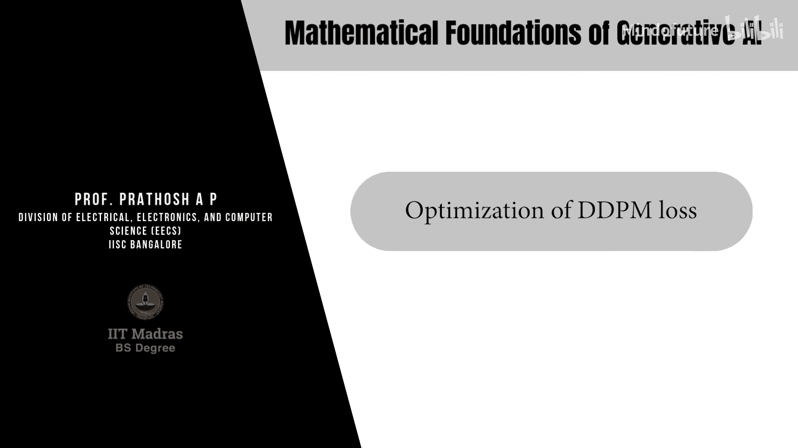
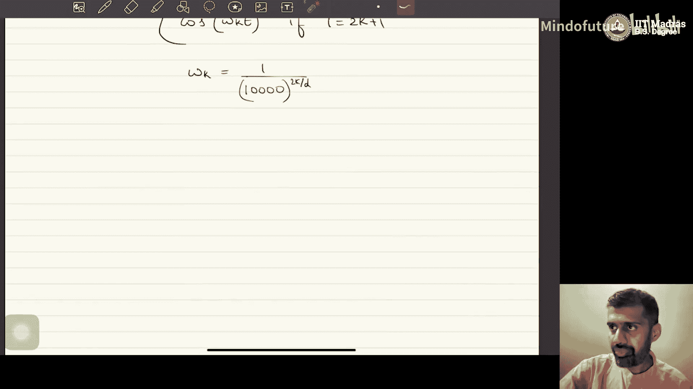

# 043：DDPM损失的优化

在本节课中，我们将要学习扩散概率模型（DDPM）中证据下界（ELBO）的优化过程。我们将推导出最终的损失函数形式，并探讨如何通过神经网络来参数化和优化这个损失函数。

## 证据下界（ELBO）的组成

上一节我们介绍了DDPM的ELBO由三项组成。本节中，我们来看看这三项的具体形式及其简化过程。

ELBO由以下三项组成：
1.  **重建项**：与从第一个潜变量 $x_1$ 重建原始数据 $x_0$ 有关。
2.  **先验匹配项**：与模型参数 $\theta$ 无关，因此在优化时可以忽略。
3.  **一致性项**：也称为去噪匹配项，是优化的核心。

我们的目标是简化一致性项，并最终得到一个可优化的损失函数表达式。

## 一致性项的简化

一致性项涉及两个分布之间的KL散度：真实的反向分布 $q(x_{t-1} | x_t, x_0)$ 和模型的反向分布 $p_\theta(x_{t-1} | x_t)$。

我们通过贝叶斯规则推导出 $q(x_{t-1} | x_t, x_0)$ 是一个高斯分布，其均值 $\tilde{\mu}_t$ 是 $x_t$ 和 $x_0$ 的线性组合，方差 $\tilde{\beta}_t$ 是一个标量乘以单位矩阵。

模型分布 $p_\theta(x_{t-1} | x_t)$ 也被假设为高斯分布，其均值 $\mu_\theta$ 由神经网络预测，方差通常被设定为与 $\tilde{\beta}_t$ 相同的常数。

因此，两个高斯分布之间的KL散度可以精确计算。由于方差相同，KL散度简化为两者均值之间的平方差。

以下是KL散度的简化公式：
$$
D_{KL}(q(x_{t-1} | x_t, x_0) \ || \ p_\theta(x_{t-1} | x_t)) = \frac{1}{2\tilde{\beta}_t} \| \mu_\theta(x_t, t) - \tilde{\mu}_t(x_t, x_0) \|^2
$$

这个结果非常简洁：一致性项本质上是一个回归任务，即让神经网络预测的均值 $\mu_\theta$ 去匹配真实后验分布的均值 $\tilde{\mu}_t$。

## 完整的ELBO表达式

结合重建项和简化后的一致性项，我们得到DDPM的完整ELBO表达式。

最终的ELBO损失函数 $J_\theta(q)$ 如下：
$$
J_\theta(q) = \mathbb{E}_{q(x_1|x_0)}[\log p_\theta(x_0 | x_1)] - \sum_{t=2}^{T} \mathbb{E}_{q(x_t|x_0)} \left[ \frac{1}{2\tilde{\beta}_t} \| \mu_\theta(x_t, t) - \tilde{\mu}_t(x_t, x_0) \|^2 \right]
$$

其中，期望是在前向扩散过程 $q(x_t | x_0)$ 下计算的。这就是我们需要优化的目标函数。

## 损失函数的参数化与实现

为了优化上述损失，我们需要用神经网络来参数化未知的均值函数 $\mu_\theta(x_t, t)$。

基本思路是使用一个神经网络（如U-Net架构）来预测 $\mu_\theta$。该网络以噪声数据 $x_t$ 和时间步 $t$ 作为输入，输出预测的均值。

以下是实现的关键点：
*   **网络架构**：通常使用U-Net，它通过下采样和上采样来保持输入输出的维度一致，适合进行像素级的回归预测。
*   **时间步输入**：为了让网络感知当前的时间步 $t$，我们将标量 $t$ 通过**正弦位置编码**转换为一个向量，然后与 $x_t$ 一起输入网络。
*   **参数共享**：我们使用同一个神经网络来处理所有时间步 $t$ 的预测，这实现了跨时间步的参数共享。

正弦位置编码的函数如下，它将一个整数标量 $t$ 映射为一个 $d$ 维向量：
$$
\text{PE}(t)_{2k} = \sin\left(\frac{t}{10000^{2k/d}}\right)
$$
$$
\text{PE}(t)_{2k+1} = \cos\left(\frac{t}{10000^{2k/d}}\right)
$$

## 训练流程概述

基于上述分析，DDPM的训练流程可以概括为以下步骤：

以下是训练一个DDPM模型的核心步骤：
1.  从数据集中采样一个干净样本 $x_0$。
2.  从 $1$ 到 $T$ 中均匀采样一个时间步 $t$。
3.  根据前向扩散公式，采样得到加噪样本 $x_t$。
4.  将 $x_t$ 和时间步 $t$ 输入神经网络，得到预测的均值 $\mu_\theta(x_t, t)$。
5.  根据 $x_t$ 和 $x_0$ 计算真实的后验均值 $\tilde{\mu}_t(x_t, x_0)$。
6.  计算损失函数 $\| \mu_\theta - \tilde{\mu}_t \|^2$ 的均值（忽略权重系数）。
7.  通过梯度下降更新神经网络参数 $\theta$。
8.  重复以上步骤直至收敛。

## 损失函数的等价形式

在实践中，为了数值稳定性和简化计算，我们通常不会直接预测 $\tilde{\mu}_t$。根据 $\tilde{\mu}_t$ 的表达式，它可以重写为：
$$
\tilde{\mu}_t(x_t, x_0) = \frac{1}{\sqrt{\alpha_t}} (x_t - \frac{\beta_t}{\sqrt{1-\bar{\alpha}_t}} \epsilon)
$$
其中 $\epsilon$ 是前向过程中添加到 $x_0$ 上的标准高斯噪声。

因此，让网络直接预测这个噪声 $\epsilon$ 是另一种等价且更常见的做法。此时，损失函数变为：
$$
L_{\text{simple}} = \mathbb{E}_{t, x_0, \epsilon} \left[ \| \epsilon_\theta(\sqrt{\bar{\alpha}_t}x_0 + \sqrt{1-\bar{\alpha}_t}\epsilon, t) - \epsilon \|^2 \right]
$$
这个形式更为简洁，它要求神经网络 $\epsilon_\theta$ 直接预测在前向过程中加入的噪声。这是大多数现代扩散模型代码实现所采用的形式。

## 总结

本节课中我们一起学习了DDPM模型证据下界（ELBO）的优化过程。我们从ELBO的三项分解出发，重点推导并简化了一致性项，将其转化为一个均值匹配的回归问题。我们得到了最终的损失函数表达式，并讨论了如何通过一个接收噪声数据 $x_t$ 和时间步 $t$ 的U-Net神经网络来参数化这个损失。最后，我们概述了训练流程，并介绍了预测噪声 $\epsilon$ 这一更常用的等价损失形式，这为后续的实际代码实现奠定了理论基础。