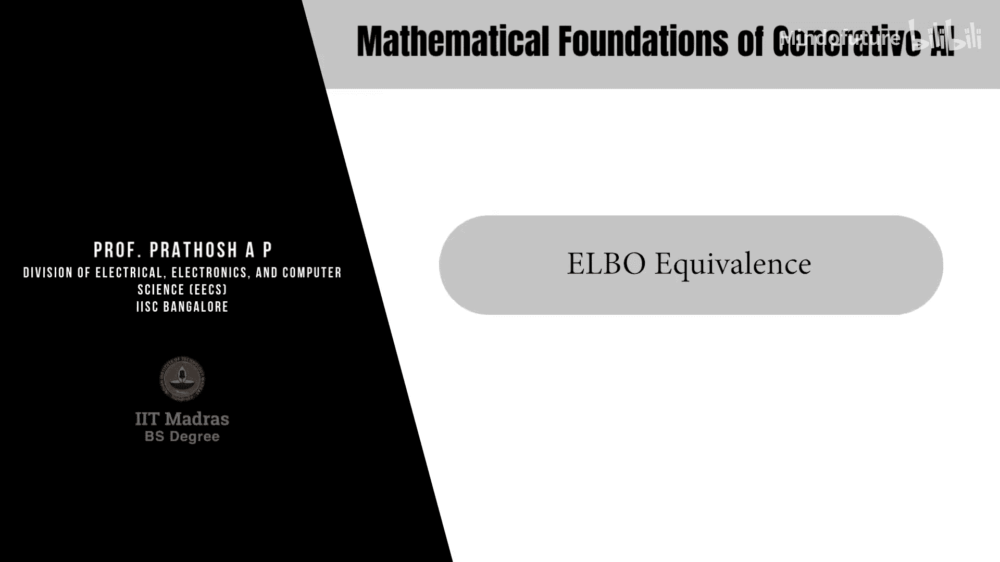

# 044：ELBO等价性

在本节课中，我们将探讨证据下界（ELBO）的等价性表示。我们将看到，虽然之前推导的损失函数在数学上是正确的，但通过重新参数化，我们可以得到一个在解释上更直观、在实践上更有用的等价形式。

## 回顾一致性项

上一节我们介绍了去噪扩散概率模型（DDPM）损失函数中的一致性项。现在，我们来看看如何对其进行等价变换。

该一致性项最初的形式为：
`L = 1/(2σ_q^2) * || μ_θ(xt) - μ_q(xt, x0) ||^2`

其中，`μ_q` 是已知的，其表达式为：
`μ_q(xt, x0) = c1 * xt + c2 * x0`
这里，`c1` 和 `c2` 是由噪声调度参数 `α` 和 `α_bar` 决定的常数。

## 重新参数化 μ_θ

我们设计的神经网络输出 `μ_θ` 可以表示为与 `μ_q` 类似的形式。具体做法如下：

我们可以将 `μ_θ` 也写成 `xt` 和另一个神经网络预测值的线性组合：
`μ_θ(xt) = c1 * xt + c2 * x_θ(xt)`

这里的 `x_θ(xt)` 是神经网络的输出。这种重新参数化是可行的，因为 `μ_θ` 是一个我们可以自由设计的向量。给定一个固定的 `xt`，`c1 * xt` 是常数。我们总是可以通过对神经网络输出进行缩放和平移（即线性变换），使其符合上述形式。

## 推导新的损失函数形式

将重新参数化后的 `μ_θ` 代入原损失函数，并进行代数化简。

经过整理，一致性项变为：
`L = 1/(2σ_q^2) * C * || x_θ(xt) - x0 ||^2`

其中，`C` 是一个由 `α_t` 和 `α_bar_t` 等参数组成的常数系数。

## 新形式的解释优势

这个新的形式在数学上与原始形式完全等价，但在解释上带来了显著优势。

以下是新形式的核心优势：

*   **直观的解释**：损失函数现在变成了在原始干净数据 `x0` 上的回归。神经网络 `x_θ` 的任务是，给定一个噪声版本 `xt`，预测出原始的、未加噪的数据 `x0`。
*   **作为去噪器**：因此，整个训练好的神经网络可以被视为一个**去噪器**。它学习的是如何从不同噪声水平（对应不同时间步 `t`）的噪声数据 `xt` 中，恢复出原始数据 `x0`。
*   **模型命名的由来**：这也正是“去噪扩散概率模型”中“去噪”一词的来源之一。模型的学习过程本质上是在学习一个去噪函数。

## 重要注意事项

需要特别注意的是，DDPM中的神经网络与之前学过的其他生成模型有根本不同。

以下是关键区别：

*   **非采样器**：与生成对抗网络（GAN）的生成器或变分自编码器（VAE）的解码器不同，DDPM中训练好的神经网络 `x_θ` **并不直接输出**一个来自目标分布 `p(x0)` 的新样本。
*   **回归器的角色**：它只是一个在输入数据点 `x0` 上的回归器。它的输入是噪声数据 `xt`，输出是对应原始数据 `x0` 的估计。
*   **采样过程**：要生成新样本，我们需要运行一个完整的反向（去噪）扩散过程，这个过程会迭代地调用这个神经网络。我们将在后续课程中详细学习推理（采样）过程。

## 训练流程概要

现在，我们已经拥有了训练一个DDPM所需的所有要素。

以下是DDPM的训练算法概要：
1.  从数据集中采样一个干净数据样本 `x0`。
2.  从均匀分布 `Uniform(1, ..., T)` 中采样一个时间步 `t`。
3.  从标准正态分布采样噪声 `ε`，并根据前向扩散过程公式计算加噪后的数据 `xt`。
4.  将 `xt` 和 `t` 输入神经网络 `x_θ`，得到预测的 `x0`（或等价地，预测噪声 `ε`，这是另一种常见参数化方式）。
5.  计算损失函数（如上所述的均方误差），并通过反向传播更新神经网络参数 `θ`。
6.  重复以上步骤直至收敛。

## 总结

本节课中，我们一起学习了ELBO的等价性表示。我们通过重新参数化技巧，将原本在 `μ` 空间上的回归损失，转换为了在原始数据 `x0` 空间上的回归损失。这种形式不仅数学等价，而且让我们能够将DDPM中的神经网络清晰地解释为一个去噪器。同时，我们明确了该网络在推理时不直接充当采样器的关键特性，为下一节学习完整的生成（采样）过程打下了基础。