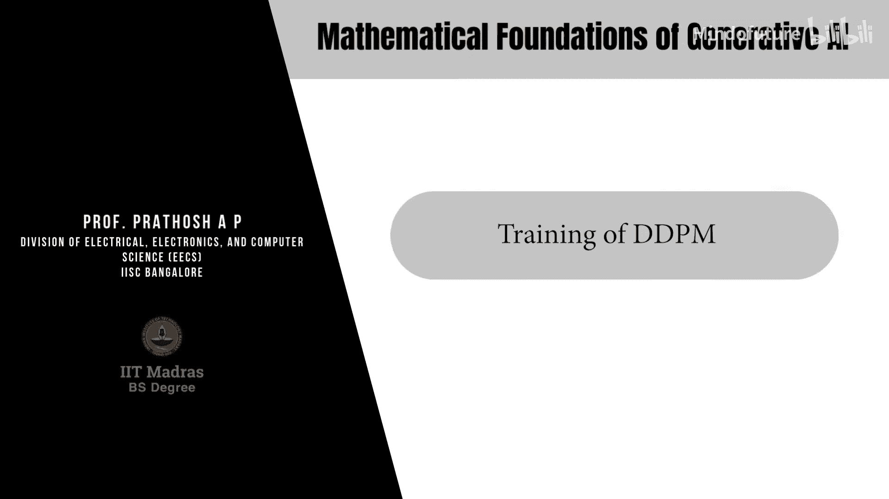
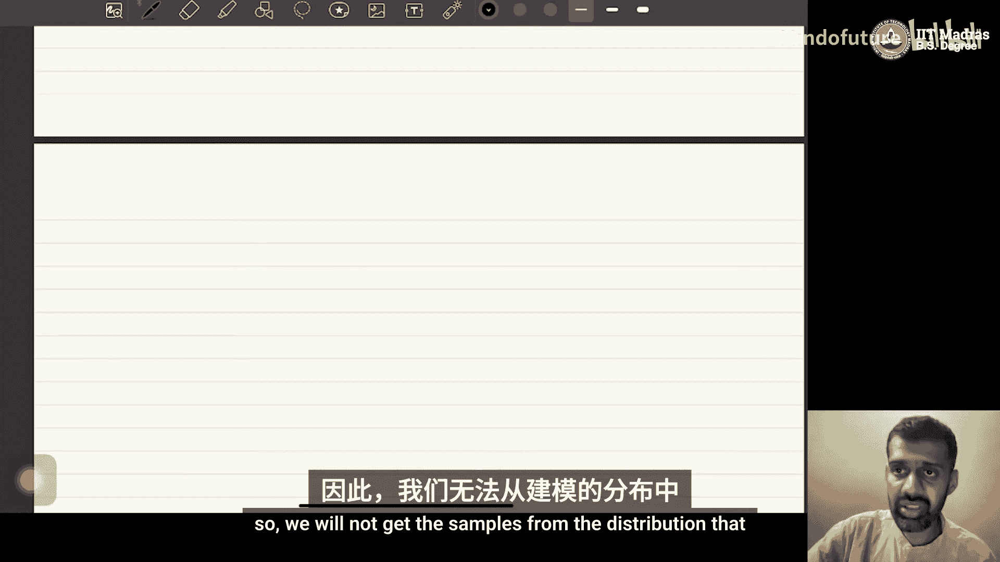

# 045：DDPM的训练

在本节课中，我们将学习去噪扩散概率模型（DDPM）的训练过程。我们将了解如何通过一个简单而优雅的优化过程来训练模型，使其能够学习从噪声中恢复原始数据。

## 概述

DDPM的训练过程非常直接。其核心思想是训练一个神经网络，使其能够预测在给定噪声样本和特定时间步长的情况下，原始数据点是什么。与GAN或VAE相比，DDPM的训练更加稳定，因为它不涉及复杂的对抗优化或潜在空间的后验坍塌问题。

## 训练步骤详解

上一节我们介绍了DDPM的损失函数，本节中我们来看看如何将这个理论转化为实际的训练步骤。

给定一个从真实数据分布中采样的数据点 \( x_0 \)，DDPM的训练流程如下。

以下是训练循环的步骤：

1.  **采样时间步长**：从0到预设的最大步长 \( T \)（通常设为1000）中均匀随机采样一个时间步长 \( t \)。
2.  **生成噪声样本**：根据前向扩散过程，计算在时间步长 \( t \) 对应的噪声样本 \( x_t \)。其计算公式为：
    \[
    x_t = \sqrt{\bar{\alpha}_t} \cdot x_0 + \sqrt{1 - \bar{\alpha}_t} \cdot \epsilon_t
    \]
    其中，\( \epsilon_t \sim \mathcal{N}(0, I) \) 是标准高斯噪声。
3.  **前向传播**：将噪声样本 \( x_t \) 和时间步长 \( t \) 输入神经网络 \( f_\theta \)，得到网络对原始数据 \( x_0 \) 的预测 \( \hat{x}_0 \)。
4.  **计算损失**：计算预测值 \( \hat{x}_0 \) 与真实值 \( x_0 \) 之间的均方误差（MSE）作为损失函数：
    \[
    J(\theta) = \| \hat{x}_0 - x_0 \|^2
    \]
5.  **反向传播与参数更新**：计算损失函数 \( J(\theta) \) 关于网络参数 \( \theta \) 的梯度，并使用梯度下降法更新参数：
    \[
    \theta_{k+1} = \theta_k - \eta \cdot \nabla_\theta J(\theta)
    \]
    其中 \( \eta \) 是学习率。

## 批处理与时间步采样

在实际操作中，我们通常不会在单个数据点和单个时间步长上进行训练。为了提高效率，会采用批处理和子采样策略。

以下是具体的优化方法：

*   **批处理**：从一个批次（batch）的多个数据点 \( \{x_0^{(1)}, x_0^{(2)}, ..., x_0^{(B)}\} \) 中同时采样进行训练。最终的损失是批次内所有数据点损失的平均值。
*   **时间步子采样**：原始的损失函数需要对所有时间步长 \( t=1 \) 到 \( T \) 求和。在实践中，我们会在每个训练步骤中，从所有可能的时间步长中随机采样一个子集 \( M \)（例如，采样 \( M \) 个不同的 \( t \)），只计算这些时间步长上的损失并进行梯度更新。这相当于对完整损失函数的一个随机估计，但能显著加速训练。

因此，一次完整的训练迭代包含：采样一个数据批次，为批次中的每个数据点采样一组时间步长，生成对应的噪声样本，计算总损失，然后进行一次梯度下降更新。

## 训练的优势与特点

DDPM的训练设计具有几个关键优势，使其在图像生成领域表现出色。

以下是其主要特点：

1.  **训练稳定**：整个过程是一个简单的回归任务（预测原始数据），避免了GAN训练中常见的模式崩溃和难以收敛的极小极大博弈问题。
2.  **避免后验坍塌**：与变分自编码器（VAE）不同，DDPM没有显式的潜在变量编码器，因此不存在VAE中“后验坍塌”（即编码器忽略输入数据）的风险。
3.  **过程优雅**：训练仅需标准的前向传播、损失计算和反向传播，无需复杂的技巧或辅助网络。

需要注意的是，在完整的损失函数中，还有一个对应于 \( t=1 \) 的对数似然项。在训练时，这一项也会被纳入考虑，其处理方式与上述回归损失类似。

## 总结

本节课中我们一起学习了DDPM模型的训练方法。其核心是训练一个神经网络，通过预测加噪数据中的原始信号来完成学习。训练过程通过随机采样时间步长、利用重参数化技巧生成噪声样本，并执行简单的梯度下降来实现。这种方法的稳定性、简洁性和高效性，是扩散模型能够成为当前图像生成领域主流技术的重要原因之一。

下一节，我们将探讨一个关键问题：训练好的DDPM模型如何用于生成全新的样本。