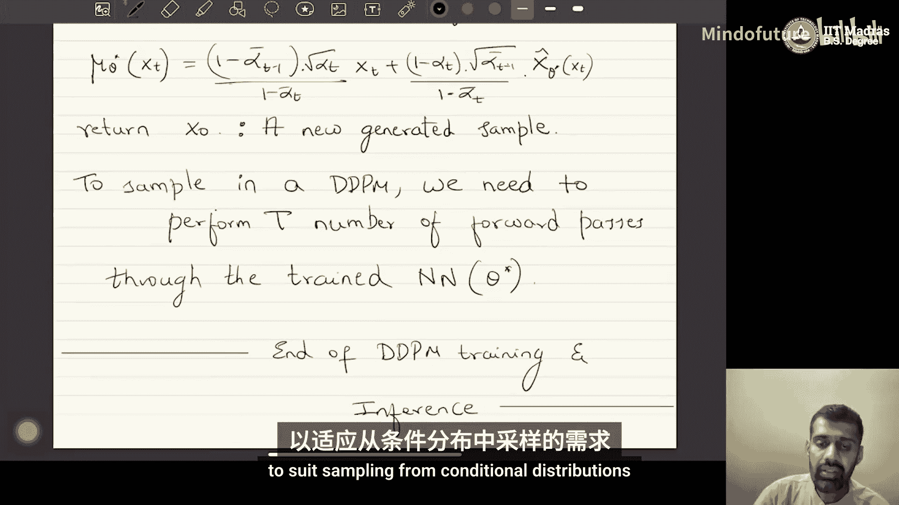

# 046：DDPM中的推理 🎼

在本节课中，我们将学习如何在去噪扩散概率模型中进行推理或采样。我们将详细探讨从训练好的DDPM中生成新样本的具体步骤和原理。

## 概述

上一节我们介绍了DDPM的训练过程，本节中我们来看看如何利用训练好的模型进行推理，即生成新的数据样本。与GAN或VAE等模型不同，DDPM的生成过程需要多步迭代。

## 推理或采样过程

在DDPM中进行推理或采样，意味着我们需要运行反向链。具体来说，为了从真实数据分布 `P(x0)` 中获取一个样本 `x0`，我们需要遍历反向过程（或称解码过程）。这个过程从 `x_T` 开始，逐步得到 `x_{T-1}`, `x_{T-2}`，最终得到 `x_0`。

因此，我们需要迭代地从解码分布 `P_θ(x_{t-1} | x_t)` 中进行采样。对于 `t` 从 `T` 到 1，我们依次执行此操作。

## 如何从解码分布中采样

我们知道，解码分布 `P_θ(x_{t-1} | x_t)` 被建模为一个高斯分布。其均值是 `μ_θ`，方差是 `σ_q^2 * I`。

为了从这个高斯分布中采样，我们可以使用重参数化技巧。具体步骤如下：

1.  从标准正态分布 `N(0, I)` 中采样一个随机噪声 `ε`。
2.  使用公式 `x_{t-1} = μ_θ + σ_q * ε` 计算样本。

这样，我们就得到了一个来自 `P_θ(x_{t-1} | x_t)` 的样本。

## 均值 `μ_θ` 的计算

均值 `μ_θ` 是关键。如果我们训练的神经网络直接回归均值 `μ_θ`，那么 `μ_θ` 就是神经网络的输出。

如果我们训练的神经网络是去预测原始数据 `x_0`（记作 `x̂_θ`），那么 `μ_θ` 需要通过以下公式计算：

**μ_θ(xt) = (1 - ᾱ_{t-1}) * √α_t / (1 - ᾱ_t) * x_t + (1 - α_t) * √ᾱ_{t-1} / (1 - ᾱ_t) * x̂_θ(xt)**

其中，`α_t` 和 `ᾱ_t` 是预定义的前向过程超参数。

## DDPM推理算法

以下是DDPM推理过程的算法步骤：

1.  **初始化**：从标准正态分布 `N(0, I)` 中采样一个随机点 `x_T`。
2.  **迭代去噪**：对于 `t` 从 `T` 到 1，执行以下循环：
    *   将当前 `x_t` 输入训练好的神经网络，得到预测值 `x̂_θ(xt)`（或直接得到 `μ_θ`）。
    *   根据所选公式计算均值 `μ_θ(xt)`。
    *   从 `N(0, I)` 采样一个随机噪声 `ε`。
    *   计算 `x_{t-1} = μ_θ(xt) + σ_q * ε`。
3.  **输出**：循环结束后，返回 `x_0` 作为新生成的样本。

请注意，与GAN或VAE的单步生成不同，DDPM需要执行 `T` 次神经网络前向传播和采样步骤，因此其生成速度相对较慢。这个过程可以看作是逐步“去噪”，从一个纯噪声 `x_T` 开始，一步步还原出数据样本 `x_0`。

## 原理回顾与总结

本节课中我们一起学习了DDPM的推理机制。其核心在于，我们训练模型的目标是学习反向马尔可夫链中高斯转移分布的均值。生成样本时，我们就是沿着这条学习到的反向链，从噪声开始，通过多次迭代采样，最终得到符合数据分布的新样本。

虽然推理过程需要多步计算，但DDPM的训练非常稳定，因为它本质上是一个回归任务，避免了GAN中的对抗训练难题或VAE中的后验坍塌问题。超参数 `α_t` 通常被预设为一个从接近1递减到接近0的序列，具体细节会在相关教程中讨论。

## 后续内容预告

目前我们所讨论的DDPM只能从无条件分布中采样，生成随机的数据。然而，在实际应用中（如根据文本生成图像），我们常常需要从条件分布 `P(x|y)` 中采样，其中 `y` 是条件信息（如文本描述）。

下一节，我们将探讨如何修改DDPM的公式，使其能够进行条件生成。主要有两种方法：**分类器引导扩散** 和 **无分类器引导**。我们将学习这两种方法如何将条件信息融入DDPM的生成过程。

