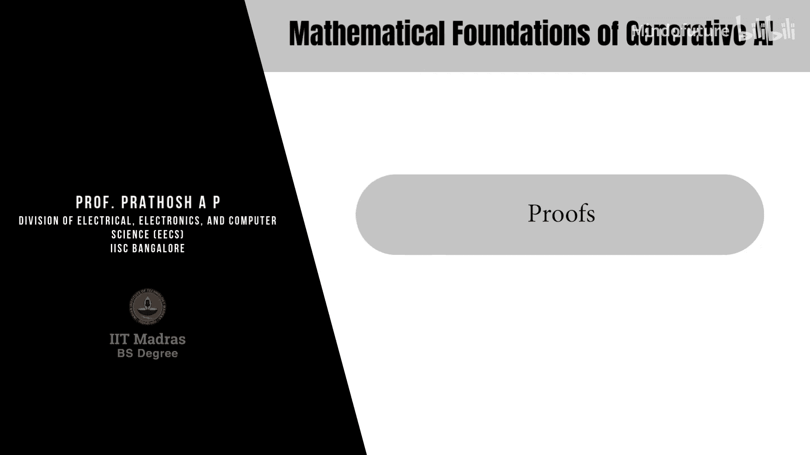
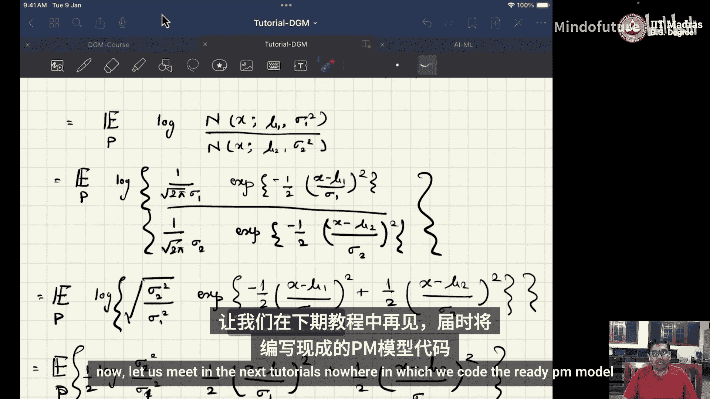

# 048：W8T16 证明 🧮

在本教程中，我们将完成第八周课程中遗留的三个数学证明。我们将推导两个独立正态分布随机变量之和的分布，并计算两个正态分布之间的KL散度。这些推导是理解扩散模型等生成式AI模型数学基础的关键步骤。

---

## 两个独立正态分布随机变量之和 📊

上一节我们提到了几个未完成的证明，本节中我们首先来看第一个：两个独立正态分布随机变量之和的分布。

设随机变量 **X** 和 **Y** 相互独立，且：
*   **X ~ N(μₓ, σₓ²)**
*   **Y ~ N(μᵧ, σᵧ²)**

定义 **Z = X + Y**。我们的目标是证明 **Z** 也服从正态分布，并求出其均值 **μ_z** 和方差 **σ_z²**。

我们将使用特征函数法进行证明。正态分布 **N(μ, σ²)** 的特征函数公式为：
**φ(t) = exp(iμt - (σ²t²)/2)**

根据特征函数的性质，独立随机变量之和的特征函数等于各自特征函数的乘积。因此，**Z** 的特征函数为：
**φ_z(t) = φ_x(t) * φ_y(t)**

代入公式：
**φ_z(t) = exp(iμₓt - (σₓ²t²)/2) * exp(iμᵧt - (σᵧ²t²)/2)**

合并指数项：
**φ_z(t) = exp(i(μₓ + μᵧ)t - ((σₓ² + σᵧ²)t²)/2)**

观察上式，这正是均值为 **(μₓ + μᵧ)**、方差为 **(σₓ² + σᵧ²)** 的正态分布的特征函数。因此，我们得出结论：
**Z ~ N(μₓ + μᵧ, σₓ² + σᵧ²)**

这个结论可以推广到线性组合 **aX + bY** 的情况。基于此结果，你可以自行推导其分布。

---

## 两个正态分布之间的KL散度 📐

接下来，我们计算两个正态分布之间的KL散度。这是评估概率分布差异的重要度量。

设两个一维正态分布：
*   **P ~ N(μ₁, σ₁²)**
*   **Q ~ N(μ₂, σ₂²)**

KL散度的定义为：
**KL(P || Q) = ∫ p(x) log(p(x)/q(x)) dx = E_{x~P}[log(p(x)/q(x))]**

以下是计算步骤：

1.  写出概率密度函数并代入公式：
    **KL(P || Q) = E_{x~P}[ log( (1/(√(2π)σ₁)) * exp(-(x-μ₁)²/(2σ₁²)) ) - log( (1/(√(2π)σ₂)) * exp(-(x-μ₂)²/(2σ₂²)) ) ]**

2.  利用对数性质合并项：
    **= E_{x~P}[ log(σ₂/σ₁) + ( - (x-μ₁)²/(2σ₁²) + (x-μ₂)²/(2σ₂²) ) ]**

3.  展开平方项 **(x-μ₂)²**，并利用期望的线性性质，将各项分开计算：
    **= log(σ₂/σ₁) + (1/2) * E_{x~P}[ - (x-μ₁)²/σ₁² + (x² - 2μ₂x + μ₂²)/σ₂² ]**

4.  分别计算各项期望。已知对于 **X ~ P**：
    *   **E[(x-μ₁)²] = σ₁²**
    *   **E[x] = μ₁**
    *   **E[x²] = μ₁² + σ₁²**

5.  将期望值代入表达式：
    **= log(σ₂/σ₁) + (1/2) * [ - (σ₁²/σ₁²) + ( (μ₁²+σ₁²) - 2μ₂μ₁ + μ₂² )/σ₂² ]**
    **= log(σ₂/σ₁) + (1/2) * [ -1 + ( (μ₁ - μ₂)² + σ₁² )/σ₂² ]**

6.  整理最终公式。通常我们使用方差比的形式，将 **log(σ₂/σ₁)** 改写为 **(1/2)log(σ₂²/σ₁²)**，并进一步调整得到最终形式：
    **KL(P || Q) = log(σ₂/σ₁) + (σ₁² + (μ₁ - μ₂)²)/(2σ₂²) - 1/2**

或者更常见的等价形式：
**KL(P || Q) = (1/2)[ (μ₁ - μ₂)²/σ₂² + σ₁²/σ₂² - 1 - log(σ₁²/σ₂²) ]**

这个一维情况的推导过程，为理解高维（向量值）正态分布的KL散度公式（涉及矩阵迹和行列式）提供了清晰的直觉。

---

## 总结 ✨

本节课中我们一起学习了两个核心推导：

1.  **独立正态变量之和**：我们使用特征函数法证明了 **N(μₓ, σₓ²)** 与 **N(μᵧ, σᵧ²)** 之和服从 **N(μₓ+μᵧ, σₓ²+σᵧ²)**。
2.  **正态分布间的KL散度**：我们通过展开期望、代入矩的计算，推导出了一维正态分布 **P** 与 **Q** 之间KL散度的解析表达式。

这些结论是构建和分析扩散模型等生成式AI算法的基石。虽然涉及一些代数运算，但每一步都基于概率论的基本定义和性质。理解这些推导有助于你更深入地掌握模型背后的数学原理。