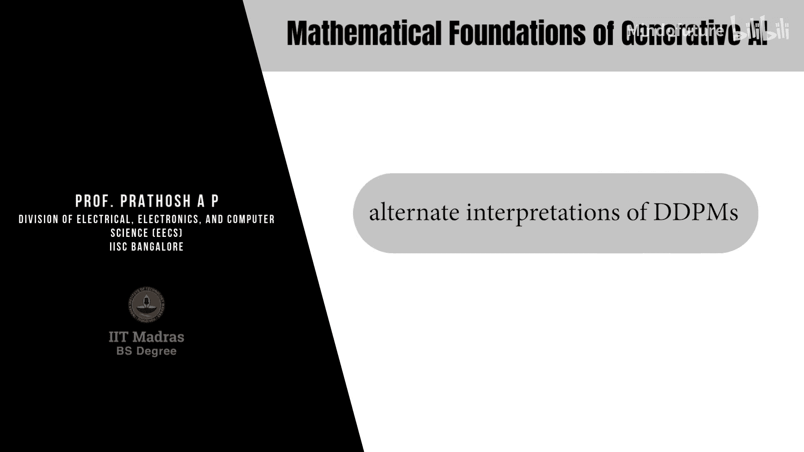
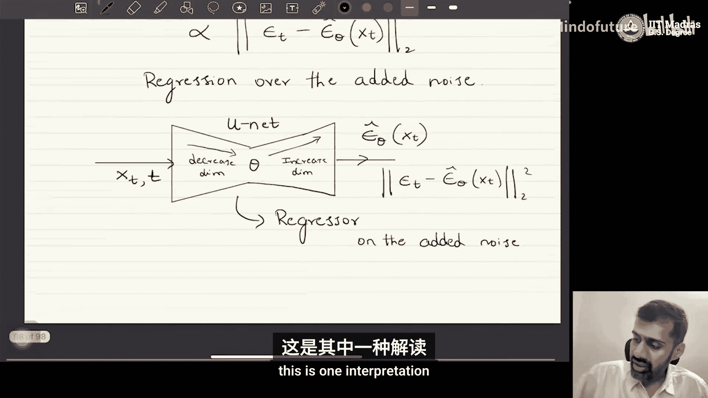

# 049：DDPM的替代解释

## 概述

在本节课中，我们将学习扩散模型的条件生成能力。具体来说，我们将探讨如何修改去噪扩散概率模型的结构，使其能够从条件分布而非边缘分布中进行采样。为了实现这一目标，我们首先需要理解DDPM的几种不同数学表述。

## DDPM的替代解释

上一节我们回顾了DDPM的基本框架。本节中，我们来看看对DDPM的两种重要替代解释。这些解释本质上是对同一组方程的不同参数化方式，但它们为理解和扩展模型提供了新的视角。

### DDPM作为噪声预测器

这是DDPM原始论文中提出的著名解释之一。其核心思想是将模型视为对**所添加噪声**的回归器。

首先，回顾DDPM的前向过程。第t个潜在变量（即加噪后的数据）可以递归地定义为：
`x_t = sqrt(α_t_bar) * x_0 + sqrt(1 - α_t_bar) * ε_t`
其中，`ε_t` 是从标准正态分布 `N(0, I)` 中采样的噪声。

通过重新排列上述项，我们可以将原始数据 `x_0` 表示为 `x_t` 和所添加噪声 `ε_t` 的函数：
`x_0 = (x_t - sqrt(1 - α_t_bar) * ε_t) / sqrt(α_t_bar)`

现在，回顾我们之前推导的一致性损失项。它涉及真实反向分布 `q(x_{t-1} | x_t, x_0)` 的均值 `μ_q` 和模型预测分布 `p_θ(x_{t-1} | x_t)` 的均值 `μ_θ` 之间的差异。

`μ_q` 原本是 `x_t` 和 `x_0` 的线性组合。通过将上述 `x_0` 的表达式代入 `μ_q` 的公式，并进行代数整理，我们可以将 `μ_q` 重新参数化为 `x_t` 和 `ε_t` 的函数：
`μ_q = (1 / sqrt(α_t)) * x_t - ((1 - α_t) / (sqrt(1 - α_t_bar) * sqrt(α_t))) * ε_t`

类似地，我们可以将模型预测的均值 `μ_θ` 设计为具有相同结构的形式：
`μ_θ = (1 / sqrt(α_t)) * x_t - ((1 - α_t) / (sqrt(1 - α_t_bar) * sqrt(α_t))) * ε_θ(x_t, t)`

这里，`ε_θ(x_t, t)` 是一个神经网络，其输入是 `x_t` 和时间步 `t`。

当我们计算 `μ_q` 和 `μ_θ` 之间的差异时，许多系数会相互抵消。最终，一致性损失项（忽略常数因子）简化为：
`L_t ∝ || ε_t - ε_θ(x_t, t) ||^2`

**结论**：在这种解释下，DDPM的训练目标可以看作是让一个神经网络 `ε_θ` 去预测在前向过程中添加到原始数据 `x_0` 上的噪声 `ε_t`。模型输入是加噪样本 `x_t` 和时间步 `t`，输出是预测的噪声。

以下是这种解释的直观理解：

*   神经网络接收一个含噪图像 `x_t`。
*   它的任务是预测出为了从 `x_0` 得到 `x_t` 所必须添加的噪声量 `ε_t`。
*   通过最小化预测噪声和真实噪声之间的均方误差，模型学会了“理解”噪声是如何被添加的，从而在推理时能够逐步去除噪声。

### DDPM作为分数预测器

接下来，我们看看第二种重要的解释：将DDPM视为对数据分布**对数概率密度梯度**（即分数）的预测器。这种解释建立了扩散模型与基于分数的生成模型之间的深刻联系。

分数函数的定义是数据对数概率密度对数据本身的梯度：
`score(x) = ∇_x log p(x)`

在DDPM的框架下，可以证明，在特定条件下，我们之前定义的噪声预测器 `ε_θ(x_t, t)` 与分数函数之间存在一个比例关系。

具体而言，对于在时间步 `t` 的加噪数据分布 `p(x_t)`，其分数与预测噪声的关系近似为：
`∇_{x_t} log p(x_t) ≈ - ε_θ(x_t, t) / sqrt(1 - α_t_bar)`

**推导思路**：前向过程定义 `x_t = sqrt(α_t_bar) * x_0 + sqrt(1 - α_t_bar) * ε`。如果我们将 `x_t` 的分布视为 `x_0` 的先验分布与高斯噪声的卷积，那么根据Tweedie公式，其后验均值（即给定 `x_t` 下 `x_0` 的期望）与分数有关。结合我们之前 `x_0` 与 `ε_t` 的关系式，即可建立上述联系。

**结论**：在这种解释下，训练DDPM的噪声预测网络 `ε_θ`，等价于训练一个模型来估计各个噪声水平下数据分布的分数。反向（生成）过程则可以被视为一种沿着分数场（即指向数据高概率区域的方向）进行的迭代去噪过程，这类似于朗之万动力学采样。

## 两种解释的意义与关联

我们已经介绍了DDPM的两种核心替代解释。

*   **噪声预测视角** 更直观，直接对应于去噪任务。
*   **分数匹配视角** 更具理论深度，将扩散模型纳入了更广泛的基于分数的生成模型框架。

这两种视角是内在统一的。预测噪声本质上是在估计一个与分数成比例的量。这种等价性为理解扩散模型为何有效提供了坚实的基础，也为其扩展（如下一节将要讨论的条件生成）铺平了道路。

## 总结

本节课中，我们一起学习了DDPM的两种关键替代解释：
1.  **作为噪声预测器**：模型学习预测前向过程中添加到数据上的噪声，其损失函数为 `|| ε_t - ε_θ(x_t, t) ||^2`。
2.  **作为分数预测器**：模型学习估计数据分布在对数概率密度空间中的梯度（分数），建立了与基于分数的生成模型的联系。

理解这些不同的数学表述至关重要，它们不仅是理论上的优美结果，更是我们修改模型以实现条件生成、加速采样等高级功能的理论工具。在下一节中，我们将利用这些知识，探讨如何引导扩散模型进行条件生成。