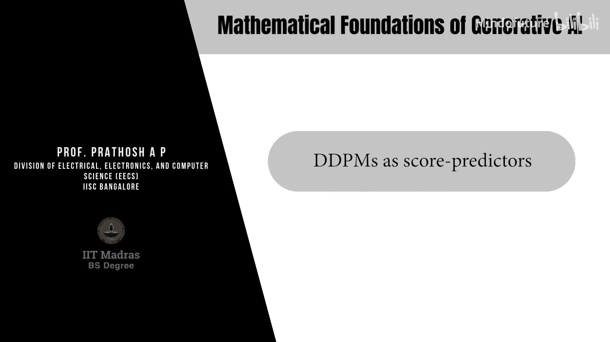
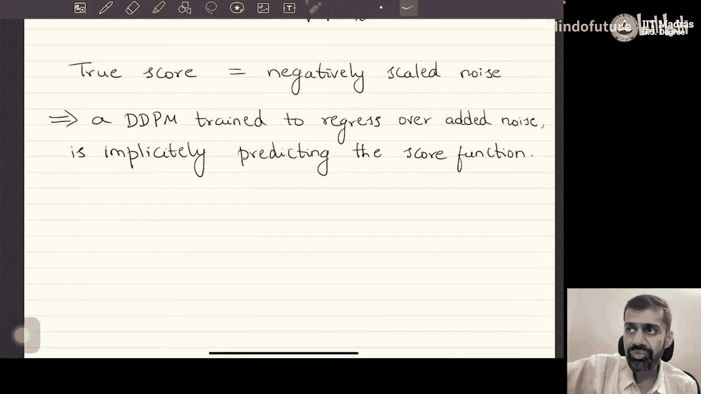

# 050：DDPM作为分数预测器 🎯

在本节课中，我们将学习扩散模型（DDPM）的另一种重要解释：将其视为分数预测器。这种视角与分数匹配模型有很强的联系，并且对于理解条件生成任务非常有用。

## 概述：从统计公式到分数函数

上一节我们介绍了DDPM的几种等价解释。本节中，我们将从一个经典的统计学结果出发，推导出DDPM作为分数预测器的解释。

在统计学中，有一个著名的结果称为“Tweedie公式”。假设有一个高斯随机变量 **T**，其均值为 **μ**，方差为 **σ²**。那么，在观察到该随机变量的一个具体值 **t** 后，其真实均值的条件期望可以表示为：

**E[μ | T = t] = t + σ² * ∇_t log p(t)**

其中，**∇_t log p(t)** 被称为分布 **p(t)** 的**分数函数**。分数函数是**对数似然函数关于随机变量本身的梯度**。它指示了在随机变量的取值空间中，哪个方向能最大程度地增加数据的似然概率。

## DDPM中的分数函数

现在，我们将这个公式应用到DDPM的框架中。回忆一下，在DDPM中，第 **t** 步的潜变量 **x_t** 的条件分布是高斯分布：

**q(x_t | x_0) = N( x_t; √(ᾱ_t) * x_0, (1 - ᾱ_t) I )**

其中，均值 **μ** = √(ᾱ_t) * x_0，方差 **σ²** = (1 - ᾱ_t)。

根据Tweedie公式，在给定观测值 **x_t** 的情况下，真实均值 **√(ᾱ_t) * x_0** 的最佳估计（即条件期望）为：

**E[√(ᾱ_t) * x_0 | x_t] = x_t + (1 - ᾱ_t) * ∇_{x_t} log p(x_t)**

这里，**∇_{x_t} log p(x_t)** 就是边际分布 **p(x_t)** 的分数函数。

由于我们知道真实均值就是 **√(ᾱ_t) * x_0**，因此我们可以将上述等式写为：

**√(ᾱ_t) * x_0 = x_t + (1 - ᾱ_t) * ∇_{x_t} log p(x_t)**

通过简单的代数重排，我们可以用 **x_t** 和分数函数来表示原始数据 **x_0**：

**x_0 = (1 / √(ᾱ_t)) * x_t - ((1 - ᾱ_t) / √(ᾱ_t)) * ∇_{x_t} log p(x_t)**

## 将一致性损失重写为分数匹配

接下来，我们利用这个关系来重新表达DDPM训练中的“一致性项”损失。回忆一下，一致性损失是真实后验均值 **μ_q** 和模型预测均值 **μ_θ** 之间的差异。

首先，我们将 **μ_q** 用分数函数表示。通过将上面 **x_0** 的表达式代入 **μ_q** 的定义式，并进行代数运算（此处省略详细步骤），可以得到：

**μ_q = (1 / √(α_t)) * x_t - ((1 - α_t) / √(α_t)) * ∇_{x_t} log p(x_t)**

遵循DDPM的一贯做法，我们将所有常数因子吸收进神经网络，并定义模型的预测目标。因此，我们可以类似地定义模型的预测均值 **μ_θ** 为：

**μ_θ = (1 / √(α_t)) * x_t - ((1 - α_t) / √(α_t)) * s_θ(x_t, t)**

这里，**s_θ(x_t, t)** 是一个神经网络，其任务是**预测分数函数 ∇_{x_t} log p(x_t)**。

现在，一致性损失函数 **|| μ_q - μ_θ ||²** 就转化为（忽略常数缩放因子）：

**L = || ∇_{x_t} log p(x_t) - s_θ(x_t, t) ||²**

这正是一个**分数匹配**的目标：训练一个神经网络 **s_θ** 来匹配真实数据分布的分数函数。

## 真实分数的计算与等价性

你可能会问：我们如何知道真实的分数函数 **∇_{x_t} log p(x_t)** 是什么呢？这可以通过DDPM的前向过程推导出来。

我们知道，根据前向加噪过程，**x_t** 可以直接由 **x_0** 和所加的噪声 **ε_t** 定义：

**x_t = √(ᾱ_t) * x_0 + √(1 - ᾱ_t) * ε_t**，其中 **ε_t ~ N(0, I)**

由此可以解出 **x_0**：

**x_0 = (x_t - √(1 - ᾱ_t) * ε_t) / √(ᾱ_t)**

将这个表达式与我们之前通过Tweedie公式得到的 **x_0** 表达式联立：

**(1 / √(ᾱ_t)) * x_t - ((1 - ᾱ_t) / √(ᾱ_t)) * ∇ log p(x_t) = (x_t - √(1 - ᾱ_t) * ε_t) / √(ᾱ_t)**

通过比较和代数运算（建议作为练习），我们可以得到一个优美而关键的结论：

**∇_{x_t} log p(x_t) = - ε_t / √(1 - ᾱ_t)**

这个结果表明，**真实数据分布的分数函数，本质上就是所添加噪声的负值，再经过一个缩放**。分数指向噪声的反方向，这很直观：为了从带噪数据 **x_t** 回到干净数据 **x_0**（分布的高概率区域），我们需要沿着与所加噪声相反的方向移动。

## 核心结论与不同解释的等价性

由此，我们得到了DDPM的第四种解释：

**DDPM可以被视为一个分数函数预测器（Score Predictor）。** 神经网络 **s_θ(x_t, t)** 学习预测分数 **∇ log p(x_t)**。

更重要的是，我们揭示了不同解释之间的深刻联系：

*   **预测噪声**：神经网络输出 **ε_θ**，目标是匹配添加的噪声 **ε_t**。
*   **预测分数**：神经网络输出 **s_θ**，目标是匹配分数函数 **∇ log p(x_t)**。

由于 **∇ log p(x_t) ∝ - ε_t**，因此**预测噪声和预测分数是完全等价的**。预测噪声的神经网络隐式地也在预测分数函数。

以下是DDPM几种核心解释的总结，它们本质上是同一模型的不同视角：

1.  **数据预测**：直接预测原始数据 **x_0**。
2.  **均值预测**：预测后验分布的均值 **μ**。
3.  **噪声预测**：预测前向过程中添加的噪声 **ε_t**。（最常用）
4.  **分数预测**：预测数据分布的分数函数 **∇ log p(x_t)**。

所有这些解释对应的损失函数，彼此之间只相差一些常数缩放因子。因此，无论采用哪种解释，神经网络都在学习相同的内在规律。

## 总结

本节课中，我们一起学习了扩散模型（DDPM）作为分数预测器的解释。

*   我们从统计学中的Tweedie公式出发，引入了**分数函数**的概念，即对数似然关于数据本身的梯度。
*   我们将此公式应用于DDPM的高斯扩散过程，推导出可以用分数函数表示原始数据 **x_0**。
*   基于此，我们将DDPM的一致性训练目标重新表述为**分数匹配**问题，即让神经网络 **s_θ** 去逼近真实分布的分数。
*   通过分析DDPM的前向过程，我们证明了**真实分数与所加噪声成比例**，从而揭示了“预测噪声”和“预测分数”这两种解释的**等价性**。
*   最后，我们总结了DDPM的多种等价解释，并指出最常用的噪声预测视角隐含着分数预测的能力。

理解分数预测的视角至关重要，因为它为后续扩展到更复杂的生成模型（如条件生成、基于分数的生成模型）提供了清晰的理论桥梁。在需要引导生成过程时，操作分数函数往往比直接操作噪声更为直观和方便。