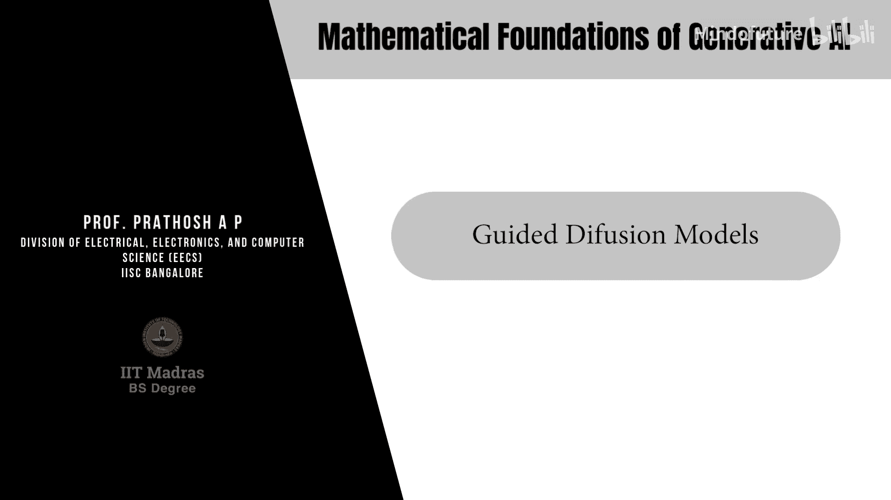
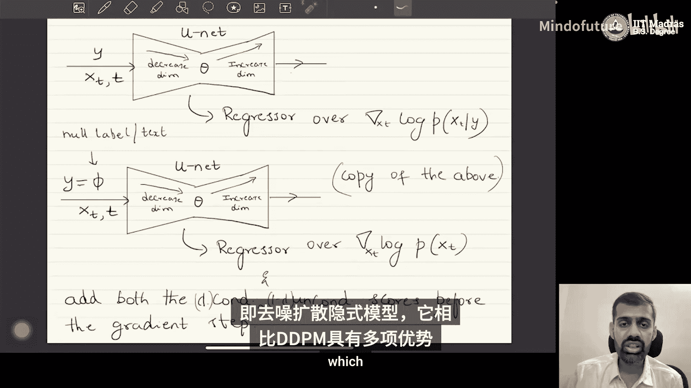

# 051：引导扩散模型

## 概述
在本节课中，我们将学习如何将扩散模型用于条件生成，即根据给定的条件（如文本描述或类别标签）生成数据。我们将探讨两种主要方法：**分类器引导扩散**和**分类器自由引导扩散**。

---

## 条件生成与引导扩散

上一节我们介绍了扩散模型的基本原理。本节中，我们来看看如何将其用于条件生成。

目前所有商业化的生成工具（如文本生成图像模型）本质上都是条件生成器。它们的目标不再是简单地从数据分布 \( p(x_0) \) 中采样，而是从条件分布 \( p(x_0 | y) \) 中采样。这里的 \( y \) 是条件变量。

以下是条件变量 \( y \) 的常见示例：
*   **类别标签**：例如，在图像数据集中，\( y \) 可以表示“猫”、“狗”等类别。
*   **文本嵌入**：一段自然语言文本可以被编码成一个向量（嵌入），作为生成图像的条件。

为了实现条件生成，我们需要成对的数据 \( (x_0, y) \)，例如（图像，文本描述）或（图像，类别标签）。我们的核心问题是如何修改去噪扩散概率模型，使其能够从条件分布 \( p(x_0 | y) \) 中采样。

我们将学习两种实现方法。

---

## 分类器引导扩散

第一种方法是**分类器引导扩散**。它利用了DDPM是**分数预测器**这一重要解释。

在无条件生成中，DDPM预测的是边际分布 \( p(x_t) \) 的分数（梯度）：
\[
\nabla_{x_t} \log p(x_t)
\]

在条件生成中，我们的目标是预测条件分数 \( \nabla_{x_t} \log p(x_t | y) \)。根据贝叶斯定理，我们可以将其分解：
\[
\nabla_{x_t} \log p(x_t | y) = \nabla_{x_t} \log p(x_t) + \nabla_{x_t} \log p(y | x_t)
\]

这个结果非常关键：
*   第一项 \( \nabla_{x_t} \log p(x_t) \) 是**无条件分数**，可以由我们的DDPM模型预测。
*   第二项 \( \nabla_{x_t} \log p(y | x_t) \) 是**分类器梯度**。它表示在给定噪声数据 \( x_t \) 时，条件 \( y \) 的对数概率梯度。

因此，要估计条件分数，我们需要同时获得无条件分数和分类器梯度。

以下是具体的实现步骤：

1.  **训练一个分类器**：首先，我们需要一个预训练的分类器（或回归器，取决于 \( y \) 的类型）。这个分类器以噪声样本 \( x_t \) 为输入，预测条件概率 \( p(y | x_t) \)。这个分类器需要在不同噪声水平 \( t \) 的数据上进行训练，这是一个具有挑战性的任务。
2.  **修改DDPM训练**：在训练DDPM（即预测噪声 \( \epsilon_\theta \) 的模型）时，我们进行前向传播计算无条件分数。同时，我们将相同的 \( x_t \) 输入预训练的分类器，计算其输出 \( p(y | x_t) \)，然后通过反向传播计算该输出相对于输入 \( x_t \) 的梯度，即分类器梯度 \( \nabla_{x_t} \log p(y | x_t) \)。
3.  **组合梯度进行更新**：在DDPM的反向传播步骤中，我们不只使用无条件分数的梯度来更新模型参数 \( \theta \)，而是将无条件分数的梯度与分类器梯度相加，用这个总和来更新参数。这样，DDPM就学会了预测接近条件分数的值。

**关于推理**：在推理（生成）阶段，我们只需要训练好的DDPM模型。我们将条件 \( y \) 作为额外输入提供给模型，模型会输出条件分数的估计。然后，我们使用与标准DDPM完全相同的迭代去噪公式进行采样，只是将公式中的分数替换为条件分数估计。预训练的分类器在推理阶段不再使用。

这种方法的主要问题在于，其生成质量严重依赖于分类器的性能。而在高噪声水平 \( x_t \) 上训练一个准确的分类器是非常困难的。

---

## 分类器自由引导扩散

为了解决分类器引导的难题，研究者提出了**分类器自由引导扩散**。这种方法无需单独训练分类器，而是通过修改训练过程来近似条件分数。

我们从条件分数的贝叶斯分解开始：
\[
\nabla_{x_t} \log p(x_t | y) = \nabla_{x_t} \log p(x_t) + \nabla_{x_t} \log p(y | x_t)
\]
再次利用贝叶斯定理处理分类器项，并引入一个超参数 \( \lambda \) 进行缩放，我们可以得到一个近似表达式：
\[
\nabla_{x_t} \log p(x_t | y) \approx \lambda \cdot \nabla_{x_t} \log p(x_t | y) + (1 - \lambda) \cdot \nabla_{x_t} \log p(x_t)
\]
这里，\( \lambda \) 是一个可调节的超参数。当 \( \lambda = 1 \) 时，上式退化为精确的条件分数；当 \( \lambda > 1 \) 时，会增强条件的影响。

这个公式表明，我们想要的条件分数，可以通过无条件分数和条件分数本身的凸组合来近似。关键在于，我们现在需要同时估计无条件分数和条件分数。

以下是具体的实现方式：

1.  **使用单一模型**：我们只训练一个神经网络 \( \epsilon_\theta \)。这个网络以噪声 \( x_t \) 和时间步 \( t \) 为输入，同时它也以条件 \( y \) 为输入。
2.  **随机丢弃条件进行训练**：在训练过程中，我们以一定的概率（例如10%）将条件 \( y \) 设置为“空”（如零向量、空文本的嵌入）。这样：
    *   当提供有效条件 \( y \) 时，模型学习预测**条件分数** \( \nabla_{x_t} \log p(x_t | y) \)。
    *   当条件 \( y \) 被置为空时，模型学习预测**无条件分数** \( \nabla_{x_t} \log p(x_t) \)。
3.  **组合分数进行推理**：在推理阶段，对于同一个 \( x_t \)，我们运行模型两次：
    *   一次输入有效条件 \( y \)，得到条件分数估计 \( s_c \)。
    *   一次输入空条件，得到无条件分数估计 \( s_u \)。
    *   然后，我们按公式 \( s = \lambda \cdot s_c + (1 - \lambda) \cdot s_u \) 计算引导后的分数，并用它进行去噪采样。

这种方法避免了训练独立分类器的困难，简化了流程，并且被Stable Diffusion等当前最先进的文本到图像模型所广泛采用。超参数 \( \lambda \) 允许我们在生成样本的多样性和与条件的对齐程度之间进行权衡。

---

## 总结
本节课中，我们一起学习了如何扩展扩散模型以实现条件生成。
*   我们首先明确了条件生成的目标是从 \( p(x_0 | y) \) 采样。
*   接着，我们学习了**分类器引导扩散**，它通过引入一个预训练的分类器来提供梯度信号，引导生成过程朝向给定的条件 \( y \)。
*   最后，我们探讨了更流行的**分类器自由引导扩散**，它通过在同一模型的训练中随机丢弃条件，并在线性组合条件与无条件分数估计的方式，实现了无需分类器的条件引导。这种方法更稳定，是当前的主流选择。

下一节，我们将讨论另一类扩散模型——去噪扩散隐式模型，它相比DDPM具有一些优势。