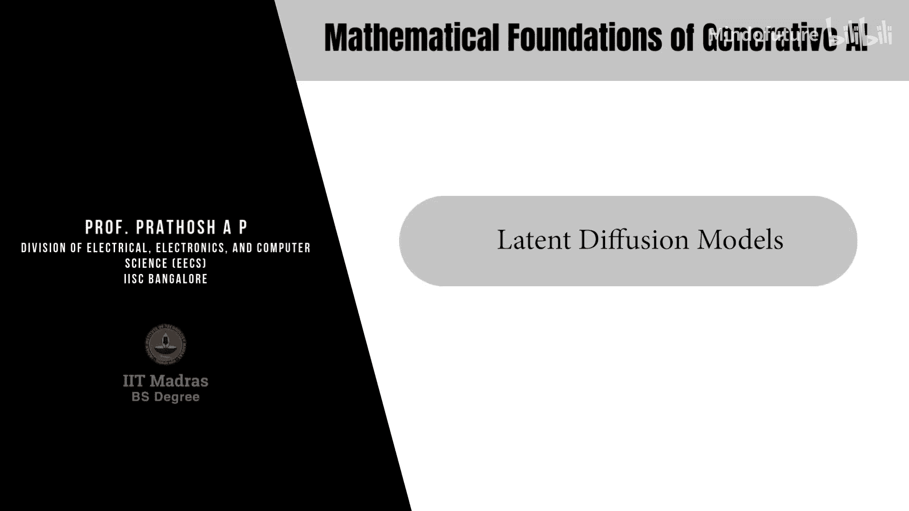
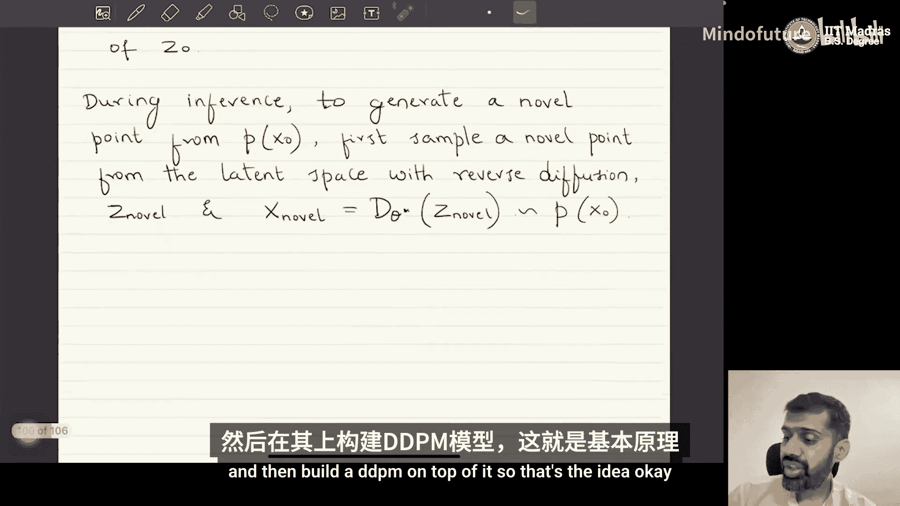

生成式AI的数学基础：P52：潜在扩散模型 🎼

在本节课中，我们将学习扩散模型。这是本课程的最后一个模块，我们将讨论两种在DDPM基础上的改进模型：潜在扩散模型和扩散隐式模型。这两种模型都在当前最先进的技术中广泛使用，相比基础的DDPM公式具有显著优势。

首先，我们来探讨潜在扩散模型。

潜在扩散模型，有时也被称为稳定扩散模型。它在算法层面没有新的突破，但在实现层面有所不同。其核心思想是，不在原始数据空间上构建扩散模型，而是在某个编码器-解码器结构所诱导的潜在空间上构建扩散模型。

### 核心思想

潜在扩散模型的基本思想是：在由另一个编码器-解码器模型诱导的潜在空间上构建扩散模型。

为什么要这样做呢？以图像数据为例，它们通常存在于非常高维的空间中。在这种极高维空间中创建马尔可夫链并进行操作，会在稳定性和正确学习分布等方面带来许多问题。

潜在扩散模型的思路是，在一个预先训练好的编码器-解码器模型的潜在空间上进行操作。具体步骤如下：

给定数据 `x_0`（我们假设它在某个维度为 `D` 的空间 `R^D` 中），第一步是学习一个潜在表示 `z_0`，它位于维度 `K` 的空间 `R^K` 中，且 `K` 远小于 `D`。这通过一个编码器-解码器模型实现。

一个常用于图像数据集的例子是构建一个我们之前见过的向量量化变分自编码器（VQ-VAE）来学习潜在空间。在VQ-VAE中，潜在空间是确定性的，即给定一个特定的 `x_0`，它会给出一个经过向量量化的确定性向量。

模型结构如下：有一个编码器 `E_φ` 和一个解码器 `D_θ`。`x_0` 输入编码器，得到潜在表示 `z_0`。解码器则根据 `z_0` 重建数据 `x_0_hat`。编码器和解码器函数 `E_φ` 和 `D_θ` 是预先训练的。

这些编码器和解码器函数使用原始数据 `x_0` 或与 `x_0` 相似的其他数据集进行预训练。预训练完成后，所有位于真实数据空间 `R^D` 中的数据点，都可以通过编码器投影到 `K` 维潜在空间。即：
`z_0 = E_φ*(x_0)`

完成投影后，我们在 `z_0` 的空间上构建一个DDPM扩散模型。

### 推理过程

在推理阶段，我们的最终目标是从真实数据对应的分布 `P(x_0)` 中生成一个新点，而不是从潜在空间生成。

为了从 `P(x_0)` 生成一个新点，我们首先需要从潜在空间中采样一个新点。由于扩散模型构建在数据的潜在空间上，我们通过反向扩散过程从潜在空间中采样一个新点，记作 `z_novel`。

然后，将这个新点 `z_novel` 输入预训练的解码器，得到最终的新点 `x_novel`：
`x_novel = D_θ*(z_novel)`

这样得到的 `x_novel` 就是从 `P(x_0)` 中采样的点。因为解码器正是以这种方式学习的。

### 优势总结

潜在扩散模型的关键优势在于：我们不是在原始的高维数据空间上构建扩散模型，而是在一个通过预训练编码器-解码器学习到的、维度更低、更紧凑的潜在空间上构建扩散模型。

目前大多数可用的实现都基于这一原则：首先在给定数据上预训练一个强大的编码器-解码器模型，然后在其潜在空间上构建扩散模型。在推理时，扩散模型学习如何从潜在空间生成潜在点，一旦获得潜在点，只需将其通过解码器，即可得到数据空间中的点。

这种方法也被称为稳定扩散，因为与直接在原始高维数据空间上构建扩散模型相比，它在生成图像类数据集时被观察到更加稳定。

从算法和理论角度看，潜在扩散模型没有改变DDPM的数学本质——它仍然是在一个随机变量（此处是 `z` 而非 `x`）上构建马尔可夫链。但从实现角度看，潜在扩散或稳定扩散是指先将数据投影到预训练编码器-解码器的潜在空间，然后在其上构建DDPM的过程。

本节课我们一起学习了潜在扩散模型的核心概念。我们了解到，其核心创新在于将扩散过程应用于一个低维的、由编码器-解码器学习到的潜在空间，而非原始高维数据空间。这带来了更好的稳定性和效率。在下一节中，我们将探讨另一种重要的改进模型：扩散隐式模型。

