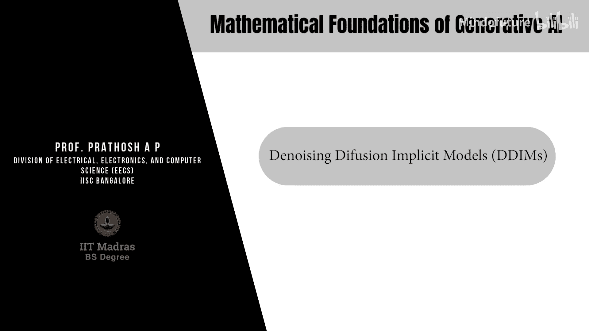
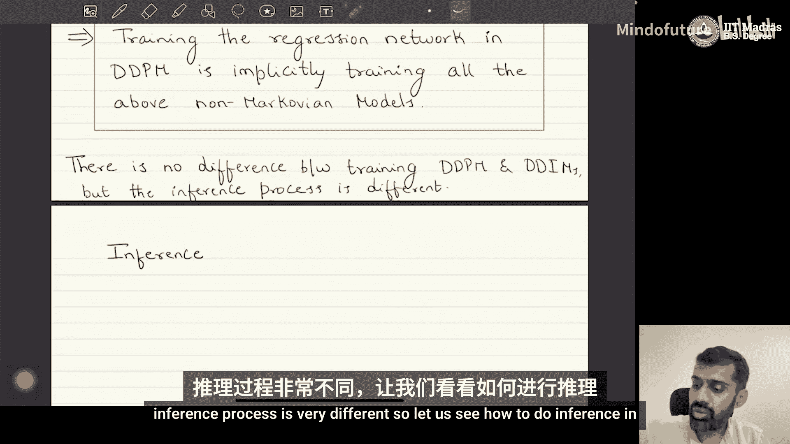
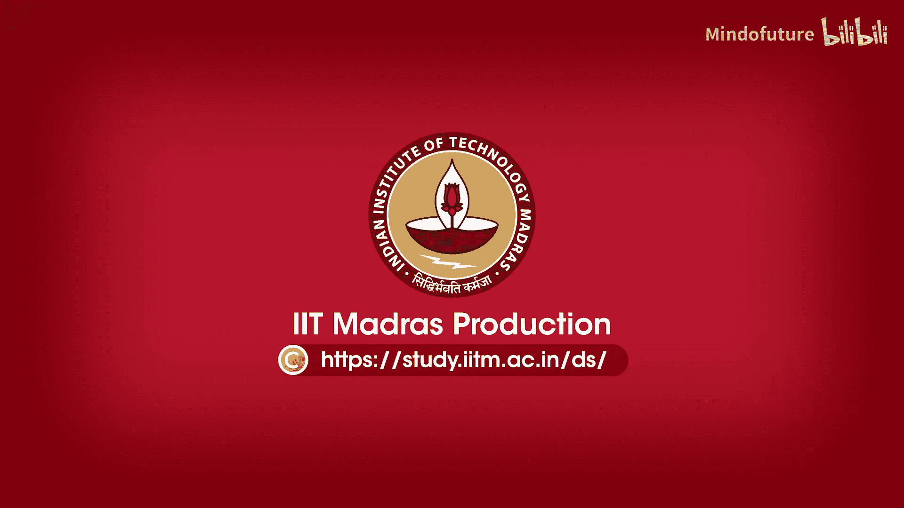

# 053：去噪扩散隐式模型（DDIMs）

在本节课中，我们将学习去噪扩散隐式模型（Denoising Diffusion Implicit Models, DDIMs）。这是一种与去噪扩散概率模型（DDPMs）非常相似的生成模型家族，但旨在解决DDPMs的两个主要限制：采样速度慢和缺乏确定性映射。我们将探讨DDIMs的动机、核心数学定义，以及它们如何在不改变训练过程的前提下，实现更高效的采样。

## DDPMs的局限性

上一节我们介绍了DDPMs的基本原理。本节中，我们来看看DDPMs在实际应用中面临的两个主要问题。

**1. 采样速度慢**
DDPMs的生成过程需要从噪声图像 `x_T` 开始，逐步执行 `T` 次反向去噪步骤（通常 `T` 为数千步），才能得到最终样本 `x_0`。这个过程非常耗时。

**2. 缺乏确定性映射（不可唯一逆推）**
DDPMs的前向过程是随机的。给定一个数据点 `x_0`，运行前向过程多次会得到不同的最终潜在表示 `x_T`。这意味着：
*   不存在一个**唯一**的 `x_T` 能通过反向过程确定性地生成给定的 `x_0`。
*   因此，我们无法为一张给定的图像（如“森林中的老虎”）找到一个确定的潜在向量，从而难以在潜在空间中对图像进行精确的编辑操作（如将“老虎”替换为“大象”）。

以下是DDPMs的两个核心问题：
*   **采样速度慢**
*   **缺乏唯一可逆性**

为了解决这些问题，研究者提出了DDIMs。

## DDIMs：非马尔可夫前向过程

DDIMs也是一种隐变量模型。与DDPMs不同，它定义了一族**非马尔可夫**的前向过程（即后验分布）。

我们考虑一族由标量参数 `σ`（`σ ≥ 0`）参数化的后验分布 `q_σ`：
`q_σ(x_{1:T} | x_0) = q_σ(x_T | x_0) ∏_{t=2}^{T} q_σ(x_{t-1} | x_t, x_0)`

其中：
*   `q_σ(x_T | x_0)` 定义为均值为 `√α_T * x_0`，方差为 `(1 - α_T)I` 的高斯分布。
*   对于所有 `t > 1`，`q_σ(x_{t-1} | x_t, x_0)` 定义为高斯分布，其均值和方差如下：

**均值公式**：
`μ = √α_{t-1} * x_0 + √(1 - α_{t-1} - σ_t^2) * ( (x_t - √α_t * x_0) / √(1 - α_t) )`

**方差公式**：
`Σ = σ_t^2 * I`

需要指出的是，这个定义本身**不是一个马尔可夫链**。`x_t` 不仅依赖于 `x_{t-1}`，还依赖于原始数据 `x_0`。

## DDIMs与DDPMs的关键联系

尽管DDIMs的前向过程与DDPMs不同，但它们有一个至关重要的共同点：

**边际分布 `q_σ(x_t | x_0)` 与DDPMs中的完全相同。**

即：
`q_σ(x_t | x_0) = 𝒩(√α_t * x_0, (1 - α_t)I)`

这个观察是DDIMs理论的基石。因为DDPMs的损失函数（证据下界，ELBO）**只依赖于这些边际分布 `q(x_t | x_0)`**，而不依赖于前向过程的具体路径（即 `q(x_{1:T} | x_0)` 的联合分布形式）。

这意味着：
**只要保证所有 `t` 的 `q(x_t | x_0)` 与DDPMs一致，任何形式的前向过程（包括我们定义的这族非马尔可夫过程）在优化ELBO时，都会得到与训练DDPMs完全相同的解（相差一个常数）。**

换句话说：
**通过训练一个标准的DDPM模型，我们实际上已经隐式地训练了无限多个不同 `σ` 参数的DDIM模型。**

## DDIMs的反向（生成）过程

训练完成后，我们需要定义如何从DDIM中采样（即推理过程）。我们定义参数化的反向过程 `p_θ`：

对于 `t > 1`：
`p_θ^{(t)}(x_{t-1} | x_t) = q_σ(x_{t-1} | x_t, x̂_0)`
其中 `x̂_0` 是由神经网络预测的 `x_0` 的估计值：
`x̂_0 = (x_t - √(1 - α_t) * ε_θ(x_t, t)) / √α_t`

对于 `t = 1`：
`p_θ^{(1)}(x_0 | x_1) = 𝒩(μ_θ(x_1), σ^2 I)`

这里，`ε_θ(x_t, t)` 就是训练DDPM时所用的同一个去噪神经网络。因此，**DDIMs的训练过程与DDPMs完全一致**。

## DDIMs的采样算法

由于反向过程是非马尔可夫的，且依赖于预测的 `x̂_0`，我们可以设计出比DDPM更高效的采样算法。核心思想是：我们可以跳过一些时间步，因为 `x_{t-1}` 的计算直接依赖于预测的 `x_0` 和当前的 `x_t`，而不需要严格按顺序遍历所有中间状态。

一个确定性的采样步骤（当 `σ_t = 0` 时）可以表示为：

`x_{t-1} = √α_{t-1} * x̂_0 + √(1 - α_{t-1}) * ε_θ(x_t, t)`

通过选择一组递减的时间步子序列 `{τ_1, τ_2, ..., τ_S}`，其中 `S` 远小于DDPM的总步数 `T`，我们可以仅用 `S` 步就从 `x_T` 生成 `x_0`，从而**大幅提升采样速度**。

## 总结

本节课中我们一起学习了去噪扩散隐式模型（DDIMs）。我们了解到：
1.  DDIMs旨在解决DDPMs**采样慢**和**缺乏确定性映射**的问题。
2.  DDIMs的核心是构造了一族**非马尔可夫**的前向过程，但其边际分布 `q(x_t | x_0)` 与DDPMs保持一致。
3.  一个关键结论是：**训练一个DDPM模型等价于同时训练了所有可能的DDIM模型**。两者的训练过程完全相同。
4.  DDIMs的优势体现在**推理（采样）阶段**。通过利用非马尔可夫特性，可以设计出能跳过大量步骤的采样算法，实现数十倍甚至百倍的加速，并且当 `σ=0` 时，生成过程是确定性的，使得图像编辑等任务成为可能。

因此，DDIMs是在不增加额外训练成本的前提下，对DDPMs在推理效率和应用灵活性上的一个强大改进。