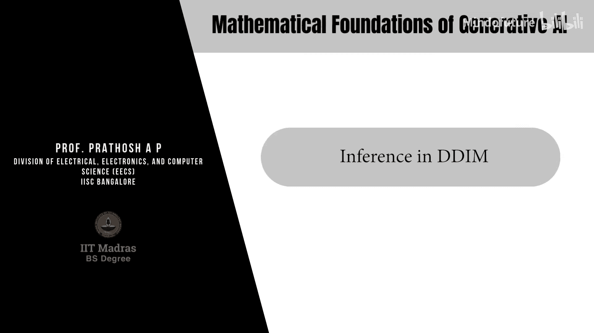
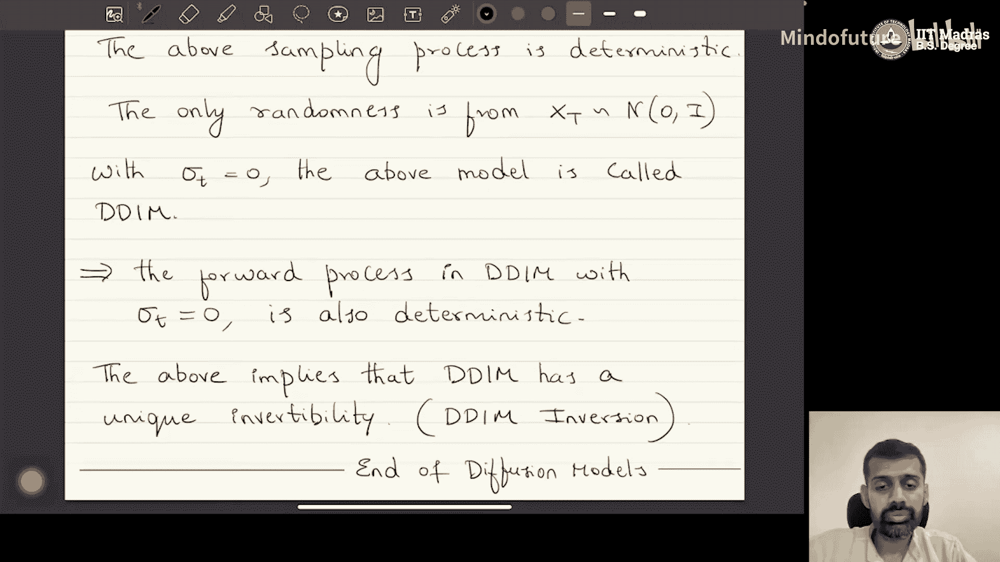

# 054：DDIM中的推理 🎼

在本节课中，我们将学习扩散模型中一个重要的推理方法——去噪扩散隐式模型（DDIM）。我们将了解DDIM如何从DDPM中推导出来，其推理过程有何不同，以及它为何在图像编辑等应用中具有优势。

## 概述

上一节我们介绍了扩散模型的基本框架。本节中，我们来看看DDIM中的推理过程。推理，本质上就是从反向过程中采样。

## 什么是推理？

推理就是从反向过程中采样。具体来说，就是从条件分布 **P_θ(x_{t-1} | x_t)** 中采样。对于一个训练好的DDPM模型，我们已得到最优参数 **θ***，因此这个分布就是 **P_{θ*}(x_{t-1} | x_t)**。

根据定义，这个分布是一个高斯分布。其均值为 **μ_θ***，方差为 **σ_t^2**。因此，采样过程就是从这个高斯分布中抽取样本。

## 通用采样过程

以下是DDIM的通用采样步骤。我们需要从高斯分布 **P_{θ*}(x_{t-1} | x_t)** 中采样。

1.  首先，采样一个标准高斯噪声：**z ~ N(0, I)**。
2.  然后，计算 **x_{t-1}**：
    **x_{t-1} = μ_{θ*} + σ_t * z**

其中，均值 **μ_{θ*}** 的表达式为：
**μ_{θ*} = (1 / √α_t) * [ x_t - ( (1-α_t) / √(1-α_t) ) * ε_{θ*}(x_t, t) ]**

这里，**ε_{θ*}(x_t, t)** 是训练好的神经网络预测的噪声。将均值代入，完整的采样公式为：

**x_{t-1} = (1 / √α_t) * [ x_t - ( (1-α_t) / √(1-α_t) ) * ε_{θ*}(x_t, t) ] + σ_t * z**

这个公式定义了一个参数化的采样族，其中 **σ_t** 是一个非负的向量，不同的 **σ_t** 值对应不同的前向过程。关键在于，**训练一个DDPM网络，就等价于训练了这一整个模型族**。

## DDPM：一个特例

当 **σ_t** 取一个特定值时，上述通用过程就退化成了标准的DDPM。

具体来说，当 **σ_t** 满足以下公式时：
**σ_t = √( (1-α_{t-1})/(1-α_t) ) * √(1 - α_t/α_{t-1})**

采样过程就与DDPM完全一致。这说明，**DDPM只是这个更大家族模型中的一个特例**。

## DDIM：另一个特例

另一个重要的特例是当 **σ_t = 0**。

此时，采样公式中的随机噪声项 **σ_t * z** 完全消失。**x_{t-1}** 的表达式变为：

**x_{t-1} = (1 / √α_t) * [ x_t - ( (1-α_t) / √(1-α_t) ) * ε_{θ*}(x_t, t) ]**

这个采样过程是**完全确定性的**。唯一的随机性仅来自于初始噪声 **x_T ~ N(0, I)**。一旦 **x_T** 确定，整个反向过程就会生成唯一确定的图像 **x_0**。

## DDIM的优势

DDIM（即 **σ_t = 0** 的情况）带来了两个关键优势：

1.  **可逆性**：由于前向和反向过程都是确定性的，给定一张图像 **x_0**，通过DDIM的前向过程可以得到一个唯一的隐变量（噪声）**x_T**。这个过程称为 **DDIM反转**。反之，从这个 **x_T** 出发，通过反向过程也能确定性地重建回 **x_0**。
2.  **快速采样**：DDIM的确定性特性允许使用更少的采样步数（即更小的 **T**）来生成高质量图像，从而大大加快了推理速度。

## DDIM在图像编辑中的应用

DDIM的可逆性使其在图像编辑中非常有用。以下是典型的编辑流程：

1.  对原始图像（例如“森林中的老虎”）进行 **DDIM反转**，得到其对应的唯一隐变量 **x_T**。
2.  修改文本条件提示词（例如，改为“森林中的大象”）。
3.  以修改后的提示词为条件，从 **x_T** 开始运行**条件DDIM反向过程**。
4.  生成的图像将保持背景（森林）几乎不变，而主体对象（老虎）被替换为新对象（大象）。

如果没有这种确定性的可逆性，每次反转得到的 **x_T** 都可能不同，导致编辑后的图像背景也会发生变化。

## 总结

本节课中我们一起学习了DDIM的推理过程。核心思想是定义一个参数化的非马尔可夫过程族，它们与DDPM具有相同的边缘分布。因此，训练一个DDPM就相当于训练了整个模型族。通过改变推理过程中的 **σ_t** 参数，我们可以从不同的过程中采样。

*   当 **σ_t** 取特定值时，得到**DDPM**（随机过程）。
*   当 **σ_t = 0** 时，得到**DDIM**（确定性过程）。

DDIM因其**确定性可逆性**和**更快的采样速度**，在实践中被广泛采用。现代图像生成软件（如Stable Diffusion等）大多在隐空间中使用DDIM或其变体。虽然扩散模型目前主要应用于图像生成，但其思想也正被探索用于文本等序列数据的生成，我们将在后续学习自回归大语言模型时再次遇到相关概念。